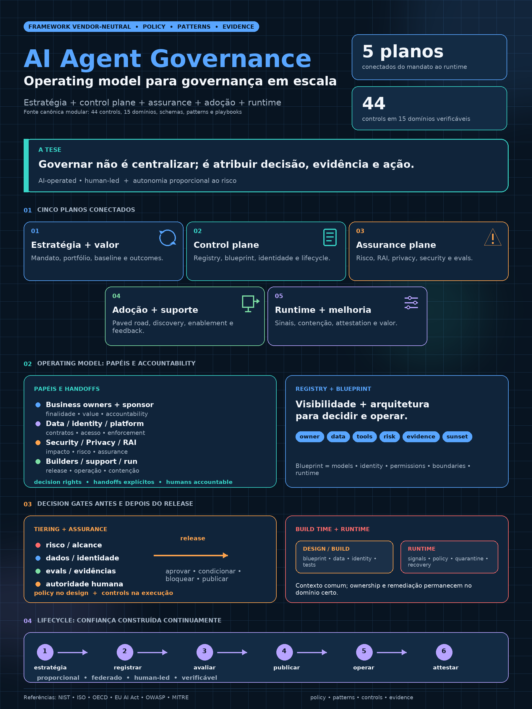

# Governar agentes em escala — da policy ao sistema operacional

## Decisão solicitada

Autorizar a implantação de um sistema federado de governança para o portfólio de IA e agentes, com:

- mandato e scope explícitos;
- owners e decision rights;
- registry e blueprint;
- tiering proporcional;
- controls de build time e runtime;
- evidence package e attestation;
- roadmap inicial de 90 dias governado por decision gates.

A decisão não exige escolher uma plataforma universal, adotar um fornecedor específico ou iniciar um programa de certificação.

## Contexto

A [policy modular](../framework/00-document-control.md) consolida princípios, decision rights, controls, evidências e lifecycle em uma fonte canônica que pode evoluir até a release final. A adoção organizacional continua sendo uma decisão explícita da authority competente.

O gap tratado pelo framework é transformar intenção de governança em um sistema operacional capaz de responder, com evidência:

1. quais sistemas e agentes existem;
2. para que servem e quem responde por eles;
3. que dados, identidades e tools utilizam;
4. quanto risco e capacidade de ação possuem;
5. que controls estão implementados e eficazes;
6. quem pode liberar, conter, reativar e aposentar;
7. se uso, qualidade e valor justificam continuidade.

## Por que agora

Agentes não apenas produzem conteúdo. Eles podem recuperar dados, usar credenciais, chamar tools, escrever em sistemas e orquestrar workflows. Autonomia, alcance e interconectividade tornam inadequados tanto o laissez-faire quanto um único approval flow para tudo.

Governança proporcional permite:

- baixo atrito para baixo risco;
- revisão profunda para high impact e state-changing actions;
- enforcement nos pontos de controle adequados;
- especialistas concentrados em exceções e material decisions;
- contenção e recovery quando o comportamento muda em runtime.

## Recomendação

Adotar cinco planos conectados:

1. **Estratégia e valor:** mandato, portfolio, baseline, outcomes e business ownership.
2. **Control plane:** registry, blueprint, identidade, lifecycle, configuração e administrative action.
3. **Assurance plane:** risk, security, privacy, Responsible AI, evaluations e challenge proporcional; independência só quando formalmente demonstrada.
4. **Adoção e suporte:** paved road, catálogo, enablement, suporte e feedback.
5. **Runtime e melhoria:** telemetry, policy decisions, containment, recovery, attestation e value evidence.

O framework é vendor-neutral. Produtos podem implementar partes do control plane ou do assurance plane, mas nenhum produto substitui operating model, accountability e controles especializados de dados, identidade, segurança, privacy e operação.

## Modelo operacional proposto

| Autoridade | Accountability principal |
|---|---|
| Sponsor executivo | mandato, appetite, funding e material trade-offs |
| Governance Owner | framework, control catalog, decisões e exceptions |
| Business Owner | finalidade, uso permitido, outcomes e continuidade |
| Technical Owner | arquitetura, change, evaluations e remediation |
| Design Authority | admissibilidade pré-release e conditions |
| Run Authority | containment, quarantine, rollback e reactivation |
| Domain Owners | controls de identity, data, tools, security, privacy e RAI |
| Assurance / challenge | testar design e eficácia conforme tier; só usar o rótulo independente quando conflitos e segregação estiverem formalizados |

Decision rights são definidos no [operating model](../framework/02-governance-and-accountability.md).

## O que a policy modular operacionaliza

- registry e blueprint separados;
- risk tiering por ação, dados, alcance, criticidade e reversibilidade;
- identity, data e tool contracts;
- control catalog com owner, implementation, evidence e metrics;
- release evidence proporcional;
- runtime signals ligados a ação administrativa;
- attestation e sunset como processos reais;
- métricas separadas de criação, descoberta, uso, qualidade, risco e valor.

Mudanças normativas são propostas, revisadas e versionadas no próprio corpus modular. Casos de estudo, mappings e roadmap não alteram a policy por implicação.

## Resultados esperados

### Governança

- visão única do portfólio e ownership;
- decisões proporcionais e rastreáveis;
- exceções temporárias e compensadas;
- evidências recuperáveis para assurance.

### Engenharia e operação

- paved road para builders;
- permissions e tools explícitas;
- release e rollback repetíveis;
- quarantine e incident response exercitáveis.

### Negócio

- investimento ligado a problema e baseline;
- uso, qualidade e valor medidos separadamente;
- continuidade, remediação ou sunset baseados em evidence.

Esses outcomes são objetivos do sistema; não constituem garantia de ROI, compliance ou ausência de incidentes.

## Riscos e mitigadores

| Risco | Mitigação |
|---|---|
| Burocracia | tiering, defaults, self-service e SLA por gate |
| Falsa segurança documental | system evidence, drills e effectiveness testing |
| Centralização | ownership federado e controls comuns |
| Tool-led governance | capabilities e contracts vendor-neutral |
| Métricas de vaidade | baseline, denominadores e outcomes separados |
| Backlog sem decisão | gates com authority, prazo e output claros |
| Scope excessivo | portfolio boundary e rollout por coortes operacionais |

## Plano inicial de 90 dias

1. aprovar mandate, scope, sponsorship e risk appetite;
2. estabelecer baseline e reconcile inventory;
3. implantar registry e blueprint para o portfolio in-scope;
4. configurar tiering e controls mínimos por domínio;
5. ativar decision gates, evidence package e exception flow;
6. validar release, containment, rollback e reactivation em exercícios;
7. iniciar operação, attestation e portfolio review;
8. aprovar roadmap de melhoria com owners e acceptance criteria.

Detalhes: [implementation playbook](../framework/08-implementation-and-adoption.md) e [roadmap de 90 dias](../framework/08-implementation-and-adoption.md).

## Critérios de sucesso

- scope e authorities aprovados;
- registry reconciliado para o portfolio in-scope;
- owners e attestations válidos;
- tiering e blueprint completos conforme applicability;
- controls aplicáveis ao tier definidos como bloqueantes possuem evidence;
- release e runtime actions exercitados;
- exceptions possuem expiry;
- metrics têm baseline e owners;
- roadmap seguinte é baseado em gaps e outcomes observados.

## Evidência complementar

- [Policy modular](../framework/00-document-control.md)
- [Arquitetura de referência](../framework/06-architecture-and-technical-controls.md)
- [Maturity model](../../toolkit/maturity/maturity-model.md)
- [Control catalog](../../toolkit/controls/README.md)

Casos e mappings de fornecedores são referências externas opcionais. Eles não integram a solução necessária nem redefinem o framework.
