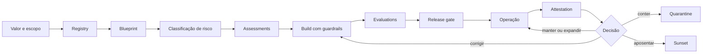

# 01 — Mandato, escopo e princípios

## Visão geral

Todo programa de governança precisa começar por três definições que parecem óbvias e raramente são feitas com rigor:

1. **Por que estamos fazendo isso?** — o mandato: qual problema de negócio, quais falhas são inaceitáveis e quais resultados a governança deve produzir.
2. **O que está coberto?** — o escopo: o que é um agente, o que não é, e onde valem as regras.
3. **Quais princípios orientam as decisões?** — o "código de conduta" do framework: o que nunca se sacrifica e como resolver quando princípios colidem.

Sem essas três definições, o framework vira uma coleção de controles sem alma: tudo parece obrigatório, nada parece justificado, e cada time interpreta o espírito do seu jeito. Este capítulo constrói o alicerce na ordem correta — **mandato antes de automação**.

## 1. O mandato: por que governar agentes

### 1.1 Finalidade executiva e problema de negócio

Antes de selecionar controles ou tecnologia, a organização declara o problema de negócio, os modos de falha inaceitáveis e os resultados de governança esperados: sponsor, condição de baseline, stakeholders afetados, resultados desejados, restrições e data da evidência.

> **Concluído quando:** o mandato pode ser testado contra resultados e não pode ser reduzido a produzir documentos ou comprar uma plataforma.

Governança de agentes não é um approval adicional nem um produto isolado. É o sistema de decisões, controles, evidências e accountability que acompanha uma capacidade de IA **desde a hipótese de valor até a aposentadoria** — como o NIST AI RMF organiza o risco em Govern, Map, Measure e Manage: governança é função transversal, não etapa final.

### 1.2 Por que agentes mudam o problema

Um modelo produz saídas. Um agente combina modelo, contexto, memória, identidade, dados, ferramentas e lógica de orquestração para **perseguir um objetivo** — e quando pode executar ações, sua superfície de risco muda de natureza:

- decidir com evidência incompleta;
- acessar dados fora da finalidade;
- propagar instruções maliciosas;
- encadear tools e ampliar blast radius;
- agir com identidade ou privilégio inadequado;
- repetir erro em escala e velocidade;
- produzir efeitos difíceis de reverter;
- esconder falhas atrás de dashboards agregados.

Por isso, o objeto de governança é o **sistema sociotécnico** — não apenas o modelo.

### 1.3 Sponsorship executivo e financiamento

Um mandato sem recurso é um desejo. A organização assegura sponsor accountable, capacidade financiada e papéis nomeados tanto para a implementação quanto para a operação no business as usual: orçamento, capacidade, competências, autoridade de decisão, horizonte de financiamento, dependências e riscos não financiados.

> **Concluído quando:** controles obrigatórios e deveres operacionais têm recursos **antes** de a coorte ou capacidade relacionada ser aprovada.

### 1.4 Critérios de sucesso e data da evidência

O mandato é uma hipótese testável: resultado falseável, baseline pré-mudança e contrafactual crível com corte de evidências. Registrar owner da métrica, população, fórmula, alvo, fonte, confounders, custo e threshold de decisão.

> **Concluído quando:** a autoridade consegue distinguir criação, adoção, qualidade e resultado — e pode **interromper o trabalho quando a evidência não suporta expansão**.

## 2. O escopo: o que está coberto

### 2.1 O que é um agente (e o que não é)

O framework adota definições testáveis com exemplos de inclusão, exclusão e fronteira, publicadas no glossário controlado: termo, critérios distintivos, termos relacionados, exemplos e authority. **Revisores independentes devem classificar casos representativos de forma consistente; casos ambíguos seguem a rota de interpretação.**

As definições operacionais:

- **Sistema de IA (AI system):** sistema que processa dados com técnicas de IA para gerar saídas (predições, conteúdo, recomendações ou decisões) usadas em contexto organizacional.
- **Agente de IA (AI agent):** sistema que realiza tarefas autônoma ou semi-autonomamente usando IA/LLMs, orquestrando tools, dados e APIs.
- **HITL (Human-in-the-loop):** mecanismo no qual decisões/ações relevantes do agente exigem confirmação humana explícita.
- **Blast radius:** medida do impacto potencial se um risco se materializar (dados, finanças, operação, reputação).

Modelo, assistente, workflow e automação determinística são coisas diferentes: o framework distingue modelo (produz saídas), assistente (media a interação), workflow (sequência determinística) e agente (persegue objetivo com tools e autonomia). A fronteira é testável — e a classificação importa porque cada categoria recebe controles diferentes.

> **Aviso importante:** não é necessário chamar algo de "agente" para que os controles se apliquem. **Capacidade e impacto importam mais que branding.** Um workflow com decisão ou conteúdo gerado por IA entra no escopo mesmo sem o rótulo.

### 2.2 O que o framework cobre

- modelos generativos integrados a aplicações;
- copilots e assistentes;
- workflows com decisão ou conteúdo gerado por IA;
- agentes single e multi-agent;
- agentes com tools, APIs, browsers, código ou MCP;
- sistemas adquiridos, SaaS, low-code, no-code e pro-code;
- capacidades internas ou externas que afetem pessoas, dados, finanças ou operações.

### 2.3 As dimensões do escopo

| Dimensão | Inclusões típicas | Decisão de fronteira |
|---|---|---|
| organizacional | unidades e entidades cobertas | rationale de fronteira, padrões locais delegados, expiração de exclusões |
| geográfico/regulatório | jurisdições e obrigações externas | obrigações mapeadas, delegação documentada |
| lifecycle | estágios cobertos (do intake ao sunset) | estágios fora do escopo declarados |
| aquisição | build, buy, configure, SaaS, low-code, fornecedores | governança equivalente a terceiros; alegação sem evidência não satisfaz controle |
| pessoas | usuários, pessoas afetadas, stakeholders | classes afetadas enumeradas |

> **Concluído quando:** o intake consegue encaminhar cada candidato como dentro do escopo, fora do escopo ou exigindo decisão — **sem isenção implícita**.

### 2.4 Escopo de build, buy e terceiros

Governança **equivalente** para agentes construídos, comprados, configurados, SaaS, low-code e operados por fornecedores: fornecedor, fronteira de serviço, deveres contratuais, evidências fornecidas, subprocessadores, direitos de saída, owner e lacunas não resolvidas. **A terceirização não remove a accountability** — e uma alegação de fornecedor sem evidência não pode satisfazer um controle bloqueante.

### 2.5 Risk appetite e usos inicialmente proibidos

**Risk appetite.** Aprovar apetite e tolerâncias por classe de impacto, autonomia, população afetada e criticidade: exposição proibida, tolerância quantitativa ou qualitativa, threshold de escalonamento, authority e gatilho de revisão. Decisões de tiering e risco residual são limitadas pelo apetite aprovado e **não podem ser auto-aprovadas pelo time de entrega**.

**Usos inicialmente proibidos ou restritos.** Classificar usos como `permitted`, `conditional`, `restricted` ou `prohibited` independentemente da pontuação de risco: origem da regra, condições, uso afetado, rationale, authority, expiração e workarounds proibidos. **Um uso proibido não pode prosseguir por meio de compensating controls; um uso condicional não pode operar após a expiração das condições.**

## 3. Os princípios: como o framework decide

### 3.1 Princípios só têm valor se alterarem decisões

**Um princípio que nunca reprovou uma proposta é um slogan.** Por isso cada princípio carrega três coisas: a pergunta de decisão que ele faz, a aplicação prática que dele decorre e o antipattern que ele existe para evitar. Um princípio que não consegue preencher as três colunas não deveria estar na lista.

Os 13 princípios arquiteturais:

| Princípio | Pergunta de decisão | Aplicação prática | Antipattern |
|---|---|---|---|
| **Visibility first** | consigo identificar o agente, o owner e a plataforma? | agente desconhecido é descoberto e classificado antes de receber enforcement progressivo | bloquear tudo antes de ter inventário, criando incentivo para shadow AI |
| **Identity first** | quem ou o que executou esta ação? | cada execução relevante carrega identidade do ator e contexto de autorização | uma chave de API compartilhada entre vários agentes |
| **Explicit capability** | a autorização considera a ação **e** os parâmetros? | uma ferramenta de atualização pode editar descrição sem poder alterar prioridade crítica | autorizar uma API inteira porque uma operação era necessária |
| **Proportional by risk** | o esforço de controle corresponde ao impacto real? | T1 somente leitura recebe policy gate; T3 financeiro recebe assessment, oversight e assurance ampliado | o mesmo formulário e o mesmo comitê para todos |
| **Embedded by default** | o caminho governado é mais fácil que contorná-lo? | limites, identidade e logging vêm no template, não no manual | publicar guidance e esperar adesão voluntária |
| **Human-led** | quem responde por esta decisão, nominalmente? | aceitação de risco residual pertence a quem responde pelo impacto | tratar revisão humana como carimbo de um resultado já pronto |
| **Observable and remediable** | como detectamos desvio depois da aprovação? | telemetria, budget, baseline de comportamento, quarentena e reassessment | tratar a aprovação inicial como garantia permanente |
| **Federated with common controls** | esta decisão pertence a qual authority de domínio? | identidade, dados e segurança mantêm suas competências sob padrões comuns | um time de governança que absorve o ownership dos demais |
| **Evidence before automation** | temos dado confiável para automatizar esta decisão? | automatizar primeiro a preparação da evidência; a decisão só com policy estável | policy-as-code sobre um campo que ninguém reconcilia |
| **Lifecycle-aware** | o que acontece quando o owner sai ou o uso desaparece? | cada agente nasce com owner, reavaliação, attestation e critério de retirada | agente publicado que mantém acessos e custo sem dono |
| **Platform-agnostic** | esta regra sobrevive à troca de fornecedor? | a policy define capability e evidência; o adapter varia | escrever o controle em termos de um produto |
| **Value-linked** | que outcome justifica custo e risco? | portfolio review retira agentes sem adoção ou benefício | medir sucesso pelo número de agentes publicados |
| **Iterative** | o que aprendemos que muda esta regra? | thresholds e classificação revisados com evidência de operação | congelar a matriz de risco depois do primeiro release |

### 3.2 Como validar os princípios

Princípio ambíguo produz interpretação local, e interpretação local produz divergência que só aparece em auditoria. O teste:

1. Selecione dez cenários reais ou plausíveis — incluindo ao menos um caso financeiro, um somente leitura, um com ferramenta privilegiada e um agente de terceiro embarcado em SaaS.
2. Peça a **três grupos diferentes** que apliquem os princípios sem consultar o autor. Compare as decisões.
3. Divergência alta indica princípio ambíguo, não grupo despreparado.
4. Transforme divergência recorrente em regra mais concreta, standard ou decision tree. **Princípio não deve carregar detalhe que pertence a um standard.**
5. Revalide anualmente, ou quando surgir nova classe de risco.

**Registre o resultado do teste** — cenários usados, divergências encontradas e o que foi refinado. Sem esse registro, a próxima revisão recomeça do zero.

### 3.3 Tensões que os princípios não resolvem sozinhos

Alguns princípios se opõem em casos concretos, e é aí que a authority decide:

- **Visibility first × Embedded by default** — enforcement antes do inventário empurra a criação para fora do radar. A sequência correta é descobrir, classificar e só então restringir progressivamente.
- **Proportional by risk × Federated with common controls** — proporcionalidade pede caminhos diferentes; federação pede padrão comum. O padrão comum é o *mínimo*, não o uniforme.
- **Evidence before automation × Value-linked** — esperar evidência perfeita custa valor; automatizar cedo custa confiança. O gargalo manual medido é o que decide qual custo é maior.

**Quando dois princípios colidem, a decisão é registrada com rationale — não resolvida por preferência de quem estava na sala.**

### 3.4 Os 10 princípios fundamentais (reforço)

Os princípios fundamentais que atravessam todos os capítulos:

1. **Mandato antes de automação:** sem propósito, owner e risk appetite, não há base legítima para operar.
2. **Proporcionalidade:** autonomia, alcance, criticidade, dados, conectores, reversibilidade e capacidade de ação determinam intensidade.
3. **Least privilege:** identidade, tools e dados recebem somente acesso necessário, por tempo e finalidade definidos.
4. **Separation of duties:** quem constrói não deve ser o único a avaliar ou aceitar risco relevante.
5. **Human accountability:** todo agente tem business owner e technical owner humanos.
6. **Evidence by design:** decisões e controles produzem evidência recuperável como parte do fluxo.
7. **Runtime matters:** testes de release não eliminam comportamento emergente, drift ou abuso.
8. **Reversibilidade:** rollback, quarantine, kill switch e sunset são requisitos de arquitetura, não planos tardios.
9. **Governança federada:** especialidades mantêm autoridade; contexto e controles comuns reduzem fragmentação.
10. **Neutralidade de plataforma:** produtos implementam capabilities; o framework define outcomes e evidências.

### 3.5 Conceitos que não devem ser confundidos

| Conceito | Pergunta respondida |
|---|---|
| criação | quantos artefatos foram construídos? |
| descoberta | usuários encontram a capacidade certa? |
| adoção | pessoas incorporaram a capacidade ao trabalho? |
| uso | com que frequência e por quem ela é usada? |
| qualidade | funciona com precisão, segurança e utilidade suficientes? |
| valor | produziu outcome operacional, financeiro ou humano demonstrável? |

**Volume de criação não demonstra adoção. Uso não demonstra qualidade. Satisfação não demonstra valor. ROI não deve ser inferido sem baseline, atribuição e evidência.**

### 3.6 Hierarquia de evidência

1. **Evidência operacional observada:** logs, testes, incidentes e outcomes medidos.
2. **Evidência documental verificável:** decisões, assessments e configurações versionadas.
3. **Referência externa primária:** normas, regulação e documentação oficial.
4. **Estudo institucional:** relato de fornecedor ou Customer Zero, com limites declarados.
5. **Hipótese ou benchmark:** útil para planejar, não para afirmar eficácia.

**A força da conclusão não pode exceder a força da evidência.**

### 3.7 O que o framework NÃO garante

A adoção deste material não garante segurança, compliance, ética, ROI ou ausência de incidentes. O framework organiza decisões e evidências; eficácia depende da implementação, contexto, competências, supervisão e melhoria contínua.

## 4. Referência normativa

Condições mínimas que devem ser verdadeiras. Use como checklist; as seções 1–3 explicam o porquê.

| # | Obrigação | Evidência mínima | Concluído quando |
|---|---|---|---|
| R1 | Declarar problema de negócio, modos de falha inaceitáveis e resultados de governança antes de controles/tecnologia | sponsor, baseline, stakeholders, resultados desejados, restrições, data da evidência | mandato testável contra resultados; não reduzível a documentos ou plataforma |
| R2 | Adotar definições testáveis (AI system, agente, assistente, workflow, automação) com inclusão/exclusão/fronteira | termo, critérios distintivos, termos relacionados, exemplos, authority no glossário | revisores independentes classificam casos representativos de forma consistente |
| R3 | Enumerar escopo organizacional, geográfico, lifecycle, aquisição e pessoas | declaração de escopo com rationale, obrigações externas, delegações, expiração de exclusões | intake encaminha cada candidato sem isenção implícita |
| R4 | Aplicar governança equivalente a build, buy, configure, SaaS, low-code e fornecedores | fornecedor, fronteira, deveres contratuais, evidências, subprocessadores, saída, owner, lacunas | terceirização não remove accountability; alegação sem evidência não satisfaz controle |
| R5 | Aprovar apetite e tolerâncias por classe de impacto, autonomia, população e criticidade | exposição proibida, tolerância, threshold de escalonamento, authority, gatilho de revisão | tiering e risco residual limitados pelo apetite; não auto-aprovados pelo time |
| R6 | Classificar usos permitted/conditional/restricted/prohibited independentemente do risco | origem da regra, condições, uso afetado, rationale, authority, expiração, workarounds | uso proibido não prossegue por compensating controls; condicional não opera após expirar |
| R7 | Traduzir princípios e atributos de qualidade em perguntas de decisão, requisitos mensuráveis e trade-offs | princípio aplicável, cenário, threshold, resposta de design, owner, teste, trade-off | decisões mostram como qualidades conflitantes foram equilibradas, não só citam princípios |
| R8 | Assegurar sponsor accountable, capacidade financiada e papéis nomeados (implementação e BAU) | orçamento, capacidade, competências, authority, horizonte, dependências, riscos não financiados | controles obrigatórios têm recursos antes da coorte ser aprovada |
| R9 | Definir resultado falseável, baseline e contrafactual com corte de evidências | owner da métrica, população, fórmula, alvo, fonte, confounders, custo, threshold | authority distingue criação/adoção/qualidade/resultado e interrompe sem evidência |
| R10 | Adotar fronteira como decisão explícita de governança (relação com risco, segurança, privacidade, dados, compliance) | charter ou policy aprovada com inclusões, exclusões, authority, rationale, obrigações | times de intake, design e revisão aplicam a mesma fronteira; ambiguidade escalona |

## 5. Objetos canônicos e lifecycle

### 5.1 Objetos canônicos

- **Registry:** registro do que existe, lifecycle, ownership, status, alcance, risco e links para evidências. Fundação de visibilidade, mas não equivale à governança completa.
- **Agent blueprint:** descrição técnica de arquitetura, modelos, dados, identidade, memória, tools, permissões, superfícies, dependências, guardrails e failure modes. Complementa o registry.
- **Control:** requisito preventivo, detectivo, responsivo ou corretivo com owner, método de implementação e evidência esperada.
- **Assessment:** avaliação contextual que identifica impacto, risco, adequação, mitigadores, residual risk e decisão necessária.
- **Evidence package:** conjunto versionado de registros que permite reconstruir o que foi aprovado, testado, executado, observado e decidido.

### 5.2 Lifecycle canônico

Cada transição exige decision rights e evidência compatíveis com o tier de risco.

### 5.3 Build time e runtime

**Build time:** business case e baseline; classificação de dados e conectores; workload identity e permissões; threat model e impact assessment; evals, red teaming e release evidence; rollback, containment e support readiness.

**Runtime:** comportamento, qualidade e drift; prompt injection e tool misuse; acessos, ações e trânsito de dados; incidentes e policy signals; contenção, remediação e reativação; attestation, value review e sunset.

**Controle build-time sem runtime é confiança estática em sistema dinâmico. Runtime sem build-time transfere risco para resposta tardia.**

### 5.4 Governança coordenada e distribuída

Não se cria um novo silo central para decidir tudo. A governança funciona como rede de autoridades: negócio responde por finalidade e outcome; plataforma por capabilities e enforcement; identidade por autenticação e autorização; dados por classificação, finalidade e acesso; segurança por threat model, detecção e resposta; privacy, jurídico e Responsible AI por impactos e obrigações; operações por runtime e contenção; assurance por verificação independente. O [operating model](02-governance-and-accountability.md) transforma essa rede em decision rights e handoffs explícitos.

## 6. Acceptance criteria

- todas as decisões deste capítulo possuem authority, owner e evidência recuperável;
- requisitos aplicáveis estão ligados ao catálogo de controles e ao método de verificação;
- exceções têm escopo, justificativa, compensating controls, expiry e decisão residual;
- controles de build time e runtime são distinguidos e exercitados quando aplicáveis;
- mudanças materiais reabrem avaliação, aprovação e evidência;
- nenhuma alegação de conformidade, eficácia ou valor excede a evidência observada.
