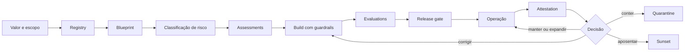

# 01 — Mandato, escopo e princípios

Este capítulo integra a estrutura clean-room aprovada com o conteúdo substantivo do corpus autoritativo. Requisitos do framework são vendor-neutral; legislação externa, guidance, casos e histórico são identificados como tais. A implementação organizacional exige adoção formal pela authority competente e não decorre do versionamento deste repositório.

## Contrato operacional do capítulo

As subseções seguintes formam um contrato executável de completude. Cada uma especifica a decisão ou ação requerida, o record/evidence mínimo e uma condição observável de conclusão para levar a governança do zero ao business as usual.

### 01.1 Finalidade executiva e problema de negócio

**Decisão/ação obrigatória.** Para **finalidade executiva e problema de negócio**, a organização deve declarar o problema de negócio, os modos de falha inaceitáveis e os resultados de governança antes de selecionar controles ou tecnologia.

**Registro e evidência.** Registrar sponsor, condição de baseline, stakeholders afetados, resultados desejados, restrições e data da evidência.

**Concluído quando.** O mandato pode ser testado contra resultados e não pode ser reduzido a produzir documentos ou comprar uma plataforma.

### 01.2 Resultados de governança pretendidos

**Decisão/ação obrigatória.** Para **resultados de governança pretendidos**, a organização deve declarar o problema de negócio, os modos de falha inaceitáveis e os resultados de governança antes de selecionar controles ou tecnologia.

**Registro e evidência.** Registrar sponsor, condição de baseline, stakeholders afetados, resultados desejados, restrições e data da evidência.

**Concluído quando.** O mandato pode ser testado contra resultados e não pode ser reduzido a produzir documentos ou comprar uma plataforma.

### 01.3 Definição de sistema de IA (AI system)

**Decisão/ação obrigatória.** Para **definição de sistema de IA**, a organização deve adotar uma definição testável com exemplos de inclusão, exclusão e fronteira.

**Registro e evidência.** Publicar o termo, os critérios distintivos, os termos relacionados, os exemplos e a authority no glossário controlado ou na policy.

**Concluído quando.** Revisores independentes classificam casos representativos de forma consistente e casos ambíguos seguem a rota de interpretação.

### 01.4 Definição de agente de IA (AI agent)

**Decisão/ação obrigatória.** Para **definição de agente de IA**, a organização deve adotar uma definição testável com exemplos de inclusão, exclusão e fronteira.

**Registro e evidência.** Publicar o termo, os critérios distintivos, os termos relacionados, os exemplos e a authority no glossário controlado ou na policy.

**Concluído quando.** Revisores independentes classificam casos representativos de forma consistente e casos ambíguos seguem a rota de interpretação.

### 01.5 Distinção de modelo, assistente, workflow e automação determinística

**Decisão/ação obrigatória.** Para **distinção de modelo, assistente, workflow e automação determinística**, a organização deve adotar uma definição testável com exemplos de inclusão, exclusão e fronteira.

**Registro e evidência.** Publicar o termo, os critérios distintivos, os termos relacionados, os exemplos e a authority no glossário controlado ou na policy.

**Concluído quando.** Revisores independentes classificam casos representativos de forma consistente e casos ambíguos seguem a rota de interpretação.

### 01.6 Escopo organizacional

**Decisão/ação obrigatória.** Para **escopo organizacional**, a organização deve enumerar inclusões, exclusões, jurisdições, estágios de lifecycle, unidades organizacionais e classes de stakeholders afetados.

**Registro e evidência.** Reter declaração de escopo com rationale de fronteira, obrigações externas, padrões locais delegados e expiração de exclusões.

**Concluído quando.** O intake consegue encaminhar cada candidato como dentro do escopo, fora do escopo ou exigindo decisão, sem isenção implícita.

### 01.7 Escopo geográfico e regulatório

**Decisão/ação obrigatória.** Para **escopo geográfico e regulatório**, a organização deve enumerar inclusões, exclusões, jurisdições, estágios de lifecycle, unidades organizacionais e classes de stakeholders afetados.

**Registro e evidência.** Reter declaração de escopo com rationale de fronteira, obrigações externas, padrões locais delegados e expiração de exclusões.

**Concluído quando.** O intake consegue encaminhar cada candidato como dentro do escopo, fora do escopo ou exigindo decisão, sem isenção implícita.

### 01.8 Escopo de lifecycle

**Decisão/ação obrigatória.** Para **escopo de lifecycle**, a organização deve enumerar inclusões, exclusões, jurisdições, estágios de lifecycle, unidades organizacionais e classes de stakeholders afetados.

**Registro e evidência.** Reter declaração de escopo com rationale de fronteira, obrigações externas, padrões locais delegados e expiração de exclusões.

**Concluído quando.** O intake consegue encaminhar cada candidato como dentro do escopo, fora do escopo ou exigindo decisão, sem isenção implícita.

### 01.9 Escopo build, buy, configure, SaaS, low-code e terceiros

**Decisão/ação obrigatória.** Para **escopo build, buy, configure, SaaS, low-code e terceiros**, a organização deve aplicar governança equivalente a agentes construídos, comprados, configurados, SaaS, low-code e operados por fornecedores.

**Registro e evidência.** Registrar fornecedor, fronteira de serviço, deveres contratuais, evidências fornecidas, subprocessadores, direitos de saída, owner e lacunas não resolvidas.

**Concluído quando.** A terceirização não remove a accountability e uma alegação de fornecedor sem evidência não pode satisfazer um controle bloqueante.

### 01.10 Escopo de usuários, pessoas afetadas e stakeholders

**Decisão/ação obrigatória.** Para **escopo de usuários, pessoas afetadas e stakeholders**, a organização deve enumerar inclusões, exclusões, jurisdições, estágios de lifecycle, unidades organizacionais e classes de stakeholders afetados.

**Registro e evidência.** Reter declaração de escopo com rationale de fronteira, obrigações externas, padrões locais delegados e expiração de exclusões.

**Concluído quando.** O intake consegue encaminhar cada candidato como dentro do escopo, fora do escopo ou exigindo decisão, sem isenção implícita.

### 01.11 Princípios de IA responsável (Responsible AI)

**Decisão/ação obrigatória.** Para **princípios de IA responsável**, a organização deve traduzir princípios e atributos de qualidade em perguntas de decisão, requisitos mensuráveis e trade-offs explícitos.

**Registro e evidência.** Registrar princípio aplicável, cenário, threshold, resposta de design, owner, teste e trade-off não resolvido.

**Concluído quando.** Decisões de arquitetura e release mostram como qualidades conflitantes foram equilibradas em vez de apenas citar princípios.

### 01.12 Características de confiabilidade (trustworthiness)

**Decisão/ação obrigatória.** Para **características de confiabilidade**, a organização deve traduzir princípios e atributos de qualidade em perguntas de decisão, requisitos mensuráveis e trade-offs explícitos.

**Registro e evidência.** Registrar princípio aplicável, cenário, threshold, resposta de design, owner, teste e trade-off não resolvido.

**Concluído quando.** Decisões de arquitetura e release mostram como qualidades conflitantes foram equilibradas em vez de apenas citar princípios.

### 01.13 Risk appetite e tolerância a risco

**Decisão/ação obrigatória.** Para **risk appetite e tolerância a risco**, a organização deve aprovar apetite e tolerâncias por classe de impacto, autonomia, população afetada e criticidade.

**Registro e evidência.** Registrar exposição proibida, tolerância quantitativa ou qualitativa, threshold de escalonamento, authority e gatilho de revisão.

**Concluído quando.** Decisões de tiering e risco residual são limitadas pelo apetite aprovado e não podem ser auto-aprovadas pelo time de entrega.

### 01.14 Usos inicialmente proibidos ou restritos

**Decisão/ação obrigatória.** Para **usos inicialmente proibidos ou restritos**, a organização deve classificar usos como permitted, conditional, restricted ou prohibited independentemente da pontuação de risco.

**Registro e evidência.** Registrar origem da regra, condições, uso afetado, rationale, authority, expiração e workarounds proibidos.

**Concluído quando.** Um uso proibido não pode prosseguir por meio de compensating controls e um uso condicional não pode operar após a expiração das condições.

### 01.15 Relação com risco empresarial, segurança, privacidade, dados e compliance

**Decisão/ação obrigatória.** Para **relação com risco empresarial, segurança, privacidade, dados e compliance**, a organização deve adotar este mandato ou fronteira como decisão explícita de governança.

**Registro e evidência.** O charter ou entrada de policy aprovada deve declarar inclusões, exclusões, autoridade responsável, rationale e obrigações externas.

**Concluído quando.** Times de intake, design e revisão aplicam a mesma fronteira e interpretação não resolvida é escalonada em vez de assumida.

### 01.16 Sponsorship executivo e mandato de financiamento

**Decisão/ação obrigatória.** Para **sponsorship executivo e mandato de financiamento**, a organização deve assegurar sponsor accountable, capacidade financiada e papéis nomeados tanto para a implementação quanto para a operação no business as usual.

**Registro e evidência.** Registrar orçamento, capacidade, competências, autoridade de decisão, horizonte de financiamento, dependências e riscos não financiados.

**Concluído quando.** Controles obrigatórios e deveres operacionais têm recursos antes de a coorte ou capacidade relacionada ser aprovada.

### 01.17 Definição de governança implementada

**Decisão/ação obrigatória.** Para **definição de governança implementada**, a organização deve adotar uma definição testável com exemplos de inclusão, exclusão e fronteira.

**Registro e evidência.** Publicar o termo, os critérios distintivos, os termos relacionados, os exemplos e a authority no glossário controlado ou na policy.

**Concluído quando.** Revisores independentes classificam casos representativos de forma consistente e casos ambíguos seguem a rota de interpretação.

### 01.18 Critérios de sucesso e data da evidência

**Decisão/ação obrigatória.** Para **critérios de sucesso e data da evidência**, a organização deve definir um resultado falseável, baseline pré-mudança e contrafactual crível com corte de evidências.

**Registro e evidência.** Registrar owner da métrica, população, fórmula, alvo, fonte, confounders, custo e threshold de decisão.

**Concluído quando.** A autoridade consegue distinguir criação, adoção, qualidade e resultado e pode interromper o trabalho quando a evidência não suporta expansão.

## Conteúdo canônico incorporado

A seção preserva integralmente as unidades atribuídas pela matriz de cobertura. Os marcadores HTML são provenance machine-readable e não alteram o significado normativo.

### Fonte: `docs/architecture/principles.md`

Commit de origem: `5545d9227624400ab8bb707b6032b2f61329a36e`.

<!-- source-unit {"classification": "metadata-title", "end_line": "2", "index": 1, "source_field": "title", "source_heading": "", "source_path": "docs/architecture/principles.md", "start_line": "2", "transformation": "merge-as-normative-principles-with-decision-questions-validation-and-policy-cross-link", "unit_type": "frontmatter-title"} -->
**Título controlado na origem:** Princípios arquiteturais de governança de agentes

<!-- source-unit {"classification": "architecture-runtime", "end_line": "16", "index": 2, "source_field": "", "source_heading": "Princípios arquiteturais de governança de agentes", "source_path": "docs/architecture/principles.md", "start_line": "11", "transformation": "preserve-exact-heading-subtrees-and-resequence-only-with-explicit-cross-reference", "unit_type": "markdown-atx-heading"} -->
### Princípios arquiteturais de governança de agentes

Princípios só têm valor se alterarem decisões. Um princípio que nunca reprovou uma proposta é um slogan.

Por isso cada princípio abaixo carrega três coisas: a **pergunta de decisão** que ele faz, a **aplicação prática** que dele decorre e o **antipattern** que ele existe para evitar. Um princípio que não consegue preencher as três colunas não deveria estar nesta lista.

<!-- source-unit {"classification": "concept-or-structure", "end_line": "32", "index": 3, "source_field": "", "source_heading": "Os princípios", "source_path": "docs/architecture/principles.md", "start_line": "17", "transformation": "preserve-exact-heading-subtrees-and-resequence-only-with-explicit-cross-reference", "unit_type": "markdown-atx-heading"} -->
#### Os princípios

1. **Visibility first:** não se governa o que não se consegue descobrir e registrar.
2. **Identity first:** toda ação relevante é atribuível a um usuário, agente ou workload identificado.
3. **Explicit capability:** acesso de leitura não implica direito de escrita; possuir uma ferramenta não autoriza qualquer parâmetro.
4. **Proportional by risk:** controles aumentam com alcance, dados, capacidade de ação, autonomia e irreversibilidade.
5. **Embedded by default:** guidance, limites, identidade, logging e policy entram nas ferramentas e pipelines.
6. **Human-led:** pessoas definem direção, aprovam exceções e permanecem accountable.
7. **Observable and remediable:** autonomia relevante exige telemetria, quarantine, rollback e sunset.
8. **Federated with common controls:** domínios mantêm ownership; padrões comuns preservam interoperabilidade e confiança.
9. **Evidence before automation:** decisões e exceções precisam de evidência antes de virar policy-as-code.
10. **Lifecycle-aware:** criação, mudança, attestation, transferência e decommissioning fazem parte do mesmo sistema.
11. **Platform-agnostic:** policy e control objectives são comuns; implementação varia por plataforma.
12. **Value-linked:** criação e uso só importam quando conectados a qualidade, risco, experiência e resultado.
13. **Iterative:** arquitetura, controles e classificação de risco evoluem com tecnologia, regulação e evidência operacional.

<!-- source-unit {"classification": "concept-or-structure", "end_line": "50", "index": 4, "source_field": "", "source_heading": "Como cada princípio decide", "source_path": "docs/architecture/principles.md", "start_line": "33", "transformation": "preserve-exact-heading-subtrees-and-resequence-only-with-explicit-cross-reference", "unit_type": "markdown-atx-heading"} -->
#### Como cada princípio decide

| Princípio | Pergunta de decisão | Aplicação prática | Antipattern |
|---|---|---|---|
| Visibility first | consigo identificar o agente, o owner e a plataforma? | agente desconhecido é descoberto e classificado antes de receber enforcement progressivo | bloquear tudo antes de ter inventário, criando incentivo para shadow AI |
| Identity first | quem ou o que executou esta ação? | cada execução relevante carrega identidade do ator e contexto de autorização | uma chave de API compartilhada entre vários agentes |
| Explicit capability | a autorização considera a ação **e** os parâmetros? | uma ferramenta de atualização pode editar descrição sem poder alterar prioridade crítica | autorizar uma API inteira porque uma operação era necessária |
| Proportional by risk | o esforço de controle corresponde ao impacto real? | T1 somente leitura recebe policy gate; T3 financeiro recebe assessment, oversight e assurance ampliado | o mesmo formulário e o mesmo comitê para todos |
| Embedded by default | o caminho governado é mais fácil que contorná-lo? | limites, identidade e logging vêm no template, não no manual | publicar guidance e esperar adesão voluntária |
| Human-led | quem responde por esta decisão, nominalmente? | aceitação de risco residual pertence a quem responde pelo impacto | tratar revisão humana como carimbo de um resultado já pronto |
| Observable and remediable | como detectamos desvio depois da aprovação? | telemetria, budget, baseline de comportamento, quarentena e reassessment | tratar a aprovação inicial como garantia permanente |
| Federated with common controls | esta decisão pertence a qual authority de domínio? | identidade, dados e segurança mantêm suas competências sob padrões comuns | um time de governança que absorve o ownership dos demais |
| Evidence before automation | temos dado confiável para automatizar esta decisão? | automatizar primeiro a preparação da evidência; a decisão só com policy estável | policy-as-code sobre um campo que ninguém reconcilia |
| Lifecycle-aware | o que acontece quando o owner sai ou o uso desaparece? | cada agente nasce com owner, reavaliação, attestation e critério de retirada | agente publicado que mantém acessos e custo sem dono |
| Platform-agnostic | esta regra sobrevive à troca de fornecedor? | a policy define capability e evidência; o adapter varia | escrever o controle em termos de um produto |
| Value-linked | que outcome justifica custo e risco? | portfolio review retira agentes sem adoção ou benefício | medir sucesso pelo número de agentes publicados |
| Iterative | o que aprendemos que muda esta regra? | thresholds e classificação revisados com evidência de operação | congelar a matriz de risco depois do primeiro release |

<!-- source-unit {"classification": "concept-or-structure", "end_line": "62", "index": 5, "source_field": "", "source_heading": "Como validar os princípios", "source_path": "docs/architecture/principles.md", "start_line": "51", "transformation": "preserve-exact-heading-subtrees-and-resequence-only-with-explicit-cross-reference", "unit_type": "markdown-atx-heading"} -->
#### Como validar os princípios

Princípio ambíguo produz interpretação local, e interpretação local produz divergência que só aparece em auditoria.

1. Selecione dez cenários reais ou plausíveis — incluindo ao menos um caso financeiro, um somente leitura, um com ferramenta privilegiada e um agente de terceiro embarcado em SaaS.
2. Peça a **três grupos diferentes** que apliquem os princípios sem consultar o autor. Compare as decisões.
3. Divergência alta indica princípio ambíguo, não grupo despreparado.
4. Transforme divergência recorrente em regra mais concreta, standard ou decision tree. **Princípio não deve carregar detalhe que pertence a um standard.**
5. Revalide anualmente, ou quando surgir nova classe de risco — novos protocolos de descoberta de ferramentas, delegação entre agentes ou aumento material de autonomia.

Registre o resultado do teste: cenários usados, divergências encontradas e o que foi refinado em consequência. Sem esse registro, a próxima revisão recomeça do zero.

<!-- source-unit {"classification": "concept-or-structure", "end_line": "72", "index": 6, "source_field": "", "source_heading": "Tensões que os princípios não resolvem sozinhos", "source_path": "docs/architecture/principles.md", "start_line": "63", "transformation": "preserve-exact-heading-subtrees-and-resequence-only-with-explicit-cross-reference", "unit_type": "markdown-atx-heading"} -->
#### Tensões que os princípios não resolvem sozinhos

Alguns princípios se opõem em casos concretos, e é aí que a authority decide:

- **Visibility first × Embedded by default** — enforcement antes do inventário empurra a criação para fora do radar. A sequência correta é descobrir, classificar e só então restringir progressivamente.
- **Proportional by risk × Federated with common controls** — proporcionalidade pede caminhos diferentes; federação pede padrão comum. O padrão comum é o *mínimo*, não o uniforme.
- **Evidence before automation × Value-linked** — esperar evidência perfeita custa valor; automatizar cedo custa confiança. O gargalo manual medido é o que decide qual custo é maior.

Quando dois princípios colidem, a decisão é registrada com rationale — não resolvida por preferência de quem estava na sala.

<!-- source-unit {"classification": "concept-or-structure", "end_line": "75", "index": 7, "source_field": "", "source_heading": "Relação com a policy", "source_path": "docs/architecture/principles.md", "start_line": "73", "transformation": "preserve-exact-heading-subtrees-and-resequence-only-with-explicit-cross-reference", "unit_type": "markdown-atx-heading"} -->
#### Relação com a policy

Esses princípios integram a [policy modular](00-document-control.md). Sua adoção e alteração exigem revisão formal, decision authority e release versionada; mappings de plataforma não podem redefini-los.

### Fonte: `docs/fundamentals/README.md`

Commit de origem: `5545d9227624400ab8bb707b6032b2f61329a36e`.

<!-- source-unit {"classification": "metadata-title", "end_line": "2", "index": 8, "source_field": "title", "source_heading": "", "source_path": "docs/fundamentals/README.md", "start_line": "2", "transformation": "integrate-completely", "unit_type": "frontmatter-title"} -->
**Título controlado na origem:** Fundamentos de governança de IA e agentes

<!-- source-unit {"classification": "concept-or-structure", "end_line": "16", "index": 9, "source_field": "", "source_heading": "Fundamentos de governança de IA e agentes", "source_path": "docs/fundamentals/README.md", "start_line": "15", "transformation": "integrate-completely", "unit_type": "markdown-atx-heading"} -->
### Fundamentos de governança de IA e agentes

<!-- source-unit {"classification": "concept-or-structure", "end_line": "22", "index": 10, "source_field": "", "source_heading": "Tese", "source_path": "docs/fundamentals/README.md", "start_line": "17", "transformation": "integrate-completely", "unit_type": "markdown-atx-heading"} -->
#### Tese

Governança de agentes não é um approval adicional nem um produto isolado. É o sistema de decisões, controles, evidências e accountability que acompanha uma capacidade de IA desde a hipótese de valor até a aposentadoria.

O NIST AI RMF organiza o risco em `Govern`, `Map`, `Measure` e `Manage` e trata governança como função transversal, não como etapa final.[7] O perfil de GenAI reforça governança, provenance, testes pré-deployment e incident disclosure como considerações primárias.[8]

<!-- source-unit {"classification": "risk-failure-mode", "end_line": "37", "index": 11, "source_field": "", "source_heading": "Por que agentes mudam o problema", "source_path": "docs/fundamentals/README.md", "start_line": "23", "transformation": "integrate-completely", "unit_type": "markdown-atx-heading"} -->
#### Por que agentes mudam o problema

Um modelo produz saídas. Um agente combina modelo, contexto, memória, identidade, dados, ferramentas e lógica de orquestração para perseguir um objetivo. Quando pode executar ações, sua superfície de risco inclui:

- decidir com evidência incompleta;
- acessar dados fora da finalidade;
- propagar instruções maliciosas;
- encadear tools e ampliar blast radius;
- agir com identidade ou privilégio inadequado;
- repetir erro em escala e velocidade;
- produzir efeitos difíceis de reverter;
- esconder falhas atrás de dashboards agregados.

Por isso, o objeto de governança é o **sistema sociotécnico**, não apenas o modelo.

<!-- source-unit {"classification": "concept-or-structure", "end_line": "51", "index": 12, "source_field": "", "source_heading": "Escopo do framework", "source_path": "docs/fundamentals/README.md", "start_line": "38", "transformation": "integrate-completely", "unit_type": "markdown-atx-heading"} -->
#### Escopo do framework

O framework cobre:

- modelos generativos integrados a aplicações;
- copilots e assistentes;
- workflows com decisão ou conteúdo gerado por IA;
- agentes single e multi-agent;
- agentes com tools, APIs, browsers, código ou MCP;
- sistemas adquiridos, SaaS, low-code, no-code e pro-code;
- capacidades internas ou externas que afetem pessoas, dados, finanças ou operações.

Não é necessário chamar algo de “agente” para que os controles se apliquem. Capacidade e impacto importam mais que branding.

<!-- source-unit {"classification": "concept-or-structure", "end_line": "64", "index": 13, "source_field": "", "source_heading": "Conceitos que não devem ser confundidos", "source_path": "docs/fundamentals/README.md", "start_line": "52", "transformation": "integrate-completely", "unit_type": "markdown-atx-heading"} -->
#### Conceitos que não devem ser confundidos

| Conceito | Pergunta respondida |
|---|---|
| criação | quantos artefatos foram construídos? |
| descoberta | usuários encontram a capacidade certa? |
| adoção | pessoas incorporaram a capacidade ao trabalho? |
| uso | com que frequência e por quem ela é usada? |
| qualidade | funciona com precisão, segurança e utilidade suficientes? |
| valor | produziu outcome operacional, financeiro ou humano demonstrável? |

Volume de criação não demonstra adoção. Uso não demonstra qualidade. Satisfação não demonstra valor. ROI não deve ser inferido sem baseline, atribuição e evidência.

<!-- source-unit {"classification": "concept-or-structure", "end_line": "66", "index": 14, "source_field": "", "source_heading": "Objetos canônicos", "source_path": "docs/fundamentals/README.md", "start_line": "65", "transformation": "integrate-completely", "unit_type": "markdown-atx-heading"} -->
#### Objetos canônicos

<!-- source-unit {"classification": "architecture-runtime", "end_line": "70", "index": 15, "source_field": "", "source_heading": "Registry", "source_path": "docs/fundamentals/README.md", "start_line": "67", "transformation": "integrate-completely", "unit_type": "markdown-atx-heading"} -->
##### Registry

Registro de o que existe, lifecycle, ownership, status, alcance, risco e links para evidências. É a fundação de visibilidade, mas não equivale à governança completa.

<!-- source-unit {"classification": "architecture-runtime", "end_line": "74", "index": 16, "source_field": "", "source_heading": "Agent blueprint", "source_path": "docs/fundamentals/README.md", "start_line": "71", "transformation": "integrate-completely", "unit_type": "markdown-atx-heading"} -->
##### Agent blueprint

Descrição técnica de arquitetura, modelos, dados, identidade, memória, tools, permissões, superfícies, dependências, guardrails e failure modes. Complementa o registry.

<!-- source-unit {"classification": "concept-or-structure", "end_line": "78", "index": 17, "source_field": "", "source_heading": "Control", "source_path": "docs/fundamentals/README.md", "start_line": "75", "transformation": "integrate-completely", "unit_type": "markdown-atx-heading"} -->
##### Control

Requisito preventivo, detectivo, responsivo ou corretivo com owner, método de implementação e evidência esperada.

<!-- source-unit {"classification": "concept-or-structure", "end_line": "82", "index": 18, "source_field": "", "source_heading": "Assessment", "source_path": "docs/fundamentals/README.md", "start_line": "79", "transformation": "integrate-completely", "unit_type": "markdown-atx-heading"} -->
##### Assessment

Avaliação contextual que identifica impacto, risco, adequação, mitigadores, residual risk e decisão necessária.

<!-- source-unit {"classification": "evidence-artifact", "end_line": "86", "index": 19, "source_field": "", "source_heading": "Evidence package", "source_path": "docs/fundamentals/README.md", "start_line": "83", "transformation": "integrate-completely", "unit_type": "markdown-atx-heading"} -->
##### Evidence package

Conjunto versionado de registros que permite reconstruir o que foi aprovado, testado, executado, observado e decidido.

<!-- source-unit {"classification": "concept-or-structure", "end_line": "99", "index": 20, "source_field": "", "source_heading": "Princípios", "source_path": "docs/fundamentals/README.md", "start_line": "87", "transformation": "integrate-completely", "unit_type": "markdown-atx-heading"} -->
#### Princípios

1. **Mandato antes de automação:** sem propósito, owner e risk appetite, não há base legítima para operar.
2. **Proporcionalidade:** autonomia, alcance, criticidade, dados, conectores, reversibilidade e capacidade de ação determinam intensidade.
3. **Least privilege:** identidade, tools e dados recebem somente acesso necessário, por tempo e finalidade definidos.
4. **Separation of duties:** quem constrói não deve ser o único a avaliar ou aceitar risco relevante.
5. **Human accountability:** todo agente tem business owner e technical owner humanos.
6. **Evidence by design:** decisões e controles produzem evidência recuperável como parte do fluxo.
7. **Runtime matters:** testes de release não eliminam comportamento emergente, drift ou abuso.
8. **Reversibilidade:** rollback, quarantine, kill switch e sunset são requisitos de arquitetura, não planos tardios.
9. **Governança federada:** especialidades mantêm autoridade; contexto e controles comuns reduzem fragmentação.
10. **Neutralidade de plataforma:** produtos implementam capabilities; o framework define outcomes e evidências.

<!-- source-unit {"classification": "lifecycle-state", "end_line": "121", "index": 21, "source_field": "", "source_heading": "Lifecycle canônico", "source_path": "docs/fundamentals/README.md", "start_line": "100", "transformation": "integrate-completely", "unit_type": "markdown-atx-heading"} -->
#### Lifecycle canônico

Cada transição exige decision rights e evidência compatíveis com o tier de risco.

<!-- source-unit {"classification": "architecture-runtime", "end_line": "123", "index": 22, "source_field": "", "source_heading": "Build time e runtime", "source_path": "docs/fundamentals/README.md", "start_line": "122", "transformation": "integrate-completely", "unit_type": "markdown-atx-heading"} -->
#### Build time e runtime

<!-- source-unit {"classification": "concept-or-structure", "end_line": "132", "index": 23, "source_field": "", "source_heading": "Build time", "source_path": "docs/fundamentals/README.md", "start_line": "124", "transformation": "integrate-completely", "unit_type": "markdown-atx-heading"} -->
##### Build time

- business case e baseline;
- classificação de dados e conectores;
- workload identity e permissões;
- threat model e impact assessment;
- evals, red teaming e release evidence;
- rollback, containment e support readiness.

<!-- source-unit {"classification": "architecture-runtime", "end_line": "143", "index": 24, "source_field": "", "source_heading": "Runtime", "source_path": "docs/fundamentals/README.md", "start_line": "133", "transformation": "integrate-completely", "unit_type": "markdown-atx-heading"} -->
##### Runtime

- comportamento, qualidade e drift;
- prompt injection e tool misuse;
- acessos, ações e trânsito de dados;
- incidentes e policy signals;
- contenção, remediação e reativação;
- attestation, value review e sunset.

Controle build-time sem runtime é confiança estática em sistema dinâmico. Runtime sem build-time transfere risco para resposta tardia.

<!-- source-unit {"classification": "concept-or-structure", "end_line": "158", "index": 25, "source_field": "", "source_heading": "Governança coordenada e distribuída", "source_path": "docs/fundamentals/README.md", "start_line": "144", "transformation": "integrate-completely", "unit_type": "markdown-atx-heading"} -->
#### Governança coordenada e distribuída

Não se cria um novo silo central para decidir tudo. A governança funciona como rede de autoridades:

- negócio responde por finalidade e outcome;
- plataforma por capabilities e enforcement;
- identidade por autenticação e autorização;
- dados por classificação, finalidade e acesso;
- segurança por threat model, detecção e resposta;
- privacy, jurídico e Responsible AI por impactos e obrigações;
- operações por runtime e contenção;
- assurance por verificação independente.

O [operating model](02-governance-and-accountability.md) transforma essa rede em decision rights e handoffs explícitos.

<!-- source-unit {"classification": "evidence-artifact", "end_line": "168", "index": 26, "source_field": "", "source_heading": "Hierarquia de evidência", "source_path": "docs/fundamentals/README.md", "start_line": "159", "transformation": "integrate-completely", "unit_type": "markdown-atx-heading"} -->
#### Hierarquia de evidência

1. **Evidência operacional observada:** logs, testes, incidentes e outcomes medidos.
2. **Evidência documental verificável:** decisões, assessments e configurações versionadas.
3. **Referência externa primária:** normas, regulação e documentação oficial.
4. **Estudo institucional:** relato de fornecedor ou Customer Zero, com limites declarados.
5. **Hipótese ou benchmark:** útil para planejar, não para afirmar eficácia.

A força da conclusão não pode exceder a força da evidência.

<!-- source-unit {"classification": "concept-or-structure", "end_line": "172", "index": 27, "source_field": "", "source_heading": "O que o framework não garante", "source_path": "docs/fundamentals/README.md", "start_line": "169", "transformation": "integrate-completely", "unit_type": "markdown-atx-heading"} -->
#### O que o framework não garante

A adoção deste material não garante segurança, compliance, ética, ROI ou ausência de incidentes. O framework organiza decisões e evidências; eficácia depende da implementação, contexto, competências, supervisão e melhoria contínua.

<!-- source-unit {"classification": "reference", "end_line": "176", "index": 28, "source_field": "", "source_heading": "Sources", "source_path": "docs/fundamentals/README.md", "start_line": "173", "transformation": "integrate-completely", "unit_type": "markdown-atx-heading"} -->
#### Sources

[7] <https://nvlpubs.nist.gov/nistpubs/ai/NIST.AI.100-1.pdf> — NIST AI Risk Management Framework 1.0
[8] <https://nvlpubs.nist.gov/nistpubs/ai/NIST.AI.600-1.pdf> — NIST AI 600-1 Generative AI Profile

### Fonte: `docs/governance/ai-agent-policy-and-governance-v1.md`

Commit de origem: `5545d9227624400ab8bb707b6032b2f61329a36e`.

<!-- source-unit {"classification": "objective", "end_line": "20", "index": 29, "source_field": "", "source_heading": "1. Introduction and Objective", "source_path": "docs/governance/ai-agent-policy-and-governance-v1.md", "start_line": "18", "transformation": "archive-verbatim-and-integrate-unique-content", "unit_type": "markdown-atx-heading"} -->
#### 1. Introduction and Objective
This document establishes the policy, processes, and corporate controls for the creation, publication, and operation of Artificial Intelligence Agents ("AI agents") across multiple platforms (e.g., your-agent-platform, N8N, AWS Bedrock, Foundry, Copilot Studio). The objective is to enable innovation with security, compliance, and accountability, ensuring transparency, traceability, and business value.

<!-- source-unit {"classification": "concept-or-structure", "end_line": "22", "index": 30, "source_field": "", "source_heading": "2. Scope and Principles", "source_path": "docs/governance/ai-agent-policy-and-governance-v1.md", "start_line": "21", "transformation": "archive-verbatim-and-integrate-unique-content", "unit_type": "markdown-atx-heading"} -->
#### 2. Scope and Principles

<!-- source-unit {"classification": "concept-or-structure", "end_line": "26", "index": 31, "source_field": "", "source_heading": "2.1 Scope", "source_path": "docs/governance/ai-agent-policy-and-governance-v1.md", "start_line": "23", "transformation": "archive-verbatim-and-integrate-unique-content", "unit_type": "markdown-atx-heading"} -->
##### 2.1 Scope
This policy applies to all AI agents created, acquired, or operated within the organization, on any approved platforms.
It covers test/PoC, staging, and production environments; includes legacy and new agents.

<!-- source-unit {"classification": "concept-or-structure", "end_line": "34", "index": 32, "source_field": "", "source_heading": "2.2 Principles (aligned with Responsible AI)", "source_path": "docs/governance/ai-agent-policy-and-governance-v1.md", "start_line": "27", "transformation": "archive-verbatim-and-integrate-unique-content", "unit_type": "markdown-atx-heading"} -->
##### 2.2 Principles (aligned with Responsible AI)
Transparency and Explainability (documentation, auditability, XAI when applicable).
Justice and Bias Mitigation.
Privacy and applicable data protection law (e.g., GDPR/LGPD) (DPO, DPIA when necessary).
Robustness, Security, and Reliability.
Human responsibility (HITL) and accountability.
Proportionality of risk and business value.

<!-- source-unit {"classification": "definition", "end_line": "39", "index": 33, "source_field": "", "source_heading": "3. Key Definitions", "source_path": "docs/governance/ai-agent-policy-and-governance-v1.md", "start_line": "35", "transformation": "archive-verbatim-and-integrate-unique-content", "unit_type": "markdown-atx-heading"} -->
#### 3. Key Definitions
AI agent: a system that performs tasks autonomously or semi-autonomously using AI/LLMs, orchestrating tools, data, and APIs.
HITL (Human-in-the-loop): a mechanism in which relevant decisions/actions of the agent require explicit human confirmation.
Blast radius: measure of the potential impact if a risk materializes (data, finance, operation, reputation).

<!-- source-unit {"classification": "concept-or-structure", "end_line": "252", "index": 34, "source_field": "", "source_heading": "17.1 Principles", "source_path": "docs/governance/ai-agent-policy-and-governance-v1.md", "start_line": "246", "transformation": "archive-verbatim-and-integrate-unique-content", "unit_type": "markdown-atx-heading"} -->
##### 17.1 Principles
Complete operational visibility over actions, consumption, accessed data, and agent behavior.
Risk proportionality, following the blast radius classification and autonomy level defined in the policy.
Traceability and auditability, with immutable logs, proper retention, and evidence available for internal audits.
Integration with human accountability, ensuring the ability to intervene via HITL, quarantine, or kill-switch as established.
Continuous compliance, with early signs of operational, behavioral, or financial deviation that may trigger review, correction, or sunset.

## Acceptance criteria

- todas as decisões deste capítulo possuem authority, owner e evidência recuperável;
- requisitos aplicáveis estão ligados ao catálogo de controles e ao método de verificação;
- exceções têm escopo, justificativa, compensating controls, expiry e decisão residual;
- controles de build time e runtime são distinguidos e exercitados quando aplicáveis;
- mudanças materiais reabrem avaliação, aprovação e evidência;
- nenhuma alegação de conformidade, eficácia ou valor excede a evidência observada.
