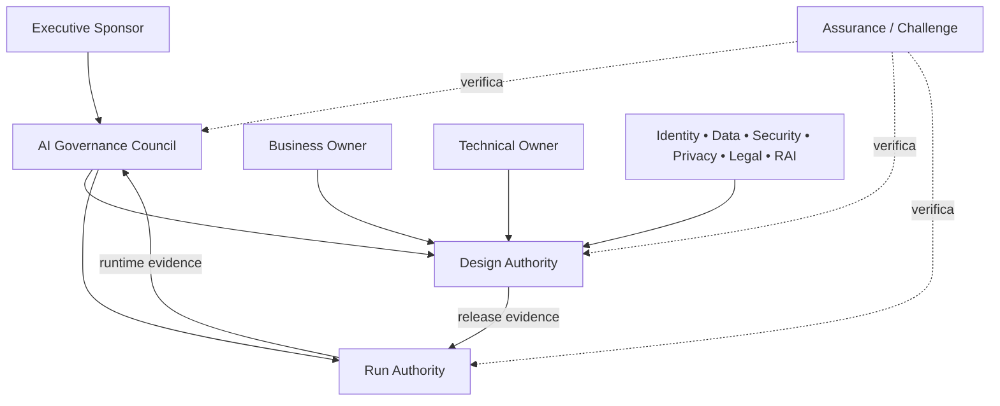

# 02 — Governança e accountability

## Visão geral

Governança não é um comitê. É a resposta a uma pergunta que todo agente faz a qualquer momento: **quem responde por esta decisão?**

Este capítulo constrói o sistema de accountability em camadas:

1. **Desenho da governança** — como as atribuições são distribuídas (centralizado, federado ou híbrido).
2. **Papéis** — quem responde pelo quê, com autoridade explícita e sem lacunas ("ninguém é dono") nem sobreposições ("dois times decidem diferente").
3. **Mecanismos** — fóruns, decision rights, escalonamento, segregação de funções e exceções.
4. **Supervisão humana** — como o humano mantém autoridade real sobre o agente, sem virar carimbo.

O princípio central: **governança é coordenada e distribuída.** Um council comum define risk appetite, padrões mínimos e exceções; autoridades de domínio preservam suas competências e evidências. Não se cria um novo silo central para decidir tudo.

## 1. Desenho do sistema de governança

### 1.1 Centralizado, federado ou híbrido

A organização seleciona e documenta a alocação das atribuições de policy, plataforma, domínio e assurance: princípios de design, mapa de papéis, fronteiras de serviço, decision rights, handoffs, níveis de serviço e rota de exceção.

**Concluído quando:** um caso representativo percorre do intake à operação sem decisão órfã nem fonte de verdade duplicada.

### 1.2 O modelo federado (recomendado)

Governança é coordenada e distribuída:

A rede de autoridades: negócio responde por finalidade e outcome; plataforma por capabilities e enforcement; identidade por autenticação e autorização; dados por classificação, finalidade e acesso; segurança por threat model, detecção e resposta; privacy, jurídico e Responsible AI por impactos e obrigações; operações por runtime e contenção; assurance por verificação independente.

> **Antiobjetivos:** criar um "time de governança" que absorve ownership dos demais; exigir o mesmo processo para todo risco; usar council como fila operacional; tratar registro, dashboard ou assinatura como prova isolada de eficácia.

## 2. Papéis e accountability

### 2.1 Accountability executiva: um resultado, uma autoridade, decisões indelegáveis

Todo papel nomeado tem: resultado accountable, autoridade explícita e decisões indelegáveis. O RACI e o charter declaram deveres, evidências exigidas, handoffs, escalonamento, regras de delegação e competência. **A accountability permanece clara quando a entrega é delegada a outro time ou fornecedor.**

A matriz de papéis (o que antes eram 12 blocos repetidos):

| Papel | Responder por | Não pode |
|---|---|---|
| **Governance owner** | desenho e manutenção do sistema de governança | absorver ownership dos domínios |
| **Business owner** (por agente) | finalidade, valor/risco/orçamento, requirements, comunicação com afetados; aceita residual risk quando autorizado; revisa valor/qualidade/continuidade | delegar accountability nominal a um fornecedor |
| **Technical owner** (por agente) | blueprint, implementação, integrações e segurança, dependências e operações técnicas; controls, evals, runbooks e evidências; correção, rollback e sunset técnico | mudar finalidade ou risco aceito sem voltar à Design Authority |
| **Product owner** | priorização e investimento de produto | decidir risco sozinho |
| **Gestão de risco** | metodologia, tiering e residual risk | auto-aprovar risco do próprio build |
| **Legal/regulatório** | obrigações, uso aceitável, contratos, restrições setoriais | mapear obrigação sem fonte |
| **Privacidade/DPO** | DPIA, direitos, retenção, tratamento de dados pessoais | liberar sem DPIA quando exigido |
| **Segurança da informação** | threat model, security testing, monitoramento e resposta | aprovar o próprio threat model sem challenge |
| **Governança de dados** | classificação, finalidade, lineage, minimização, connector gates | classificar dados sem consulta ao negócio |
| **Responsible AI** | impacto, fairness, transparência, safety, human oversight | ser authority de veto sem evidência |
| **Operações/SRE/SOC/suporte** | runtime, observabilidade, incidentes, contenção | alterar finalidade aprovada |
| **Auditoria interna / challenge** | verificação independente | concluir sobre trabalho que ele mesmo desenhou ou operou |

**Concluído quando:** o papel aceita um registro representativo e a accountability permanece clara quando a entrega é delegada a outro time ou fornecedor.

### 2.2 Autoridades específicas do modelo

**Executive Sponsor:** garante mandato, funding e alinhamento estratégico; aprova risk appetite e conflitos de prioridade; remove impedimentos que excedem authority operacional; **não substitui owners nas decisões técnicas.**

**AI Governance Council:** mantém policy, taxonomia, tiers e critérios comuns; resolve conflitos entre domínios; aprova exceções materiais e mudanças de risk appetite; revisa portfólio, incidentes sistêmicos e value evidence.

**Design Authority:** avalia blueprint, risco, arquitetura e release evidence; coordena identity, data, security, privacy e RAI; decide ou recomenda publicação conforme tier; devolve gaps com owner e critério de aceite.

**Run Authority:** define observabilidade, incidentes, quarantine e reactivation; **pode conter agentes quando sinais ultrapassam limites aprovados**; mantém escalations, SLOs e drills; não altera finalidade ou risco aceito sem voltar à Design Authority.

**Domain Authorities:**

| Domínio | Authority primária |
|---|---|
| identidade | padrões de workload identity, autenticação e autorização |
| dados | classificação, finalidade, lineage, minimização e connector gates |
| segurança | threat model, security testing, monitoramento e resposta |
| privacy | DPIA/triggers, direitos, retenção e tratamento de dados pessoais |
| jurídico/compliance | obrigações, uso aceitável, contratos e restrições setoriais |
| Responsible AI | impacto, fairness, transparência, safety e human oversight |
| plataforma | capabilities, enforcement points, adapters e service health |

### 2.3 Right to create e publish

**Criação (Test/PoC):** permitida somente em plataformas aprovadas e ambientes não-produtivos; exige Self-Assessment completo e Owners designados (Business + Technical) antes do primeiro uso. O criador precisa de licença e perfil de acesso concedidos formalmente (papel Agent Creator), com treinamento mínimo e aceitação das regras de uso.

**Publicação/Promoção para produção:** somente após aprovação conforme a Matriz de Aprovação, registro no Catálogo e conclusão da Publication Checklist. A promoção é executada por um perfil Agent Publisher (Run Authority ou delegado formal), garantindo segregação de funções quando aplicável (SOX/ITGC).

**Concessão de acessos e permissões:** solicitada pelo Business Owner; validada pelo Technical Owner; aprovada pelo Data Owner/DPO quando envolve dados pessoais/sensíveis e por Cyber/ITGC quando envolve sistemas críticos. Run Authority implementa e mantém evidência (RBAC/ABAC, trilhas de auditoria).

**Access review:** revisões periódicas (ex.: semestrais) para agentes em produção e sempre que houver mudança de escopo, dados, integrações ou nível de autonomia.

### 2.4 Representação no organograma (quando aplicável)

Agentes não são cargos (FTE) no organograma — são capacidades digitais ligadas a um domínio de negócio, com accountability humana explícita. Um agente deve ser indicado no organograma detalhado (ou catálogo de capacidades) quando atender ao menos um critério:

- produção com >100 usuários; ou
- execução de processo crítico (operacional, financeiro, segurança, qualidade) ou sujeito a SOX/ITGC; ou
- canal corporativo oficial (interação ampla com empregados) ou interface com público externo; ou
- nível de autonomia L2 ou superior.

A representação referencia: nome do agente, domínio/área, Business Owner, Technical Owner, Run Authority responsável e link/ID no Catálogo.

## 3. Mecanismos de governança

### 3.1 Fóruns e termos de referência

Cada fórum é constituído com as decisões que pode tomar, quórum, composição, entradas, saídas e escalonamento. Reter termos de referência, pauta, registro de decisões, conflitos, presença, condições e owners das ações. **Resultados do fórum são exequíveis e não substituem discussão por uma decisão accountable nomeada.**

| Fórum | Cadência sugerida | Saída |
|---|---|---|
| portfolio review | mensal ou trimestral | priorização, funding, duplicidade e sunset |
| design review | por mudança material | decisão, conditions e evidence gaps |
| runtime risk review | semanal ou por severidade | incidentes, quarantine, trends e remediation |
| control owner review | mensal | eficácia, exceções, SLA e automação |
| attestation | por tier, no máximo anual | reconfirmação ou retirada de aprovação |
| policy review | anual ou evento material | versão, rationale e migration plan |

Cadências são adaptadas ao contexto; **eventos críticos ignoram o calendário e seguem incident response.**

### 3.2 Decision rights por evento de lifecycle

Cada evento material de lifecycle e severidade de incidente mapeia para uma decisão accountable e um caminho de escalonamento: evento, threshold, autoridade primária e alternativa, consulta, tempo de resposta e fallback para decisão não resolvida.

| Decisão | Accountable | Consultados | Evidência mínima |
|---|---|---|---|
| aprovar propósito e baseline | Business Owner | Sponsor, Finance, usuários | business case e baseline |
| classificar tier de risco | Design Authority | Risk, RAI, Security, Data | registry, blueprint e assessment |
| conceder identidade/acesso | Domain Authority | Technical Owner | least-privilege mapping e expiry |
| aprovar tool ou MCP server | Tool Authority | Security, Data, Platform | provenance, scopes, threat model e kill switch |
| liberar para produção | Design/Release Authority | Owners e domínios aplicáveis | release package completo |
| conter ou quarentenar | Run Authority | Business/Technical Owner | signal, severity, scope e timestamp |
| reativar | Run + Design Authority | Domain Authorities | causa, correção e regression evidence |
| aceitar risco residual | Authority definida por tier | Legal, RAI, Security, negócio | residual risk, prazo e compensating controls |
| aprovar exceção | Governance Council ou delegado | owners afetados | rationale, owner, expiry e review |
| aposentar | Business Owner | Technical Owner, Run Authority | usage/value review, retention e sunset plan |

**Concluído quando:** um exercício (drill) alcança uma decisão autorizada dentro do alvo e autoridade ambígua **falha para o estado mais seguro**.

### 3.3 Handoffs obrigatórios

1. **Estratégia → design:** propósito, owner, usuários, baseline e constraints.
2. **Design → assurance/challenge:** blueprint, dados, identidade, tools, risk tier e test plan.
3. **Assurance/challenge → release:** findings, residual risk, approvals e expiry.
4. **Release → run:** thresholds, telemetry, runbooks, quarantine e support owner.
5. **Run → governance:** incidentes, exceptions, value evidence e mudanças materiais.
6. **Governance → sunset:** decisão, retenção, comunicação, revogação e archive.

**Um handoff sem owner receptor e evidência não está concluído.**

### 3.4 Segregação de funções e conflitos de interesse

Separação de construção, operação, aprovação e assurance onde a auto-revisão criaria viés material: deveres incompatíveis, declarações de conflito, separação técnica, impedimento (recusal) e revisão compensatória. **Nenhuma pessoa pode criar e aprovar independentemente a mesma evidência material sem exceção autorizada.**

Por tier:

| Tier | Separação mínima |
|---|---|
| T1 — baixo | technical owner pode executar; business owner aprova propósito |
| T2 — moderado | peer reviewer separado da execução de build valida release evidence |
| T3 — alto | Design Authority e domain authorities aplicáveis aprovam; conflitos são declarados |
| T4 — crítico | aprovação executiva ou comitê, challenge com segregation formal e runtime oversight contínuo |

### 3.5 Assurance: self-check, peer challenge e independent assurance

Há três níveis: **self-check** do control owner, **peer challenge** separado do build e **independent assurance**. `Independent` é uma propriedade do arrangement, não do nome do papel. Exige: ausência de responsabilidade por design/implementação/operação do objeto revisado; conflitos e serviços anteriores declarados; reporting line e authority para publicar findings sem interferência; scope, criteria, population, sampling e evidence cutoff definidos; método, forma da conclusão, limitações, remediação e renewal aprovados.

Quando esses requisitos não estiverem demonstrados, use `peer challenge` ou `limited-scope review`. O mesmo fornecedor que diagnosticou, desenhou ou implementou **não pode emitir independent assurance sobre o próprio trabalho** sem regra institucional explícita de serviços incompatíveis — este framework não presume que tais safeguards existam.

**Concluído quando:** o revisor não conclui sobre trabalho que ele mesmo desenhou ou operou, e as alegações não excedem o escopo e a evidência aprovados.

### 3.6 Hierarquia de policy e exceções

**Hierarquia:** o framework mapeia políticas superiores, padrões subordinados e procedimentos locais sem criar segunda fonte canônica: tipo de relacionamento, owner, versão, regra de conflito e requisito vinculado. Conflito resolve por precedência aprovada.

**Exceções:** somente para requisito, período e ativo delimitados após avaliação de alternativas. Toda exceção contém: requisito afetado, justificativa e impacto, owner nominativo, compensating controls, data de expiração, gatilho de revisão antecipada e plano de regularização ou sunset.

> **Exceção sem expiração é alteração de policy disfarçada.** Exceções expiradas bloqueiam a continuidade da dependência; uma exceção nunca sobrepõe um uso proibido por lei ou por policy.

### 3.7 Competência e treinamento

Competências e treinamentos específicos por papel, vinculados a decisões e tarefas — não conscientização genérica: papel, objetivo de aprendizado, método de avaliação, conclusão, expiração, remediação e owner da evidência. Todo funcionário autorizado a criar, publicar ou operar agentes conclui o treinamento corporativo **antes** de receber acesso, com reforço anual. Conteúdo mínimo: princípios de IA responsável, avaliação de risco (blast radius), níveis de autonomia e HITL, proteção de dados, segurança e uso correto de logs e kill switch.

**Concluído quando:** pessoal demonstra a tarefa ou decisão exigida e competência vencida é visível antes de acesso ou autoridade ser exercido.

### 3.8 Comunicação e revisão de documentos

**Comunicação interna:** rotas de comunicação, suporte e feedback adequadas ao papel antes e durante o rollout: público, mensagem, canal, momento, owner, sinal de compreensão, feedback e ação resultante. Usuários afetados conhecem a fronteira do sistema, a rota de reporte e a consequência do uso indevido.

**Revisão de documentos de governança:** mudanças materiais passam por análise de impacto, consulta às funções afetadas e aprovação. **Decisões aceitas são superseded em vez de reescritas silenciosamente.**

## 4. Supervisão humana: AI-operated, human-led

### 4.1 Um humano "no loop" não garante controle

Oversight efetivo exige: decision right explícito; visibilidade do que o agente pretende fazer; informação sobre risco e incerteza; capacidade técnica de bloquear ou reverter; tempo compatível com a decisão; competência e independência; registro de decisão e resultado.

### 4.2 Modos de supervisão

| Modo | Descrição | Uso |
|---|---|---|
| human-in-command | humano define finalidade, limites e autoridade | todos os tiers |
| human-in-the-loop | aprovação antes da ação | ação material ou irreversível |
| human-on-the-loop | monitoramento e intervenção durante operação | volume alto com contenção rápida |
| human-out-of-the-loop | sem revisão por execução | somente escopo aprovado, reversível e observado |

**O modo é escolhido por risco e capability, não por preferência de UX.**

### 4.3 Accountability boundary

Para cada decisão, registrar: o que o agente pode decidir; o que apenas prepara ou recomenda; o que exige aprovação humana; o que é proibido; qual humano ou função é accountable; quando escalonar; como interromper e reverter; como contestar e corrigir.

### 4.4 Approval UX: botão "OK" genérico não é informed approval

Uma confirmação de alto impacto mostra: ação e alvo; dados ou sistemas afetados; consequência esperada; irreversibilidade e rollback; evidência ou rationale do agente; alertas e policy conditions; opção clara de negar ou editar; identity de quem aprova.

**Quando exigir aprovação** (triggers): delete, payment, approval ou privileged change; decisão sobre emprego, crédito, saúde, segurança ou direito; comunicação pública ou em nome da organização; acesso/transferência de dado sensível; code execution em ambiente relevante; mudança de policy, identidade ou permissão; ação sem rollback confiável; confiança ou evidência abaixo do threshold.

### 4.5 Evitar rubber stamping

- reduzir volume de approvals por melhor tiering, não por remover controle;
- agrupar apenas ações homogêneas e reversíveis;
- mostrar diferenças e exceções;
- medir tempo, override e concordância automática;
- rotacionar reviewer em atividades repetitivas;
- permitir amostragem para baixo risco e revisão total para red flags;
- treinar reviewers sobre failure modes.

### 4.6 Escalation e break-glass

Break-glass exige: condição de uso definida; identidade forte e authority; privilégio temporário; registro e alerta imediato; limitação de escopo; revisão posterior obrigatória; revogação automática. **Urgência não transforma ação desconhecida em baixo risco.**

### 4.7 Contestability e redress

Pessoas afetadas devem ter, quando aplicável: canal acessível; identificação do decision owner; revisão humana significativa; correção de dados ou resultado; prazo e comunicação; registro para análise sistêmica.

## 5. Referência normativa

Condições mínimas que devem ser verdadeiras. Use como checklist; as seções 1–4 explicam o porquê.

| # | Obrigação | Evidência mínima | Concluído quando |
|---|---|---|---|
| R1 | Selecionar e documentar alocação centralizada, federada ou híbrida | princípios de design, mapa de papéis, fronteiras, decision rights, handoffs, SLAs, rota de exceção | caso representativo percorre do intake à operação sem decisão órfã |
| R2 | Atribuir a cada papel resultado accountable, autoridade explícita e decisões indelegáveis | RACI e charter com deveres, evidências, handoffs, escalonamento, delegação, competência | papel aceita registro representativo; accountability clara com delegação a terceiros |
| R3 | Definir escopo do challenge e critérios de independência antes da revisão | linha de reporte, conflitos, serviços incompatíveis, população, amostra, critérios, limitações, conclusão | revisor não conclui sobre trabalho próprio; alegações não excedem escopo/evidência |
| R4 | Constituir cada fórum com decisões, quórum, composição, entradas, saídas e escalonamento | termos de referência, pauta, registro de decisões, conflitos, presença, owners | resultados exequíveis; não substituem decisão accountable |
| R5 | Mapear eventos de lifecycle e severidades para decisão accountable e escalonamento | evento, threshold, autoridade primária/alternativa, consulta, tempo de resposta, fallback | drill alcança decisão autorizada no alvo; ambiguidade falha para o estado mais seguro |
| R6 | Separar construção, operação, aprovação e assurance onde auto-revisão criaria viés | deveres incompatíveis, conflitos, separação técnica, recusal, revisão compensatória | ninguém cria e aprova a mesma evidência material sem exceção |
| R7 | Mapear políticas superiores e padrões locais sem segunda fonte canônica | tipo de relacionamento, owner, versão, regra de conflito, requisito vinculado | conflito resolve por precedência; dependentes avaliáveis por impacto |
| R8 | Permitir exceções somente delimitadas após avaliação de alternativas | requisito, escopo, rationale, compensating controls, owner, residual, aprovador, expiry, gatilho | exceções expiradas bloqueiam dependência; exceção nunca sobrepõe proibição legal |
| R9 | Definir competências e treinamento específicos por papel | papel, objetivo de aprendizado, avaliação, conclusão, expiração, remediação, owner | pessoal demonstra tarefa/decisão; competência vencida visível antes do exercício |
| R10 | Prover comunicação, suporte e feedback adequados ao papel | público, mensagem, canal, momento, owner, compreensão, feedback, ação | usuários conhecem fronteira, rota de reporte e consequência; feedback chega a owner |
| R11 | Encaminhar mudanças materiais por impacto, consulta e aprovação | proposta, rationale, consultas, objeções, compatibilidade, decisão, migração | decisões superseded, não reescritas; dependentes atualizados |
| R12 | Projetar supervisão humana com autoridade, informação, tempo e competência | accountability matrix, approval rules, logs de approve/deny/edit/override, break-glass, contest records, drill | humano previne, detecta, interrompe ou corrige efeitos inadequados |

## 6. Evidências, métricas e failure modes

**Evidências:** accountability matrix; approval rules e UX specs; logs de approve, deny, edit e override; training/competence records; break-glass logs; contest e redress records; drill de kill switch ou rollback; review de automation bias.

**Métricas:** decisões dentro do SLA por tier; evidence packages devolvidos por falta de completude; exceções abertas, expiradas e reincidentes; tempo entre signal, decisão e contenção; porcentagem de agentes com owners e attestation válidos; findings por control domain e tempo de remediação; mudanças materiais não declaradas; decisões de manter, corrigir, restringir ou aposentar; approval rate e override rate; tempo de decisão por tier; rubber-stamp indicators; break-glass frequency e findings; contest volume e correction time; failed rollback/kill-switch drills; decisões sem rationale recuperável. **As métricas medem fluxo e controle; não substituem outcomes de negócio ou impacto responsável.**

**Failure modes:** humano sem autoridade real; aprovação depois da ação; reviewer sem informação ou tempo; confirmação escondida em termos genéricos; exigir approval em excesso e induzir fadiga; não registrar edits e overrides; accountability atribuída a "o time"; break-glass permanente; automatizar approvals antes de estabilizar policy e exceções.

## Decision gate

A release authority verifica se o oversight mode, approval UX, escalation, contestability e rollback correspondem ao tier e às ações possíveis.

## Acceptance criteria

- todas as decisões deste capítulo possuem authority, owner e evidência recuperável;
- requisitos aplicáveis estão ligados ao catálogo de controles e ao método de verificação;
- exceções têm escopo, justificativa, compensating controls, expiry e decisão residual;
- controles de build time e runtime são distinguidos e exercitados quando aplicáveis;
- mudanças materiais reabrem avaliação, aprovação e evidência;
- nenhuma alegação de conformidade, eficácia ou valor excede a evidência observada.
