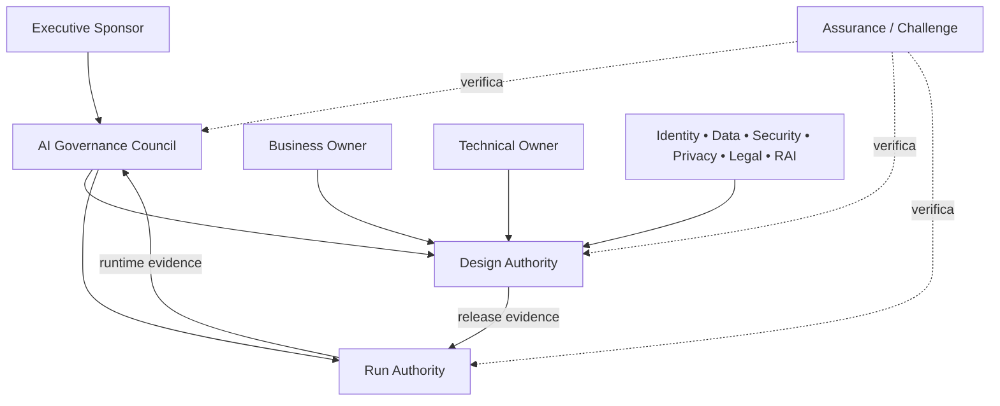

# 02 — Governança e accountability

Este capítulo integra a estrutura clean-room aprovada com o conteúdo substantivo do corpus autoritativo. Requisitos do framework são vendor-neutral; legislação externa, guidance, casos e histórico são identificados como tais. A implementação organizacional exige adoção formal pela authority competente e não decorre do versionamento deste repositório.

## Contrato operacional do capítulo

As subseções seguintes formam um contrato executável de completude. Cada uma especifica a decisão ou ação requerida, o record/evidence mínimo e uma condição observável de conclusão para levar a governança do zero ao business as usual.

### 02.1 Governance-system design

**Required decision/action.** For **governance-system design**, the organization must select and document the centralized, federated or hybrid allocation of policy, platform, domain and assurance duties.

**Record and evidence.** Retain design principles, role map, service boundaries, decision rights, handoffs, service levels and exception route.

**Done when.** A representative case moves from intake to operation with no orphan decision or duplicated source of truth.

### 02.2 Centralized, federated or hybrid operating model

**Required decision/action.** For **centralized, federated or hybrid operating model**, the organization must select and document the centralized, federated or hybrid allocation of policy, platform, domain and assurance duties.

**Record and evidence.** Retain design principles, role map, service boundaries, decision rights, handoffs, service levels and exception route.

**Done when.** A representative case moves from intake to operation with no orphan decision or duplicated source of truth.

### 02.3 Executive accountability

**Required decision/action.** For **executive accountability**, the organization must assign the named role one accountable outcome, explicit authority and non-delegable decisions.

**Record and evidence.** The RACI and role charter must state duties, required evidence, handoffs, escalation, delegate rules and competency.

**Done when.** The role accepts a representative record and accountability remains clear when delivery is delegated to another team or supplier.

### 02.4 Governance owner

**Required decision/action.** For **governance owner**, the organization must assign the named role one accountable outcome, explicit authority and non-delegable decisions.

**Record and evidence.** The RACI and role charter must state duties, required evidence, handoffs, escalation, delegate rules and competency.

**Done when.** The role accepts a representative record and accountability remains clear when delivery is delegated to another team or supplier.

### 02.5 Business ownership

**Required decision/action.** For **business ownership**, the organization must assign the named role one accountable outcome, explicit authority and non-delegable decisions.

**Record and evidence.** The RACI and role charter must state duties, required evidence, handoffs, escalation, delegate rules and competency.

**Done when.** The role accepts a representative record and accountability remains clear when delivery is delegated to another team or supplier.

### 02.6 Technical ownership

**Required decision/action.** For **technical ownership**, the organization must assign the named role one accountable outcome, explicit authority and non-delegable decisions.

**Record and evidence.** The RACI and role charter must state duties, required evidence, handoffs, escalation, delegate rules and competency.

**Done when.** The role accepts a representative record and accountability remains clear when delivery is delegated to another team or supplier.

### 02.7 Product ownership

**Required decision/action.** For **product ownership**, the organization must assign the named role one accountable outcome, explicit authority and non-delegable decisions.

**Record and evidence.** The RACI and role charter must state duties, required evidence, handoffs, escalation, delegate rules and competency.

**Done when.** The role accepts a representative record and accountability remains clear when delivery is delegated to another team or supplier.

### 02.8 Risk-management responsibilities

**Required decision/action.** For **risk-management responsibilities**, the organization must assign the named role one accountable outcome, explicit authority and non-delegable decisions.

**Record and evidence.** The RACI and role charter must state duties, required evidence, handoffs, escalation, delegate rules and competency.

**Done when.** The role accepts a representative record and accountability remains clear when delivery is delegated to another team or supplier.

### 02.9 Legal and regulatory responsibilities

**Required decision/action.** For **legal and regulatory responsibilities**, the organization must assign the named role one accountable outcome, explicit authority and non-delegable decisions.

**Record and evidence.** The RACI and role charter must state duties, required evidence, handoffs, escalation, delegate rules and competency.

**Done when.** The role accepts a representative record and accountability remains clear when delivery is delegated to another team or supplier.

### 02.10 Privacy and data-protection responsibilities

**Required decision/action.** For **privacy and data-protection responsibilities**, the organization must assign the named role one accountable outcome, explicit authority and non-delegable decisions.

**Record and evidence.** The RACI and role charter must state duties, required evidence, handoffs, escalation, delegate rules and competency.

**Done when.** The role accepts a representative record and accountability remains clear when delivery is delegated to another team or supplier.

### 02.11 Information-security responsibilities

**Required decision/action.** For **information-security responsibilities**, the organization must assign the named role one accountable outcome, explicit authority and non-delegable decisions.

**Record and evidence.** The RACI and role charter must state duties, required evidence, handoffs, escalation, delegate rules and competency.

**Done when.** The role accepts a representative record and accountability remains clear when delivery is delegated to another team or supplier.

### 02.12 Data-governance responsibilities

**Required decision/action.** For **data-governance responsibilities**, the organization must assign the named role one accountable outcome, explicit authority and non-delegable decisions.

**Record and evidence.** The RACI and role charter must state duties, required evidence, handoffs, escalation, delegate rules and competency.

**Done when.** The role accepts a representative record and accountability remains clear when delivery is delegated to another team or supplier.

### 02.13 Responsible AI responsibilities

**Required decision/action.** For **responsible ai responsibilities**, the organization must assign the named role one accountable outcome, explicit authority and non-delegable decisions.

**Record and evidence.** The RACI and role charter must state duties, required evidence, handoffs, escalation, delegate rules and competency.

**Done when.** The role accepts a representative record and accountability remains clear when delivery is delegated to another team or supplier.

### 02.14 Operations, SRE, SOC and support responsibilities

**Required decision/action.** For **operations, sre, soc and support responsibilities**, the organization must assign the named role one accountable outcome, explicit authority and non-delegable decisions.

**Record and evidence.** The RACI and role charter must state duties, required evidence, handoffs, escalation, delegate rules and competency.

**Done when.** The role accepts a representative record and accountability remains clear when delivery is delegated to another team or supplier.

### 02.15 Internal audit and independent challenge

**Required decision/action.** For **internal audit and independent challenge**, the organization must define challenge scope and independence criteria before the reviewer evaluates work.

**Record and evidence.** Record reporting line, conflicts, incompatible services, population, sample, criteria, limitations and form of conclusion.

**Done when.** The reviewer does not conclude on work they designed or operated, and claims do not exceed the approved scope and evidence.

### 02.16 Governance forums and terms of reference

**Required decision/action.** For **governance forums and terms of reference**, the organization must charter each forum with decisions it may take, quorum, membership, inputs, outputs and escalation.

**Record and evidence.** Retain terms of reference, agenda, decision log, conflicts, attendance, conditions and action owners.

**Done when.** Forum outcomes are enforceable and do not substitute discussion for a named accountable decision.

### 02.17 Decision rights by lifecycle event

**Required decision/action.** For **decision rights by lifecycle event**, the organization must map each material lifecycle event and incident severity to one accountable decision and escalation path.

**Record and evidence.** Record event, threshold, primary and alternate authority, consultation, response time and unresolved-decision fallback.

**Done when.** A drill reaches an authorized decision within the target and ambiguous authority fails to the safer state.

### 02.18 Escalation paths

**Required decision/action.** For **escalation paths**, the organization must map each material lifecycle event and incident severity to one accountable decision and escalation path.

**Record and evidence.** Record event, threshold, primary and alternate authority, consultation, response time and unresolved-decision fallback.

**Done when.** A drill reaches an authorized decision within the target and ambiguous authority fails to the safer state.

### 02.19 Segregation of duties and conflicts of interest

**Required decision/action.** For **segregation of duties and conflicts of interest**, the organization must separate build, operation, approval and assurance where self-review would create material bias.

**Record and evidence.** Record incompatible duties, conflict declarations, technical separation, recusal and compensating review.

**Done when.** No person can both create and independently approve the same material evidence without an authorized exception.

### 02.20 Policy hierarchy and local standards

**Required decision/action.** For **policy hierarchy and local standards**, the organization must map this framework to superior policies, subordinate standards and local procedures without creating a second canonical source.

**Record and evidence.** Record relationship type, owner, version, conflict rule and the exact requirement or decision linked.

**Done when.** A conflict resolves through an approved precedence rule and downstream artifacts can be impact-assessed on change.

### 02.21 Exception, waiver and risk-acceptance process

**Required decision/action.** For **exception, waiver and risk-acceptance process**, the organization must allow exceptions only for a bounded requirement, period and asset after alternatives are assessed.

**Record and evidence.** Record requirement, scope, rationale, compensating controls, owner, residual risk, approver, expiry and review trigger.

**Done when.** Expired exceptions block continued reliance and an exception never overrides a legally or policy-prohibited use.

### 02.22 Competence requirements

**Required decision/action.** For **competence requirements**, the organization must define role-specific competencies and training tied to decisions and tasks rather than generic awareness.

**Record and evidence.** Record role, learning objective, assessment method, completion, expiry, remediation and evidence owner.

**Done when.** Personnel demonstrate the required task or decision and lapsed competency is visible before access or authority is exercised.

### 02.23 Role-based training

**Required decision/action.** For **role-based training**, the organization must define role-specific competencies and training tied to decisions and tasks rather than generic awareness.

**Record and evidence.** Record role, learning objective, assessment method, completion, expiry, remediation and evidence owner.

**Done when.** Personnel demonstrate the required task or decision and lapsed competency is visible before access or authority is exercised.

### 02.24 Internal communication and awareness

**Required decision/action.** For **internal communication and awareness**, the organization must provide role-appropriate communication, support and feedback routes before and during rollout.

**Record and evidence.** Record audience, message, channel, timing, owner, comprehension signal, feedback and resulting action.

**Done when.** Affected users know the system boundary, reporting route and consequence of misuse, and feedback reaches an accountable owner.

### 02.25 Governance-document review and change

**Required decision/action.** For **governance-document review and change**, the organization must route material changes through impact analysis, affected-function consultation and approval.

**Record and evidence.** Retain proposal, rationale, consulted roles, objections, compatibility result, decision and migration plan.

**Done when.** Accepted decisions are superseded rather than silently rewritten and affected dependents receive a traceable update.

## Conteúdo canônico incorporado

A seção preserva integralmente as unidades atribuídas pela matriz de cobertura. Os marcadores HTML são provenance machine-readable e não alteram o significado normativo.

### Fonte: `docs/governance/ai-agent-policy-and-governance-v1.md`

Commit de origem: `5545d9227624400ab8bb707b6032b2f61329a36e`.

<!-- source-unit {"classification": "governance-role", "end_line": "41", "index": 1, "source_field": "", "source_heading": "4. Governance Model (Design/Run/Human Accountability)", "source_path": "docs/governance/ai-agent-policy-and-governance-v1.md", "start_line": "40", "transformation": "archive-verbatim-and-integrate-unique-content", "unit_type": "markdown-atx-heading"} -->
#### 4. Governance Model (Design/Run/Human Accountability)

<!-- source-unit {"classification": "concept-or-structure", "end_line": "59", "index": 2, "source_field": "", "source_heading": "4.4 Right to Create and Publish (Create vs Promote to Prod)", "source_path": "docs/governance/ai-agent-policy-and-governance-v1.md", "start_line": "54", "transformation": "archive-verbatim-and-integrate-unique-content", "unit_type": "markdown-atx-heading"} -->
##### 4.4 Right to Create and Publish (Create vs Promote to Prod)
Creation (Test/PoC): allowed only on approved platforms and in non-production environments. Requires a completed Self-Assessment and designated Owners (Business Owner and Technical Owner) before first use. The creator must have a formally granted license and access profile (Agent Creator role), with minimum training and acceptance of the usage rules.
Publication/Promotion to Production: only after approval according to the Approval Matrix, registration in the Catalog, and completion of the Publication Checklist. Promotion to Production must be performed by an Agent Publisher profile (Run Authority or formally delegated), ensuring segregation of duties when applicable (SOX/ITGC).
Granting of accesses and permissions: requested by the Business Owner; validated by the Technical Owner; approved by the Data Owner/DPO when involving personal/sensitive data and by Cyber/ITGC when involving critical systems. Run Authority implements and maintains evidence (RBAC/ABAC, audit trails).
Access review: periodic reviews (e.g., semiannual) for agents in Production and whenever there is a change in scope, data, integrations, or level of autonomy.

<!-- source-unit {"classification": "concept-or-structure", "end_line": "68", "index": 3, "source_field": "", "source_heading": "4.5 Representation Rule in the Organizational Chart (when applicable)", "source_path": "docs/governance/ai-agent-policy-and-governance-v1.md", "start_line": "60", "transformation": "archive-verbatim-and-integrate-unique-content", "unit_type": "markdown-atx-heading"} -->
##### 4.5 Representation Rule in the Organizational Chart (when applicable)
AI agents are not positions (FTE) on the organizational chart; they are digital capabilities linked to a business domain, with explicit human accountability.
An agent must be indicated in the detailed organizational chart (or capabilities catalog) when it meets at least one criterion:
Use in Production with >100 users; or
Execution of a critical process (operational, financial, security, quality) or subject to SOX/ITGC; or
Official corporate channel (broad interaction with employees) or interface with external public; or
Autonomy level L2 or higher (see section 8.1).
The representation must reference: agent name, domain/area, Business Owner, Technical Owner, responsible Run Authority, and link/ID in the Catalog.

<!-- source-unit {"classification": "concept-or-structure", "end_line": "72", "index": 4, "source_field": "", "source_heading": "4.5 AI Governance Awareness", "source_path": "docs/governance/ai-agent-policy-and-governance-v1.md", "start_line": "69", "transformation": "archive-verbatim-and-integrate-unique-content", "unit_type": "markdown-atx-heading"} -->
##### 4.5 AI Governance Awareness
All employees authorized to create, publish, or operate AI agents must complete corporate AI Governance training before access is granted and undergo annual refresher training.
The minimum content covers: principles of responsible AI, risk assessment (blast radius), levels of autonomy and HITL, data protection (applicable data protection law (e.g., GDPR/LGPD)), security and proper use of logs and kill switch.

<!-- source-unit {"classification": "decision-authority", "end_line": "228", "index": 5, "source_field": "", "source_heading": "15. RACI (Roles and Responsibilities)", "source_path": "docs/governance/ai-agent-policy-and-governance-v1.md", "start_line": "213", "transformation": "archive-verbatim-and-integrate-unique-content", "unit_type": "markdown-atx-heading"} -->
#### 15. RACI (Roles and Responsibilities)
Agents create new types of responsibility: it is not enough for "IT to approve" or "business to request." This section defines clear roles and responsibilities (RACI) to ensure consistent decision-making, secure operation, and human accountability by agent, separating policy design functions (Design Authority), operation and technical controls (Run Authority), and nominative responsibility (Business Owner and Technical Owner). The goal is to avoid gaps ("no one owns it"), conflicts ("two areas decide differently"), and segregation risks (SOX/ITGC), making governance executable at any level of the organization.
Design Authority: Responsible/Accountable for policies and standards; Consulted for segments; Informed by Run.
Run Authority: Responsible for operation and observability; Accountable for incidents; Consulted for Design; Informed for owners.
Business Owner (by agent): Accountable for value/risk/budget; Responsible for requirements; Consulted for compliance; Informed for Run; Review the agent's value and risk quarterly and decide on continuity, adjustment, or sunset.
Technical Owner (by agent): Responsible for integrations and security; Accountable for permissions; Responsible for quarterly review of technical performance, security, logs, and access controls.
Legend
R = Responsible (executes the activity)
A = Accountable (owns the decision and outcome)
C = Consulted (provides input)
I = Informed (kept informed)
Notes
Cells show A / R where the context indicated both accountability and responsibility.
Business Owner
leads value/risk decisions and requirements; Technical Owner leads technical integrations, security, permissions, and technical reviews; Run Authority leads operations and incident response; Design Authority defines policies and is consulted on segments and design.

### Fonte: `docs/governance/operating-model.md`

Commit de origem: `5545d9227624400ab8bb707b6032b2f61329a36e`.

<!-- source-unit {"classification": "metadata-title", "end_line": "2", "index": 6, "source_field": "title", "source_heading": "", "source_path": "docs/governance/operating-model.md", "start_line": "2", "transformation": "integrate-completely", "unit_type": "frontmatter-title"} -->
**Título controlado na origem:** Operating model e decision rights

<!-- source-unit {"classification": "decision-authority", "end_line": "16", "index": 7, "source_field": "", "source_heading": "Operating model e decision rights", "source_path": "docs/governance/operating-model.md", "start_line": "15", "transformation": "integrate-completely", "unit_type": "markdown-atx-heading"} -->
### Operating model e decision rights

<!-- source-unit {"classification": "objective", "end_line": "20", "index": 8, "source_field": "", "source_heading": "Objetivo", "source_path": "docs/governance/operating-model.md", "start_line": "17", "transformation": "integrate-completely", "unit_type": "markdown-atx-heading"} -->
#### Objetivo

Converter os princípios da [policy modular](00-document-control.md) em decisões executáveis, com autoridade, handoffs, evidências e tempos de resposta definidos. Sua adoção organizacional depende de release e authority explícitas.

<!-- source-unit {"classification": "concept-or-structure", "end_line": "48", "index": 9, "source_field": "", "source_heading": "Modelo federado", "source_path": "docs/governance/operating-model.md", "start_line": "21", "transformation": "integrate-completely", "unit_type": "markdown-atx-heading"} -->
#### Modelo federado

Governança é coordenada e distribuída. Um council comum define risk appetite, padrões mínimos e exceções; autoridades de domínio preservam suas competências e evidências.

<!-- source-unit {"classification": "governance-role", "end_line": "50", "index": 10, "source_field": "", "source_heading": "Papéis", "source_path": "docs/governance/operating-model.md", "start_line": "49", "transformation": "integrate-completely", "unit_type": "markdown-atx-heading"} -->
#### Papéis

<!-- source-unit {"classification": "concept-or-structure", "end_line": "57", "index": 11, "source_field": "", "source_heading": "Executive Sponsor", "source_path": "docs/governance/operating-model.md", "start_line": "51", "transformation": "integrate-completely", "unit_type": "markdown-atx-heading"} -->
##### Executive Sponsor

- garante mandato, funding e alinhamento estratégico;
- aprova risk appetite e conflitos de prioridade;
- remove impedimentos que excedem authority operacional;
- não substitui owners nas decisões técnicas.

<!-- source-unit {"classification": "concept-or-structure", "end_line": "64", "index": 12, "source_field": "", "source_heading": "AI Governance Council", "source_path": "docs/governance/operating-model.md", "start_line": "58", "transformation": "integrate-completely", "unit_type": "markdown-atx-heading"} -->
##### AI Governance Council

- mantém policy, taxonomia, tiers e critérios comuns;
- resolve conflitos entre domínios;
- aprova exceções materiais e mudanças de risk appetite;
- revisa portfólio, incidentes sistêmicos e value evidence.

<!-- source-unit {"classification": "decision-authority", "end_line": "71", "index": 13, "source_field": "", "source_heading": "Design Authority", "source_path": "docs/governance/operating-model.md", "start_line": "65", "transformation": "integrate-completely", "unit_type": "markdown-atx-heading"} -->
##### Design Authority

- avalia blueprint, risco, arquitetura e release evidence;
- coordena identity, data, security, privacy e RAI;
- decide ou recomenda publicação conforme tier;
- devolve gaps com owner e critério de aceite.

<!-- source-unit {"classification": "decision-authority", "end_line": "78", "index": 14, "source_field": "", "source_heading": "Run Authority", "source_path": "docs/governance/operating-model.md", "start_line": "72", "transformation": "integrate-completely", "unit_type": "markdown-atx-heading"} -->
##### Run Authority

- define observabilidade, incidentes, quarantine e reactivation;
- pode conter agentes quando sinais ultrapassam limites aprovados;
- mantém escalations, SLOs e drills;
- não altera finalidade ou risco aceito sem voltar à Design Authority.

<!-- source-unit {"classification": "concept-or-structure", "end_line": "85", "index": 15, "source_field": "", "source_heading": "Business Owner", "source_path": "docs/governance/operating-model.md", "start_line": "79", "transformation": "integrate-completely", "unit_type": "markdown-atx-heading"} -->
##### Business Owner

- responde por finalidade, usuários, outcome e impacto;
- aceita residual risk quando autorizado;
- revisa valor, qualidade e continuidade;
- garante comunicação com pessoas afetadas.

<!-- source-unit {"classification": "concept-or-structure", "end_line": "92", "index": 16, "source_field": "", "source_heading": "Technical Owner", "source_path": "docs/governance/operating-model.md", "start_line": "86", "transformation": "integrate-completely", "unit_type": "markdown-atx-heading"} -->
##### Technical Owner

- responde por blueprint, implementação, dependências e operações técnicas;
- mantém controls, evals, runbooks e evidências;
- comunica mudanças materiais;
- executa correção, rollback e sunset técnico.

<!-- source-unit {"classification": "concept-or-structure", "end_line": "104", "index": 17, "source_field": "", "source_heading": "Domain Authorities", "source_path": "docs/governance/operating-model.md", "start_line": "93", "transformation": "integrate-completely", "unit_type": "markdown-atx-heading"} -->
##### Domain Authorities

| Domínio | Authority primária |
|---|---|
| identidade | padrões de workload identity, autenticação e autorização |
| dados | classificação, finalidade, lineage, minimização e connector gates |
| segurança | threat model, security testing, monitoramento e resposta |
| privacy | DPIA/triggers, direitos, retenção e tratamento de dados pessoais |
| jurídico/compliance | obrigações, uso aceitável, contratos e restrições setoriais |
| Responsible AI | impacto, fairness, transparência, safety e human oversight |
| plataforma | capabilities, enforcement points, adapters e service health |

<!-- source-unit {"classification": "concept-or-structure", "end_line": "121", "index": 18, "source_field": "", "source_heading": "Assurance / Challenge", "source_path": "docs/governance/operating-model.md", "start_line": "105", "transformation": "integrate-completely", "unit_type": "markdown-atx-heading"} -->
##### Assurance / Challenge

- verifica design e operação sem assumir ownership da decisão;
- testa suficiência e integridade das evidências;
- registra findings, severity, divergência e prazo;
- não transforma ausência de finding em garantia absoluta.

Há três níveis distintos: self-check do control owner, peer challenge separado do build e independent assurance. `Independent` é uma propriedade do arrangement, não do nome do papel. Exige, no mínimo:

- ausência de responsabilidade por design, implementação e operação do objeto revisado;
- conflitos e serviços anteriores declarados e avaliados;
- reporting line e authority para publicar findings sem interferência;
- scope, criteria, population, sampling e evidence cutoff definidos;
- método, forma da conclusão, limitações, remediação e renewal aprovados.

Quando esses requisitos não estiverem demonstrados, use `peer challenge` ou `limited-scope review`. O mesmo fornecedor que diagnosticou, desenhou ou implementou não pode emitir independent assurance sobre o próprio trabalho sem uma regra institucional explícita de serviços incompatíveis e safeguards; este framework não presume que tais safeguards existam.

<!-- source-unit {"classification": "decision-authority", "end_line": "136", "index": 19, "source_field": "", "source_heading": "Decision rights", "source_path": "docs/governance/operating-model.md", "start_line": "122", "transformation": "integrate-completely", "unit_type": "markdown-atx-heading"} -->
#### Decision rights

| Decisão | Accountable | Consultados | Evidência mínima |
|---|---|---|---|
| aprovar propósito e baseline | Business Owner | Sponsor, Finance, usuários | business case e baseline |
| classificar tier de risco | Design Authority | Risk, RAI, Security, Data | registry, blueprint e assessment |
| conceder identidade/acesso | Domain Authority | Technical Owner | least-privilege mapping e expiry |
| aprovar tool ou MCP server | Tool Authority | Security, Data, Platform | provenance, scopes, threat model e kill switch |
| liberar para produção | Design/Release Authority | Owners e domínios aplicáveis | release package completo |
| conter ou quarentenar | Run Authority | Business/Technical Owner | signal, severity, scope e timestamp |
| reativar | Run + Design Authority | Domain Authorities | causa, correção e regression evidence |
| aceitar risco residual | Authority definida por tier | Legal, RAI, Security, negócio | residual risk, prazo e compensating controls |
| aprovar exceção | Governance Council ou delegado | owners afetados | rationale, owner, expiry e review |
| aposentar | Business Owner | Technical Owner, Run Authority | usage/value review, retention e sunset plan |

<!-- source-unit {"classification": "concept-or-structure", "end_line": "149", "index": 20, "source_field": "", "source_heading": "Fóruns e cadência", "source_path": "docs/governance/operating-model.md", "start_line": "137", "transformation": "integrate-completely", "unit_type": "markdown-atx-heading"} -->
#### Fóruns e cadência

| Fórum | Cadência sugerida | Saída |
|---|---|---|
| portfolio review | mensal ou trimestral | priorização, funding, duplicidade e sunset |
| design review | por mudança material | decisão, conditions e evidence gaps |
| runtime risk review | semanal ou por severidade | incidentes, quarantine, trends e remediation |
| control owner review | mensal | eficácia, exceções, SLA e automação |
| attestation | por tier, no máximo anual | reconfirmação ou retirada de aprovação |
| policy review | anual ou evento material | versão, rationale e migration plan |

Cadências são adaptadas ao contexto; eventos críticos ignoram o calendário e seguem incident response.

<!-- source-unit {"classification": "governance-role", "end_line": "160", "index": 21, "source_field": "", "source_heading": "Handoffs obrigatórios", "source_path": "docs/governance/operating-model.md", "start_line": "150", "transformation": "integrate-completely", "unit_type": "markdown-atx-heading"} -->
#### Handoffs obrigatórios

1. **Estratégia → design:** propósito, owner, usuários, baseline e constraints.
2. **Design → assurance/challenge:** blueprint, dados, identidade, tools, risk tier e test plan.
3. **Assurance/challenge → release:** findings, residual risk, approvals e expiry.
4. **Release → run:** thresholds, telemetry, runbooks, quarantine e support owner.
5. **Run → governance:** incidentes, exceptions, value evidence e mudanças materiais.
6. **Governance → sunset:** decisão, retenção, comunicação, revogação e archive.

Um handoff sem owner receptor e evidência não está concluído.

<!-- source-unit {"classification": "governance-role", "end_line": "169", "index": 22, "source_field": "", "source_heading": "Segregation of duties por tier", "source_path": "docs/governance/operating-model.md", "start_line": "161", "transformation": "integrate-completely", "unit_type": "markdown-atx-heading"} -->
#### Segregation of duties por tier

| Tier | Separação mínima |
|---|---|
| T1 — baixo | technical owner pode executar; business owner aprova propósito |
| T2 — moderado | peer reviewer separado da execução de build valida release evidence |
| T3 — alto | Design Authority e domain authorities aplicáveis aprovam; conflitos são declarados |
| T4 — crítico | aprovação executiva ou comitê, challenge com segregation formal e runtime oversight contínuo; usar `independent assurance` somente se os requisitos acima forem demonstrados |

<!-- source-unit {"classification": "exception-limitation", "end_line": "183", "index": 23, "source_field": "", "source_heading": "Exceções", "source_path": "docs/governance/operating-model.md", "start_line": "170", "transformation": "integrate-completely", "unit_type": "markdown-atx-heading"} -->
#### Exceções

Toda exceção contém:

- requisito afetado;
- justificativa e impacto;
- owner nominativo;
- compensating controls;
- data de expiração;
- gatilho de revisão antecipada;
- plano de regularização ou sunset.

Exceção sem expiração é alteração de policy disfarçada.

<!-- source-unit {"classification": "metric", "end_line": "196", "index": 24, "source_field": "", "source_heading": "Métricas do operating model", "source_path": "docs/governance/operating-model.md", "start_line": "184", "transformation": "integrate-completely", "unit_type": "markdown-atx-heading"} -->
#### Métricas do operating model

- decisões dentro do SLA por tier;
- evidence packages devolvidos por falta de completude;
- exceções abertas, expiradas e reincidentes;
- tempo entre signal, decisão e contenção;
- porcentagem de agentes com owners e attestation válidos;
- findings por control domain e tempo de remediação;
- mudanças materiais não declaradas;
- decisões de manter, corrigir, restringir ou aposentar.

As métricas medem fluxo e controle; não substituem outcomes de negócio ou impacto responsável.

<!-- source-unit {"classification": "objective", "end_line": "203", "index": 25, "source_field": "", "source_heading": "Antiobjetivos", "source_path": "docs/governance/operating-model.md", "start_line": "197", "transformation": "integrate-completely", "unit_type": "markdown-atx-heading"} -->
#### Antiobjetivos

- criar um “time de governança” que absorve ownership dos demais;
- exigir o mesmo processo para todo risco;
- automatizar approvals antes de estabilizar policy e exceções;
- usar council como fila operacional;
- tratar registro, dashboard ou assinatura como prova isolada de eficácia.

### Fonte: `docs/human-oversight/README.md`

Commit de origem: `5545d9227624400ab8bb707b6032b2f61329a36e`.

<!-- source-unit {"classification": "metadata-title", "end_line": "2", "index": 26, "source_field": "title", "source_heading": "", "source_path": "docs/human-oversight/README.md", "start_line": "2", "transformation": "synthesize-and-preserve", "unit_type": "frontmatter-title"} -->
**Título controlado na origem:** Human oversight e accountability

<!-- source-unit {"classification": "concept-or-structure", "end_line": "16", "index": 27, "source_field": "", "source_heading": "Human oversight e accountability", "source_path": "docs/human-oversight/README.md", "start_line": "15", "transformation": "synthesize-and-preserve", "unit_type": "markdown-atx-heading"} -->
### Human oversight e accountability

<!-- source-unit {"classification": "objective", "end_line": "20", "index": 28, "source_field": "", "source_heading": "Objetivo", "source_path": "docs/human-oversight/README.md", "start_line": "17", "transformation": "synthesize-and-preserve", "unit_type": "markdown-atx-heading"} -->
#### Objetivo

Projetar supervisão humana com autoridade, informação, tempo e competência suficientes para prevenir, detectar, interromper ou corrigir efeitos inadequados.

<!-- source-unit {"classification": "concept-or-structure", "end_line": "32", "index": 29, "source_field": "", "source_heading": "AI-operated, human-led", "source_path": "docs/human-oversight/README.md", "start_line": "21", "transformation": "synthesize-and-preserve", "unit_type": "markdown-atx-heading"} -->
#### AI-operated, human-led

Um humano “no loop” não garante controle. Oversight efetivo exige:

- decision right explícito;
- visibilidade do que o agente pretende fazer;
- informação sobre risco e incerteza;
- capacidade técnica de bloquear ou reverter;
- tempo compatível com a decisão;
- competência e independência;
- registro de decisão e resultado.

<!-- source-unit {"classification": "concept-or-structure", "end_line": "43", "index": 30, "source_field": "", "source_heading": "Modos de supervisão", "source_path": "docs/human-oversight/README.md", "start_line": "33", "transformation": "synthesize-and-preserve", "unit_type": "markdown-atx-heading"} -->
#### Modos de supervisão

| Modo | Descrição | Uso |
|---|---|---|
| human-in-command | humano define finalidade, limites e autoridade | todos os tiers |
| human-in-the-loop | aprovação antes da ação | ação material ou irreversível |
| human-on-the-loop | monitoramento e intervenção durante operação | volume alto com contenção rápida |
| human-out-of-the-loop | sem revisão por execução | somente escopo aprovado, reversível e observado |

O modo é escolhido por risco e capability, não por preferência de UX.

<!-- source-unit {"classification": "concept-or-structure", "end_line": "56", "index": 31, "source_field": "", "source_heading": "Accountability boundary", "source_path": "docs/human-oversight/README.md", "start_line": "44", "transformation": "synthesize-and-preserve", "unit_type": "markdown-atx-heading"} -->
#### Accountability boundary

Para cada decisão, registrar:

- o que o agente pode decidir;
- o que apenas prepara ou recomenda;
- o que exige aprovação humana;
- o que é proibido;
- qual humano ou função é accountable;
- quando escalonar;
- como interromper e reverter;
- como contestar e corrigir.

<!-- source-unit {"classification": "decision-authority", "end_line": "71", "index": 32, "source_field": "", "source_heading": "Approval UX", "source_path": "docs/human-oversight/README.md", "start_line": "57", "transformation": "synthesize-and-preserve", "unit_type": "markdown-atx-heading"} -->
#### Approval UX

Uma confirmação de alto impacto deve mostrar:

- ação e alvo;
- dados ou sistemas afetados;
- consequência esperada;
- irreversibilidade e rollback;
- evidência ou rationale do agente;
- alertas e policy conditions;
- opção clara de negar ou editar;
- identity de quem aprova.

Botão genérico “OK” sem contexto não constitui informed approval.

<!-- source-unit {"classification": "concept-or-structure", "end_line": "84", "index": 33, "source_field": "", "source_heading": "Quando exigir aprovação", "source_path": "docs/human-oversight/README.md", "start_line": "72", "transformation": "synthesize-and-preserve", "unit_type": "markdown-atx-heading"} -->
#### Quando exigir aprovação

Triggers incluem:

- delete, payment, approval ou privileged change;
- decisão sobre emprego, crédito, saúde, segurança ou direito;
- comunicação pública ou em nome da organização;
- acesso/transferência de dado sensível;
- code execution em ambiente relevante;
- mudança de policy, identidade ou permissão;
- ação sem rollback confiável;
- confiança ou evidência abaixo do threshold.

<!-- source-unit {"classification": "concept-or-structure", "end_line": "94", "index": 34, "source_field": "", "source_heading": "Evitar rubber stamping", "source_path": "docs/human-oversight/README.md", "start_line": "85", "transformation": "synthesize-and-preserve", "unit_type": "markdown-atx-heading"} -->
#### Evitar rubber stamping

- reduzir volume de approvals por melhor tiering, não por remover controle;
- agrupar apenas ações homogêneas e reversíveis;
- mostrar diferenças e exceções;
- medir tempo, override e concordância automática;
- rotacionar reviewer em atividades repetitivas;
- permitir amostragem para baixo risco e revisão total para red flags;
- treinar reviewers sobre failure modes.

<!-- source-unit {"classification": "concept-or-structure", "end_line": "108", "index": 35, "source_field": "", "source_heading": "Escalation e break-glass", "source_path": "docs/human-oversight/README.md", "start_line": "95", "transformation": "synthesize-and-preserve", "unit_type": "markdown-atx-heading"} -->
#### Escalation e break-glass

Break-glass exige:

- condição de uso definida;
- identidade forte e authority;
- privilege temporário;
- registro e alerta imediato;
- limitação de escopo;
- revisão posterior obrigatória;
- revogação automática.

Urgência não transforma ação desconhecida em baixo risco.

<!-- source-unit {"classification": "concept-or-structure", "end_line": "119", "index": 36, "source_field": "", "source_heading": "Contestability e redress", "source_path": "docs/human-oversight/README.md", "start_line": "109", "transformation": "synthesize-and-preserve", "unit_type": "markdown-atx-heading"} -->
#### Contestability e redress

Pessoas afetadas devem ter, quando aplicável:

- canal acessível;
- identificação do decision owner;
- revisão humana significativa;
- correção de dados ou resultado;
- prazo e comunicação;
- registro para análise sistêmica.

<!-- source-unit {"classification": "evidence-artifact", "end_line": "130", "index": 37, "source_field": "", "source_heading": "Evidências", "source_path": "docs/human-oversight/README.md", "start_line": "120", "transformation": "synthesize-and-preserve", "unit_type": "markdown-atx-heading"} -->
#### Evidências

- accountability matrix;
- approval rules e screenshots/UX specs;
- logs de approve, deny, edit e override;
- training/competence records;
- break-glass logs;
- contest e redress records;
- drill de kill switch ou rollback;
- review de automation bias.

<!-- source-unit {"classification": "metric", "end_line": "141", "index": 38, "source_field": "", "source_heading": "Métricas", "source_path": "docs/human-oversight/README.md", "start_line": "131", "transformation": "synthesize-and-preserve", "unit_type": "markdown-atx-heading"} -->
#### Métricas

- approval rate e override rate;
- tempo de decisão por tier;
- ações executadas sem authority correta;
- rubber-stamp indicators;
- break-glass frequency e findings;
- contest volume e correction time;
- failed rollback/kill-switch drills;
- decisões sem rationale recuperável.

<!-- source-unit {"classification": "risk-failure-mode", "end_line": "152", "index": 39, "source_field": "", "source_heading": "Failure modes", "source_path": "docs/human-oversight/README.md", "start_line": "142", "transformation": "synthesize-and-preserve", "unit_type": "markdown-atx-heading"} -->
#### Failure modes

- humano sem autoridade real;
- aprovação depois da ação;
- reviewer sem informação ou tempo;
- confirmação escondida em termos genéricos;
- exigir approval em excesso e induzir fadiga;
- não registrar edits e overrides;
- accountability atribuída a “o time”;
- break-glass permanente.

<!-- source-unit {"classification": "requirement-control", "end_line": "155", "index": 40, "source_field": "", "source_heading": "Decision gate", "source_path": "docs/human-oversight/README.md", "start_line": "153", "transformation": "synthesize-and-preserve", "unit_type": "markdown-atx-heading"} -->
#### Decision gate

A release authority verifica se o oversight mode, approval UX, escalation, contestability e rollback correspondem ao tier e às ações possíveis.

## Acceptance criteria

- todas as decisões deste capítulo possuem authority, owner e evidência recuperável;
- requisitos aplicáveis estão ligados ao catálogo de controles e ao método de verificação;
- exceções têm escopo, justificativa, compensating controls, expiry e decisão residual;
- controles de build time e runtime são distinguidos e exercitados quando aplicáveis;
- mudanças materiais reabrem avaliação, aprovação e evidência;
- nenhuma alegação de conformidade, eficácia ou valor excede a evidência observada.
