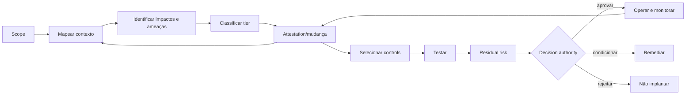

# 04 — Risco, impacto e compliance

Este capítulo integra a estrutura clean-room aprovada com o conteúdo substantivo do corpus autoritativo. Requisitos do framework são vendor-neutral; legislação externa, guidance, casos e histórico são identificados como tais. A implementação organizacional exige adoção formal pela authority competente e não decorre do versionamento deste repositório.

## Distinção entre risco e admissibilidade

Risco e admissibilidade são dimensões distintas e devem ser decididos separadamente. O tier expressa criticidade e orienta controls, evidence e approval authority; a admissibilidade determina se o uso é `permitted`, `conditional`, `restricted` ou `prohibited`. Tratamento ou aceitação de risco não transforma uso proibido em permitido, e admissibilidade favorável não demonstra risco baixo.

## Contrato operacional do capítulo

As subseções seguintes formam um contrato executável de completude. Cada uma especifica a decisão ou ação requerida, o record/evidence mínimo e uma condição observável de conclusão para levar a governança do zero ao business as usual.

### 04.1 Metodologia de gestão de risco

**Decisão/ação obrigatória.** Para **metodologia de gestão de risco**, a organização deve aprovar um método repetível para contexto, identificação, análise, tratamento, risco residual e revisão.

**Registro e evidência.** O método deve definir escalas, tiering, admissibilidade, qualidade de evidência, authority, incerteza e gatilhos de reavaliação.

**Concluído quando.** Dois avaliadores qualificados alcançam resultados defensavelmente consistentes e evidência ausente não pode ser interpretada como risco baixo.

### 04.2 Análise de contexto e uso pretendido

**Decisão/ação obrigatória.** Para **análise de contexto e uso pretendido**, a organização deve analisar o contexto real de decisão, usuários, pessoas afetadas, escala, autonomia, ambiente e a alternativa não-IA.

**Registro e evidência.** Reter usos pretendidos e excluídos, premissas, dependências, grupos afetados, consequências de falha e corte de evidências.

**Concluído quando.** Risco, avaliação e supervisão baseiam-se no contexto operacional em vez de uma descrição genérica de modelo.

### 04.3 Uso indevido previsível e uso não intencional

**Decisão/ação obrigatória.** Para **uso indevido previsível e uso não intencional**, a organização deve identificar uso indevido plausível, abuso, viés de automação, expansão de escopo e interação emergente antes do release.

**Registro e evidência.** Registrar ator de ameaça ou usuário, cenário, pré-condição, impacto, detecção, controle preventivo, resposta e exposição residual.

**Concluído quando.** Cenários materiais são testados ou explicitamente restritos e uso indevido observado alimenta controles e reavaliação.

### 04.4 Classificação proporcional

**Decisão/ação obrigatória.** Para **classificação proporcional**, a organização deve classificar o caso usando critérios aprovados, escaladores obrigatórios e o resultado aplicável mais severo.

**Registro e evidência.** Registrar resultados por critério, red flags, rationale, confiança, revisor e rota resultante ou alvo de resposta.

**Concluído quando.** A mesma evidência produz encaminhamento consistente e sub-classificação é detectada por revisão ou reconciliação.

### 04.5 Escalonamento e gatilhos de red flag

**Decisão/ação obrigatória.** Para **escalonamento e gatilhos de red flag**, a organização deve definir red flags não discricionárias que elevem revisão, controles ou authority independentemente da pontuação inicial.

**Registro e evidência.** Registrar definição do gatilho, fonte de detecção, tier mínimo, revisores exigidos, ações bloqueadas e disposição.

**Concluído quando.** Uma flag acionada não pode ser dispensada pelo solicitante e permanece aberta até uma disposição autorizada ser evidenciada.

### 04.6 Uso permitted, conditional e prohibited

**Decisão/ação obrigatória.** Para **uso permitted, conditional e prohibited**, a organização deve classificar usos como permitted, conditional, restricted ou prohibited independentemente da pontuação de risco.

**Registro e evidência.** Registrar origem da regra, condições, uso afetado, rationale, authority, expiração e workarounds proibidos.

**Concluído quando.** Um uso proibido não pode prosseguir por meio de compensating controls e um uso condicional não pode operar após a expiração das condições.

### 04.7 Avaliação de impacto de IA

**Decisão/ação obrigatória.** Para **avaliação de impacto de IA**, a organização deve avaliar efeitos benéficos e adversos plausíveis sobre cada pessoa, grupo, direito e ambiente relevantes ao longo do lifecycle.

**Registro e evidência.** Registrar população afetada, via de impacto, severidade, probabilidade, distribuição, mitigação, impacto residual, consulta e owner.

**Concluído quando.** Impactos materiais são testados com evidência do contexto afetado e impacto inaceitável não resolvido bloqueia implantação ou expansão.

### 04.8 Efeitos sobre posição legal e oportunidades de vida

**Decisão/ação obrigatória.** Para **efeitos sobre posição legal e oportunidades de vida**, a organização deve avaliar efeitos benéficos e adversos plausíveis sobre cada pessoa, grupo, direito e ambiente relevantes ao longo do lifecycle.

**Registro e evidência.** Registrar população afetada, via de impacto, severidade, probabilidade, distribuição, mitigação, impacto residual, consulta e owner.

**Concluído quando.** Impactos materiais são testados com evidência do contexto afetado e impacto inaceitável não resolvido bloqueia implantação ou expansão.

### 04.9 Segurança física e psicológica

**Decisão/ação obrigatória.** Para **segurança física e psicológica**, a organização deve avaliar efeitos benéficos e adversos plausíveis sobre cada pessoa, grupo, direito e ambiente relevantes ao longo do lifecycle.

**Registro e evidência.** Registrar população afetada, via de impacto, severidade, probabilidade, distribuição, mitigação, impacto residual, consulta e owner.

**Concluído quando.** Impactos materiais são testados com evidência do contexto afetado e impacto inaceitável não resolvido bloqueia implantação ou expansão.

### 04.10 Direitos humanos e direitos fundamentais

**Decisão/ação obrigatória.** Para **direitos humanos e direitos fundamentais**, a organização deve avaliar efeitos benéficos e adversos plausíveis sobre cada pessoa, grupo, direito e ambiente relevantes ao longo do lifecycle.

**Registro e evidência.** Registrar população afetada, via de impacto, severidade, probabilidade, distribuição, mitigação, impacto residual, consulta e owner.

**Concluído quando.** Impactos materiais são testados com evidência do contexto afetado e impacto inaceitável não resolvido bloqueia implantação ou expansão.

### 04.11 Efeitos sociais e ambientais

**Decisão/ação obrigatória.** Para **efeitos sociais e ambientais**, a organização deve avaliar efeitos benéficos e adversos plausíveis sobre cada pessoa, grupo, direito e ambiente relevantes ao longo do lifecycle.

**Registro e evidência.** Registrar população afetada, via de impacto, severidade, probabilidade, distribuição, mitigação, impacto residual, consulta e owner.

**Concluído quando.** Impactos materiais são testados com evidência do contexto afetado e impacto inaceitável não resolvido bloqueia implantação ou expansão.

### 04.12 Privacidade e proteção de dados

**Decisão/ação obrigatória.** Para **privacidade e proteção de dados**, a organização deve estabelecer finalidade, base legal, minimização, tratamento de direitos, retenção e restrições de transferência para dados pessoais.

**Registro e evidência.** Reter categorias de dados, titulares, origem, finalidade de processamento, acesso, fluxo, DPIA ou equivalente, testes e evidência de exclusão.

**Concluído quando.** Caminhos de dados não autorizados falham em teste, direitos dos titulares são operáveis e mudança material de processamento reabre a avaliação.

### 04.13 Definições de fairness e viés prejudicial

**Decisão/ação obrigatória.** Para **definições de fairness e viés prejudicial**, a organização deve definir danos de fairness específicos do contexto, grupos relevantes, fatias e disparidade aceitável antes de testar.

**Registro e evidência.** Registrar rationale do grupo, métricas, adequação da amostra, thresholds, resultados, incerteza, mitigações e impacto residual.

**Concluído quando.** Desempenho agregado não pode esconder uma fatia material reprovada e dano não resolvido é escalonado à authority adequada.

### 04.14 Transparência, aviso e divulgação

**Decisão/ação obrigatória.** Para **transparência, aviso e divulgação**, a organização deve fornecer aviso oportuno do envolvimento de IA, limitações materiais, owner accountable e uma rota utilizável de contestação ou reparação.

**Registro e evidência.** Reter aviso aprovado, público, canal, explicação da decisão, SLA de reclamação, escalonamento, resultado e evidência de remediação.

**Concluído quando.** Pessoas afetadas conseguem identificar a interação, alcançar um humano responsável e obter revisão ou reparação dentro do alvo.

### 04.15 Explainability adequada ao contexto

**Decisão/ação obrigatória.** Para **explainability adequada ao contexto**, a organização deve definir a explicação necessária para usuários, pessoas afetadas, operadores e revisores no contexto real de decisão.

**Registro e evidência.** Registrar público, decisão, conteúdo da explicação, método, limites de fidelidade, momento e evidência de compreensão.

**Concluído quando.** A explicação suporta a ação ou contestação exigida sem revelar informação protegida nem exagerar a certeza do modelo.

### 04.16 Supervisão humana e intervenção significativa

**Decisão/ação obrigatória.** Para **supervisão humana e intervenção significativa**, a organização deve posicionar um humano competente em um ponto de decisão onde a intervenção permaneça oportuna, informada e tecnicamente eficaz.

**Registro e evidência.** Registrar gatilho, informações apresentadas, authority, tempo de resposta, caminho de override, carga de trabalho, treinamento e teste exercitado.

**Concluído quando.** O humano consegue detectar, interromper, corrigir e escalonar uma falha representativa em vez de carimbar uma ação irreversível.

### 04.17 Acessibilidade e populações vulneráveis

**Decisão/ação obrigatória.** Para **acessibilidade e populações vulneráveis**, a organização deve avaliar efeitos benéficos e adversos plausíveis sobre cada pessoa, grupo, direito e ambiente relevantes ao longo do lifecycle.

**Registro e evidência.** Registrar população afetada, via de impacto, severidade, probabilidade, distribuição, mitigação, impacto residual, consulta e owner.

**Concluído quando.** Impactos materiais são testados com evidência do contexto afetado e impacto inaceitável não resolvido bloqueia implantação ou expansão.

### 04.18 Propriedade intelectual e direitos de conteúdo

**Decisão/ação obrigatória.** Para **propriedade intelectual e direitos de conteúdo**, a organização deve verificar direitos e restrições para treinamento, recuperação, prompts, saídas, código e conteúdo gerado.

**Registro e evidência.** Registrar licença da fonte, permissão, atribuição, restrição de uso, rota de takedown, filtro ou controle e alegação não resolvida.

**Concluído quando.** Conteúdo sem licença ou incompatível é bloqueado ou removido e obrigações a jusante permanecem rastreáveis.

### 04.19 Integridade da informação e conteúdo prejudicial

**Decisão/ação obrigatória.** Para **integridade da informação e conteúdo prejudicial**, a organização deve definir factualidade aceitável, qualidade de fonte e limites de conteúdo prejudicial para o contexto de uso.

**Registro e evidência.** Registrar categorias de afirmação, fontes autoritativas, conjunto de teste, verificações de citação, thresholds, exemplos de falha e resposta.

**Concluído quando.** Alegações materiais sem suporte são detectadas ou divulgadas e falha acima do threshold bloqueia ou restringe o uso.

### 04.20 Segurança e risco de abuso

**Decisão/ação obrigatória.** Para **segurança e risco de abuso**, a organização deve modelar ameaças através das fronteiras de identidade, prompt, dados, ferramenta, runtime e supply chain e testar caminhos materiais de abuso.

**Registro e evidência.** Reter threat model, cenários, pré-condições de ataque, evidência de teste, descobertas, mitigações, risco residual e resultado de reteste.

**Concluído quando.** Caminhos de ataque de alto impacto são prevenidos ou contidos e descobertas bloqueantes abertas impedem o release.

### 04.21 Risco de terceiros e cadeia de valor

**Decisão/ação obrigatória.** Para **risco de terceiros e cadeia de valor**, a organização deve governar fornecedores e dependências a jusante por due diligence, contrato, monitoramento e planejamento de saída.

**Registro e evidência.** Registrar serviço, owner, criticidade, evidência, obrigações, concentração, incidentes, subprocessadores, fallback e teste de saída.

**Concluído quando.** Falha do fornecedor dispara a contenção ou fallback acordado e a accountability permanece com a organização.

### 04.22 Tratamento de risco e compensating controls

**Decisão/ação obrigatória.** Para **tratamento de risco e compensating controls**, a organização deve selecionar tratamentos que reduzam o risco identificado e documentar por que a exposição residual é aceitável ou permanece bloqueada.

**Registro e evidência.** Registrar vínculo risco-controle, owner do controle, estado de implementação, teste de eficácia, limite compensatório e classificação residual.

**Concluído quando.** O tratamento passa no teste de eficácia e um controle compensatório expira junto com a condição que o justificava.

### 04.23 Decisão de risco residual

**Decisão/ação obrigatória.** Para **decisão de risco residual**, a organização deve apresentar o risco residual após tratamento verificado à authority empoderada para aquela exposição.

**Registro e evidência.** Registrar risco inerente, evidência de tratamento, classificação residual, incerteza, condições de aceite, aprovador e expiração.

**Concluído quando.** O time de entrega não pode auto-aceitar risco residual material e o aceite não sobrepõe admissibilidade ou lei.

### 04.24 Comunicação, contestabilidade e reparação

**Decisão/ação obrigatória.** Para **comunicação, contestabilidade e reparação**, a organização deve fornecer aviso oportuno do envolvimento de IA, limitações materiais, owner accountable e uma rota utilizável de contestação ou reparação.

**Registro e evidência.** Reter aviso aprovado, público, canal, explicação da decisão, SLA de reclamação, escalonamento, resultado e evidência de remediação.

**Concluído quando.** Pessoas afetadas conseguem identificar a interação, alcançar um humano responsável e obter revisão ou reparação dentro do alvo.

### 04.25 Crosswalk regulatório e de normas

**Decisão/ação obrigatória.** Para **crosswalk regulatório e de normas**, a organização deve mapear obrigações e normas somente onde uma fonte primária ou adequadamente atribuída suporta a relação.

**Registro e evidência.** Registrar fonte, versão, cláusula ou disposição, artefato mapeado, tipo de relação, cobertura, ressalva e revisor.

**Concluído quando.** O crosswalk distingue alinhamento de compliance e não inventa mapeamentos para texto proprietário inacessível.

### 04.26 Gatilhos de revisão e reavaliação contínua

**Decisão/ação obrigatória.** Para **gatilhos de revisão e reavaliação contínua**, a organização deve definir mudanças materiais e eventos externos que reabram risco, aprovação, avaliação ou compatibilidade contratual.

**Registro e evidência.** Registrar gatilho, fonte de detecção, ativos e evidências impactados, controle provisório, owner, data de vencimento e disposição.

**Concluído quando.** Ativos acionados não podem depender indefinidamente de aprovação anterior e a nova decisão é vinculada à versão alterada.


## Conteúdo canônico incorporado

A seção preserva integralmente as unidades atribuídas pela matriz de cobertura. Os marcadores HTML são provenance machine-readable e não alteram o significado normativo.

### Fonte: `docs/governance/ai-agent-policy-and-governance-v1.md`

Commit de origem: `5545d9227624400ab8bb707b6032b2f61329a36e`.

<!-- source-unit {"classification": "exception-limitation", "end_line": "76", "index": 1, "source_field": "", "source_heading": "5. Do’s & Don’ts (Usage Rules)", "source_path": "docs/governance/ai-agent-policy-and-governance-v1.md", "start_line": "73", "transformation": "archive-verbatim-and-integrate-unique-content", "unit_type": "markdown-atx-heading"} -->
#### 5. Do’s & Don’ts (Usage Rules)
This section establishes simple and objective rules to guide the responsible use of AI agents within the company. The goal is to reduce recurring risks (data leakage, misuse, decisions without accountability, harassment/inappropriate behavior, dependence on unreliable sources) while simultaneously accelerating adoption through clear “guardrails.” The rules apply at all levels (Group/Segment/Local) and to any approved platform, serving as a reference for self-assessment and auditing.
Suppliers and partners who develop or operate agents on behalf of the company must fully comply with this policy and its annexes.

<!-- source-unit {"classification": "concept-or-structure", "end_line": "82", "index": 2, "source_field": "", "source_heading": "5.1 Allowed", "source_path": "docs/governance/ai-agent-policy-and-governance-v1.md", "start_line": "77", "transformation": "archive-verbatim-and-integrate-unique-content", "unit_type": "markdown-atx-heading"} -->
##### 5.1 Allowed
Use only data and systems with explicit authorization;
Operate with HITL at decision points;
Record agent actions in an immutable log;
Display visible identification ("Governed Agent").

<!-- source-unit {"classification": "decision-authority", "end_line": "87", "index": 3, "source_field": "", "source_heading": "5.2 Requires Approval", "source_path": "docs/governance/ai-agent-policy-and-governance-v1.md", "start_line": "83", "transformation": "archive-verbatim-and-integrate-unique-content", "unit_type": "markdown-atx-heading"} -->
##### 5.2 Requires Approval
Access to personal/sensitive data (DPIA when applicable);
Integration with critical systems;
Use for decisions that impact critical KPIs (production, safety, quality, OWCR, etc.);

<!-- source-unit {"classification": "concept-or-structure", "end_line": "94", "index": 4, "source_field": "", "source_heading": "5.3 Prohibited", "source_path": "docs/governance/ai-agent-policy-and-governance-v1.md", "start_line": "88", "transformation": "archive-verbatim-and-integrate-unique-content", "unit_type": "markdown-atx-heading"} -->
##### 5.3 Prohibited
Agents without designated owners;
Irreversible actions without HITL;
Storing personal data outside of approved repositories;
Bypass security controls, jailbreaks, or unauthorized data usage.
Do not use platforms, models, or AI tools provided by third parties without formal platform approval and full adherence to this policy.

<!-- source-unit {"classification": "concept-or-structure", "end_line": "111", "index": 5, "source_field": "", "source_heading": "6. Self-Assessment (Mandatory)", "source_path": "docs/governance/ai-agent-policy-and-governance-v1.md", "start_line": "95", "transformation": "archive-verbatim-and-integrate-unique-content", "unit_type": "markdown-atx-heading"} -->
#### 6. Self-Assessment (Mandatory)
To scale agents safely, every agent must undergo a standardized evaluation before being released, expanded, or significantly changed. This section defines the Self-Assessment as a mandatory screening and accountability recording tool, allowing teams to conduct an initial evaluation of risk, compliance, and minimum controls. The Self-Assessment also acts as an escalation trigger: when there are “red flags,” approval must follow higher levels according to the Approval Matrix.
A 1-page form must be completed before creating/publishing an agent. Minimum fields:
Objective and use cases;
Justification for the Use of AI
Data (types/sensitivity, databases, owners);
Permissions and scope of action;
Autonomy and HITL (control points);
Interconnections (systems/APIs);
AI Impact Assessment (for high risk)
Users/reach (number and profiles);
Impact on KPIs;
Risks (privacy, SOX, reputation, etc.);
Controls (audit, rate-limit, budget cap);
User Feedback Evidence (when applicable)
Owners and sunset plan.

<!-- source-unit {"classification": "risk-failure-mode", "end_line": "130", "index": 6, "source_field": "", "source_heading": "9. Risk Assessment (Blast Radius)", "source_path": "docs/governance/ai-agent-policy-and-governance-v1.md", "start_line": "128", "transformation": "archive-verbatim-and-integrate-unique-content", "unit_type": "markdown-atx-heading"} -->
#### 9. Risk Assessment (Blast Radius)
AI agents differ from traditional applications because they can access multiple data sources, trigger tools, and operate at scale (users, systems, and volume). This section establishes a standardized method to assess an agent's "blast radius" before its release and during changes, considering: data accessed, privileges, output channels, action capability, and number of users. The assessment result guides the approval level, minimum controls, and applicable monitoring/cost regime.

<!-- source-unit {"classification": "concept-or-structure", "end_line": "191", "index": 7, "source_field": "", "source_heading": "13. Security, Data, and Compliance (applicable data protection law (e.g., GDPR/LGPD)/SOX)", "source_path": "docs/governance/ai-agent-policy-and-governance-v1.md", "start_line": "184", "transformation": "archive-verbatim-and-integrate-unique-content", "unit_type": "markdown-atx-heading"} -->
#### 13. Security, Data, and Compliance (applicable data protection law (e.g., GDPR/LGPD)/SOX)
Agents may process personal data, sensitive data, and confidential information, as well as interact with systems subject to internal control requirements (SOX/ITGC). This section consolidates the minimum security, privacy, and compliance requirements applicable to agents, including access governance, segregation of duties, leakage prevention (DLP/egress), secrets management, log retention, and DPIA requirements when applicable. The goal is to reduce legal, financial, and reputational risk without hindering innovation.
Access controls (RBAC/ABAC), segregation of duties, and least privileges.
Encryption in transit and at rest; DLP; SIEM; vulnerability management.
applicable data protection law (e.g., GDPR/LGPD): principles, processing record, DPIA, data subject rights, DPO.
SOX/ITGC: audit trails, formal approvals, segregation for critical actions.
Models and data used by agents must be evaluated for bias, quality, and suitability for the intended use before publication and whenever they are updated.

### Fonte: `docs/responsible-ai/README.md`

Commit de origem: `5545d9227624400ab8bb707b6032b2f61329a36e`.

<!-- source-unit {"classification": "metadata-title", "end_line": "2", "index": 8, "source_field": "title", "source_heading": "", "source_path": "docs/responsible-ai/README.md", "start_line": "2", "transformation": "integrate-completely", "unit_type": "frontmatter-title"} -->
**Título controlado na origem:** Responsible AI e assurance

<!-- source-unit {"classification": "concept-or-structure", "end_line": "16", "index": 9, "source_field": "", "source_heading": "Responsible AI e assurance", "source_path": "docs/responsible-ai/README.md", "start_line": "15", "transformation": "integrate-completely", "unit_type": "markdown-atx-heading"} -->
### Responsible AI e assurance

<!-- source-unit {"classification": "objective", "end_line": "22", "index": 10, "source_field": "", "source_heading": "Objetivo", "source_path": "docs/responsible-ai/README.md", "start_line": "17", "transformation": "integrate-completely", "unit_type": "markdown-atx-heading"} -->
#### Objetivo

Avaliar e controlar impactos em pessoas, grupos, direitos e sociedade ao longo do lifecycle, preservando accountability humana e independência suficiente entre build e assurance.

Responsible AI não é sinônimo de content filter. É a aplicação verificável de princípios, assessments, design choices, controles, avaliações, transparência e resposta.

<!-- source-unit {"classification": "concept-or-structure", "end_line": "36", "index": 11, "source_field": "", "source_heading": "Assurance plane", "source_path": "docs/responsible-ai/README.md", "start_line": "23", "transformation": "integrate-completely", "unit_type": "markdown-atx-heading"} -->
#### Assurance plane

O assurance plane reúne especialidades que testam se o sistema atende aos requisitos e ao contexto aprovado:

- Responsible AI;
- privacy e data protection;
- security e safety;
- legal e compliance;
- accessibility e inclusão;
- model/system evaluation;
- independent review quando exigido.

Ele complementa o control plane. Registry, postura técnica e telemetria não demonstram sozinhos tratamento adequado de impacto.

<!-- source-unit {"classification": "concept-or-structure", "end_line": "49", "index": 12, "source_field": "", "source_heading": "Princípios de avaliação", "source_path": "docs/responsible-ai/README.md", "start_line": "37", "transformation": "integrate-completely", "unit_type": "markdown-atx-heading"} -->
#### Princípios de avaliação

- **validade e confiabilidade:** desempenho suficiente no contexto real;
- **safety:** danos previsíveis identificados e mitigados;
- **security e resilience:** resistência e recuperação;
- **accountability e transparência:** owners, decisões e comunicação;
- **explicabilidade proporcional:** informação útil para decisão e contestação;
- **privacy:** finalidade, minimização e direitos;
- **fairness:** impactos e desempenho entre grupos relevantes;
- **human agency:** supervisão, contestação e limites de automação.

Esses princípios orientam perguntas; não funcionam como checklist universal.

<!-- source-unit {"classification": "concept-or-structure", "end_line": "64", "index": 13, "source_field": "", "source_heading": "Impact assessment", "source_path": "docs/responsible-ai/README.md", "start_line": "50", "transformation": "integrate-completely", "unit_type": "markdown-atx-heading"} -->
#### Impact assessment

O assessment deve responder:

1. qual objetivo e qual alternativa não-IA foram considerados;
2. quem usa, quem é afetado e quem pode ser vulnerável;
3. quais decisões ou direitos podem ser influenciados;
4. quais dados, proxies e representações são usados;
5. quais harms, benefits e distributional effects são plausíveis;
6. onde automation bias, over-reliance ou contestability importam;
7. quais métricas e slices são materialmente relevantes;
8. quais human controls e redress mechanisms existem;
9. quais limitações precisam ser comunicadas;
10. qual residual impact permanece e quem pode aceitá-lo.

<!-- source-unit {"classification": "concept-or-structure", "end_line": "75", "index": 14, "source_field": "", "source_heading": "Tiering de assurance", "source_path": "docs/responsible-ai/README.md", "start_line": "65", "transformation": "integrate-completely", "unit_type": "markdown-atx-heading"} -->
#### Tiering de assurance

| Tier | Assurance mínima | Quando evoluir para assessment formal | Efeito na aprovação |
|---|---|---|---|
| T1 — baixo | intended use, limitations, basic quality e owner review | qualquer `sim` no impact trigger screen; uso por população vulnerável; reclamação recorrente | owner aprova dentro da rota automatizada; RAI não entra na fila |
| T2 — moderado | impact assessment, slices relevantes e user transparency | decisão que influencia direitos, oportunidades ou acesso a serviço; dado pessoal sensível; proxy de atributo protegido | aprovação condicionada às mitigações registradas e ao residual impact aceito por quem responde pelo processo |
| T3 — alto | domain review, adversarial/edge testing, human oversight e monitoring | disparidade material entre grupos; automation bias observado; mudança de população ou de contexto de uso | RAI é authority de veto no gate; sem oversight design e evaluation por slices, o release não passa |
| T4 — crítico | challenge com segregation formal, contestability, continuous review e executive authority; usar `independent assurance` somente quando regras de independência, conflitos, amostragem, reporting e forma da conclusão estiverem aprovadas e demonstradas | sempre — em T4 o assessment formal é a linha de base, não uma evolução | aprovação executiva com residual impact explícito; ausência de contestability é bloqueador, não finding |

"RAI mínimo" é a evidência mínima esperada naquele tier, não um teto. Um caso T1 que dispara impact trigger executa o assessment formal do mesmo jeito — o tier determina proporcionalidade, o trigger determina obrigatoriedade.

<!-- source-unit {"classification": "concept-or-structure", "end_line": "89", "index": 15, "source_field": "", "source_heading": "Transparência", "source_path": "docs/responsible-ai/README.md", "start_line": "76", "transformation": "integrate-completely", "unit_type": "markdown-atx-heading"} -->
#### Transparência

A comunicação adequada pode incluir:

- que IA está sendo usada;
- finalidade e limites;
- dados relevantes e fontes quando aplicável;
- grau de automação;
- necessidade de revisão humana;
- como reportar erro, contestar ou obter suporte;
- owner e canal de responsabilidade.

Transparência não exige expor secrets, dados pessoais ou detalhes que aumentem abuso. Precisa ser útil para a pessoa afetada.

<!-- source-unit {"classification": "concept-or-structure", "end_line": "100", "index": 16, "source_field": "", "source_heading": "Fairness e performance", "source_path": "docs/responsible-ai/README.md", "start_line": "90", "transformation": "integrate-completely", "unit_type": "markdown-atx-heading"} -->
#### Fairness e performance

- selecionar grupos/slices com base em contexto e impacto, não apenas disponibilidade;
- comparar performance e harms com baseline adequado;
- registrar incerteza e tamanho de amostra;
- investigar proxies e feedback loops;
- definir threshold, owner e ação para disparidade;
- reavaliar após mudança material ou drift.

Uma métrica agregada pode esconder falha grave em um grupo relevante.

<!-- source-unit {"classification": "concept-or-structure", "end_line": "111", "index": 17, "source_field": "", "source_heading": "Human agency e contestability", "source_path": "docs/responsible-ai/README.md", "start_line": "101", "transformation": "integrate-completely", "unit_type": "markdown-atx-heading"} -->
#### Human agency e contestability

Quando o sistema influencia decisão material:

- a pessoa entende o papel da IA;
- um humano possui autoridade real, não ritual;
- há canal de contestação e correção;
- revisão humana recebe tempo, contexto e competência;
- o sistema registra override e outcome;
- automation bias é monitorado.

<!-- source-unit {"classification": "evidence-artifact", "end_line": "124", "index": 18, "source_field": "", "source_heading": "Evidências", "source_path": "docs/responsible-ai/README.md", "start_line": "112", "transformation": "integrate-completely", "unit_type": "markdown-atx-heading"} -->
#### Evidências

- intended use e prohibited use;
- impact assessment;
- affected-party map;
- dataset/model/system limitations;
- quality/fairness/safety evaluation;
- transparency artifacts;
- human oversight design;
- decisions, waivers e residual impact;
- runtime monitoring e incidents;
- attestation e improvement backlog.

<!-- source-unit {"classification": "metric", "end_line": "135", "index": 19, "source_field": "", "source_heading": "Métricas", "source_path": "docs/responsible-ai/README.md", "start_line": "125", "transformation": "integrate-completely", "unit_type": "markdown-atx-heading"} -->
#### Métricas

- assessments aplicáveis concluídos antes do release;
- findings por princípio e tempo de remediação;
- performance por slices relevantes;
- harmful output e safety events;
- overrides e automation-bias indicators;
- complaints, contests e correction time;
- limitations comunicadas e compreendidas;
- drift em contexto, população ou impacto.

<!-- source-unit {"classification": "risk-failure-mode", "end_line": "146", "index": 20, "source_field": "", "source_heading": "Failure modes", "source_path": "docs/responsible-ai/README.md", "start_line": "136", "transformation": "integrate-completely", "unit_type": "markdown-atx-heading"} -->
#### Failure modes

- tratar Responsible AI como aprovação final;
- usar princípios sem controles ou evidências;
- medir fairness sem affected-party analysis;
- confundir explicação técnica com comunicação útil;
- usar humano como rubber stamp;
- não oferecer contestação;
- inferir ausência de impacto porque não houve reclamação;
- deixar o builder aceitar sozinho residual impact.

<!-- source-unit {"classification": "requirement-control", "end_line": "149", "index": 21, "source_field": "", "source_heading": "Decision gate", "source_path": "docs/responsible-ai/README.md", "start_line": "147", "transformation": "integrate-completely", "unit_type": "markdown-atx-heading"} -->
#### Decision gate

Sistemas com impacto material em pessoas não passam pelo release gate sem impact assessment, oversight design, evaluation por slices relevantes, transparency plan e authority compatível com o tier.

### Fonte: `docs/risk-management/README.md`

Commit de origem: `5545d9227624400ab8bb707b6032b2f61329a36e`.

<!-- source-unit {"classification": "metadata-title", "end_line": "2", "index": 22, "source_field": "title", "source_heading": "", "source_path": "docs/risk-management/README.md", "start_line": "2", "transformation": "integrate-completely", "unit_type": "frontmatter-title"} -->
**Título controlado na origem:** Gestão proporcional de riscos de IA e agentes

<!-- source-unit {"classification": "risk-failure-mode", "end_line": "18", "index": 23, "source_field": "", "source_heading": "Gestão proporcional de riscos de IA e agentes", "source_path": "docs/risk-management/README.md", "start_line": "17", "transformation": "integrate-completely", "unit_type": "markdown-atx-heading"} -->
### Gestão proporcional de riscos de IA e agentes

<!-- source-unit {"classification": "objective", "end_line": "24", "index": 24, "source_field": "", "source_heading": "Objetivo", "source_path": "docs/risk-management/README.md", "start_line": "19", "transformation": "integrate-completely", "unit_type": "markdown-atx-heading"} -->
#### Objetivo

Classificar risco de forma contextual, aplicar controls compatíveis, registrar residual risk e revisar continuamente quando contexto ou comportamento mudam.

O NIST AI RMF trata gestão de risco como atividade contínua ao longo do lifecycle.[7] A legislação europeia exige sistema de risco estabelecido, implementado, documentado e mantido para sistemas classificados como high-risk.[12] Este framework usa essas referências como alinhamento, sem afirmar equivalência regulatória.

<!-- source-unit {"classification": "risk-failure-mode", "end_line": "36", "index": 25, "source_field": "", "source_heading": "Risco não é um número isolado", "source_path": "docs/risk-management/README.md", "start_line": "25", "transformation": "integrate-completely", "unit_type": "markdown-atx-heading"} -->
#### Risco não é um número isolado

A avaliação combina:

```text
Risk posture = impacto × likelihood × exposição × autonomia
               × capacidade de ação × irreversibilidade
               ajustado por controls e detectability
```

Não existe fórmula universal. Scoring apoia consistência; a decisão preserva contexto e rationale.

<!-- source-unit {"classification": "concept-or-structure", "end_line": "53", "index": 26, "source_field": "", "source_heading": "Dimensões", "source_path": "docs/risk-management/README.md", "start_line": "37", "transformation": "integrate-completely", "unit_type": "markdown-atx-heading"} -->
#### Dimensões

| Dimensão | Perguntas |
|---|---|
| finalidade | qual decisão, processo ou direito pode ser afetado? |
| alcance | quantas pessoas, sistemas, regiões ou transações? |
| dados | sensibilidade, qualidade, origem e obrigações? |
| autonomia | recomenda, prepara, executa, aprova ou delega? |
| capability | read, write, action, workflow, code ou physical effect? |
| interconectividade | quantos tools, agents, APIs e downstream systems? |
| reversibilidade | efeito pode ser desfeito com custo e tempo aceitáveis? |
| detectability | falha aparece antes do impacto? |
| exposição | interno, externo, público ou adversarial? |
| vulnerabilidade | pessoas ou grupos podem sofrer impacto desproporcional? |
| contexto legal | há obrigação setorial, regional, contratual ou trabalhista? |
| novidade | há evidência operacional comparável ou elevada incerteza? |

<!-- source-unit {"classification": "concept-or-structure", "end_line": "64", "index": 27, "source_field": "", "source_heading": "Tiers", "source_path": "docs/risk-management/README.md", "start_line": "54", "transformation": "integrate-completely", "unit_type": "markdown-atx-heading"} -->
#### Tiers

T1–T4 é a taxonomia canônica de risco/criticidade da policy modular. Uma organização pode mapear classificações locais, regulatórias ou legadas, desde que preserve os critérios, documente divergências e aplique o caminho decisório mais restritivo quando houver ambiguidade.

| Tier | Perfil | Exemplo de controle |
|---|---|---|
| T1 — baixo | sugestão interna, dados não sensíveis, reversível | owner, registry, testes básicos e logging |
| T2 — moderado | influência operacional limitada ou dados internos | blueprint, reviewer independente, evals e monitoring |
| T3 — alto | escrita/ação, dados sensíveis, alto alcance ou impacto | domain approvals, threat/impact assessment, kill switch e attestation |
| T4 — crítico | efeito legal, financeiro, safety-critical ou difícil de reverter | authority executiva, dual control, challenge com segregation formal e containment contínuo; `independent assurance` somente se os requisitos institucionais de independência estiverem demonstrados |

<!-- source-unit {"classification": "risk-failure-mode", "end_line": "87", "index": 28, "source_field": "", "source_heading": "Red flags e escaladores", "source_path": "docs/risk-management/README.md", "start_line": "65", "transformation": "integrate-completely", "unit_type": "markdown-atx-heading"} -->
##### Red flags e escaladores

Red flags elevam a criticidade **independentemente do score**. Existem porque uma média esconde um fator crítico: um caso com dez respostas benignas e uma destrutiva não é um caso médio.

Qualquer red flag retira o caso do fast path. A coluna de criticidade é **piso, não teto** — o scoring pode chegar mais alto, nunca mais baixo.

| Red flag | Criticidade mínima | Efeito adicional | Pergunta no pre-screen |
|---|---|---|---|
| dados restritos enviados a provedor externo | **T4** | admissibilidade `restricted` por padrão: default deny, com exceção explícita, authority e expiry | 1 |
| descoberta irrestrita de tools ou MCP externos em runtime | **T4** | admissibilidade `restricted` por padrão; o conjunto de capacidades deixa de ser conhecido no momento da aprovação | 8 |
| execução de código ou comandos arbitrários | **T4** | mediação obrigatória e isolamento; sem allowlist, a capability é ilimitada por construção | 9 |
| deleção irreversível ou mudança destrutiva | **T4** | dual control onde aplicável; contenção testada antes do release | 3 |
| modificação de identidade, permissão ou secrets | **T3** | o agente passa a poder ampliar o próprio privilégio; segregação e logging forense | 10 |
| acesso privilegiado ou administrativo | **T3** | JIT e monitoramento contínuo; privilégio permanente exige justificativa própria | 5 |
| decisão sobre emprego, crédito, elegibilidade ou acesso a serviço | **T3** | impact assessment formal obrigatório e canal de contestação, mesmo em caso tecnicamente simples | 6 |
| processo safety-critical ou de tecnologia operacional | **T3** | domain review do processo físico; failure containment exercitado | 7 |
| execução de transação financeira material | **T3** | limite por transação e por período, reconciliação e rollback testado | 2 e 3 |
| comunicação pública autônoma e em escala, sem revisão humana | **T3** | as três condições somadas — pública, autônoma e em escala — é que fazem o escalador; separadas, cada uma é menos grave | 4 e 14 |

Duas observações sobre a coluna de admissibilidade. Primeiro, red flags governam **criticidade**; apenas os dois primeiros carregam um default de admissibilidade, porque neles a restrição é do uso em si, não da severidade do impacto. Segundo, `restricted` **por padrão** não significa proibido: significa que operar exige exceção registrada, e não silêncio.

A lista acima é a norma; o [pre-screen](../../toolkit/templates/risk-pre-screen.md) é o instrumento. Se divergirem, a lista prevalece e o instrumento é corrigido — nunca o contrário.

<!-- source-unit {"classification": "concept-or-structure", "end_line": "103", "index": 29, "source_field": "", "source_heading": "Fast path de T1", "source_path": "docs/risk-management/README.md", "start_line": "88", "transformation": "integrate-completely", "unit_type": "markdown-atx-heading"} -->
##### Fast path de T1

Em estates com alto volume de casos simples, exigir revisão humana caso a caso transforma a governança em gargalo — e a organização passa a contorná-la. O fast path é a rota **automatizada** de T1, preservada pela [ADR-0009](../architecture/decisions/0009-risk-tier-and-admissibility.md).

O fast path elimina revisão manual caso a caso. Ele **não** elimina controle. Permanecem obrigatórios:

- descoberta e registro com `agent_id` e owner atribuído;
- logging básico e telemetria mínima recuperável;
- uso restrito a fontes de dados e tools já aprovadas;
- termos de uso aceitos pelo owner;
- evidência proporcional e recuperável da classificação.

A saída do fast path é **automática**: qualquer red flag, escalador ou impact trigger remove o agente da rota rápida e exige a rota do tier resultante. A entrada é que precisa ser conquistada — na dúvida, o caso não entra.

Materiais externos que usem uma faixa `T0` convergem para T1: `T0` e `T1` externos mapeiam para o T1 canônico. Os demais rótulos precisam ser decompostos em criticidade e admissibilidade; `Restricted` do guia v3.4 mapeia para admissibilidade, não redefine T4.

<!-- source-unit {"classification": "concept-or-structure", "end_line": "118", "index": 30, "source_field": "", "source_heading": "Admissibilidade é uma dimensão separada", "source_path": "docs/risk-management/README.md", "start_line": "104", "transformation": "integrate-completely", "unit_type": "markdown-atx-heading"} -->
#### Admissibilidade é uma dimensão separada

Risk tier responde **quão severo pode ser o impacto**. Admissibilidade responde **se e sob quais condições o uso pode operar**. Um T1 pode ser proibido por finalidade ou obrigação legal; um T4 pode ser admitido quando authority, controls e evidências compatíveis existirem.

| Admissibilidade | Regra de decisão |
| --- | --- |
| `permitted` | pode operar dentro do blueprint e dos controls aprovados |
| `conditional` | pode operar somente enquanto condições documentadas forem satisfeitas |
| `restricted` | default deny; exige exceção explícita, temporária, com authority e expiry |
| `prohibited` | não entra nem permanece em produção no escopo avaliado |

Tier e admissibilidade são registrados juntos no [Agent Risk Record](../../toolkit/templates/agent-risk-record.md), no Registry, no Blueprint e no release evidence manifest. Mudança em qualquer dimensão é mudança material.

O piso de controles exigido por tier para entrar e permanecer em produção está no [Minimum Production Bar](../../toolkit/controls/minimum-production-bar.md).

<!-- source-unit {"classification": "procedure", "end_line": "137", "index": 31, "source_field": "", "source_heading": "Processo", "source_path": "docs/risk-management/README.md", "start_line": "119", "transformation": "integrate-completely", "unit_type": "markdown-atx-heading"} -->
#### Processo



<!-- source-unit {"classification": "procedure", "end_line": "151", "index": 32, "source_field": "", "source_heading": "Playbook do fluxo risco → impacto → aprovação", "source_path": "docs/risk-management/README.md", "start_line": "138", "transformation": "integrate-completely", "unit_type": "markdown-atx-heading"} -->
#### Playbook do fluxo risco → impacto → aprovação

Classificação, impact assessment e aprovação não são três aprovações concorrentes. Resolvem problemas diferentes e operam em sequência.

1. **Pre-screen no intake** com perguntas objetivas sobre dados, autonomia, ações, pessoas afetadas e alcance. Use o [template de risk pre-screen](../../toolkit/templates/risk-pre-screen.md).
2. **Calcular o risco base e aplicar os red flags.** O score apoia consistência; os red flags impedem que um fator crítico seja diluído por uma média.
3. **Definir o tier preliminar e a admissibilidade.** Tier determina proporcionalidade; admissibilidade determina se o uso é permitido, condicionado, restrito ou proibido.
4. **Selecionar os controles obrigatórios** correspondentes, conforme o [Minimum Production Bar](../../toolkit/controls/minimum-production-bar.md).
5. **Aplicar o impact trigger screen.** O agente influencia direitos, oportunidades, acesso a serviços, decisões sobre pessoas, segurança física, comunicação pública ou processo regulado? Se sim, executa-se o [impact assessment](04-risk-impact-and-compliance.md#impact-assessment) formal — **mesmo em caso tecnicamente simples**.
6. **Acionar domain reviews apenas quando relevantes.** Privacidade por dados pessoais; segurança por ferramentas e privilégio; dados por fontes; arquitetura por mudança de pattern; jurídico por obrigação aplicável. Review acionada por regra fixa vira fila.
7. **Registrar riscos, admissibilidade, mitigações, residual risk e owner.** **Nenhuma review aprovada deve existir sem residual risk explícito** e sem a authority compatível com o tier e a admissibilidade.
8. **Compilar o evidence pack.** O gate de publicação verifica a evidência exigida pelo tier — ele não refaz as reviews. Ver [evidence pack por tier](07-evaluation-evidence-and-assurance.md).
9. **Após mudança material, o reassessment recomeça do ponto afetado**, não do zero. Reassessment integral por padrão é caro, e o que é caro deixa de ser feito.

<!-- source-unit {"classification": "risk-failure-mode", "end_line": "166", "index": 33, "source_field": "", "source_heading": "Risk register mínimo", "source_path": "docs/risk-management/README.md", "start_line": "152", "transformation": "integrate-completely", "unit_type": "markdown-atx-heading"} -->
#### Risk register mínimo

- risk ID e categoria;
- scenario e affected parties;
- source/cause;
- likelihood, impact e uncertainty;
- existing controls e eficácia observada;
- residual risk;
- admissibilidade, rationale, condições ou exception/expiry;
- owner e decision authority;
- treatment, due date e status;
- indicators e escalation threshold;
- evidências;
- review trigger e expiry.

<!-- source-unit {"classification": "concept-or-structure", "end_line": "182", "index": 34, "source_field": "", "source_heading": "Categorias", "source_path": "docs/risk-management/README.md", "start_line": "167", "transformation": "integrate-completely", "unit_type": "markdown-atx-heading"} -->
#### Categorias

- business/value e uso inadequado;
- fairness e impacto em pessoas;
- privacy e data protection;
- security e adversarial misuse;
- safety e harmful content;
- reliability, quality e hallucination;
- identidade, autorização e excessive agency;
- tool/MCP e supply chain;
- operações, resilience e incident response;
- jurídico, regulatório e propriedade intelectual;
- reputação, comunicação e transparência;
- concentração, vendor e systemic risk;
- environmental e resource consumption quando material.

<!-- source-unit {"classification": "decision-authority", "end_line": "198", "index": 35, "source_field": "", "source_heading": "Risk acceptance", "source_path": "docs/risk-management/README.md", "start_line": "183", "transformation": "integrate-completely", "unit_type": "markdown-atx-heading"} -->
#### Risk acceptance

Acceptance exige:

- risco descrito em linguagem de negócio;
- controls existentes e limitações;
- residual risk e incerteza;
- authority compatível com tier;
- prazo e gatilhos de revisão;
- compensating controls quando aplicável;
- opção de não implementar ou reduzir scope.

Risk acceptance não transforma uso `prohibited` em permitido. Para uso `restricted`, a exceção é registro distinto, temporário e revogável.

Risco não pode ser “aceito” pelo technical owner se o impacto pertence ao negócio, a pessoas ou a obrigação de outro domínio.

<!-- source-unit {"classification": "lifecycle-state", "end_line": "212", "index": 36, "source_field": "", "source_heading": "Mudança material", "source_path": "docs/risk-management/README.md", "start_line": "199", "transformation": "integrate-completely", "unit_type": "markdown-atx-heading"} -->
#### Mudança material

Reclassificar quando muda:

- finalidade ou população;
- modelo ou provider relevante;
- dados, connector ou região;
- identidade, scope ou tool;
- autonomia ou capability;
- volume, alcance ou criticidade;
- UI/approval flow;
- incident, finding ou external threat;
- obrigação legal ou risk appetite.

<!-- source-unit {"classification": "evidence-artifact", "end_line": "224", "index": 37, "source_field": "", "source_heading": "Evidências", "source_path": "docs/risk-management/README.md", "start_line": "213", "transformation": "integrate-completely", "unit_type": "markdown-atx-heading"} -->
#### Evidências

- context map;
- impact/threat assessments;
- tier rationale;
- control mapping;
- test results;
- residual risk decision;
- runtime indicators;
- incidents e remediação;
- attestation e reclassification history.

<!-- source-unit {"classification": "metric", "end_line": "235", "index": 38, "source_field": "", "source_heading": "Métricas", "source_path": "docs/risk-management/README.md", "start_line": "225", "transformation": "integrate-completely", "unit_type": "markdown-atx-heading"} -->
#### Métricas

- riscos sem owner ou due date;
- findings e exceptions vencidos;
- tier changes após incidentes;
- controls sem evidence de eficácia;
- tempo entre trigger e reavaliação;
- residual risks sem authority adequada;
- concentração por provider, modelo ou tool;
- incidentes por categoria e recurrence.

<!-- source-unit {"classification": "risk-failure-mode", "end_line": "246", "index": 39, "source_field": "", "source_heading": "Antipatterns", "source_path": "docs/risk-management/README.md", "start_line": "236", "transformation": "integrate-completely", "unit_type": "markdown-atx-heading"} -->
#### Antipatterns

- score único sem narrativa;
- classificar risco apenas pelo número de usuários;
- usar “PoC” como sinônimo de baixo risco;
- copiar thresholds de outro contexto;
- zerar risco porque existe approval;
- aceitar risco sem expiry;
- medir apenas likelihood e impact, ignorando detectability e reversibilidade;
- congelar classificação após release.

<!-- source-unit {"classification": "reference", "end_line": "250", "index": 40, "source_field": "", "source_heading": "Sources", "source_path": "docs/risk-management/README.md", "start_line": "247", "transformation": "integrate-completely", "unit_type": "markdown-atx-heading"} -->
#### Sources

[7] <https://nvlpubs.nist.gov/nistpubs/ai/NIST.AI.100-1.pdf> — NIST AI Risk Management Framework 1.0
[12] <https://eur-lex.europa.eu/eli/reg/2024/1689/oj/eng> — Regulation (EU) 2024/1689 — Artificial Intelligence Act

## Acceptance criteria

- todas as decisões deste capítulo possuem authority, owner e evidência recuperável;
- requisitos aplicáveis estão ligados ao catálogo de controles e ao método de verificação;
- exceções têm escopo, justificativa, compensating controls, expiry e decisão residual;
- controles de build time e runtime são distinguidos e exercitados quando aplicáveis;
- mudanças materiais reabrem avaliação, aprovação e evidência;
- nenhuma alegação de conformidade, eficácia ou valor excede a evidência observada.
