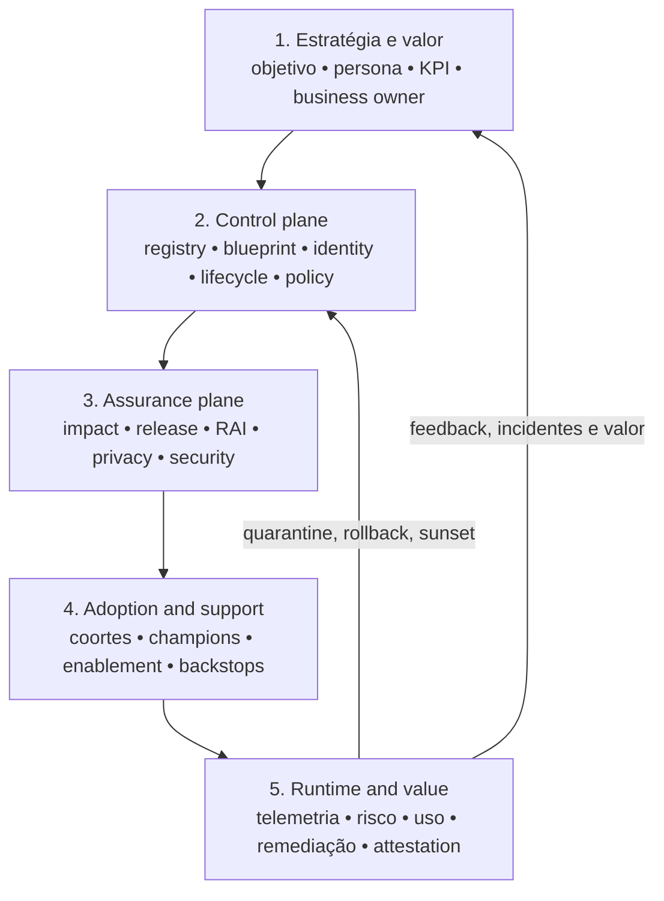
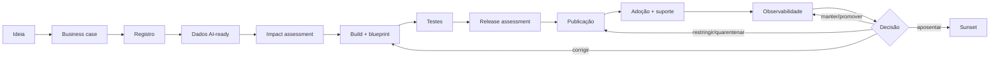
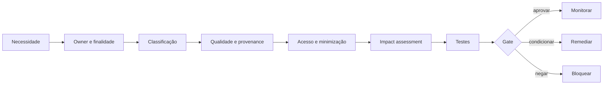
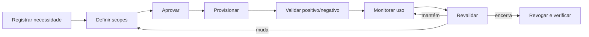
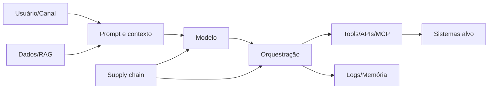
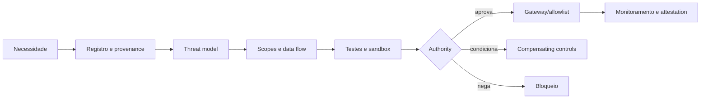

# 06 — Arquitetura e controles técnicos

Este capítulo integra a estrutura clean-room aprovada com o conteúdo substantivo do corpus autoritativo. Requisitos do framework são vendor-neutral; legislação externa, guidance, casos e histórico são identificados como tais. A implementação organizacional exige adoção formal pela authority competente e não decorre do versionamento deste repositório.

## Contrato operacional do capítulo

As subseções seguintes formam um contrato executável de completude. Cada uma especifica a decisão ou ação requerida, o record/evidence mínimo e uma condição observável de conclusão para levar a governança do zero ao business as usual.

### 06.1 Architecture principles and quality attributes

**Required decision/action.** For **architecture principles and quality attributes**, the organization must translate principles and quality attributes into decision questions, measurable requirements and explicit trade-offs.

**Record and evidence.** Record applicable principle, scenario, threshold, design response, owner, test and unresolved trade-off.

**Done when.** Architecture and release decisions show how conflicting qualities were balanced rather than merely citing principles.

### 06.2 Reference architecture and system boundaries

**Required decision/action.** For **reference architecture and system boundaries**, the organization must document boundaries, trust assumptions, data and action flows, quality attributes, controls and failure behavior before build.

**Record and evidence.** Retain approved blueprint, diagrams, interface contracts, threat and impact links, alternatives and ADRs.

**Done when.** Reviewers can trace each material requirement to an architecture element and testable enforcement point.

### 06.3 Separation of governance management and runtime enforcement

**Required decision/action.** For **separation of governance management and runtime enforcement**, the organization must separate policy authoring, decision, distribution and runtime enforcement while preserving traceable linkage.

**Record and evidence.** The architecture record must identify policy source, decision point, enforcement point, version propagation, fail mode and telemetry.

**Done when.** A policy change reaches enforcement predictably and failure cannot silently fall back to an unrestricted path.

### 06.4 Enterprise inventory and registry integration

**Required decision/action.** For **enterprise inventory and registry integration**, the organization must operate the registry as the authoritative identity and lifecycle index for every in-scope agent.

**Record and evidence.** Validate stable ID, owner, purpose, tier, admissibility, version, environment, state, dependencies and last-attested date.

**Done when.** Automated and manual reconciliation detects missing, stale, duplicate and invalid records and blocks required transitions.

### 06.5 Agent identity

**Required decision/action.** For **agent identity**, the organization must assign a unique non-human identity per agent or bounded runtime instance with a named owner.

**Record and evidence.** Record identity ID, issuer, owner, environment, authentication mode, entitlements, credential age and lifecycle state.

**Done when.** Shared human credentials are absent and disablement of the registry identity revokes the agent's effective access.

### 06.6 User identity and delegated context

**Required decision/action.** For **user identity and delegated context**, the organization must preserve the initiating user's identity, consent and delegated authority across the agent's action chain.

**Record and evidence.** Record user, session, delegation scope, purpose, expiry, downstream propagation and audit correlation.

**Done when.** The agent cannot expand delegated authority and every consequential action is attributable to both agent and initiating context.

### 06.7 Authentication

**Required decision/action.** For **authentication**, the organization must use approved workload authentication with rotation, audience restriction and revocation.

**Record and evidence.** Retain issuer, credential type, storage, rotation, expiry, audience, failure alerts and test evidence.

**Done when.** Expired, replayed or wrong-audience credentials fail and no secret is embedded in source, prompt or configuration.

### 06.8 Authorization and policy decision

**Required decision/action.** For **authorization and policy decision**, the organization must evaluate each sensitive action and material parameter against current subject, resource, context and purpose.

**Record and evidence.** Record policy version, input attributes, decision, reason, enforcement result, override and correlation ID.

**Done when.** Negative tests deny out-of-scope actions and delegated or multi-step execution cannot bypass the same policy.

### 06.9 Least privilege and just-in-time access

**Required decision/action.** For **least privilege and just-in-time access**, the organization must grant the minimum action, resource, environment and duration needed for the approved purpose.

**Record and evidence.** Record entitlement rationale, approver, activation, expiry, use, attestation and revocation evidence.

**Done when.** Unused or expired privilege is removed automatically and access expansion reopens authorization review.

### 06.10 Secrets and credential lifecycle

**Required decision/action.** For **secrets and credential lifecycle**, the organization must issue, store, rotate, monitor and revoke secrets through an approved secrets service.

**Record and evidence.** Record secret owner, consumer identity, store reference, rotation target, last use, exposure response and deletion.

**Done when.** Scans find no embedded secret and rotation or revocation can occur without rebuilding unrelated components.

### 06.11 Data classification and authorization

**Required decision/action.** For **data classification and authorization**, the organization must authorize each data source and field class for the stated purpose, identity and environment.

**Record and evidence.** Record classification, owner, purpose, allowed operations, jurisdiction, retention, DLP controls and access test.

**Done when.** Unauthorized data and cross-purpose reuse are denied at the boundary and logged with attributable context.

### 06.12 Data minimization, provenance, quality and retention

**Required decision/action.** For **data minimization, provenance, quality and retention**, the organization must limit data to what is necessary and trace its source, transformations, quality and disposition.

**Record and evidence.** Record source owner, lineage, quality rules, filters, retention, deletion, derived-data handling and known gaps.

**Done when.** Stale, low-quality or untraceable data is excluded or disclosed and retention expiry is technically enforced.

### 06.13 Knowledge bases, retrieval and grounded generation

**Required decision/action.** For **knowledge bases, retrieval and grounded generation**, the organization must govern retrieval sources, indexing, access filtering, freshness and citation for the use context.

**Record and evidence.** Record source catalog, ingestion version, permission model, chunking, freshness SLA, retrieval tests and citation evidence.

**Done when.** Retrieval respects source permissions and material answers can be traced to current authorized evidence.

### 06.14 Model and provider selection

**Required decision/action.** For **model and provider selection**, the organization must select approved model-provider combinations against task, data, risk, portability and fallback requirements.

**Record and evidence.** Record model and provider version, evaluation, data restrictions, region, terms, fallback, change notice and exit test.

**Done when.** Unapproved substitution is blocked and fallback does not silently weaken data, safety or evaluation requirements.

### 06.15 Model versions, fallback and portability

**Required decision/action.** For **model versions, fallback and portability**, the organization must select approved model-provider combinations against task, data, risk, portability and fallback requirements.

**Record and evidence.** Record model and provider version, evaluation, data restrictions, region, terms, fallback, change notice and exit test.

**Done when.** Unapproved substitution is blocked and fallback does not silently weaken data, safety or evaluation requirements.

### 06.16 Tools, APIs, plugins and Model Context Protocol

**Required decision/action.** For **tools, apis, plugins and model context protocol**, the organization must register each callable tool with owner, source, action class, scopes, side effects and approved versions.

**Record and evidence.** Retain tool ID, provenance, interface hash, parameters, permissions, data classes, rate limits, sandbox and review date.

**Done when.** Unknown or incompatible tools cannot be invoked and version change triggers impact and negative testing.

### 06.17 Tool registry and provenance

**Required decision/action.** For **tool registry and provenance**, the organization must register each callable tool with owner, source, action class, scopes, side effects and approved versions.

**Record and evidence.** Retain tool ID, provenance, interface hash, parameters, permissions, data classes, rate limits, sandbox and review date.

**Done when.** Unknown or incompatible tools cannot be invoked and version change triggers impact and negative testing.

### 06.18 Action-level and parameter-level authorization

**Required decision/action.** For **action-level and parameter-level authorization**, the organization must evaluate each sensitive action and material parameter against current subject, resource, context and purpose.

**Record and evidence.** Record policy version, input attributes, decision, reason, enforcement result, override and correlation ID.

**Done when.** Negative tests deny out-of-scope actions and delegated or multi-step execution cannot bypass the same policy.

### 06.19 Human approval for consequential actions

**Required decision/action.** For **human approval for consequential actions**, the organization must place a competent human at a decision point where intervention remains timely, informed and technically effective.

**Record and evidence.** Record trigger, information presented, authority, response time, override path, workload, training and exercised test.

**Done when.** The human can detect, stop, correct and escalate a representative failure rather than rubber-stamping an irreversible action.

### 06.20 Memory, persistence and deletion

**Required decision/action.** For **memory, persistence and deletion**, the organization must define what state may persist, who can access it, its purpose, isolation, retention and deletion behavior.

**Record and evidence.** Record memory class, keying, data categories, owner, encryption, retention, user controls and deletion test.

**Done when.** State does not leak across users or purposes and deletion removes active and derived copies within the target.

### 06.21 Multi-agent delegation and inherited authority

**Required decision/action.** For **multi-agent delegation and inherited authority**, the organization must constrain delegation depth, task, budget, identity and permissions at every agent-to-agent handoff.

**Record and evidence.** Record delegator, delegate, task, inherited and reduced scopes, expiry, chain ID, result and revocation.

**Done when.** The chain cannot amplify authority and operators can stop and attribute every delegated action.

### 06.22 Code execution and sandboxing

**Required decision/action.** For **code execution and sandboxing**, the organization must execute generated or supplied code only in an isolated, least-privileged and disposable environment.

**Record and evidence.** Record image or runtime hash, allowed resources, filesystem, network, timeout, inputs, outputs, scan and cleanup.

**Done when.** Escape, persistence, secret access and unauthorized egress tests fail safely and the sandbox is destroyed after use.

### 06.23 Network boundaries, egress and isolation

**Required decision/action.** For **network boundaries, egress and isolation**, the organization must restrict network paths to approved destinations, protocols, identities and data purposes.

**Record and evidence.** Record segment, allowlist, proxy or gateway policy, DNS and egress logs, inspection, exception and test evidence.

**Done when.** Unapproved egress and lateral movement are denied and a boundary failure triggers containment.

### 06.24 Software, model, data and tool supply chain

**Required decision/action.** For **software, model, data and tool supply chain**, the organization must inventory and verify software, model, data and tool dependencies from source through deployment.

**Record and evidence.** Retain provenance, version, license, integrity signature or hash, vulnerability status, owner, update and recall path.

**Done when.** Unverifiable or blocked components cannot promote and a compromised dependency can be located and replaced.

### 06.25 Input, context and output controls

**Required decision/action.** For **input, context and output controls**, the organization must validate and bound inputs, system context, retrieved content and outputs according to data and action risk.

**Record and evidence.** Record validation rules, size and type limits, sanitization, policy checks, output handling, failures and test corpus.

**Done when.** Malformed, injected or disallowed content cannot cross the boundary or trigger an unauthorized action.

### 06.26 Logging, correlation and evidence integrity

**Required decision/action.** For **logging, correlation and evidence integrity**, the organization must emit attributable events that correlate user, agent, version, task, model, tool, policy decision and outcome.

**Record and evidence.** Define event schema, IDs, timestamps, integrity control, retention, access, clock assumptions and coverage tests.

**Done when.** A representative action chain can be reconstructed without exposing prohibited prompt, secret or personal data.

### 06.27 Observability and behavioral signals

**Required decision/action.** For **observability and behavioral signals**, the organization must establish baselines and signals for behavior, quality, safety, security, cost and dependency change.

**Record and evidence.** Record signal definition, population, baseline window, threshold, confidence, owner, response ladder and calibration history.

**Done when.** Alerts are calibrated against real behavior and lead to investigation, throttling, quarantine or reassessment.

### 06.28 Rate, spend and resource limits

**Required decision/action.** For **rate, spend and resource limits**, the organization must enforce per-agent and per-owner limits for rate, concurrency, spend, tokens, storage and high-impact actions.

**Record and evidence.** Record limit, scope, rationale, warning and hard thresholds, override authority, telemetry and test.

**Done when.** Limit breach throttles or stops safely and an agent cannot evade limits through delegation or retries.

### 06.29 Kill switch, circuit breaker and containment

**Required decision/action.** For **kill switch, circuit breaker and containment**, the organization must implement authority and technical paths to stop actions, isolate dependencies and preserve evidence.

**Record and evidence.** Record trigger, command path, scope, expected state, operator, test cadence, result and recovery prerequisites.

**Done when.** A drill contains a representative failure within the target without relying on the failing agent itself.

### 06.30 Fail-safe behavior, rollback and recovery

**Required decision/action.** For **fail-safe behavior, rollback and recovery**, the organization must define the safer state, rollback target and recovery sequence for control, dependency and model failures.

**Record and evidence.** Retain failure modes, trigger, rollback artifact, data reconciliation, operator authority, RTO/RPO and exercise result.

**Done when.** A representative failure restores a known-good bounded service without losing required evidence or duplicating actions.

### 06.31 Resilience, continuity and exit strategy

**Required decision/action.** For **resilience, continuity and exit strategy**, the organization must define approved degraded modes, dependency fallbacks, continuity priorities and exit from critical suppliers.

**Record and evidence.** Record critical paths, tolerances, RTO/RPO, fallback capability, manual procedure, data reconciliation and exercise.

**Done when.** The service meets the approved recovery target without silently bypassing risk, data or authorization controls.

### 06.32 Platform integration and vendor-neutral extension points

**Required decision/action.** For **platform integration and vendor-neutral extension points**, the organization must define capability contracts and extension interfaces independently from a specific product.

**Record and evidence.** Record required behavior, interface, data and identity contract, portability test, supplier mapping and exit constraint.

**Done when.** A supplier can be replaced or isolated without redefining the policy, control IDs, schemas or decision gates.


## Conteúdo canônico incorporado

A seção preserva integralmente as unidades atribuídas pela matriz de cobertura. Os marcadores HTML são provenance machine-readable e não alteram o significado normativo.

### Fonte: `docs/architecture/capability-to-technology.md`

Commit de origem: `5545d9227624400ab8bb707b6032b2f61329a36e`.

<!-- source-unit {"classification": "metadata-title", "end_line": "2", "index": 1, "source_field": "title", "source_heading": "", "source_path": "docs/architecture/capability-to-technology.md", "start_line": "2", "transformation": "integrate-method-completely", "unit_type": "frontmatter-title"} -->
**Título controlado na origem:** Mapeamento de capability para tecnologia

<!-- source-unit {"classification": "concept-or-structure", "end_line": "16", "index": 2, "source_field": "", "source_heading": "Mapeamento de capability para tecnologia", "source_path": "docs/architecture/capability-to-technology.md", "start_line": "15", "transformation": "integrate-method-completely", "unit_type": "markdown-atx-heading"} -->
### Mapeamento de capability para tecnologia

<!-- source-unit {"classification": "objective", "end_line": "22", "index": 3, "source_field": "", "source_heading": "Objetivo", "source_path": "docs/architecture/capability-to-technology.md", "start_line": "17", "transformation": "integrate-method-completely", "unit_type": "markdown-atx-heading"} -->
#### Objetivo

Conectar as capacidades exigidas pelo framework aos sistemas que a organização **já tem**, sem transformar o framework em dependência de produto.

Este é o documento que falta entre a arquitetura de referência e a execução: a arquitetura diz qual controle precisa existir e onde; o capability map diz onde a organização está; este mapeamento diz **qual sistema passa a responder por cada função** e quem é a fonte autoritativa de cada atributo.

<!-- source-unit {"classification": "evidence-artifact", "end_line": "30", "index": 4, "source_field": "", "source_heading": "Por que o mapeamento é um artefato separado", "source_path": "docs/architecture/capability-to-technology.md", "start_line": "23", "transformation": "integrate-method-completely", "unit_type": "markdown-atx-heading"} -->
#### Por que o mapeamento é um artefato separado

A [arquitetura de referência](06-architecture-and-technical-controls.md) e a [policy modular](00-document-control.md) são agnósticas de produto por decisão registrada ([ADR-0002](../../project/decisions/0001-canonical-source-and-product-boundaries.md)). O mapeamento não é: ele nomeia sistemas concretos da organização.

Manter os dois no mesmo documento é o erro que produz frameworks descartáveis. Quando o produto muda — e ele muda —, uma arquitetura contaminada por nomes de produto precisa ser reescrita inteira. Separados, troca-se o mapeamento e a arquitetura permanece.

Por isso este documento descreve o **método** e as categorias de sistema. O mapeamento preenchido é artefato da organização e vive fora deste repositório.

<!-- source-unit {"classification": "concept-or-structure", "end_line": "40", "index": 5, "source_field": "", "source_heading": "Método", "source_path": "docs/architecture/capability-to-technology.md", "start_line": "31", "transformation": "integrate-method-completely", "unit_type": "markdown-atx-heading"} -->
#### Método

1. **Comece pela capability e pelo controle, nunca pelo produto.** A frase de partida é "precisamos de registry com owner, tier e lifecycle" — não "precisamos de uma ferramenta de governança de agentes".
2. **Identifique os systems of record existentes que já fornecem parte da função.** Quase nenhuma organização parte do zero: inventário, identidade, risco, integração, telemetria e catálogo de dados normalmente já existem com owner e processo.
3. **Defina contrato de integração e source of truth por atributo.** Não por sistema — por atributo. Owner de negócio pode vir do sistema de RH, tier do registro de risco, estado operacional da plataforma de execução. Duplicar ownership do mesmo atributo em cinco sistemas é como se perde a rastreabilidade.
4. **Só então avalie produtos para os gaps remanescentes.** Um produto pode cobrir várias capabilities; isso é vantagem operacional, não razão para o framework depender do nome dele.
5. **Registre um ADR para toda decisão que cria lock-in, centraliza enforcement ou altera trust boundary.** Essas três são reversíveis apenas com custo alto, e a justificativa precisa sobreviver à saída de quem decidiu.

A ordem importa. Invertida — produto primeiro, capability depois — a organização passa a chamar de governança aquilo que a ferramenta comprada faz.

<!-- source-unit {"classification": "concept-or-structure", "end_line": "56", "index": 6, "source_field": "", "source_heading": "Capacidades a mapear", "source_path": "docs/architecture/capability-to-technology.md", "start_line": "41", "transformation": "integrate-method-completely", "unit_type": "markdown-atx-heading"} -->
#### Capacidades a mapear

| Capability | Função de controle | Categorias que costumam fornecer | Decidir antes de escolher produto |
|---|---|---|---|
| estate e registry | existência, ownership, tier e estado de cada agente | inventário de configuração, ITSM, GRC, plataforma de execução | quem é source of truth de cada campo e como conflitos são reconciliados |
| identidade não-humana | emissão, escopo, expiry e revogação de identidade própria | IAM e governança de identidade, gestão de segredos | se o agente atua com identidade delegada, própria ou ambas, e como JML se aplica |
| dados certificados | quais fontes podem ser usadas, por quem e com quais restrições | catálogo de dados, prevenção de perda de dados, plataforma de dados | critério de certificação e quem tem autoridade sobre a fonte |
| mediação de ações | autorização por ação e parâmetro antes da execução | gateway de API, camada de integração, broker próprio | quais ações exigem mediação e quais podem permanecer no builder |
| acesso a modelos | roteamento, allowlist, budget, fallback e logging de chamadas | gateway de modelos ou proxy de inferência | combinações modelo/provedor permitidas por classe de dado |
| lifecycle e attestation | transições, dormancy, revalidação e retirada | GRC, ITSM, o próprio registry | o que é mudança material e o que dispara reassessment |
| observabilidade e correlação | reconstruir o que aconteceu, ponta a ponta | plataforma de observabilidade, SIEM | schema de telemetria e chave de correlação comuns |
| custo e unit economics | orçamento, quota e custo por resultado | gestão de custo de nuvem, FinOps | qual é a unidade de resultado antes de medir custo por ela |
| evidência | pacote recuperável, versionado e íntegro por release | GRC, repositório de evidências | retenção por tier e como a integridade é verificada |

Nenhuma linha nomeia produto. A coluna de categorias existe para acelerar o reconhecimento do que já existe na casa, não para sugerir compra.

<!-- source-unit {"classification": "reference", "end_line": "62", "index": 7, "source_field": "", "source_heading": "Regra do source of truth", "source_path": "docs/architecture/capability-to-technology.md", "start_line": "57", "transformation": "integrate-method-completely", "unit_type": "markdown-atx-heading"} -->
#### Regra do source of truth

Um atributo tem **exatamente um** sistema autoritativo. Os demais consomem e podem exibir, nunca redefinir.

Quando dois sistemas discordam, a divergência é finding — não é resolvida escolhendo o valor mais recente. Reconciliação silenciosa por timestamp destrói a evidência de que houve conflito, que costuma ser o sinal mais útil.

<!-- source-unit {"classification": "concept-or-structure", "end_line": "69", "index": 8, "source_field": "", "source_heading": "Quando o mapeamento exige ADR", "source_path": "docs/architecture/capability-to-technology.md", "start_line": "63", "transformation": "integrate-method-completely", "unit_type": "markdown-atx-heading"} -->
#### Quando o mapeamento exige ADR

- a decisão cria dependência difícil de reverter em prazo aceitável;
- o enforcement de um controle passa a existir em um único componente;
- a fronteira de confiança muda, incluindo quem pode emitir identidade ou autorizar ação;
- uma capability passa a depender de um sistema fora do perímetro de assurance da organização.

<!-- source-unit {"classification": "evidence-artifact", "end_line": "77", "index": 9, "source_field": "", "source_heading": "Evidências", "source_path": "docs/architecture/capability-to-technology.md", "start_line": "70", "transformation": "integrate-method-completely", "unit_type": "markdown-atx-heading"} -->
#### Evidências

- mapeamento capability × sistema, com owner e data;
- source of truth declarado por atributo;
- contratos de integração e o que cada um garante;
- ADRs das decisões de lock-in, centralização e trust boundary;
- gaps sem sistema atribuído, com owner e prazo.

<!-- source-unit {"classification": "metric", "end_line": "85", "index": 10, "source_field": "", "source_heading": "Métricas", "source_path": "docs/architecture/capability-to-technology.md", "start_line": "78", "transformation": "integrate-method-completely", "unit_type": "markdown-atx-heading"} -->
#### Métricas

- capabilities sem sistema atribuído;
- atributos com mais de um sistema se declarando autoritativo;
- divergências de reconciliação abertas por período;
- decisões de lock-in sem ADR;
- capabilities cobertas por sistema fora do perímetro de assurance.

<!-- source-unit {"classification": "risk-failure-mode", "end_line": "94", "index": 11, "source_field": "", "source_heading": "Failure modes", "source_path": "docs/architecture/capability-to-technology.md", "start_line": "86", "transformation": "integrate-method-completely", "unit_type": "markdown-atx-heading"} -->
#### Failure modes

- escolher produto antes de definir capability e controle;
- tratar cobertura de produto como cobertura de controle;
- duplicar ownership do mesmo atributo em vários sistemas;
- reconciliar divergência por timestamp e perder o sinal de conflito;
- deixar o mapeamento sem data de revisão e descobrir na auditoria que ele descreve um estado antigo;
- misturar o mapeamento na arquitetura e ter de reescrever a arquitetura quando o produto mudar.

<!-- source-unit {"classification": "requirement-control", "end_line": "97", "index": 12, "source_field": "", "source_heading": "Decision gate", "source_path": "docs/architecture/capability-to-technology.md", "start_line": "95", "transformation": "integrate-method-completely", "unit_type": "markdown-atx-heading"} -->
#### Decision gate

Uma capability não é declarada implantada sem sistema atribuído, source of truth por atributo e evidência recuperável. Cobertura prometida por roadmap de fornecedor não é cobertura.

### Fonte: `docs/architecture/overview.md`

Commit de origem: `5545d9227624400ab8bb707b6032b2f61329a36e`.

<!-- source-unit {"classification": "metadata-title", "end_line": "2", "index": 13, "source_field": "title", "source_heading": "", "source_path": "docs/architecture/overview.md", "start_line": "2", "transformation": "synthesize-and-preserve", "unit_type": "frontmatter-title"} -->
**Título controlado na origem:** Arquitetura de referência para governança de agentes

<!-- source-unit {"classification": "reference", "end_line": "15", "index": 14, "source_field": "", "source_heading": "Arquitetura de referência para governança de agentes", "source_path": "docs/architecture/overview.md", "start_line": "14", "transformation": "synthesize-and-preserve", "unit_type": "markdown-atx-heading"} -->
### Arquitetura de referência para governança de agentes

<!-- source-unit {"classification": "architecture-runtime", "end_line": "19", "index": 15, "source_field": "", "source_heading": "Status desta arquitetura", "source_path": "docs/architecture/overview.md", "start_line": "16", "transformation": "synthesize-and-preserve", "unit_type": "markdown-atx-heading"} -->
#### Status desta arquitetura

Este documento integra a [policy modular](00-document-control.md) como arquitetura canônica do framework. A adoção normativa de uma release continua dependendo da authority competente.

<!-- source-unit {"classification": "objective", "end_line": "27", "index": 16, "source_field": "", "source_heading": "Objetivo", "source_path": "docs/architecture/overview.md", "start_line": "20", "transformation": "synthesize-and-preserve", "unit_type": "markdown-atx-heading"} -->
#### Objetivo

Conectar estratégia, dados, controles, Responsible AI, adoção, suporte e operação em um único fluxo verificável. O modelo define capabilities e boundaries independentes de produto; qualquer plataforma é uma implementação substituível e opcional.

A ligação entre estas capabilities e os sistemas que a organização já opera é artefato separado, por decisão: [mapeamento de capability para tecnologia](06-architecture-and-technical-controls.md). Mantê-lo fora daqui é o que permite trocar de produto sem reescrever a arquitetura.

Duas leituras complementam esta arquitetura: os [atributos de qualidade](06-architecture-and-technical-controls.md) que ela precisa sustentar e os [riscos arquiteturais](06-architecture-and-technical-controls.md) que ela assume. Uma arquitetura sem atributo declarado não pode ser avaliada; sem risco declarado, não pode ser desafiada.

<!-- source-unit {"classification": "concept-or-structure", "end_line": "45", "index": 17, "source_field": "", "source_heading": "Modelo em cinco planos", "source_path": "docs/architecture/overview.md", "start_line": "28", "transformation": "synthesize-and-preserve", "unit_type": "markdown-atx-heading"} -->
#### Modelo em cinco planos



<!-- source-unit {"classification": "concept-or-structure", "end_line": "51", "index": 18, "source_field": "", "source_heading": "1. Estratégia e valor", "source_path": "docs/architecture/overview.md", "start_line": "46", "transformation": "synthesize-and-preserve", "unit_type": "markdown-atx-heading"} -->
##### 1. Estratégia e valor

Define por que o agente existe, qual processo afeta, quem responde pelo resultado e como sucesso ou fracasso serão medidos.

**Artefatos:** business case, persona, baseline, KPI, owner, critérios de sunset.

<!-- source-unit {"classification": "concept-or-structure", "end_line": "57", "index": 19, "source_field": "", "source_heading": "2. Control plane", "source_path": "docs/architecture/overview.md", "start_line": "52", "transformation": "synthesize-and-preserve", "unit_type": "markdown-atx-heading"} -->
##### 2. Control plane

Mantém a visão compartilhada de agentes, ownership, identidade, capacidades, dados, conectores, lifecycle e ações administrativas.

**Artefatos:** registry, agent blueprint, identity record, policy template, attestation.

<!-- source-unit {"classification": "concept-or-structure", "end_line": "63", "index": 20, "source_field": "", "source_heading": "3. Assurance plane", "source_path": "docs/architecture/overview.md", "start_line": "58", "transformation": "synthesize-and-preserve", "unit_type": "markdown-atx-heading"} -->
##### 3. Assurance plane

Avalia impactos, riscos, mitigadores, testes e accountability antes e durante a operação.

**Artefatos:** self-assessment, impact assessment, release assessment, threat model, evidence package, waiver.

<!-- source-unit {"classification": "adoption-implementation", "end_line": "69", "index": 21, "source_field": "", "source_heading": "4. Adoption and support plane", "source_path": "docs/architecture/overview.md", "start_line": "64", "transformation": "synthesize-and-preserve", "unit_type": "markdown-atx-heading"} -->
##### 4. Adoption and support plane

Prepara builders, usuários, líderes e suporte para criar, descobrir, usar e operar agentes com segurança.

**Artefatos:** adoption plan, coortes, learning assets, champion network, support model, feedback backlog.

<!-- source-unit {"classification": "architecture-runtime", "end_line": "75", "index": 22, "source_field": "", "source_heading": "5. Runtime and value plane", "source_path": "docs/architecture/overview.md", "start_line": "70", "transformation": "synthesize-and-preserve", "unit_type": "markdown-atx-heading"} -->
##### 5. Runtime and value plane

Observa comportamento, segurança, acesso, performance, uso e valor; executa remediação e realimenta decisões.

**Artefatos:** logs, dashboards, alerts, incidents, quarantine, rollback, value review, retirement decision.

<!-- source-unit {"classification": "concept-or-structure", "end_line": "89", "index": 23, "source_field": "", "source_heading": "Domínios canônicos por plano", "source_path": "docs/architecture/overview.md", "start_line": "76", "transformation": "synthesize-and-preserve", "unit_type": "markdown-atx-heading"} -->
#### Domínios canônicos por plano

Os cinco planos são a arquitetura. Os domínios canônicos são a organização editorial e de ownership do corpus. Um domínio pertence a um plano principal, mas quase sempre produz evidência consumida por outros.

| Plano | Domínios canônicos |
|---|---|
| 1. Estratégia e valor | [estratégia, portfólio e valor](03-inventory-portfolio-and-value.md) |
| 2. Control plane | [estate e registry](../../toolkit/registry/README.md) · [lifecycle](05-agent-lifecycle.md) · [identidade](06-architecture-and-technical-controls.md) · [dados](06-architecture-and-technical-controls.md) · [tools e MCP](06-architecture-and-technical-controls.md) · [modelos e provedores](06-architecture-and-technical-controls.md) |
| 3. Assurance plane | [risco](04-risk-impact-and-compliance.md) · [Responsible AI](04-risk-impact-and-compliance.md) · [segurança](06-architecture-and-technical-controls.md) · [evaluations](07-evaluation-evidence-and-assurance.md) · [human oversight](02-governance-and-accountability.md) |
| 4. Adoção e suporte | [adoção e enablement](08-implementation-and-adoption.md) |
| 5. Runtime e valor | [operações e resposta](09-operations-incidents-and-continuity.md) · [auditabilidade](07-evaluation-evidence-and-assurance.md) |

Um domínio novo só se justifica quando altera decisão, authority, control ou evidência. Subdividir por afinidade temática, sem consequência operacional, aumenta manutenção sem aumentar governança.

<!-- source-unit {"classification": "procedure", "end_line": "110", "index": 24, "source_field": "", "source_heading": "Fluxo ponta a ponta", "source_path": "docs/architecture/overview.md", "start_line": "90", "transformation": "synthesize-and-preserve", "unit_type": "markdown-atx-heading"} -->
#### Fluxo ponta a ponta



<!-- source-unit {"classification": "decision-authority", "end_line": "125", "index": 25, "source_field": "", "source_heading": "Matriz de proporcionalidade", "source_path": "docs/architecture/overview.md", "start_line": "111", "transformation": "synthesize-and-preserve", "unit_type": "markdown-atx-heading"} -->
#### Matriz de proporcionalidade

O grau de governança deve aumentar quando cresce qualquer uma destas dimensões:

- alcance e número de usuários;
- sensibilidade e criticidade dos dados;
- escrita, ação ou automação de workflows;
- interconectividade e uso de APIs/MCP;
- irreversibilidade;
- impacto financeiro, operacional, legal ou humano;
- autonomia;
- distribuição regional e exposição externa.

O modelo combina autonomia, blast radius, capacidade de ação, criticidade, reversibilidade, dados e alcance. Taxonomias organizacionais adicionais podem ser mapeadas sem alterar a arquitetura.

<!-- source-unit {"classification": "concept-or-structure", "end_line": "127", "index": 26, "source_field": "", "source_heading": "Boundaries", "source_path": "docs/architecture/overview.md", "start_line": "126", "transformation": "synthesize-and-preserve", "unit_type": "markdown-atx-heading"} -->
#### Boundaries

<!-- source-unit {"classification": "concept-or-structure", "end_line": "135", "index": 27, "source_field": "", "source_heading": "O control plane deve", "source_path": "docs/architecture/overview.md", "start_line": "128", "transformation": "synthesize-and-preserve", "unit_type": "markdown-atx-heading"} -->
##### O control plane deve

- consolidar contexto;
- reconciliar inventário;
- expor postura e sinais;
- acionar workflows e ferramentas especializadas;
- registrar evidências e decisões.

<!-- source-unit {"classification": "concept-or-structure", "end_line": "143", "index": 28, "source_field": "", "source_heading": "O control plane não deve", "source_path": "docs/architecture/overview.md", "start_line": "136", "transformation": "synthesize-and-preserve", "unit_type": "markdown-atx-heading"} -->
##### O control plane não deve

- substituir sistemas de identidade ou DLP;
- decidir sozinho risco residual;
- transformar telemetria incompleta em falsa certeza;
- centralizar toda responsabilidade em um único time;
- confundir uso com valor.

<!-- source-unit {"classification": "architecture-runtime", "end_line": "153", "index": 29, "source_field": "", "source_heading": "Princípios arquiteturais", "source_path": "docs/architecture/overview.md", "start_line": "144", "transformation": "synthesize-and-preserve", "unit_type": "markdown-atx-heading"} -->
#### Princípios arquiteturais

1. **Proporcional:** controles crescem com risco e capacidade.
2. **Embedded by default:** guardrails entram nas ferramentas e pipelines.
3. **Human-led:** accountability e julgamento permanecem humanos.
4. **Observable and remediable:** toda autonomia relevante precisa de sinal e ação.
5. **Federated with common controls:** domínios mantêm ownership; padrões comuns preservam confiança.
6. **Lifecycle-aware:** criação, mudança, attestation e sunset são partes do mesmo sistema.
7. **Platform-agnostic:** a policy é comum; adapters e evidências variam por plataforma.

<!-- source-unit {"classification": "procedure", "end_line": "166", "index": 30, "source_field": "", "source_heading": "Playbook do runtime control plane", "source_path": "docs/architecture/overview.md", "start_line": "154", "transformation": "synthesize-and-preserve", "unit_type": "markdown-atx-heading"} -->
#### Playbook do runtime control plane

O control plane transforma os standards dos demais domínios em enforcement técnico. A arquitetura precisa deixar explícito **onde** autenticação, policy, acesso a modelo, mediação de ferramentas, egress, rate limit, logging e contenção realmente acontecem.

1. **Separar management plane de runtime plane.** O primeiro guarda registry, policy, lifecycle e configuração; o segundo executa sessões, recuperação, modelos e ferramentas. A separação revela onde cada controle deve residir.
2. **Definir pontos de enforcement comuns.** Gateways e brokers para modelos, ferramentas e egress onde isso reduzir bypass. Nem todo tráfego precisa passar por um único componente, mas **toda rota de produção precisa de enforcement conhecido**.
3. **Modelar o fluxo ponta a ponta por tier.** Gatilho → agente → identidade → dados/ferramenta/modelo → policy → telemetria → resposta. Desenhar ao menos um fluxo T1, um T2 e um T3 para verificar que nenhum controle depende de conhecimento implícito.
4. **Implementar isolamento e fronteiras de rede.** Egress, endpoints privados, separação de ambientes, fronteira de secrets e acesso a sistemas críticos. Workloads privilegiados merecem runtime isolado e allowlists mais restritas.
5. **Definir limites operacionais.** Timeouts, máximo de chamadas e profundidade de cadeia, concorrência, política de retry, limite de contexto, budget e circuit breaker. **São controles de resiliência e custo, não tuning.**
6. **Projetar fallback e comportamento de falha.** Decidir o que acontece quando modelo, índice, ferramenta ou identidade falham. Fail-closed pode ser obrigatório em ação crítica; em leitura pode haver degradação controlada — mas a escolha é explícita.
7. **Padronizar correlation IDs e telemetria.** Uma execução precisa ser rastreável por tarefa, sessão, agente, usuário, modelo, ferramenta e policy. Sem correlação, segurança, custo e valor ficam em silos.
8. **Validar por teste e cenário de ameaça.** Exercitar falha de componente, bypass de policy, negação de permissão, loop descontrolado, indisponibilidade de provedor e quarentena. **A arquitetura de referência só está pronta quando os padrões são demonstráveis em um piloto.**

<!-- source-unit {"classification": "concept-or-structure", "end_line": "172", "index": 31, "source_field": "", "source_heading": "Visual consolidado", "source_path": "docs/architecture/overview.md", "start_line": "167", "transformation": "synthesize-and-preserve", "unit_type": "markdown-atx-heading"} -->
#### Visual consolidado


A fonte reproduzível está em [`tools/scripts/render-agent-governance-infographic.py`](../../tools/render-agent-governance-infographic.py).

<!-- source-unit {"classification": "concept-or-structure", "end_line": "179", "index": 32, "source_field": "", "source_heading": "Próximos passos", "source_path": "docs/architecture/overview.md", "start_line": "173", "transformation": "synthesize-and-preserve", "unit_type": "markdown-atx-heading"} -->
#### Próximos passos

- aprovar mandato, escopo, sponsorship e risk appetite;
- executar o [plano de 90 dias](08-implementation-and-adoption.md);
- implantar registry, blueprint e risk tiering no portfólio inicial;
- validar decision gates, containment, rollback e attestation por evidência;
- promover mudanças normativas por proposta, revisão, authority, changelog e release versionada.

### Fonte: `docs/architecture/quality-attributes.md`

Commit de origem: `5545d9227624400ab8bb707b6032b2f61329a36e`.

<!-- source-unit {"classification": "metadata-title", "end_line": "2", "index": 33, "source_field": "title", "source_heading": "", "source_path": "docs/architecture/quality-attributes.md", "start_line": "2", "transformation": "integrate-as-quality-attributes-section-preserving-review-and-observed-status", "unit_type": "frontmatter-title"} -->
**Título controlado na origem:** Atributos de qualidade para governança de agentes

<!-- source-unit {"classification": "concept-or-structure", "end_line": "12", "index": 34, "source_field": "", "source_heading": "Atributos de qualidade para governança de agentes", "source_path": "docs/architecture/quality-attributes.md", "start_line": "11", "transformation": "integrate-as-quality-attributes-section-preserving-review-and-observed-status", "unit_type": "markdown-atx-heading"} -->
### Atributos de qualidade para governança de agentes

<!-- source-unit {"classification": "concept-or-structure", "end_line": "16", "index": 35, "source_field": "", "source_heading": "Auditability", "source_path": "docs/architecture/quality-attributes.md", "start_line": "13", "transformation": "integrate-as-quality-attributes-section-preserving-review-and-observed-status", "unit_type": "markdown-atx-heading"} -->
#### Auditability

Toda decisão relevante precisa de owner, timestamp, evidência, versão e vínculo com agent ID.

<!-- source-unit {"classification": "architecture-runtime", "end_line": "20", "index": 36, "source_field": "", "source_heading": "Observability", "source_path": "docs/architecture/quality-attributes.md", "start_line": "17", "transformation": "integrate-as-quality-attributes-section-preserving-review-and-observed-status", "unit_type": "markdown-atx-heading"} -->
#### Observability

A operação deve expor ações, ferramentas, dados acessados, erros, custo, policy signals e uso suficiente para decisão.

<!-- source-unit {"classification": "concept-or-structure", "end_line": "24", "index": 37, "source_field": "", "source_heading": "Remediability", "source_path": "docs/architecture/quality-attributes.md", "start_line": "21", "transformation": "integrate-as-quality-attributes-section-preserving-review-and-observed-status", "unit_type": "markdown-atx-heading"} -->
#### Remediability

O sistema deve permitir restringir, quarentenar, corrigir, reverter e aposentar dentro de SLAs proporcionais ao risco.

<!-- source-unit {"classification": "concept-or-structure", "end_line": "28", "index": 38, "source_field": "", "source_heading": "Accountability", "source_path": "docs/architecture/quality-attributes.md", "start_line": "25", "transformation": "integrate-as-quality-attributes-section-preserving-review-and-observed-status", "unit_type": "markdown-atx-heading"} -->
#### Accountability

Business owner, technical owner e authorities precisam ter responsabilidade e autoridade claramente separadas.

<!-- source-unit {"classification": "concept-or-structure", "end_line": "32", "index": 39, "source_field": "", "source_heading": "Interoperability", "source_path": "docs/architecture/quality-attributes.md", "start_line": "29", "transformation": "integrate-as-quality-attributes-section-preserving-review-and-observed-status", "unit_type": "markdown-atx-heading"} -->
#### Interoperability

Registry, evidence e policy controls devem funcionar em múltiplas plataformas, inclusive ferramentas de terceiros.

<!-- source-unit {"classification": "concept-or-structure", "end_line": "36", "index": 40, "source_field": "", "source_heading": "Security and privacy", "source_path": "docs/architecture/quality-attributes.md", "start_line": "33", "transformation": "integrate-as-quality-attributes-section-preserving-review-and-observed-status", "unit_type": "markdown-atx-heading"} -->
#### Security and privacy

Least privilege, workload identity, secrets management, DLP, data boundaries e secure-by-default são propriedades de base.

<!-- source-unit {"classification": "concept-or-structure", "end_line": "40", "index": 41, "source_field": "", "source_heading": "Reliability", "source_path": "docs/architecture/quality-attributes.md", "start_line": "37", "transformation": "integrate-as-quality-attributes-section-preserving-review-and-observed-status", "unit_type": "markdown-atx-heading"} -->
#### Reliability

Agentes críticos exigem métricas, error handling, rollback, fallback e continuidade compatíveis com o processo afetado.

<!-- source-unit {"classification": "concept-or-structure", "end_line": "44", "index": 42, "source_field": "", "source_heading": "Usability", "source_path": "docs/architecture/quality-attributes.md", "start_line": "41", "transformation": "integrate-as-quality-attributes-section-preserving-review-and-observed-status", "unit_type": "markdown-atx-heading"} -->
#### Usability

Builders e usuários precisam entender limites, approvals, status e próximos passos sem depender de especialistas para casos simples.

<!-- source-unit {"classification": "concept-or-structure", "end_line": "48", "index": 43, "source_field": "", "source_heading": "Evolvability", "source_path": "docs/architecture/quality-attributes.md", "start_line": "45", "transformation": "integrate-as-quality-attributes-section-preserving-review-and-observed-status", "unit_type": "markdown-atx-heading"} -->
#### Evolvability

Risk matrix, connector catalog, model/tool inventory e policy templates devem aceitar novas capacidades sem reescrita completa.

<!-- source-unit {"classification": "concept-or-structure", "end_line": "51", "index": 44, "source_field": "", "source_heading": "Measurability", "source_path": "docs/architecture/quality-attributes.md", "start_line": "49", "transformation": "integrate-as-quality-attributes-section-preserving-review-and-observed-status", "unit_type": "markdown-atx-heading"} -->
#### Measurability

Criação, descoberta, uso, qualidade, risco, custo e valor precisam ser distinguíveis e comparáveis a baselines.

### Fonte: `docs/architecture/risks.md`

Commit de origem: `5545d9227624400ab8bb707b6032b2f61329a36e`.

<!-- source-unit {"classification": "metadata-title", "end_line": "2", "index": 45, "source_field": "title", "source_heading": "", "source_path": "docs/architecture/risks.md", "start_line": "2", "transformation": "synthesize-and-preserve", "unit_type": "frontmatter-title"} -->
**Título controlado na origem:** Riscos arquiteturais da governança de agentes

<!-- source-unit {"classification": "risk-failure-mode", "end_line": "27", "index": 46, "source_field": "", "source_heading": "Riscos arquiteturais da governança de agentes", "source_path": "docs/architecture/risks.md", "start_line": "11", "transformation": "synthesize-and-preserve", "unit_type": "markdown-atx-heading"} -->
### Riscos arquiteturais da governança de agentes

| Risco | Consequência | Mitigação arquitetural |
| --- | --- | --- |
| Catálogo incompleto | Falsa confiança e agentes órfãos | Reconciliation, missing-evidence status e coverage metrics |
| Centralização excessiva | Gargalo, shadow AI e baixa accountability local | Ownership federado, common controls e handoffs explícitos |
| Aprovação igual para todos | Burocracia em baixo risco e revisão insuficiente em alto risco | Risk matrix proporcional por alcance e capacidade |
| Telemetria sem ação | Dashboard decorativo e incidentes sem owner | Alert-to-workflow, authority, SLA e remediation states |
| Automação prematura | Enforcement incorreto e exceções ocultas | Escopo controlado, baselines e evidence before automation |
| Dados não confiáveis | Respostas erradas, oversharing e decisões inválidas | AI-ready data, labels, connector gates e lineage |
| Identidade fraca ou compartilhada | Acesso indevido e baixa rastreabilidade | Workload identity, least privilege e lifecycle de credenciais |
| MCP sem governança | Tool poisoning, exfiltration e blast radius ampliado | Gateway, vetting, inventory, isolation e context trimming |
| Métricas de vaidade | Investimento em agentes sem valor | Separar criação, descoberta, uso, qualidade e outcomes |
| Dependência de fornecedor | Lock-in e perda de controle | Policy e schemas multiplataforma, exportable logs e adapters |
| Owners nominais | Reviews e incidents sem decisão efetiva | Authority explícita, attestation e escalation path |
| Policy drift | Agentes ficam não conformes após mudanças | Versionamento, review triggers, compliance monitoring e remediation |

<!-- source-unit {"classification": "concept-or-structure", "end_line": "37", "index": 47, "source_field": "", "source_heading": "Review triggers", "source_path": "docs/architecture/risks.md", "start_line": "28", "transformation": "synthesize-and-preserve", "unit_type": "markdown-atx-heading"} -->
#### Review triggers

Revisar este registro quando houver:

- nova plataforma, model provider, connector ou MCP server;
- expansão regional ou exposição externa;
- mudança de autonomia ou capacidade de escrita/ação;
- incidente relevante;
- alteração regulatória;
- evidência operacional do portfólio inicial e dos decision gates.

### Fonte: `docs/data-access/README.md`

Commit de origem: `5545d9227624400ab8bb707b6032b2f61329a36e`.

<!-- source-unit {"classification": "metadata-title", "end_line": "2", "index": 48, "source_field": "title", "source_heading": "", "source_path": "docs/data-access/README.md", "start_line": "2", "transformation": "split-without-loss", "unit_type": "frontmatter-title"} -->
**Título controlado na origem:** Dados, acesso, provenance e AI-ready data

<!-- source-unit {"classification": "concept-or-structure", "end_line": "18", "index": 49, "source_field": "", "source_heading": "Dados, acesso, provenance e AI-ready data", "source_path": "docs/data-access/README.md", "start_line": "17", "transformation": "integrate-completely-and-link-toolkit", "unit_type": "markdown-atx-heading"} -->
### Dados, acesso, provenance e AI-ready data

<!-- source-unit {"classification": "objective", "end_line": "22", "index": 50, "source_field": "", "source_heading": "Objetivo", "source_path": "docs/data-access/README.md", "start_line": "19", "transformation": "integrate-completely-and-link-toolkit", "unit_type": "markdown-atx-heading"} -->
#### Objetivo

Garantir que dados usados por modelos e agentes sejam permitidos, adequados à finalidade, rastreáveis, minimizados, protegidos e operáveis ao longo do lifecycle.

<!-- source-unit {"classification": "concept-or-structure", "end_line": "39", "index": 51, "source_field": "", "source_heading": "AI-ready não significa apenas disponível", "source_path": "docs/data-access/README.md", "start_line": "23", "transformation": "integrate-completely-and-link-toolkit", "unit_type": "markdown-atx-heading"} -->
#### AI-ready não significa apenas disponível

Uma fonte é AI-ready para um uso específico quando possui:

- owner e steward;
- classificação e finalidade permitida;
- qualidade suficiente para o outcome;
- provenance e lineage conhecidos;
- freshness e janela temporal adequadas;
- controles de acesso e segregação;
- regras de retenção e exclusão;
- cobertura de regiões, idiomas e populações relevantes;
- limitações conhecidas e forma de comunicá-las;
- mecanismo de incident, correção e revogação.

A mesma fonte pode ser adequada para busca interna e inadequada para decisão sobre pessoas.

<!-- source-unit {"classification": "concept-or-structure", "end_line": "56", "index": 52, "source_field": "", "source_heading": "Data contract para agentes", "source_path": "docs/data-access/README.md", "start_line": "40", "transformation": "integrate-completely-and-link-toolkit", "unit_type": "markdown-atx-heading"} -->
#### Data contract para agentes

Cada dataset, index, vector store, memory store ou connector deve declarar:

| Dimensão | Pergunta |
|---|---|
| finalidade | para qual tarefa e outcome o dado pode ser usado? |
| classificação | público, interno, confidencial, restrito ou regulado? |
| subject | há dados pessoais, sensíveis ou de terceiros? |
| origem | sistema de registro, fornecedor, usuário ou conteúdo gerado? |
| lineage | quais transformações e filtros foram aplicados? |
| qualidade | quais checks, thresholds e limitações existem? |
| tempo | freshness, retention, expiry e direito de exclusão? |
| acesso | quais identidades, operações e ambientes? |
| região | onde é armazenado, processado e transferido? |
| output | o que pode ser exposto, persistido ou usado para treinamento? |

<!-- source-unit {"classification": "concept-or-structure", "end_line": "74", "index": 53, "source_field": "", "source_heading": "Connector gate", "source_path": "docs/data-access/README.md", "start_line": "57", "transformation": "integrate-completely-and-link-toolkit", "unit_type": "markdown-atx-heading"} -->
#### Connector gate



O gate deve existir no ponto de criação do connector e na mudança material de source, scope ou destination.

<!-- source-unit {"classification": "concept-or-structure", "end_line": "76", "index": 54, "source_field": "", "source_heading": "RAG, memória e conteúdo gerado", "source_path": "docs/data-access/README.md", "start_line": "75", "transformation": "integrate-completely-and-link-toolkit", "unit_type": "markdown-atx-heading"} -->
#### RAG, memória e conteúdo gerado

<!-- source-unit {"classification": "concept-or-structure", "end_line": "84", "index": 55, "source_field": "", "source_heading": "Retrieval", "source_path": "docs/data-access/README.md", "start_line": "77", "transformation": "integrate-completely-and-link-toolkit", "unit_type": "markdown-atx-heading"} -->
##### Retrieval

- filtrar por autorização antes de recuperar, não somente antes de exibir;
- preservar source IDs e timestamps;
- separar ranking de autorização;
- tratar conteúdo recuperado como não confiável para instruções;
- testar leakage entre usuários, grupos e tenants.

<!-- source-unit {"classification": "concept-or-structure", "end_line": "92", "index": 56, "source_field": "", "source_heading": "Memória", "source_path": "docs/data-access/README.md", "start_line": "85", "transformation": "integrate-completely-and-link-toolkit", "unit_type": "markdown-atx-heading"} -->
##### Memória

- definir se memória é de sessão, usuário, equipe ou organização;
- limitar categorias persistidas;
- oferecer correção, exclusão e expiração;
- impedir que instruções maliciosas se tornem memória operacional;
- registrar quem escreveu, leu e alterou.

<!-- source-unit {"classification": "concept-or-structure", "end_line": "100", "index": 57, "source_field": "", "source_heading": "Conteúdo gerado", "source_path": "docs/data-access/README.md", "start_line": "93", "transformation": "integrate-completely-and-link-toolkit", "unit_type": "markdown-atx-heading"} -->
##### Conteúdo gerado

- marcar quando necessário;
- controlar reutilização para treinamento;
- separar output temporário de record oficial;
- validar antes de gravação em system of record;
- preservar provenance do modelo, prompt, fontes e revisão humana quando aplicável.

<!-- source-unit {"classification": "requirement-control", "end_line": "113", "index": 58, "source_field": "", "source_heading": "Controles mínimos", "source_path": "docs/data-access/README.md", "start_line": "101", "transformation": "integrate-completely-and-link-toolkit", "unit_type": "markdown-atx-heading"} -->
#### Controles mínimos

1. Data owner aprova finalidade e classes acessíveis.
2. Acesso segue least privilege e identidade do agente.
3. DLP e policy enforcement cobrem input, retrieval, output e tools.
4. Dados de produção não são copiados para testes sem autorização e proteção.
5. Prompt, log e trace são classificados como dados; não são “metadados inofensivos”.
6. Vector stores e caches possuem retention e deletion verificáveis.
7. Sources externas têm licença, termos e provenance avaliados.
8. Mudança de source, embedding, index ou policy é registrada.
9. Outputs que alteram records passam por validação compatível com o risco.
10. Incidentes de dados acionam contenção e análise de blast radius.

<!-- source-unit {"classification": "procedure", "end_line": "126", "index": 59, "source_field": "", "source_heading": "Playbook de implantação", "source_path": "docs/data-access/README.md", "start_line": "114", "transformation": "integrate-completely-and-link-toolkit", "unit_type": "markdown-atx-heading"} -->
#### Playbook de implantação

AI-ready não é sinônimo de "disponível para recuperação". Uma fonte só é certificada quando ownership, classificação, qualidade, autorização, finalidade e restrições de uso por IA são conhecidos **e operáveis**.

1. **Inventariar fontes candidatas.** Começar pelos casos prioritários ou por uma cohort representativa e descobrir repositórios, APIs, bases estruturadas, documentos e knowledge stores. Registrar owner, sistema de origem e consumidores atuais.
2. **Classificar e confirmar a authority do owner.** Validar classificação, presença de dados pessoais ou restritos, residency, retenção e quem pode autorizar uso por IA. **Fonte sem owner ou classificação confiável vai para remediação, não para produção.**
3. **Definir critérios AI-ready observáveis.** Transformar "qualidade" em atualidade, completude, versionamento, metadados, ACL consistente, fonte autoritativa, restrições de modelo e procedimento de correção.
4. **Certificar com evidência.** Aplicar o checklist, amostrar conteúdo e permissões, registrar findings e a decisão `certified`, `conditional` ou `not-ready`. Condicional exige restrições explícitas e data de revisão.
5. **Manter catálogo e backlog.** O catálogo é o allowlist governado; o backlog contém fontes legítimas que ainda não atendem aos critérios. Use o [schema do Certified Source Catalog](../../toolkit/schemas/certified-source-catalog.schema.json) e o [exemplo JSON](../../toolkit/examples/certified-source-catalog.example.json); o [exemplo narrativo](../../toolkit/examples/certified-source-catalog.example.md) mostra como documentar rationale e backlog.
6. **Separar acesso do agente do acesso do usuário.** Em recuperação e ferramentas, confirmar que o resultado respeita ACL e claims. **"O agente consegue buscar" não significa que todo usuário pode receber todo resultado.**
7. **Controlar ingestão, indexação e memória.** Decidir quais campos podem virar embedding, o que pode ser cacheado, por quanto tempo, e como exclusão ou correção na origem se propaga ao índice e à memória.
8. **Reavaliar em operação.** Nova classe de dados, mudança de owner, queda de qualidade, alteração de ACL ou troca de provedor podem invalidar a certificação. Monitorar atualidade, anomalias de acesso negado e incidentes de vazamento.

<!-- source-unit {"classification": "evidence-artifact", "end_line": "139", "index": 60, "source_field": "", "source_heading": "Evidências", "source_path": "docs/data-access/README.md", "start_line": "127", "transformation": "integrate-completely-and-link-toolkit", "unit_type": "markdown-atx-heading"} -->
#### Evidências

- data contract;
- approval do owner;
- classificação e purpose mapping;
- connector configuration;
- test cases de segregação e leakage;
- lineage/provenance records;
- DLP results;
- retention/deletion test;
- incident e correction records;
- attestation periódica.

<!-- source-unit {"classification": "metric", "end_line": "150", "index": 61, "source_field": "", "source_heading": "Métricas", "source_path": "docs/data-access/README.md", "start_line": "140", "transformation": "integrate-completely-and-link-toolkit", "unit_type": "markdown-atx-heading"} -->
#### Métricas

- connectors sem owner, classificação ou expiry;
- respostas sem source attribution quando exigido;
- unauthorized retrieval attempts;
- leakage test failures;
- stale indexes e freshness breaches;
- registros sem lineage;
- deletion requests não propagadas;
- dados acessados mas não necessários ao outcome.

<!-- source-unit {"classification": "risk-failure-mode", "end_line": "161", "index": 62, "source_field": "", "source_heading": "Failure modes", "source_path": "docs/data-access/README.md", "start_line": "151", "transformation": "integrate-completely-and-link-toolkit", "unit_type": "markdown-atx-heading"} -->
#### Failure modes

- chamar todo conteúdo interno de confiável;
- usar “o usuário já tinha acesso” como única justificativa;
- indexar além do scope aprovado;
- aplicar autorização depois da retrieval;
- persistir prompts e traces indefinidamente;
- misturar memória entre personas ou tenants;
- tratar qualidade de busca como qualidade da fonte;
- permitir que output gerado se torne record oficial sem gate.

<!-- source-unit {"classification": "requirement-control", "end_line": "164", "index": 63, "source_field": "", "source_heading": "Decision gate", "source_path": "docs/data-access/README.md", "start_line": "162", "transformation": "integrate-completely-and-link-toolkit", "unit_type": "markdown-atx-heading"} -->
#### Decision gate

Sem data contract, owner, classification, access model, retention e tests de segregação, o connector permanece bloqueado para produção.

### Fonte: `docs/governance/ai-agent-policy-and-governance-v1.md`

Commit de origem: `5545d9227624400ab8bb707b6032b2f61329a36e`.

<!-- source-unit {"classification": "concept-or-structure", "end_line": "198", "index": 64, "source_field": "", "source_heading": "14. Multi-Platform Rule", "source_path": "docs/governance/ai-agent-policy-and-governance-v1.md", "start_line": "192", "transformation": "archive-verbatim-and-integrate-unique-content", "unit_type": "markdown-atx-heading"} -->
#### 14. Multi-Platform Rule
The agent ecosystem evolves rapidly, and the company may operate on more than one cloud or platform. This section defines the principle of platform-agnostic governance: corporate rules are the same, but the company only allows agents on platforms that support minimum controls (identity, logs, consumption/cost telemetry, data security, blocking/quarantine capability). The goal is to preserve technological flexibility with governability — reducing lock-in without sacrificing security, compliance, and visibility.
Governance is platform-agnostic.
Approved platforms must expose minimum telemetry (catalog, logs, consumption) and support the controls of this policy.
Preference for visibility integration (e.g., your-agent-platform as a source) without exclusivity.
Suppliers and external platforms may only be used if they contractually agree to adhere to the requirements of this policy (exportable logs, kill switch, traceability, access controls, and data retention).

<!-- source-unit {"classification": "decision-authority", "end_line": "212", "index": 65, "source_field": "", "source_heading": "14.1 Platform Approval Process (Onboarding/Offboarding)", "source_path": "docs/governance/ai-agent-policy-and-governance-v1.md", "start_line": "199", "transformation": "archive-verbatim-and-integrate-unique-content", "unit_type": "markdown-atx-heading"} -->
##### 14.1 Platform Approval Process (Onboarding/Offboarding)
Request: a Sponsor (IT or Business) submits a request to the Design Authority with a description of the platform, expected use cases, involved data, regions, and cost model.
Technical assessment (Run Authority + Cyber): minimum requirements for IAM/SSO, RBAC/ABAC, exportable logs/audit, consumption/cost telemetry, egress controls, secrets/keys management, encryption, and kill-switch capability.
Risk and compliance assessment (Compliance/DPO/ITGC): applicable data protection law (e.g., GDPR/LGPD)/DPIA when applicable, SOX/ITGC requirements, contractual terms, data retention and residency.
Controlled pilot: enable in sandbox with integration to the Catalog and logs/consumption pipeline; validate controls and evidence.
Decision:
classify the platform as:
(a) Approved for Production,
(b) Restricted to Pilots, or
(c) Not Approved.
Record decision and justification.
Operationalization: publish configuration standards (guardrails), access profiles (Creator/Publisher/Operator), and continuous telemetry integration.
Revalidation and Offboarding: periodic review (e.g., annual) and discontinuation/migration process with a transition window and rollback plan.

### Fonte: `docs/identity/README.md`

Commit de origem: `5545d9227624400ab8bb707b6032b2f61329a36e`.

<!-- source-unit {"classification": "metadata-title", "end_line": "2", "index": 66, "source_field": "title", "source_heading": "", "source_path": "docs/identity/README.md", "start_line": "2", "transformation": "integrate-completely", "unit_type": "frontmatter-title"} -->
**Título controlado na origem:** Identidade de agentes e least privilege

<!-- source-unit {"classification": "concept-or-structure", "end_line": "16", "index": 67, "source_field": "", "source_heading": "Identidade de agentes e least privilege", "source_path": "docs/identity/README.md", "start_line": "15", "transformation": "integrate-completely-and-link-controls", "unit_type": "markdown-atx-heading"} -->
### Identidade de agentes e least privilege

<!-- source-unit {"classification": "objective", "end_line": "20", "index": 68, "source_field": "", "source_heading": "Objetivo", "source_path": "docs/identity/README.md", "start_line": "17", "transformation": "integrate-completely-and-link-controls", "unit_type": "markdown-atx-heading"} -->
#### Objetivo

Garantir que cada agente, execução e ação possam ser atribuídos a uma identidade apropriada, com privilégios mínimos, finalidade, duração e owner verificáveis.

<!-- source-unit {"classification": "concept-or-structure", "end_line": "24", "index": 69, "source_field": "", "source_heading": "Princípio", "source_path": "docs/identity/README.md", "start_line": "21", "transformation": "integrate-completely-and-link-controls", "unit_type": "markdown-atx-heading"} -->
#### Princípio

Agentes não devem herdar implicitamente a identidade ampla de um usuário, builder, service account compartilhada ou runtime genérico. A identidade precisa refletir **quem opera**, **qual agente executa**, **em nome de quem**, **para qual finalidade** e **sob quais limites**.

<!-- source-unit {"classification": "concept-or-structure", "end_line": "36", "index": 70, "source_field": "", "source_heading": "Modelos de identidade", "source_path": "docs/identity/README.md", "start_line": "25", "transformation": "integrate-completely-and-link-controls", "unit_type": "markdown-atx-heading"} -->
#### Modelos de identidade

| Modelo | Uso aceitável | Risco principal |
|---|---|---|
| identidade do usuário delegada | ação interativa, no escopo do usuário | privilege laundering e consentimento ambíguo |
| workload identity do agente | execução autônoma ou serviço | privilégio persistente e ownerless identity |
| identidade por execução | tarefas efêmeras ou sensíveis | complexidade de emissão e correlação |
| service account compartilhada | legado temporário com waiver | baixa atribuição e blast radius amplo |
| credencial embutida | nenhum | segredo exposto e impossível de governar |

Service accounts compartilhadas exigem plano de eliminação, controles compensatórios e expiração da exceção.

<!-- source-unit {"classification": "requirement-control", "end_line": "49", "index": 71, "source_field": "", "source_heading": "Requisitos mínimos", "source_path": "docs/identity/README.md", "start_line": "37", "transformation": "integrate-completely-and-link-controls", "unit_type": "markdown-atx-heading"} -->
#### Requisitos mínimos

1. Cada agente possui business owner, technical owner e identidade registrada.
2. Produção usa identidade não humana quando a plataforma suporta.
3. Secrets não ficam em prompt, código, blueprint público ou configuração não protegida.
4. Scopes são derivados de tarefas aprovadas, não da conveniência do builder.
5. Acesso privilegiado é just-in-time, time-bound e reautorizado quando possível.
6. A identidade é revogada no sunset, troca de owner ou fim da finalidade.
7. Ações registram actor humano, agent identity, delegated subject e correlation ID quando aplicável.
8. Mudanças de role, scope, tenant, região ou credencial são material changes.
9. Break-glass possui authority, logging, alerta e revisão posterior.
10. O agente não pode conceder a si mesmo novos privilégios.

<!-- source-unit {"classification": "decision-authority", "end_line": "65", "index": 72, "source_field": "", "source_heading": "Matriz de autorização", "source_path": "docs/identity/README.md", "start_line": "50", "transformation": "integrate-completely-and-link-controls", "unit_type": "markdown-atx-heading"} -->
#### Matriz de autorização

O blueprint deve mapear:

| Campo | Exemplo de decisão |
|---|---|
| recurso | sistema, API, dataset, fila ou tool |
| ação | read, write, approve, execute, delete, delegate |
| condição | ambiente, horário, região, valor ou tipo de dado |
| subject | workload, usuário delegado ou equipe |
| duração | sessão, tarefa, janela ou prazo |
| approval | automático, owner, dual control ou proibido |
| evidence | policy, role binding, token claim ou log |

Permissões em produção devem ser testadas com casos positivos e negativos.

<!-- source-unit {"classification": "concept-or-structure", "end_line": "78", "index": 73, "source_field": "", "source_heading": "Delegação e “on behalf of”", "source_path": "docs/identity/README.md", "start_line": "66", "transformation": "integrate-completely-and-link-controls", "unit_type": "markdown-atx-heading"} -->
#### Delegação e “on behalf of”

Quando um agente atua em nome de um usuário:

- a interface deixa claro qual ação será executada;
- o consentimento cobre objeto, destino e efeito;
- o token não amplia privilégios do usuário;
- a decisão distingue recomendação, preparação e execução;
- ações irreversíveis exigem confirmação compatível com o risco;
- logs preservam usuário, agente, tool e resultado.

A delegação não transfere accountability do sistema para o usuário final.

<!-- source-unit {"classification": "lifecycle-state", "end_line": "93", "index": 74, "source_field": "", "source_heading": "Lifecycle de identidade", "source_path": "docs/identity/README.md", "start_line": "79", "transformation": "integrate-completely-and-link-controls", "unit_type": "markdown-atx-heading"} -->
#### Lifecycle de identidade



<!-- source-unit {"classification": "requirement-control", "end_line": "102", "index": 75, "source_field": "", "source_heading": "Controles por tier", "source_path": "docs/identity/README.md", "start_line": "94", "transformation": "integrate-completely-and-link-controls", "unit_type": "markdown-atx-heading"} -->
#### Controles por tier

| Tier | Controle adicional |
|---|---|
| T1 — baixo | identidade atribuível e scopes documentados |
| T2 — moderado | workload identity, expiry e teste negativo |
| T3 — alto | JIT, dual control para privilégio, session recording quando cabível |
| T4 — crítico | isolamento dedicado, autorização por transação e monitoramento contínuo |

<!-- source-unit {"classification": "procedure", "end_line": "115", "index": 76, "source_field": "", "source_heading": "Playbook de implantação", "source_path": "docs/identity/README.md", "start_line": "103", "transformation": "integrate-completely-and-link-controls", "unit_type": "markdown-atx-heading"} -->
#### Playbook de implantação

Identidade é o ponto que transforma atividade do agente em **ação atribuível**. Execute em ordem na primeira implantação; em ciclos posteriores, uma mudança material pode exigir apenas os passos afetados.

1. **Classificar os modos de atuação.** Para cada agente: existe usuário presente? a ação ocorre exclusivamente no escopo dele? o agente executa de forma assíncrona ou para múltiplos usuários? Identidade delegada só quando a sessão humana e o escopo são reais; identidade própria quando o agente age por conta própria.
2. **Inventariar e remediar credenciais.** Descobrir chaves de API, service accounts, tokens pessoais e secrets em builders, CI/CD e runtimes. Classificar como aprovada, transitória ou proibida, com owner e prazo. **Credencial compartilhada em T2/T3 é finding, não detalhe técnico.**
3. **Padronizar emissão e ownership.** Convenção de nomes, owner, ambiente, expiry, tags, authority de criação e contato de recuperação. O registry precisa correlacionar `agent_id` ↔ `identity_id` ↔ owner — sem isso, JML e behavioral analytics ficam frágeis.
4. **Modelar autorização por recurso, ação e parâmetros.** Least privilege não é apenas limitar a API. Uma ferramenta de atualização pode editar descrição sem poder alterar prioridade crítica; uma ferramenta de pagamento pode consultar sem poder executar acima do limite sem aprovação humana.
5. **Definir tokens, secrets e sessão.** Tokens curtos, cofre, rotação e claims específicos. Proibir secrets em prompt, memória e código. Declarar o que acontece quando a identidade é revogada **durante** uma execução longa.
6. **Integrar JML e attestation.** Saída de owner produz reatribuição ou suspensão; mudança de área pode alterar authority e centro de custo; attestation confirma owner, necessidade e permissões. Preservar o histórico de ownership e de mudanças de permissão.
7. **Aplicar step-up e dual control em ações críticas.** A aprovação é vinculada a `agent_id`, ferramenta, alvo, parâmetros e validade. **Aprovação genérica em chat não é aprovação.** Para ações privilegiadas, autorização de curta duração e segregação de funções quando exigido.
8. **Fechar o ciclo com logs e investigação.** Registrar usuário, agente, delegação, resultado da policy, ferramenta, ação, alvo e hash dos parâmetros. Validar que é possível reconstruir **quem pediu, qual agente decidiu, qual identidade executou e qual política autorizou**.

<!-- source-unit {"classification": "evidence-artifact", "end_line": "126", "index": 77, "source_field": "", "source_heading": "Evidências", "source_path": "docs/identity/README.md", "start_line": "116", "transformation": "integrate-completely-and-link-controls", "unit_type": "markdown-atx-heading"} -->
#### Evidências

- identity record e owner;
- role/scope mapping;
- configuração de autenticação;
- prova de armazenamento seguro de secrets;
- testes de autorização positiva e negativa;
- logs com correlation ID;
- attestation de acesso;
- evidência de revogação e orphan scan.

<!-- source-unit {"classification": "metric", "end_line": "136", "index": 78, "source_field": "", "source_heading": "Métricas", "source_path": "docs/identity/README.md", "start_line": "127", "transformation": "integrate-completely-and-link-controls", "unit_type": "markdown-atx-heading"} -->
#### Métricas

- agentes sem workload identity adequada;
- shared accounts e credenciais persistentes;
- scopes não usados ou excessivos;
- identities sem owner ou attestation;
- falhas de revogação;
- ações sem correlação entre usuário, agente e tool;
- exceções vencidas.

<!-- source-unit {"classification": "risk-failure-mode", "end_line": "146", "index": 79, "source_field": "", "source_heading": "Failure modes", "source_path": "docs/identity/README.md", "start_line": "137", "transformation": "integrate-completely-and-link-controls", "unit_type": "markdown-atx-heading"} -->
#### Failure modes

- usar conta do builder em produção;
- compartilhar identidade entre múltiplos agentes;
- permitir refresh token sem prazo;
- confiar apenas no prompt para proibir ações;
- registrar “system” como actor de toda execução;
- manter acesso após sunset;
- tratar autenticação forte como autorização suficiente.

<!-- source-unit {"classification": "requirement-control", "end_line": "149", "index": 80, "source_field": "", "source_heading": "Decision gate", "source_path": "docs/identity/README.md", "start_line": "147", "transformation": "integrate-completely-and-link-controls", "unit_type": "markdown-atx-heading"} -->
#### Decision gate

Nenhum agente com capacidade de escrita, execução ou deleção passa pelo release gate sem identity model, permission matrix, testes negativos e revocation plan.

### Fonte: `docs/model-governance/README.md`

Commit de origem: `5545d9227624400ab8bb707b6032b2f61329a36e`.

<!-- source-unit {"classification": "metadata-title", "end_line": "2", "index": 81, "source_field": "title", "source_heading": "", "source_path": "docs/model-governance/README.md", "start_line": "2", "transformation": "synthesize-and-preserve", "unit_type": "frontmatter-title"} -->
**Título controlado na origem:** Governança de modelos, provedores e dependências de IA

<!-- source-unit {"classification": "concept-or-structure", "end_line": "20", "index": 82, "source_field": "", "source_heading": "Governança de modelos, provedores e dependências de IA", "source_path": "docs/model-governance/README.md", "start_line": "19", "transformation": "synthesize-and-preserve", "unit_type": "markdown-atx-heading"} -->
### Governança de modelos, provedores e dependências de IA

<!-- source-unit {"classification": "objective", "end_line": "32", "index": 83, "source_field": "", "source_heading": "Objetivo", "source_path": "docs/model-governance/README.md", "start_line": "21", "transformation": "synthesize-and-preserve", "unit_type": "markdown-atx-heading"} -->
#### Objetivo

Controlar as condições sob as quais um modelo pode ser usado — finalidade, classe de dados, região, retenção, logging, comportamento e custo — e manter a organização capaz de trocar, atualizar ou abandonar um provedor sem reescrever o sistema de governança.

Aprovar um modelo não é aprovar uma marca. A unidade governada é a **combinação**:

```text
provider × model × version × finalidade × data class × região × controles
```

O mesmo modelo pode ser adequado para dados públicos e inadequado para dados restritos. Uma atualização de versão pode mudar comportamento sem alterar o nome lógico usado pela aplicação.

<!-- source-unit {"classification": "concept-or-structure", "end_line": "43", "index": 84, "source_field": "", "source_heading": "O que este domínio decide", "source_path": "docs/model-governance/README.md", "start_line": "33", "transformation": "synthesize-and-preserve", "unit_type": "markdown-atx-heading"} -->
#### O que este domínio decide

| Decisão | Pergunta | Evidência mínima |
|---|---|---|
| admissão no catálogo | o provedor atende aos critérios de segurança, dados, observabilidade e continuidade? | provider assessment e termos contratuais |
| classe de dados permitida | quais classificações podem trafegar nesta combinação? | data handling record e residency |
| adequação ao caso | o modelo foi avaliado para *esta* tarefa, não apenas para linguagem geral? | evaluation baseline por use case |
| mudança de versão | a nova versão altera comportamento material? | regression evals e diff de comportamento |
| fallback e routing | o modelo alternativo tem os mesmos controles? | equivalência declarada e testada |
| saída | é possível substituir esta dependência? | exit plan e teste de substituição |

<!-- source-unit {"classification": "concept-or-structure", "end_line": "61", "index": 85, "source_field": "", "source_heading": "Catálogo de modelos e provedores", "source_path": "docs/model-governance/README.md", "start_line": "44", "transformation": "synthesize-and-preserve", "unit_type": "markdown-atx-heading"} -->
#### Catálogo de modelos e provedores

O catálogo é por **combinação**, não por marca. Registro mínimo:

- provider, model, version e modalidade de serviço (API, managed, self-hosted ou embedded);
- allowed data classes e tiers;
- regiões permitidas e residency;
- retenção, uso para treinamento/reuso, subprocessadores e controles contratuais;
- capacidades de telemetria e atribuição de uso;
- evaluation baseline vinculado à versão;
- fallback aprovado e condições de acionamento;
- data de depreciação prevista e processo de notificação de incidente;
- status do catálogo: `approved`, `conditional`, `deprecated` ou `blocked`.

O contrato vendor-neutral está no [schema do Model and Provider Catalog](../../toolkit/schemas/model-provider-catalog.schema.json), com [exemplo preenchido](../../toolkit/examples/model-provider-catalog.example.json). Uma organização pode implementá-lo em GRC, CMDB, catálogo interno, planilha controlada ou API; o formato de armazenamento não muda a semântica.

Um provedor sem capacidade mínima de telemetria não é reprovado automaticamente, mas exige gateway ou proxy que produza a evidência ausente — o custo desse componente pertence à decisão.

<!-- source-unit {"classification": "concept-or-structure", "end_line": "73", "index": 86, "source_field": "", "source_heading": "Avaliação vinculada à versão", "source_path": "docs/model-governance/README.md", "start_line": "62", "transformation": "synthesize-and-preserve", "unit_type": "markdown-atx-heading"} -->
#### Avaliação vinculada à versão

Benchmark público de fornecedor não substitui avaliação do caso corporativo. Antes de aprovar uma versão, defina e meça:

- qualidade na tarefa real e nos slices relevantes;
- comportamento de tool calling e confiabilidade de execução;
- safety e recusa em cenários adversariais aplicáveis;
- latência, custo por tarefa e comportamento sob retry;
- failure modes: o que o modelo faz quando não sabe, quando a ferramenta falha e quando o contexto estoura.

Uma boa pontuação de linguagem não indica confiabilidade de execução. Agentes com capacidade de ação exigem avaliação de tool-use específica.

<!-- source-unit {"classification": "lifecycle-state", "end_line": "84", "index": 87, "source_field": "", "source_heading": "Mudança de versão é change control", "source_path": "docs/model-governance/README.md", "start_line": "74", "transformation": "synthesize-and-preserve", "unit_type": "markdown-atx-heading"} -->
#### Mudança de versão é change control

Uma nova major version pode alterar reasoning, seleção de ferramentas, postura de safety e custo sem qualquer mudança no código do agente. Trate como mudança potencialmente material e aplique o processo de [reavaliação de risco](04-risk-impact-and-compliance.md#mudança-material).

- rode regression evals antes do rollout, não depois;
- determine por agente se a mudança é material — a mesma versão pode ser irrelevante para um caso e material para outro;
- registre a versão avaliada no blueprint e no release evidence;
- preserve a capacidade de fixar versão quando o provedor permitir.

Quando pinning não for tecnicamente possível, `versionPinned: false` exige referência ao mecanismo de change detection e à policy de mudança do serviço. Um alias sem detecção de mudança não é version binding.

<!-- source-unit {"classification": "requirement-control", "end_line": "95", "index": 88, "source_field": "", "source_heading": "Fallback, routing e equivalência de controles", "source_path": "docs/model-governance/README.md", "start_line": "85", "transformation": "synthesize-and-preserve", "unit_type": "markdown-atx-heading"} -->
#### Fallback, routing e equivalência de controles

Se o runtime pode trocar de modelo, o fallback é parte da superfície governada.

- o modelo alternativo precisa estar aprovado para a **mesma classe de dados e capacidade**;
- failover para provedor com políticas incompatíveis é violação de controle, não resiliência;
- routing por custo ou latência não pode reduzir silenciosamente o nível de assurance;
- a troca precisa aparecer na telemetria e no registro da execução.

Se não houver fallback equivalente, `fail-closed` é uma decisão válida e frequentemente mais segura que degradar silenciosamente para uma combinação não avaliada.

<!-- source-unit {"classification": "concept-or-structure", "end_line": "103", "index": 89, "source_field": "", "source_heading": "Dependência, portabilidade e saída", "source_path": "docs/model-governance/README.md", "start_line": "96", "transformation": "synthesize-and-preserve", "unit_type": "markdown-atx-heading"} -->
#### Dependência, portabilidade e saída

- documente as abstrações que isolam o agente do provedor;
- mantenha prompts, evals e configurações exportáveis;
- identifique dependências proprietárias que não têm equivalente;
- para funções críticas, **teste a substituição antes de precisar dela**;
- registre concentração por provedor e modelo no portfólio.

<!-- source-unit {"classification": "concept-or-structure", "end_line": "107", "index": 90, "source_field": "", "source_heading": "Economia por tarefa, não por token", "source_path": "docs/model-governance/README.md", "start_line": "104", "transformation": "synthesize-and-preserve", "unit_type": "markdown-atx-heading"} -->
#### Economia por tarefa, não por token

O modelo mais barato por token pode ser o mais caro por tarefa concluída. Meça custo considerando retries, tamanho de contexto, loops de ferramenta, cache e taxa de sucesso. A comparação relevante é **custo por outcome com qualidade preservada**.

<!-- source-unit {"classification": "concept-or-structure", "end_line": "111", "index": 91, "source_field": "", "source_heading": "Incidente, advisory e depreciação", "source_path": "docs/model-governance/README.md", "start_line": "108", "transformation": "synthesize-and-preserve", "unit_type": "markdown-atx-heading"} -->
#### Incidente, advisory e depreciação

Defina antecipadamente como tratar incidente do provedor, security advisory, retirada de modelo e bloqueio emergencial. O registry e os blueprints precisam responder em minutos: **quais agentes dependem da combinação afetada?**

<!-- source-unit {"classification": "procedure", "end_line": "124", "index": 92, "source_field": "", "source_heading": "Playbook de implantação", "source_path": "docs/model-governance/README.md", "start_line": "112", "transformation": "synthesize-and-preserve", "unit_type": "markdown-atx-heading"} -->
#### Playbook de implantação

1. Definir critérios de entrada no catálogo por tier e classe de dados.
2. Criar evaluation baseline por use case, antes de aprovar qualquer versão.
3. Registrar a combinação aprovada com suas restrições explícitas.
4. Tratar mudança de versão como change control com regression evidence.
5. Definir fallback e routing com equivalência de controles demonstrada.
6. Integrar custo por tarefa e capacidade ao processo de decisão.
7. Preparar e testar a exit strategy das dependências críticas.
8. Manter processo de incidente, advisory e depreciação com busca reversa por dependência.

Execute em ordem na primeira implantação. Em ciclos posteriores, uma mudança material pode exigir apenas os passos afetados.

<!-- source-unit {"classification": "evidence-artifact", "end_line": "134", "index": 93, "source_field": "", "source_heading": "Artefatos", "source_path": "docs/model-governance/README.md", "start_line": "125", "transformation": "synthesize-and-preserve", "unit_type": "markdown-atx-heading"} -->
#### Artefatos

- Model & Provider Governance Standard;
- [Approved Model/Provider Catalog](../../toolkit/schemas/model-provider-catalog.schema.json) por classe de dados, caso e região;
- [exemplo estruturado do catálogo](../../toolkit/examples/model-provider-catalog.example.json);
- evaluation baseline e regression suite por combinação;
- provider assessment e data handling record;
- exit plan e teste de substituição;
- registro de depreciação e notificação de incidente.

<!-- source-unit {"classification": "evidence-artifact", "end_line": "145", "index": 94, "source_field": "", "source_heading": "Evidências", "source_path": "docs/model-governance/README.md", "start_line": "135", "transformation": "synthesize-and-preserve", "unit_type": "markdown-atx-heading"} -->
#### Evidências

- critérios de aprovação e decisão de admissão;
- data handling, residency e termos aplicáveis;
- evaluation results vinculados a provider, model e version;
- regression evidence de cada mudança de versão;
- equivalência de controles do fallback;
- custo por tarefa e por outcome;
- inventário de dependências por agente;
- decisões de depreciação e substituição.

<!-- source-unit {"classification": "metric", "end_line": "156", "index": 95, "source_field": "", "source_heading": "Métricas", "source_path": "docs/model-governance/README.md", "start_line": "146", "transformation": "synthesize-and-preserve", "unit_type": "markdown-atx-heading"} -->
#### Métricas

- agentes usando combinação fora do catálogo;
- versões em produção sem evaluation vinculada;
- mudanças de versão sem regression evidence;
- acionamentos de fallback e quantos foram para combinação aprovada;
- concentração por provedor, modelo e região;
- custo por tarefa e variação após mudança de versão;
- tempo entre advisory do provedor e identificação dos agentes afetados;
- dependências críticas sem exit plan testado.

<!-- source-unit {"classification": "risk-failure-mode", "end_line": "166", "index": 96, "source_field": "", "source_heading": "Failure modes", "source_path": "docs/model-governance/README.md", "start_line": "157", "transformation": "synthesize-and-preserve", "unit_type": "markdown-atx-heading"} -->
#### Failure modes

- allowlist única de modelos sem contexto de dados ou tier;
- acoplar cada agente a um provedor específico sem abstração ou plano de saída;
- tratar mudança de major version como patch;
- comparar apenas preço por token, ignorando retries, contexto, loops de ferramenta e qualidade do resultado;
- permitir fallback para provedor não aprovado durante indisponibilidade;
- aprovar modelo por reputação de fornecedor em vez de avaliação no caso real;
- perder a rastreabilidade de qual versão produziu qual resultado.

<!-- source-unit {"classification": "requirement-control", "end_line": "171", "index": 97, "source_field": "", "source_heading": "Decision gate", "source_path": "docs/model-governance/README.md", "start_line": "167", "transformation": "synthesize-and-preserve", "unit_type": "markdown-atx-heading"} -->
#### Decision gate

Nenhum agente entra em produção com combinação provider/model/version fora do catálogo aprovado para a sua classe de dados, sem evaluation vinculada à versão e sem registro da dependência no blueprint. Fallback precisa ter equivalência de controles demonstrada **ou** o runtime precisa falhar fechado com rationale documentado.

As decisões deste domínio viram exigência contratual pelo checklist de [cláusulas mínimas de contrato com fornecedor de IA](../../toolkit/templates/ai-vendor-contract-clauses.md). Fornecedor aprovado no catálogo e sem contrato compatível é gap de controle, não pendência administrativa.

### Fonte: `docs/security/README.md`

Commit de origem: `5545d9227624400ab8bb707b6032b2f61329a36e`.

<!-- source-unit {"classification": "metadata-title", "end_line": "2", "index": 98, "source_field": "title", "source_heading": "", "source_path": "docs/security/README.md", "start_line": "2", "transformation": "integrate-completely", "unit_type": "frontmatter-title"} -->
**Título controlado na origem:** Segurança de sistemas de IA e agentes

<!-- source-unit {"classification": "concept-or-structure", "end_line": "16", "index": 99, "source_field": "", "source_heading": "Segurança de sistemas de IA e agentes", "source_path": "docs/security/README.md", "start_line": "15", "transformation": "split-by-heading-with-cross-links", "unit_type": "markdown-atx-heading"} -->
### Segurança de sistemas de IA e agentes

<!-- source-unit {"classification": "objective", "end_line": "22", "index": 100, "source_field": "", "source_heading": "Objetivo", "source_path": "docs/security/README.md", "start_line": "17", "transformation": "split-by-heading-with-cross-links", "unit_type": "markdown-atx-heading"} -->
#### Objetivo

Aplicar security engineering ao sistema completo: modelo, prompts, retrieval, memória, identidade, tools, supply chain, runtime e pessoas.

O OWASP GenAI Security Project produz orientação para riscos de LLMs, sistemas agentic e aplicações orientadas por IA.[15] MITRE ATLAS é usado como fonte complementar para threat-informed defense; mappings precisam ser revisados conforme versão da base.

<!-- source-unit {"classification": "concept-or-structure", "end_line": "39", "index": 101, "source_field": "", "source_heading": "Superfície de ataque", "source_path": "docs/security/README.md", "start_line": "23", "transformation": "split-by-heading-with-cross-links", "unit_type": "markdown-atx-heading"} -->
#### Superfície de ataque



Ataques e falhas podem entrar por qualquer nó e se propagar pelos handoffs.

<!-- source-unit {"classification": "concept-or-structure", "end_line": "55", "index": 102, "source_field": "", "source_heading": "Threat categories", "source_path": "docs/security/README.md", "start_line": "40", "transformation": "split-by-heading-with-cross-links", "unit_type": "markdown-atx-heading"} -->
#### Threat categories

- direct e indirect prompt injection;
- tool poisoning e descrição maliciosa;
- data poisoning e retrieval manipulation;
- model, prompt ou dependency supply chain compromise;
- secret leakage e credential misuse;
- excessive agency e authorization bypass;
- insecure output handling;
- memory poisoning e cross-session contamination;
- denial of wallet/service;
- exfiltration por output, tool, log ou side channel;
- unsafe code execution;
- multi-agent trust transitivity;
- monitoring evasion e evidence tampering.

<!-- source-unit {"classification": "concept-or-structure", "end_line": "70", "index": 103, "source_field": "", "source_heading": "Secure-by-design requirements", "source_path": "docs/security/README.md", "start_line": "56", "transformation": "split-by-heading-with-cross-links", "unit_type": "markdown-atx-heading"} -->
#### Secure-by-design requirements

1. Trust boundaries aparecem no blueprint e threat model.
2. Conteúdo externo e recuperado nunca define policy ou autorização.
3. Identity e authorization são aplicadas fora do modelo.
4. Tools usam allowlist, schema e least privilege.
5. Code execution é sandboxed, resource-bound e sem secrets por padrão.
6. Egress é deny-by-default nos tiers altos.
7. Inputs, outputs e side effects recebem validação contextual.
8. Dependencies, models, prompts e MCP servers têm provenance/versioning.
9. Logs são protegidos contra alteração e acesso excessivo.
10. Kill switch e quarantine são independentes da lógica do agente.
11. Security tests cobrem chains, não apenas componentes isolados.
12. Incidentes alimentam regression tests e risk review.

<!-- source-unit {"classification": "concept-or-structure", "end_line": "86", "index": 104, "source_field": "", "source_heading": "Threat modeling", "source_path": "docs/security/README.md", "start_line": "71", "transformation": "split-by-heading-with-cross-links", "unit_type": "markdown-atx-heading"} -->
#### Threat modeling

O threat model declara:

- assets e impactos;
- trust boundaries;
- adversários e misuse cases;
- entry points e egress;
- identity/data/tool flow;
- side effects e blast radius;
- controls preventivos, detectivos e responsivos;
- residual risk e owner;
- testes e telemetry necessários.

Mudança de modelo, tool, connector, privilege, exposure ou data class reabre a análise.

<!-- source-unit {"classification": "concept-or-structure", "end_line": "97", "index": 105, "source_field": "", "source_heading": "Testing strategy", "source_path": "docs/security/README.md", "start_line": "87", "transformation": "split-by-heading-with-cross-links", "unit_type": "markdown-atx-heading"} -->
#### Testing strategy

| Camada | Testes |
|---|---|
| componente | prompt injection, output validation, authz e sandbox |
| chain | indirect injection, tool sequence, data exfiltration e rollback |
| system | red team, abuse cases, load/cost e incident drill |
| runtime | canaries, anomaly signals, policy denials e regression |

LLM-as-judge pode auxiliar triagem; não é evidência única para riscos críticos.

<!-- source-unit {"classification": "architecture-runtime", "end_line": "108", "index": 106, "source_field": "", "source_heading": "Runtime response", "source_path": "docs/security/README.md", "start_line": "98", "transformation": "split-by-heading-with-cross-links", "unit_type": "markdown-atx-heading"} -->
#### Runtime response

- identificar agent, version, user, tool e affected assets;
- conter identidade, tool, connector ou agente no menor blast radius;
- preservar evidências;
- avaliar propagação para memórias, indexes e downstream systems;
- corrigir causa, não apenas prompt;
- executar regression e reauthorization;
- comunicar conforme severidade e obrigação;
- atualizar threat model e control catalog.

<!-- source-unit {"classification": "procedure", "end_line": "121", "index": 107, "source_field": "", "source_heading": "Playbook de implantação", "source_path": "docs/security/README.md", "start_line": "109", "transformation": "split-by-heading-with-cross-links", "unit_type": "markdown-atx-heading"} -->
#### Playbook de implantação

AgentSecOps conecta prevenção, detecção, contenção e investigação. Opera como extensão das práticas existentes de segurança, com riscos adicionais: prompt injection, uso indevido de ferramentas, autoridade delegada, envenenamento de memória e comportamento autônomo.

1. **Modelar ameaças por fluxo e trust boundary.** Partir do diagrama de runtime e identificar assets, atores, dados, modelos, ferramentas, conteúdo externo e pontos de controle. **Incluir abuso legítimo de permissões**, não apenas atacante externo.
2. **Construir catálogo de abuse cases.** Injeção que leva a uso indevido de ferramenta; envenenamento de memória que altera decisão futura; servidor MCP comprometido que oferece ferramenta maliciosa; loop descontrolado que gera custo e ação repetida; identidade de agente usada fora do runtime.
3. **Mapear controles preventivos.** Least privilege, allowlist de ferramentas, isolamento de conteúdo, gateway de policy, validação de parâmetros, sandbox, cofre de secrets, restrições de saída e aprovação humana para ação material.
4. **Definir sinais de detecção com owner.** Correlacionar anomalia de autenticação, acesso a dados, frequência de ferramentas, alvos incomuns, negações de policy, pico de custo, destinos externos e desvio de comportamento. Cada sinal precisa de severidade **e** owner.
5. **Escrever runbooks de contenção.** Cada um declara quando desabilitar identidade, ferramenta, provedor, connector ou o agente inteiro; como preservar evidência; **quem pode executar sem aprovação adicional**; e como restaurar.
6. **Diferenciar quarentena, kill switch e rollback.** Quarentena preserva o ativo para investigação com operação bloqueada; kill switch interrompe rapidamente uma capacidade; rollback retorna versão ou configuração. Um incidente pode exigir os três em sequência.
7. **Preparar forensics e evidência.** Garantir retenção e correlação de eventos, chamadas de ferramenta, resultados de autorização, versão de modelo e de policy, e mudanças. Definir o tratamento de dados sensíveis **dentro dos próprios logs**.
8. **Executar tabletop e tuning contínuo.** Ao menos um incidente T2/T3 simulado por trimestre no início. Medir tempo até detecção, tempo até quarentena, clareza da authority e lacunas de evidência; findings recorrentes viram melhoria de plataforma, não item de checklist.

<!-- source-unit {"classification": "evidence-artifact", "end_line": "133", "index": 108, "source_field": "", "source_heading": "Evidências", "source_path": "docs/security/README.md", "start_line": "122", "transformation": "split-by-heading-with-cross-links", "unit_type": "markdown-atx-heading"} -->
#### Evidências

- blueprint com trust boundaries;
- threat model e misuse cases;
- provenance/SBOM quando aplicável;
- security test results;
- sandbox/egress configuration;
- vulnerability e patch records;
- incident e containment drills;
- runtime alerts e policy denials;
- residual risk acceptance.

<!-- source-unit {"classification": "metric", "end_line": "144", "index": 109, "source_field": "", "source_heading": "Métricas", "source_path": "docs/security/README.md", "start_line": "134", "transformation": "split-by-heading-with-cross-links", "unit_type": "markdown-atx-heading"} -->
#### Métricas

- coverage de threat models e security tests;
- prompt/tool injection success rate em teste;
- actions blocked por policy;
- mean time to contain e recover;
- secrets ou sensitive data em traces;
- assets sem provenance;
- regressions por mudança material;
- repeat findings e exceptions vencidas.

<!-- source-unit {"classification": "risk-failure-mode", "end_line": "155", "index": 110, "source_field": "", "source_heading": "Failure modes", "source_path": "docs/security/README.md", "start_line": "145", "transformation": "split-by-heading-with-cross-links", "unit_type": "markdown-atx-heading"} -->
#### Failure modes

- “o system prompt proíbe” usado como controle principal;
- red team sem cenários de tool e data flow;
- scan de dependência sem provenance de modelo/prompt;
- logar tudo e criar novo data breach;
- permitir egress amplo em sandbox;
- bloquear UI mas deixar API aberta;
- corrigir incidente sem revalidar memória e indexes;
- tratar output filter como segurança completa.

<!-- source-unit {"classification": "reference", "end_line": "158", "index": 111, "source_field": "", "source_heading": "Sources", "source_path": "docs/security/README.md", "start_line": "156", "transformation": "split-by-heading-with-cross-links", "unit_type": "markdown-atx-heading"} -->
#### Sources

[15] <https://owasp.org/www-project-top-10-for-large-language-model-applications> — OWASP Top 10 for Large Language Model Applications

### Fonte: `docs/tool-governance/README.md`

Commit de origem: `5545d9227624400ab8bb707b6032b2f61329a36e`.

<!-- source-unit {"classification": "metadata-title", "end_line": "2", "index": 112, "source_field": "title", "source_heading": "", "source_path": "docs/tool-governance/README.md", "start_line": "2", "transformation": "integrate-completely", "unit_type": "frontmatter-title"} -->
**Título controlado na origem:** Governança de tools, APIs e MCP

<!-- source-unit {"classification": "architecture-runtime", "end_line": "18", "index": 113, "source_field": "", "source_heading": "Governança de tools, APIs e MCP", "source_path": "docs/tool-governance/README.md", "start_line": "17", "transformation": "integrate-completely-and-link-toolkit", "unit_type": "markdown-atx-heading"} -->
### Governança de tools, APIs e MCP

<!-- source-unit {"classification": "objective", "end_line": "24", "index": 114, "source_field": "", "source_heading": "Objetivo", "source_path": "docs/tool-governance/README.md", "start_line": "19", "transformation": "integrate-completely-and-link-toolkit", "unit_type": "markdown-atx-heading"} -->
#### Objetivo

Controlar a descoberta, aprovação, concessão, execução e revogação de capacidades que permitem a um agente observar ou alterar sistemas.

A OWASP mantém referências específicas para ameaças agentic e destaca que a combinação de LLMs com sistemas autônomos amplia capacidades e riscos.[14] O domínio de tools deve ser tratado como superfície de segurança e de decisão, não como conveniência de integração.

<!-- source-unit {"classification": "definition", "end_line": "38", "index": 115, "source_field": "", "source_heading": "Taxonomia de capacidades", "source_path": "docs/tool-governance/README.md", "start_line": "25", "transformation": "integrate-completely-and-link-toolkit", "unit_type": "markdown-atx-heading"} -->
#### Taxonomia de capacidades

| Classe | Exemplos | Risco-base |
|---|---|---|
| observe | search, read, list, inspect | exposição e inferência |
| create | criar draft, ticket ou arquivo | conteúdo incorreto e spam |
| modify | atualizar record, config ou workflow | corrupção e efeito operacional |
| execute | rodar código, comando ou job | compromisso de sistema |
| approve | liberar pagamento, acesso ou mudança | quebra de segregation of duties |
| delete | apagar dado ou recurso | irreversibilidade |
| delegate | criar subagente ou conceder acesso | propagação e perda de controle |

Risco real combina classe, dados, identity, alcance, reversibilidade, frequência e encadeamento.

<!-- source-unit {"classification": "architecture-runtime", "end_line": "57", "index": 116, "source_field": "", "source_heading": "Tool registry", "source_path": "docs/tool-governance/README.md", "start_line": "39", "transformation": "integrate-completely-and-link-toolkit", "unit_type": "markdown-atx-heading"} -->
#### Tool registry

Cada tool, API ou MCP server registra:

- owner e fornecedor/origem;
- versão, hash ou provenance do pacote;
- operações e schemas;
- identity model e scopes;
- dados acessados e destinos;
- network endpoints e regiões;
- side effects e reversibilidade;
- rate limits, quotas e custo;
- logs e correlation IDs;
- approval mode;
- kill switch e revocation path;
- vulnerabilities, findings e validade da aprovação.

O contrato mínimo vendor-neutral está no [Enterprise Tool Registry schema](../../toolkit/schemas/enterprise-tool-registry.schema.json), com [exemplo preenchido](../../toolkit/examples/enterprise-tool-registry.example.json). O registry pode viver em GRC, CMDB, catálogo de API ou plataforma equivalente; o importante é o binding estável `catalogEntryId` usado pelo Blueprint e pelos audit events.

<!-- source-unit {"classification": "architecture-runtime", "end_line": "61", "index": 117, "source_field": "", "source_heading": "MCP governance", "source_path": "docs/tool-governance/README.md", "start_line": "58", "transformation": "integrate-completely-and-link-toolkit", "unit_type": "markdown-atx-heading"} -->
#### MCP governance

MCP padroniza acesso a tools e contexto; não padroniza confiança. Um servidor MCP pode alterar descrições, tools, resources e prompts e deve ser governado como software com autoridade.

<!-- source-unit {"classification": "requirement-control", "end_line": "76", "index": 118, "source_field": "", "source_heading": "Requisitos mínimos para MCP", "source_path": "docs/tool-governance/README.md", "start_line": "62", "transformation": "integrate-completely-and-link-toolkit", "unit_type": "markdown-atx-heading"} -->
##### Requisitos mínimos para MCP

1. Discovery somente em registries aprovados ou allowlists.
2. Provenance e versão fixadas quando tecnicamente possível.
3. Tool descriptions tratadas como input não confiável.
4. Gateway ou enforcement point aplica identidade, scopes e policy.
5. Egress e destinos são limitados.
6. Operações state-changing são diferenciadas de read-only. Na taxonomia estruturada v1.0, `create` significa criar ou persistir um artefato/registro fora da resposta transitória do modelo e, portanto, exige `stateChanging: true`; geração puramente transitória não deve ser classificada como tool `create`.
7. Argumentos e resultados são validados por schema.
8. Sensitive data é filtrado antes do envio.
9. Logs preservam servidor, tool, versão, argumentos protegidos e outcome.
10. Kill switch revoga o server sem depender do agente.
11. Mudanças materiais exigem reavaliação.
12. Sampling, roots e callbacks são explicitamente autorizados.

<!-- source-unit {"classification": "procedure", "end_line": "91", "index": 119, "source_field": "", "source_heading": "Fluxo de aprovação", "source_path": "docs/tool-governance/README.md", "start_line": "77", "transformation": "integrate-completely-and-link-toolkit", "unit_type": "markdown-atx-heading"} -->
#### Fluxo de aprovação



<!-- source-unit {"classification": "concept-or-structure", "end_line": "104", "index": 120, "source_field": "", "source_heading": "Enforcement patterns", "source_path": "docs/tool-governance/README.md", "start_line": "92", "transformation": "integrate-completely-and-link-toolkit", "unit_type": "markdown-atx-heading"} -->
#### Enforcement patterns

- **Tool allowlist:** catálogo fechado por tier e ambiente.
- **Policy gateway:** valida caller, tool, arguments, destination e context.
- **Human confirmation:** mostra ação, alvo e efeito antes de executar.
- **Transaction limit:** restringe valor, volume, frequência ou horário.
- **Sandbox:** isola filesystem, network e processo.
- **Two-person rule:** separa preparação e aprovação em ações críticas.
- **Dry run:** calcula mudanças antes de commit.
- **Kill switch:** remove capacidade imediatamente.

Prompt instructions não substituem enforcement técnico.

<!-- source-unit {"classification": "concept-or-structure", "end_line": "115", "index": 121, "source_field": "", "source_heading": "Build-time controls", "source_path": "docs/tool-governance/README.md", "start_line": "105", "transformation": "integrate-completely-and-link-toolkit", "unit_type": "markdown-atx-heading"} -->
#### Build-time controls

- threat model por classe de tool;
- dependency/provenance scan;
- schema validation;
- positive, negative e adversarial tests;
- idempotency e rollback tests;
- sandbox e egress tests;
- rate/cost controls;
- approval UX test.

<!-- source-unit {"classification": "architecture-runtime", "end_line": "125", "index": 122, "source_field": "", "source_heading": "Runtime controls", "source_path": "docs/tool-governance/README.md", "start_line": "116", "transformation": "integrate-completely-and-link-toolkit", "unit_type": "markdown-atx-heading"} -->
#### Runtime controls

- anomaly detection por identidade, tool e sequência;
- policy denial e alerting;
- correlation entre intenção, chamada e efeito;
- circuit breaker;
- quarantine do agente ou tool;
- audit de mudança de versão/capabilities;
- periodic re-attestation.

<!-- source-unit {"classification": "procedure", "end_line": "138", "index": 123, "source_field": "", "source_heading": "Playbook de implantação", "source_path": "docs/tool-governance/README.md", "start_line": "126", "transformation": "integrate-completely-and-link-toolkit", "unit_type": "markdown-atx-heading"} -->
#### Playbook de implantação

Tools, APIs, connectors e MCP são a superfície onde o agente deixa de interpretar informação e passa a **agir**. Por isso a capacidade de ação precisa de classificação e autorização próprias, mesmo quando o agente já tem um tier.

1. **Descobrir e registrar tools e servidores MCP.** Registry com owner, endpoint, autenticação, dados tocados, classes de ação, ambientes, consumidores e lifecycle. Descoberta automática ajuda; ownership e autorização precisam ser confirmados por pessoa.
2. **Classificar ações, não produtos.** Uma API contém operações de riscos distintos. Separar leitura e busca, criação e atualização, exclusão e execução, privilegiada e administrativa, financeira e safety-critical. **O controle acompanha a ação específica.**
3. **Definir tiers permitidos e pré-condições.** Para cada classe de ação: quais tiers podem consumi-la, identidade mínima, classe de dados, oversight humano e ambiente. Ação de alto impacto é default deny salvo exceção explícita.
4. **Autorizar por parâmetros.** Validar alvo, valor, escopo, recurso e constraints no gateway ou broker. **O modelo pode propor parâmetros; nunca deve ser a autoridade que decide se são permitidos.**
5. **Governar MCP como camada de confiança.** Registrar owner do servidor, ferramentas expostas, versão, autenticação, origem, fronteira de rede e política de descoberta. Descoberta externa ilimitada e servidores não aprovados não pertencem a agentes de produção.
6. **Mediar ações materiais.** O broker aplica policy, rate limit, aprovações, validação de parâmetros e logging. Para ações privilegiadas, vincular a aprovação ao artefato da **ação exata**, não a uma sessão.
7. **Definir quotas, circuit breakers e idempotência.** Um agente em loop repete ações válidas até causar dano. Limitar chamadas, custo, concorrência e retries; usar chave de idempotência e circuit breaker onde a operação suportar.
8. **Monitorar e versionar mudanças.** Alteração de schema, autenticação, ação permitida ou servidor MCP pode ser mudança material. A telemetria precisa correlacionar `agent_id` → ferramenta → ação → resultado → decisão de policy.

<!-- source-unit {"classification": "evidence-artifact", "end_line": "152", "index": 124, "source_field": "", "source_heading": "Evidências", "source_path": "docs/tool-governance/README.md", "start_line": "139", "transformation": "integrate-completely-and-link-toolkit", "unit_type": "markdown-atx-heading"} -->
#### Evidências

- tool registry record;
- [Enterprise Tool Registry estruturado](../../toolkit/schemas/enterprise-tool-registry.schema.json);
- provenance e versão;
- threat model;
- permission matrix;
- test results;
- gateway/policy configuration;
- approval/denial logs;
- rollback e kill-switch drill;
- exception e expiry;
- attestation.

<!-- source-unit {"classification": "metric", "end_line": "164", "index": 125, "source_field": "", "source_heading": "Métricas", "source_path": "docs/tool-governance/README.md", "start_line": "153", "transformation": "integrate-completely-and-link-toolkit", "unit_type": "markdown-atx-heading"} -->
#### Métricas

- tools e servers não registrados;
- chamadas negadas por policy;
- scopes não usados;
- state-changing calls sem approval correto;
- tempo para revogar uma tool;
- versão fora de baseline;
- ações sem correlation ID;
- exceptions vencidas;
- custo ou volume fora de envelope.

<!-- source-unit {"classification": "risk-failure-mode", "end_line": "176", "index": 126, "source_field": "", "source_heading": "Antipatterns", "source_path": "docs/tool-governance/README.md", "start_line": "165", "transformation": "integrate-completely-and-link-toolkit", "unit_type": "markdown-atx-heading"} -->
#### Antipatterns

- MCP irrestrito;
- tool description confiada como policy;
- standing privilege para “facilitar” operação;
- shared identity;
- approval apenas no front-end;
- log sem side effect real;
- kill switch que exige redeploy completo;
- auto-descoberta de tools em produção sem allowlist;
- cadeia de tools sem limite de profundidade ou budget.

<!-- source-unit {"classification": "requirement-control", "end_line": "180", "index": 127, "source_field": "", "source_heading": "Decision gate", "source_path": "docs/tool-governance/README.md", "start_line": "177", "transformation": "integrate-completely-and-link-toolkit", "unit_type": "markdown-atx-heading"} -->
#### Decision gate

Nenhuma tool state-changing entra em produção sem owner, provenance, scopes, threat model, enforcement, rollback e kill switch verificáveis.

<!-- source-unit {"classification": "reference", "end_line": "185", "index": 128, "source_field": "", "source_heading": "Sources", "source_path": "docs/tool-governance/README.md", "start_line": "181", "transformation": "integrate-completely-and-link-toolkit", "unit_type": "markdown-atx-heading"} -->
#### Sources

[14] <https://genai.owasp.org/resource/agentic-ai-threats-and-mitigations> — OWASP Agentic AI Threats and Mitigations

Para tools e MCP servers de terceiros, as exigências contratuais estão em [cláusulas mínimas de contrato com fornecedor de IA](../../toolkit/templates/ai-vendor-contract-clauses.md).

## Acceptance criteria

- todas as decisões deste capítulo possuem authority, owner e evidência recuperável;
- requisitos aplicáveis estão ligados ao catálogo de controles e ao método de verificação;
- exceções têm escopo, justificativa, compensating controls, expiry e decisão residual;
- controles de build time e runtime são distinguidos e exercitados quando aplicáveis;
- mudanças materiais reabrem avaliação, aprovação e evidência;
- nenhuma alegação de conformidade, eficácia ou valor excede a evidência observada.
