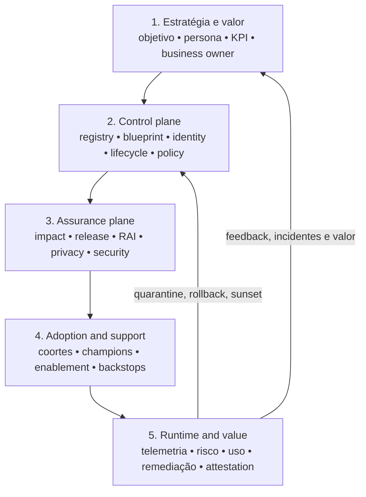
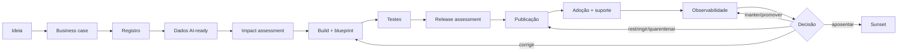
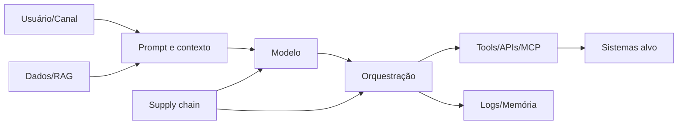

# 06 — Arquitetura e controles técnicos


## Visão geral

A arquitetura responde a uma pergunta que determina se todo o framework funciona: **onde cada controle realmente mora?**

- Se o controle de autorização vive no prompt, ele pode ser contornado com uma frase.
- Se vive num gateway de policy, ele vale para todos os agentes, em todas as plataformas.
- Se a identidade é uma service account compartilhada, nenhuma ação é atribuível.
- Se a ferramenta é mais crítica que o modelo, a discussão sobre qual modelo usar é secundária.

Este capítulo é o maior do framework porque cobre os **seis domínios técnicos** onde a governança se torna enforcement: arquitetura e capability map, identidade e acesso, dados e AI-ready, modelos e provedores, tools/APIs/MCP, e segurança. Cada domínio segue o mesmo padrão hierárquico: o que é, o que decidir, um plano de implantação subordinado ao próprio domínio, e o que bloqueia o release (decision gate).

A ideia central, expressa em dois princípios:

> **Artefatos para produzir agora — arquitetura e bindings.** Comece pelo [exemplo de arquitetura](../../toolkit/examples/architecture.example.md) para desenhar os planos e pontos de enforcement; depois use o [Agent Blueprint schema](../../toolkit/schemas/agent-blueprint.schema.json) e o [template de blueprint](../../toolkit/templates/agent-blueprint-template.md) para registrar a configuração desejada. Para dependências, consulte os schemas de [fontes certificadas](../../toolkit/schemas/certified-source-catalog.schema.json), [tools corporativas](../../toolkit/schemas/enterprise-tool-registry.schema.json) e [model/provider catalog](../../toolkit/schemas/model-provider-catalog.schema.json). O mapeamento de capability para tecnologia é um artefato da organização, não um requisito preenchido neste repositório.

1. **Capability antes de produto.** A arquitetura define capabilities e boundaries independentes de plataforma; qualquer produto é uma implementação substituível. Troca-se o mapeamento, nunca se reescreve a arquitetura.
2. **Controle fora do modelo.** O modelo propõe; a plataforma decide. Identity, policy, mediação de ferramentas, egress, rate limit, logging e contenção acontecem em pontos de enforcement conhecidos — nunca "no prompt".

## 1. A arquitetura de referência: cinco planos

### 1.1 O modelo em cinco planos



| Plano | O que faz | Artefatos |
|---|---|---|
| **1. Estratégia e valor** | define por que o agente existe, qual processo afeta, quem responde e como sucesso é medido | business case, persona, baseline, KPI, owner, critérios de sunset |
| **2. Control plane** | mantém a visão compartilhada de agentes, ownership, identidade, capacidades, dados e lifecycle | registry, agent blueprint, identity record, policy template, attestation |
| **3. Assurance plane** | avalia impactos, riscos, mitigadores, testes e accountability antes e durante a operação | self-assessment, impact assessment, release assessment, threat model, evidence package, waiver |
| **4. Adoption and support** | prepara builders, usuários, líderes e suporte para criar e operar com segurança | adoption plan, coortes, learning assets, champion network, support model |
| **5. Runtime and value** | observa comportamento, segurança, acesso, uso e valor; executa remediação e realimenta decisões | logs, dashboards, alerts, incidents, quarantine, rollback, value review |

**Domínios canônicos por plano:** os cinco planos são a arquitetura; os domínios são a organização editorial do corpus. Um domínio pertence a um plano principal, mas quase sempre produz evidência consumida por outros. Um domínio novo só se justifica quando altera decisão, authority, control ou evidência — subdividir por afinidade temática aumenta manutenção sem aumentar governança.

### 1.2 O fluxo ponta a ponta



### 1.3 Matriz de proporcionalidade

O grau de governança aumenta quando cresce qualquer uma destas dimensões: alcance e número de usuários; sensibilidade e criticidade dos dados; escrita, ação ou automação de workflows; interconectividade e uso de APIs/MCP; irreversibilidade; impacto financeiro, operacional, legal ou humano; autonomia; distribuição regional e exposição externa.

### 1.4 Boundaries: o que o control plane deve (e não deve) fazer

**O control plane deve:** consolidar contexto; reconciliar inventário; expor postura e sinais; acionar workflows e ferramentas especializadas; registrar evidências e decisões.

**O control plane não deve:** substituir sistemas de identidade ou DLP; decidir sozinho risco residual; transformar telemetria incompleta em falsa certeza; centralizar toda responsabilidade em um único time; confundir uso com valor.

### 1.4.1 Governança de múltiplos control planes

Múltiplos control planes, gateways, brokers e plataformas de workflow podem coexistir. O que não pode coexistir é **autoridade implícita e não reconciliada**. Cada capability deve declarar authority, source of truth por atributo, enforcement point, fallback, correlation key e evidence reference. Um orchestrator coordena e aciona; não se torna autoridade normativa apenas por executar routing ou policy local.

A autorização de uma ação material é composta: todos os enforcement points obrigatórios para o tier precisam produzir decisões compatíveis. Para identity, data, privacy, admissibility, security e state-changing actions, a decisão mais restritiva prevalece, salvo exceção formal com escopo, compensating controls, expiry e residual-risk authority. Um `deny`, `restricted`, `quarantined` ou `missing` crítico não pode ser convertido silenciosamente em `allow` por outro plano.

Divergência entre owner, tier, admissibility, lifecycle, identity, tool scope ou policy status é finding — não é resolvida escolhendo o timestamp mais recente. Para ações críticas, a indisponibilidade de identity, policy gateway, tool broker, authority ou evidence obrigatória resulta em `fail-closed`, `restricted` ou `quarantined`, conforme o risco e o comportamento explicitamente aprovado no blueprint.

Use o [ADR-0011 — Arbitragem entre múltiplos control planes](../architecture/decisions/0011-multi-control-plane-arbitration.md) para a decisão e o pattern [Multi-Control-Plane Governance](../../toolkit/patterns/multi-control-plane-governance.md) para a aplicação. A matriz de interação deve tornar visíveis plano, capability, authority, source of truth, enforcement, correlation, fallback, evidence e conflict path.

### 1.5 Princípios arquiteturais

1. **Proporcional:** controles crescem com risco e capacidade.
2. **Embedded by default:** guardrails entram nas ferramentas e pipelines.
3. **Human-led:** accountability e julgamento permanecem humanos.
4. **Observable and remediable:** toda autonomia relevante precisa de sinal e ação.
5. **Federated with common controls:** domínios mantêm ownership; padrões comuns preservam confiança.
6. **Lifecycle-aware:** criação, mudança, attestation e sunset são partes do mesmo sistema.
7. **Platform-agnostic:** a policy é comum; adapters e evidências variam por plataforma.

### 1.6 Plano de implantação — runtime e control plane

O control plane transforma os standards dos domínios em enforcement técnico. A arquitetura precisa deixar explícito **onde** autenticação, policy, acesso a modelo, mediação de ferramentas, egress, rate limit, logging e contenção realmente acontecem:

1. **Separar management plane de runtime plane.** O primeiro guarda registry, policy, lifecycle e configuração; o segundo executa sessões, recuperação, modelos e ferramentas. A separação revela onde cada controle deve residir.
2. **Definir pontos de enforcement comuns.** Gateways e brokers para modelos, ferramentas e egress onde isso reduzir bypass. Nem todo tráfego precisa passar por um único componente, mas **toda rota de produção precisa de enforcement conhecido**.
3. **Modelar o fluxo ponta a ponta por tier.** Gatilho → agente → identidade → dados/ferramenta/modelo → policy → telemetria → resposta. Desenhar ao menos um fluxo T1, um T2 e um T3 para verificar que nenhum controle depende de conhecimento implícito.
4. **Implementar isolamento e fronteiras de rede.** Egress, endpoints privados, separação de ambientes, fronteira de secrets e acesso a sistemas críticos. Workloads privilegiados merecem runtime isolado e allowlists mais restritas.
5. **Definir limites operacionais.** Timeouts, máximo de chamadas e profundidade de cadeia, concorrência, política de retry, limite de contexto, budget e circuit breaker. **São controles de resiliência e custo, não tuning.**
6. **Projetar fallback e comportamento de falha.** Decidir o que acontece quando modelo, índice, ferramenta ou identidade falham. Fail-closed pode ser obrigatório em ação crítica; em leitura pode haver degradação controlada — mas a escolha é explícita.
7. **Padronizar correlation IDs e telemetria.** Uma execução precisa ser rastreável por tarefa, sessão, agente, usuário, modelo, ferramenta e policy. Sem correlação, segurança, custo e valor ficam em silos.
8. **Validar por teste e cenário de ameaça.** Exercitar falha de componente, bypass de policy, negação de permissão, loop descontrolado, indisponibilidade de provedor e quarentena. **A arquitetura de referência só está pronta quando os padrões são demonstráveis em um piloto.**

### 1.7 Atributos de qualidade

| Atributo | Significado |
|---|---|
| Auditability | toda decisão relevante tem owner, timestamp, evidência, versão e vínculo com agent ID |
| Observability | operação expõe ações, ferramentas, dados acessados, erros, custo, policy signals e uso suficiente para decisão |
| Remediability | restringir, quarentenar, corrigir, reverter e aposentar dentro de SLAs proporcionais ao risco |
| Accountability | business owner, technical owner e authorities com responsabilidade e autoridade separadas |
| Interoperability | registry, evidence e policy controls funcionam em múltiplas plataformas |
| Security and privacy | least privilege, workload identity, secrets management, DLP, data boundaries e secure-by-default |
| Reliability | agentes críticos exigem métricas, error handling, rollback, fallback e continuidade |
| Usability | builders e usuários entendem limites, approvals, status e próximos passos sem especialistas |
| Evolvability | risk matrix, connector catalog, model/tool inventory e policy templates aceitam novas capacidades sem reescrita |
| Measurability | criação, descoberta, uso, qualidade, risco, custo e valor distinguíveis e comparáveis a baselines |

### 1.8 Riscos arquiteturais (conhecer para mitigar)

| Risco | Consequência | Mitigação arquitetural |
|---|---|---|
| Catálogo incompleto | falsa confiança e agentes órfãos | reconciliation, missing-evidence status, coverage metrics |
| Centralização excessiva | gargalo, shadow AI e baixa accountability local | ownership federado, common controls, handoffs explícitos |
| Aprovação igual para todos | burocracia no baixo risco, revisão insuficiente no alto | risk matrix proporcional por alcance e capacidade |
| Telemetria sem ação | dashboard decorativo e incidentes sem owner | alert-to-workflow, authority, SLA e remediation states |
| Automação prematura | enforcement incorreto e exceções ocultas | escopo controlado, baselines, evidence before automation |
| Dados não confiáveis | respostas erradas, oversharing e decisões inválidas | AI-ready data, labels, connector gates e lineage |
| Identidade fraca ou compartilhada | acesso indevido e baixa rastreabilidade | workload identity, least privilege, lifecycle de credenciais |
| MCP sem governança | tool poisoning, exfiltration e blast radius ampliado | gateway, vetting, inventory, isolation e context trimming |
| Métricas de vaidade | investimento em agentes sem valor | separar criação, descoberta, uso, qualidade e outcomes |
| Dependência de fornecedor | lock-in e perda de controle | policy e schemas multiplataforma, logs exportáveis, adapters |
| Owners nominais | reviews e incidents sem decisão efetiva | authority explícita, attestation e escalation path |
| Policy drift | agentes ficam não conformes após mudanças | versionamento, review triggers, compliance monitoring |

**Review triggers:** nova plataforma/model provider/connector/MCP; expansão regional ou exposição externa; mudança de autonomia ou capacidade de escrita/ação; incidente relevante; alteração regulatória; evidência operacional do portfólio inicial.

## 2. Mapeamento de capability para tecnologia

### 2.1 Por que o mapeamento é um artefato separado

A arquitetura de referência e a policy são agnósticas de produto por decisão registrada. O mapeamento **não é**: ele nomeia sistemas concretos da organização. Manter os dois no mesmo documento é o erro que produz frameworks descartáveis — quando o produto muda (e ele muda), uma arquitetura contaminada por nomes de produto precisa ser reescrita inteira. Separados, troca-se o mapeamento e a arquitetura permanece. Por isso este framework descreve o **método** e as categorias; o mapeamento preenchido é artefato da organização e vive fora do repositório.

### 2.2 Método (a ordem importa)

1. **Comece pela capability e pelo controle, nunca pelo produto.** A frase de partida é "precisamos de registry com owner, tier e lifecycle" — não "precisamos de uma ferramenta de governança de agentes".
2. **Identifique os systems of record existentes** que já fornecem parte da função. Quase nenhuma organização parte do zero: inventário, identidade, risco, integração, telemetria e catálogo de dados normalmente já existem com owner e processo.
3. **Defina contrato de integração e source of truth por atributo.** Não por sistema — por atributo. Owner de negócio pode vir do RH, tier do registro de risco, estado operacional da plataforma de execução. Duplicar ownership do mesmo atributo em cinco sistemas é como se perde a rastreabilidade.
4. **Só então avalie produtos para os gaps remanescentes.** Um produto pode cobrir várias capabilities; isso é vantagem operacional, não razão para o framework depender do nome dele.
5. **Registre um ADR para toda decisão que cria lock-in, centraliza enforcement ou altera trust boundary.** Essas três são reversíveis apenas com custo alto, e a justificativa precisa sobreviver à saída de quem decidiu.

Quando a decisão envolve um orchestrator ou control plane, use também o [Orchestrator Decision and Exit Record](../../toolkit/templates/orchestrator-decision-exit-record.md). O registro reúne topology, capabilities, authority, enforcement, portability, proprietary dependencies, degraded mode, substitution test e exit trigger; ele complementa o ADR e não o substitui.

> Invertida — produto primeiro, capability depois — a organização passa a chamar de governança aquilo que a ferramenta comprada faz.

### 2.3 Capacidades a mapear

| Capability | Função de controle | Categorias que costumam fornecer | Decidir antes de escolher produto |
|---|---|---|---|
| estate e registry | existência, ownership, tier e estado de cada agente | inventário de configuração, ITSM, GRC, plataforma de execução | quem é source of truth de cada campo e como conflitos são reconciliados |
| identidade não-humana | emissão, escopo, expiry e revogação de identidade própria | IAM, gestão de segredos | identidade delegada, própria ou ambas; como JML se aplica |
| dados certificados | quais fontes podem ser usadas, por quem e com quais restrições | catálogo de dados, DLP, plataforma de dados | critério de certificação e autoridade sobre a fonte |
| mediação de ações | autorização por ação e parâmetro antes da execução | gateway de API, camada de integração, broker próprio | quais ações exigem mediação e quais permanecem no builder |
| acesso a modelos | roteamento, allowlist, budget, fallback e logging | gateway de modelos ou proxy de inferência | combinações modelo/provedor permitidas por classe de dado |
| lifecycle e attestation | transições, dormancy, revalidação e retirada | GRC, ITSM, o próprio registry | o que é mudança material e o que dispara reassessment |
| observabilidade e correlação | reconstruir o que aconteceu, ponta a ponta | observabilidade, SIEM | schema de telemetria e chave de correlação comuns |
| custo e unit economics | orçamento, quota e custo por resultado | gestão de custo de nuvem, FinOps | qual é a unidade de resultado antes de medir custo por ela |
| evidência | pacote recuperável, versionado e íntegro por release | GRC, repositório de evidências | retenção por tier e como a integridade é verificada |

### 2.4 Regra do source of truth

**Um atributo tem exatamente um sistema autoritativo.** Os demais consomem e podem exibir, nunca redefinir. Quando dois sistemas discordam, a divergência é finding — não é resolvida escolhendo o valor mais recente. **Reconciliação silenciosa por timestamp destrói a evidência de que houve conflito**, que costuma ser o sinal mais útil.

### 2.5 Quando o mapeamento exige ADR

- a decisão cria dependência difícil de reverter em prazo aceitável;
- o enforcement de um controle passa a existir em um único componente;
- a fronteira de confiança muda, incluindo quem pode emitir identidade ou autorizar ação;
- uma capability passa a depender de um sistema fora do perímetro de assurance.

**Decision gate:** uma capability não é declarada implantada sem sistema atribuído, source of truth por atributo e evidência recuperável. **Cobertura prometida por roadmap de fornecedor não é cobertura.**

## 3. Identidade e acesso

### 3.1 O princípio

Agentes **não devem herdar implicitamente** a identidade ampla de um usuário, builder, service account compartilhada ou runtime genérico. A identidade precisa refletir **quem opera**, **qual agente executa**, **em nome de quem**, **para qual finalidade** e **sob quais limites**. Identidade é o ponto que transforma atividade do agente em **ação atribuível**.

### 3.2 Modelos de identidade

| Modelo | Uso aceitável | Risco principal |
|---|---|---|
| identidade do usuário delegada | ação interativa, no escopo do usuário | privilege laundering e consentimento ambíguo |
| workload identity do agente | execução autônoma ou serviço | privilégio persistente e ownerless identity |
| identidade por execução | tarefas efêmeras ou sensíveis | complexidade de emissão e correlação |
| service account compartilhada | legado temporário com waiver | baixa atribuição e blast radius amplo |
| credencial embutida | nenhum | segredo exposto e impossível de governar |

Service accounts compartilhadas exigem plano de eliminação, controles compensatórios e expiração da exceção.

### 3.3 Requisitos mínimos

1. Cada agente possui business owner, technical owner e identidade registrada.
2. Produção usa identidade não humana quando a plataforma suporta.
3. Secrets não ficam em prompt, código, blueprint público ou configuração não protegida.
4. Scopes são derivados de tarefas aprovadas, não da conveniência do builder.
5. Acesso privilegiado é just-in-time, time-bound e reautorizado quando possível.
6. A identidade é revogada no sunset, troca de owner ou fim da finalidade.
7. Ações registram actor humano, agent identity, delegated subject e correlation ID.
8. Mudanças de role, scope, tenant, região ou credencial são material changes.
9. Break-glass possui authority, logging, alerta e revisão posterior.
10. **O agente não pode conceder a si mesmo novos privilégios.**

### 3.4 Matriz de autorização (o blueprint mapeia)

| Campo | Exemplo de decisão |
|---|---|
| recurso | sistema, API, dataset, fila ou tool |
| ação | read, write, approve, execute, delete, delegate |
| condição | ambiente, horário, região, valor ou tipo de dado |
| subject | workload, usuário delegado ou equipe |
| duração | sessão, tarefa, janela ou prazo |
| approval | automático, owner, dual control ou proibido |
| evidence | policy, role binding, token claim ou log |

Permissões em produção são testadas com casos positivos e negativos. **Least privilege não é apenas limitar a API**: uma ferramenta de atualização pode editar descrição sem poder alterar prioridade crítica; uma ferramenta de pagamento pode consultar sem poder executar acima do limite sem aprovação humana.

### 3.5 Delegação e "on behalf of"

Quando um agente atua em nome de um usuário: a interface deixa claro qual ação será executada; o consentimento cobre objeto, destino e efeito; o token não amplia privilégios do usuário; a decisão distingue recomendação, preparação e execução; ações irreversíveis exigem confirmação compatível com o risco; logs preservam usuário, agente, tool e resultado. **A delegação não transfere accountability do sistema para o usuário final.**

Quando a delegação ocorre entre agentes, registre a topologia e cada delegation edge com parent, child, finalidade, tarefa, scopes, data classes, depth, fan-out, budget, expiry, revocation e correlation. O child recebe autoridade atenuada, nunca herda implicitamente o envelope do supervisor. Use a [ADR-0013 — Contrato de delegação multiagente](../architecture/decisions/0013-multi-agent-delegation-contract.md), o [pattern de governança de delegação](../../toolkit/patterns/multi-agent-delegation-governance.md) e o [template de contrato](../../toolkit/templates/agent-delegation-contract.md) para o desenho inicial; a extensão do blueprint schema permanece pendente de walkthrough.

### 3.6 Controles por tier

| Tier | Controle adicional |
|---|---|
| T1 — baixo | identidade atribuível e scopes documentados |
| T2 — moderado | workload identity, expiry e teste negativo |
| T3 — alto | JIT, dual control para privilégio, session recording quando cabível |
| T4 — crítico | isolamento dedicado, autorização por transação e monitoramento contínuo |

### 3.7 Plano de implantação — identidade e acesso

1. **Classificar os modos de atuação.** Existe usuário presente? A ação ocorre no escopo dele? O agente executa assíncrono ou para múltiplos usuários? Identidade delegada só quando a sessão humana e o escopo são reais; identidade própria quando o agente age por conta própria.
2. **Inventariar e remediar credenciais.** Descobrir chaves de API, service accounts, tokens pessoais e secrets em builders, CI/CD e runtimes. Classificar como aprovada, transitória ou proibida, com owner e prazo. **Credencial compartilhada em T2/T3 é finding, não detalhe técnico.**
3. **Padronizar emissão e ownership.** Convenção de nomes, owner, ambiente, expiry, tags, authority de criação e contato de recuperação. O registry precisa correlacionar `agent_id` ↔ `identity_id` ↔ owner.
4. **Modelar autorização por recurso, ação e parâmetros.**
5. **Definir tokens, secrets e sessão.** Tokens curtos, cofre, rotação e claims específicos. Proibir secrets em prompt, memória e código. Declarar o que acontece quando a identidade é revogada **durante** uma execução longa.
6. **Integrar JML e attestation.** Saída de owner produz reatribuição ou suspensão; mudança de área pode alterar authority; attestation confirma owner, necessidade e permissões.
7. **Aplicar step-up e dual control em ações críticas.** A aprovação é vinculada a `agent_id`, ferramenta, alvo, parâmetros e validade. **Aprovação genérica em chat não é aprovação.**
8. **Fechar o ciclo com logs e investigação.** Reconstruir **quem pediu, qual agente decidiu, qual identidade executou e qual política autorizou**.

**Decision gate:** nenhum agente com capacidade de escrita, execução ou deleção passa pelo release gate sem identity model, permission matrix, testes negativos e revocation plan.

## 4. Dados, acesso e AI-ready data

### 4.1 AI-ready não significa apenas disponível

Uma fonte é AI-ready para um uso específico quando possui: owner e steward; classificação e finalidade permitida; qualidade suficiente para o outcome; provenance e lineage conhecidos; freshness e janela temporal adequadas; controles de acesso e segregação; regras de retenção e exclusão; cobertura de regiões, idiomas e populações relevantes; limitações conhecidas e forma de comunicá-las; mecanismo de incidente, correção e revogação.

**A mesma fonte pode ser adequada para busca interna e inadequada para decisão sobre pessoas.**

### 4.2 Data contract para agentes

Cada dataset, index, vector store, memory store ou connector declara:

| Dimensão | Pergunta |
|---|---|
| finalidade | para qual tarefa e outcome o dado pode ser usado? |
| classificação | público, interno, confidencial, restrito ou regulado? |
| subject | há dados pessoais, sensíveis ou de terceiros? |
| origem | sistema de registro, fornecedor, usuário ou conteúdo gerado? |
| lineage | quais transformações e filtros foram aplicados? |
| qualidade | quais checks, thresholds e limitações existem? |
| tempo | freshness, retention, expiry e direito de exclusão? |
| acesso | quais identidades, operações e ambientes? |
| região | onde é armazenado, processado e transferido? |
| output | o que pode ser exposto, persistido ou usado para treinamento? |

### 4.3 Connector gate

O gate existe no ponto de criação do connector e na mudança material de source, scope ou destination: necessidade → owner e finalidade → classificação → qualidade e provenance → acesso e minimização → impact assessment → testes → aprovar/condicionar/negar.

### 4.4 Retrieval, memória e conteúdo gerado

**Retrieval:** filtrar por autorização **antes de recuperar**, não somente antes de exibir; preservar source IDs e timestamps; separar ranking de autorização; tratar conteúdo recuperado como não confiável para instruções; testar leakage entre usuários, grupos e tenants.

**Memória:** definir se é de sessão, usuário, equipe ou organização; limitar categorias persistidas; oferecer correção, exclusão e expiração; impedir que instruções maliciosas se tornem memória operacional; registrar quem escreveu, leu e alterou.

**Conteúdo gerado:** marcar quando necessário; controlar reutilização para treinamento; separar output temporário de record oficial; validar antes de gravação em system of record; preservar provenance do modelo, prompt, fontes e revisão humana.

### 4.5 Controles mínimos

1. Data owner aprova finalidade e classes acessíveis.
2. Acesso segue least privilege e identidade do agente.
3. DLP e policy enforcement cobrem input, retrieval, output e tools.
4. Dados de produção não são copiados para testes sem autorização e proteção.
5. **Prompt, log e trace são classificados como dados; não são "metadados inofensivos".**
6. Vector stores e caches possuem retention e deletion verificáveis.
7. Sources externas têm licença, termos e provenance avaliados.
8. Mudança de source, embedding, index ou policy é registrada.
9. Outputs que alteram records passam por validação compatível com o risco.
10. Incidentes de dados acionam contenção e análise de blast radius.

### 4.6 Plano de implantação — dados e AI-ready data

1. **Inventariar fontes candidatas.** Começar pelos casos prioritários ou uma cohort representativa; registrar owner, sistema de origem e consumidores atuais.
2. **Classificar e confirmar a authority do owner.** Validar classificação, dados pessoais/restritos, residency, retenção e quem pode autorizar uso por IA. **Fonte sem owner ou classificação confiável vai para remediação, não para produção.**
3. **Definir critérios AI-ready observáveis.** Transformar "qualidade" em atualidade, completude, versionamento, metadados, ACL consistente, fonte autoritativa, restrições de modelo e procedimento de correção.
4. **Certificar com evidência.** Aplicar o checklist, amostrar conteúdo e permissões, registrar findings e a decisão `certified`, `conditional` ou `not-ready`.
5. **Manter catálogo e backlog.** O catálogo é o allowlist governado; o backlog contém fontes legítimas que ainda não atendem aos critérios.
6. **Separar acesso do agente do acesso do usuário.** **"O agente consegue buscar" não significa que todo usuário pode receber todo resultado.**
7. **Controlar ingestão, indexação e memória.** Quais campos podem virar embedding, o que pode ser cacheado, por quanto tempo, e como exclusão na origem se propaga ao índice e à memória.
8. **Reavaliar em operação.** Nova classe de dados, mudança de owner, queda de qualidade, alteração de ACL ou troca de provedor podem invalidar a certificação.

**Decision gate:** sem data contract, owner, classification, access model, retention e tests de segregação, o connector permanece bloqueado para produção.

## 5. Modelos e provedores

### 5.1 A unidade governada é a combinação

Aprovar um modelo não é aprovar uma marca. A unidade é:

```text
provider × model × version × finalidade × data class × região × controles
```

O mesmo modelo pode ser adequado para dados públicos e inadequado para dados restritos. Uma atualização de versão pode mudar comportamento sem alterar o nome lógico usado pela aplicação.

| Decisão | Pergunta | Evidência mínima |
|---|---|---|
| admissão no catálogo | o provedor atende aos critérios de segurança, dados, observabilidade e continuidade? | provider assessment e termos contratuais |
| classe de dados permitida | quais classificações podem trafegar nesta combinação? | data handling record e residency |
| adequação ao caso | o modelo foi avaliado para *esta* tarefa, não apenas para linguagem geral? | evaluation baseline por use case |
| mudança de versão | a nova versão altera comportamento material? | regression evals e diff de comportamento |
| fallback e routing | o modelo alternativo tem os mesmos controles? | equivalência declarada e testada |
| saída | é possível substituir esta dependência? | exit plan e teste de substituição |

### 5.2 Catálogo por combinação, não por marca

Registro mínimo: provider, model, version e modalidade (API, managed, self-hosted, embedded); allowed data classes e tiers; regiões e residency; retenção, uso para treinamento, subprocessadores e controles contratuais; capacidades de telemetria; evaluation baseline vinculado à versão; fallback aprovado; data de depreciação; status (`approved`, `conditional`, `deprecated`, `blocked`). Um provedor sem telemetria mínima não é reprovado automaticamente, mas exige gateway ou proxy que produza a evidência ausente — o custo desse componente pertence à decisão.

### 5.3 Avaliação vinculada à versão

Benchmark público de fornecedor não substitui avaliação do caso corporativo: qualidade na tarefa real e nos slices relevantes; comportamento de tool calling e confiabilidade de execução; safety e recusa em cenários adversariais; latência, custo por tarefa e comportamento sob retry; failure modes. **Uma boa pontuação de linguagem não indica confiabilidade de execução** — agentes com capacidade de ação exigem avaliação de tool-use específica.

### 5.4 Mudança de versão é change control

Uma nova major version pode alterar reasoning, seleção de ferramentas, postura de safety e custo **sem qualquer mudança no código do agente**. Rode regression evals antes do rollout; determine por agente se a mudança é material (a mesma versão pode ser irrelevante para um caso e material para outro); registre a versão avaliada no blueprint e no release evidence; preserve a capacidade de fixar versão. Quando pinning não for possível, `versionPinned: false` exige referência ao mecanismo de change detection. **Um alias sem detecção de mudança não é version binding.**

### 5.5 Fallback, routing e equivalência de controles

Se o runtime pode trocar de modelo, o fallback é parte da superfície governada: o modelo alternativo precisa estar aprovado para a **mesma classe de dados e capacidade**; failover para provedor com políticas incompatíveis é **violação de controle, não resiliência**; routing por custo ou latência não pode reduzir silenciosamente o nível de assurance; a troca aparece na telemetria. Se não houver fallback equivalente, `fail-closed` é uma decisão válida e frequentemente mais segura que degradar silenciosamente.

### 5.6 Dependência, portabilidade e saída

Documente as abstrações que isolam o agente do provedor; mantenha prompts, evals e configurações exportáveis; identifique dependências proprietárias; **para funções críticas, teste a substituição antes de precisar dela**; registre concentração por provedor e modelo. **Economia por tarefa, não por token**: o modelo mais barato por token pode ser o mais caro por tarefa concluída — meça retries, contexto, loops de ferramenta, cache e taxa de sucesso.

### 5.7 Incidente, advisory e depreciação

Defina antecipadamente como tratar incidente do provedor, security advisory, retirada de modelo e bloqueio emergencial. O registry e os blueprints precisam responder em minutos: **quais agentes dependem da combinação afetada?**

### 5.8 Plano de implantação — modelos e provedores

1. Definir critérios de entrada no catálogo por tier e classe de dados.
2. Criar evaluation baseline por use case, antes de aprovar qualquer versão.
3. Registrar a combinação aprovada com suas restrições explícitas.
4. Tratar mudança de versão como change control com regression evidence.
5. Definir fallback e routing com equivalência de controles demonstrada.
6. Integrar custo por tarefa e capacidade ao processo de decisão.
7. Preparar e testar a exit strategy das dependências críticas.
8. Manter processo de incidente, advisory e depreciação com busca reversa por dependência.

**Decision gate:** nenhum agente entra em produção com combinação provider/model/version fora do catálogo aprovado para a sua classe de dados, sem evaluation vinculada à versão e sem registro da dependência no blueprint. Fallback precisa ter equivalência demonstrada **ou** o runtime falha fechado com rationale documentado. As decisões viram exigência contratual pelo checklist de cláusulas mínimas com fornecedor de IA — **fornecedor aprovado no catálogo sem contrato compatível é gap de controle, não pendência administrativa.**

## 6. Tools, APIs e MCP

### 6.1 Taxonomia de capacidades

| Classe | Exemplos | Risco-base |
|---|---|---|
| observe | search, read, list, inspect | exposição e inferência |
| create | criar draft, ticket ou arquivo | conteúdo incorreto e spam |
| modify | atualizar record, config ou workflow | corrupção e efeito operacional |
| execute | rodar código, comando ou job | compromisso de sistema |
| approve | liberar pagamento, acesso ou mudança | quebra de segregation of duties |
| delete | apagar dado ou recurso | irreversibilidade |
| delegate | criar subagente ou conceder acesso | propagação e perda de controle |

Risco real combina classe, dados, identity, alcance, reversibilidade, frequência e encadeamento. **O controle acompanha a ação específica, não o produto.**

### 6.2 Tool registry

Cada tool, API ou MCP server registra: owner e fornecedor/origem; versão e provenance; operações e schemas; identity model e scopes; dados acessados e destinos; network endpoints e regiões; side effects e reversibilidade; rate limits e custo; logs e correlation IDs; approval mode; kill switch e revocation path; vulnerabilities e validade da aprovação.

### 6.3 MCP governance

**MCP padroniza acesso a tools e contexto; não padroniza confiança.** Um servidor MCP pode alterar descrições, tools, resources e prompts e deve ser governado como software com autoridade. Requisitos mínimos: discovery somente em registries aprovados ou allowlists; provenance e versão fixadas; tool descriptions tratadas como input não confiável; gateway aplica identidade, scopes e policy; egress limitado; state-changing diferenciado de read-only; argumentos validados por schema; sensitive data filtrada antes do envio; logs preservam servidor, tool, versão e outcome; kill switch revoga sem depender do agente; mudanças materiais exigem reavaliação; sampling, roots e callbacks explicitamente autorizados.

### 6.4 Enforcement patterns

- **Tool allowlist:** catálogo fechado por tier e ambiente.
- **Policy gateway:** valida caller, tool, arguments, destination e context.
- **Human confirmation:** mostra ação, alvo e efeito antes de executar.
- **Transaction limit:** restringe valor, volume, frequência ou horário.
- **Sandbox:** isola filesystem, network e processo.
- **Two-person rule:** separa preparação e aprovação em ações críticas.
- **Dry run:** calcula mudanças antes de commit.
- **Kill switch:** remove capacidade imediatamente.

**Prompt instructions não substituem enforcement técnico.**

### 6.5 Plano de implantação — tools, APIs e MCP

1. **Descobrir e registrar tools e servidores MCP.** Descoberta automática ajuda; ownership e autorização precisam ser confirmados por pessoa.
2. **Classificar ações, não produtos.** Uma API contém operações de riscos distintos. Separar leitura, criação, atualização, exclusão, execução, privilegiada, financeira e safety-critical.
3. **Definir tiers permitidos e pré-condições.** Ação de alto impacto é default deny salvo exceção explícita.
4. **Autorizar por parâmetros.** Validar alvo, valor, escopo, recurso e constraints no gateway ou broker. **O modelo pode propor parâmetros; nunca deve ser a autoridade que decide se são permitidos.**
5. **Governar MCP como camada de confiança.** Descoberta externa ilimitada e servidores não aprovados não pertencem a agentes de produção.
6. **Mediar ações materiais.** Para ações privilegiadas, vincular a aprovação ao artefato da **ação exata**, não a uma sessão.
7. **Definir quotas, circuit breakers e idempotência.** Um agente em loop repete ações válidas até causar dano. Limitar chamadas, custo, concorrência e retries.
8. **Monitorar e versionar mudanças.** A telemetria correlaciona `agent_id` → ferramenta → ação → resultado → decisão de policy.

**Decision gate:** nenhuma tool state-changing entra em produção sem owner, provenance, scopes, threat model, enforcement, rollback e kill switch verificáveis.

## 7. Segurança de sistemas de IA e agentes

### 7.1 Superfície de ataque



Ataques e falhas podem entrar por qualquer nó e se propagar pelos handoffs.

**Threat categories:** prompt injection direta e indireta; tool poisoning e descrição maliciosa; data poisoning e retrieval manipulation; supply chain compromise de modelo/prompt/dependência; secret leakage e credential misuse; excessive agency e authorization bypass; insecure output handling; memory poisoning e cross-session contamination; denial of wallet/service; exfiltration por output, tool, log ou side channel; unsafe code execution; multi-agent trust transitivity; monitoring evasion e evidence tampering.

### 7.2 Secure-by-design requirements

1. Trust boundaries aparecem no blueprint e threat model.
2. Conteúdo externo e recuperado nunca define policy ou autorização.
3. Identity e authorization são aplicadas fora do modelo.
4. Tools usam allowlist, schema e least privilege.
5. Code execution é sandboxed, resource-bound e sem secrets por padrão.
6. Egress é deny-by-default nos tiers altos.
7. Inputs, outputs e side effects recebem validação contextual.
8. Dependencies, models, prompts e MCP servers têm provenance/versioning.
9. Logs são protegidos contra alteração e acesso excessivo.
10. Kill switch e quarantine são independentes da lógica do agente.
11. Security tests cobrem chains, não apenas componentes isolados.
12. Incidentes alimentam regression tests e risk review.

### 7.3 Threat modeling

O threat model declara: assets e impactos; trust boundaries; adversários e misuse cases; entry points e egress; identity/data/tool flow; side effects e blast radius; controls preventivos, detectivos e responsivos; residual risk e owner; testes e telemetry necessários. **Mudança de modelo, tool, connector, privilege, exposure ou data class reabre a análise.**

### 7.4 Testing strategy

| Camada | Testes |
|---|---|
| componente | prompt injection, output validation, authz e sandbox |
| chain | indirect injection, tool sequence, data exfiltration e rollback |
| system | red team, abuse cases, load/cost e incident drill |
| runtime | canaries, anomaly signals, policy denials e regression |

**LLM-as-judge pode auxiliar triagem; não é evidência única para riscos críticos.**

### 7.5 Runtime response

Identificar agent, version, user, tool e affected assets; conter identidade, tool, connector ou agente no menor blast radius; preservar evidências; avaliar propagação para memórias, indexes e downstream systems; corrigir causa, não apenas prompt; executar regression e reauthorization; comunicar conforme severidade; atualizar threat model e control catalog.

### 7.6 Plano de implantação — AgentSecOps

1. **Modelar ameaças por fluxo e trust boundary.** **Incluir abuso legítimo de permissões**, não apenas atacante externo.
2. **Construir catálogo de abuse cases.** Injeção que leva a uso indevido de ferramenta; envenenamento de memória; MCP comprometido; loop descontrolado; identidade usada fora do runtime.
3. **Mapear controles preventivos.** Least privilege, allowlist, isolamento de conteúdo, gateway de policy, validação de parâmetros, sandbox, cofre, aprovação humana.
4. **Definir sinais de detecção com owner.** Cada sinal precisa de severidade **e** owner.
5. **Escrever runbooks de contenção.** Quando desabilitar identidade, ferramenta, provedor ou agente; como preservar evidência; **quem pode executar sem aprovação adicional**; como restaurar.
6. **Diferenciar quarentena, kill switch e rollback.** Quarentena preserva o ativo com operação bloqueada; kill switch interrompe rapidamente; rollback retorna versão. Um incidente pode exigir os três em sequência.
7. **Preparar forensics e evidência.** Garantir retenção e correlação; definir o tratamento de dados sensíveis **dentro dos próprios logs**.
8. **Executar tabletop e tuning contínuo.** Ao menos um incidente T2/T3 simulado por trimestre no início; findings recorrentes viram melhoria de plataforma, não checklist.

## 8. Resiliência, contenção e recuperação

### 8.1 Kill switch, circuit breaker e contenção

Implementar caminhos de authority e técnicos para interromper ações, isolar dependências e preservar evidências: gatilho, caminho de comando, escopo, estado esperado, operador, cadência de teste, resultado e pré-requisitos de recuperação. **Um exercício (drill) contém uma falha representativa dentro do alvo sem depender do próprio agente com falha.** Kill switch e quarantine são independentes da lógica do agente.

### 8.2 Comportamento fail-safe, rollback e recuperação

Definir o estado mais seguro, o alvo de rollback e a sequência de recuperação para falhas de controle, dependência e modelo: modos de falha, gatilho, artefato de rollback, reconciliação de dados, authority do operador, RTO/RPO e resultado do exercício. **Uma falha representativa restaura um serviço delimitado em estado bom conhecido sem perder evidência exigida nem duplicar ações.**

### 8.3 Resiliência, continuidade e estratégia de saída

Definir modos degradados aprovados, fallbacks de dependência, prioridades de continuidade e saída de fornecedores críticos: caminhos críticos, tolerâncias, RTO/RPO, capacidade de fallback, procedimento manual, reconciliação de dados e exercício. **O serviço atinge o alvo de recuperação aprovado sem contornar silenciosamente controles de risco, dados ou autorização.**

### 8.4 Limites de taxa, gasto e recursos

Impor limites por agente e por owner para taxa, concorrência, gasto, tokens, armazenamento e ações de alto impacto: limite, escopo, rationale, thresholds de aviso e rígidos, authority de override, telemetria e teste. **Violação de limite faz throttling ou interrompe com segurança; um agente não pode contornar limites por delegação ou retries.**

## 9. Multi-plataforma

A governança é platform-agnostic: regras corporativas são as mesmas, mas a empresa **só permite agentes em plataformas que suportam controles mínimos** (identidade, logs, telemetria de consumo/custo, segurança de dados, capacidade de bloqueio/quarentena). Plataformas aprovadas devem expor telemetria mínima e suportar os controles desta policy. Fornecedores e plataformas externas só podem ser usados se concordarem contratualmente com os requisitos (logs exportáveis, kill switch, rastreabilidade, controles de acesso e retenção).

**Processo de aprovação de plataforma (onboarding/offboarding):** solicitação do Sponsor à Design Authority com descrição, casos de uso, dados, regiões e modelo de custo; assessment técnico (Run Authority + Cyber) de IAM/SSO, RBAC/ABAC, logs exportáveis, telemetria de consumo, egress, secrets, criptografia e kill-switch; assessment de risco e compliance (DPO/ITGC) de lei de proteção de dados, DPIA, SOX/ITGC, termos contratuais e residency; piloto controlado em sandbox; decisão classificando a plataforma como `Approved for Production`, `Restricted to Pilots` ou `Not Approved`; operacionalização com padrões de configuração e perfis de acesso; revalidação anual e offboarding com janela de transição e rollback.

## 10. Referência normativa

Condições mínimas que devem ser verdadeiras. Use como checklist; as seções 1–9 explicam o porquê.

| # | Obrigação | Evidência mínima | Concluído quando |
|---|---|---|---|
| R1 | Documentar fronteiras, premissas, fluxos, atributos de qualidade, controles e comportamento de falha antes do build | blueprint aprovado, diagramas, contratos de interface, vínculos de ameaça/impacto, alternativas, ADRs | cada requisito material rastreável a elemento de arquitetura e ponto de enforcement testável |
| R2 | Separar autoria, decisão, distribuição e enforcement de policy com vínculo rastreável | fonte de policy, ponto de decisão, ponto de enforcement, propagação de versão, modo de falha, telemetria | mudança de policy chega ao enforcement previsivelmente; falha não recua para caminho irrestrito |
| R3 | Atribuir identidade não humana única por agente com owner nomeado | ID, emissor, owner, ambiente, autenticação, entitlements, idade da credencial, estado | credenciais humanas compartilhadas ausentes; desativação revoga acesso efetivo |
| R4 | Preservar identidade, consentimento e authority delegada do usuário ao longo da cadeia | usuário, sessão, escopo de delegação, finalidade, expiração, propagação, correlação | agente não expande authority delegada; toda ação é atribuível ao agente e ao contexto |
| R5 | Usar autenticação de workload aprovada com rotação, audiência e revogação | emissor, tipo de credencial, armazenamento, rotação, expiração, audiência, alertas, teste | credenciais expiradas/reutilizadas/audiência errada falham; nenhum segredo embutido |
| R6 | Avaliar cada ação sensível e parâmetro contra sujeito, recurso, contexto e finalidade | versão da policy, atributos, decisão, motivo, enforcement, override, correlation ID | testes negativos negam fora de escopo; delegação/multi-etapas não contornam a policy |
| R7 | Conceder privilégio mínimo just-in-time | rationale, aprovador, ativação, expiração, uso, attestation, revogação | privilégio não usado/expirado removido automaticamente; expansão reabre revisão |
| R8 | Emitir, armazenar, rotacionar, monitorar e revogar segredos via serviço aprovado | owner, consumidor, store, rotação, último uso, resposta a exposição, exclusão | varreduras não encontram segredo embutido; rotação/revogação sem reconstruir componentes |
| R9 | Autorizar cada fonte de dados e classe de campo para finalidade, identidade e ambiente | classificação, owner, finalidade, operações, jurisdição, retenção, DLP, teste | dados não autorizados negados na fronteira; reuso entre finalidades registrado |
| R10 | Limitar dados ao necessário e rastrear origem, transformações, qualidade e disposição | owner da fonte, linhagem, regras de qualidade, filtros, retenção, exclusão, derivados | dados obsoletos/baixa qualidade/não rastreáveis excluídos ou divulgados; expiração aplicada |
| R11 | Governar fontes de recuperação, indexação, filtragem, atualidade e citação | catálogo de fontes, versão de ingestão, permissão, chunking, SLA de atualidade, testes, citação | recuperação respeita permissões; respostas materiais rastreadas a evidência atual |
| R12 | Selecionar combinações aprovadas modelo-provedor contra requisitos de tarefa, dados, risco e fallback | versão, avaliação, restrições de dados, região, termos, fallback, aviso, teste de saída | substituição não aprovada bloqueada; fallback não enfraquece requisitos |
| R13 | Registrar cada ferramenta chamável com owner, fonte, classe de ação, escopos e versões | ID, provenance, hash de interface, parâmetros, permissões, classes de dados, limites, sandbox | ferramentas desconhecidas/incompatíveis não invocadas; mudança de versão dispara teste |
| R14 | Restringir profundidade de delegação, tarefa, orçamento, identidade e permissões em cada handoff | delegador, delegado, tarefa, escopos, expiração, ID da cadeia, resultado, revogação | cadeia não amplia authority; operadores interrompem e atribuem toda ação delegada |
| R15 | Executar código gerado somente em ambiente isolado, mínimo e descartável | hash, recursos, filesystem, rede, timeout, entradas, saídas, varredura, limpeza | testes de escape/persistência/segredos/egress falham com segurança; sandbox destruído |
| R16 | Restringir caminhos de rede a destinos, protocolos, identidades e finalidades aprovados | segmento, allowlist, proxy/gateway, logs de DNS/egress, inspeção, exceção, teste | egress não aprovado e movimento lateral negados; falha de fronteira dispara contenção |
| R17 | Inventariar e verificar dependências da origem à implantação | provenance, versão, licença, hash, vulnerabilidades, owner, atualização, recall | componentes não verificáveis não promovem; dependência comprometida localizável |
| R18 | Validar e limitar entradas, contexto, conteúdo recuperado e saídas conforme risco | regras de validação, limites, sanitização, policy checks, tratamento de saídas, corpus de teste | conteúdo malformado/injetado não cruza fronteira nem dispara ação não autorizada |
| R19 | Emitir eventos atribuíveis que correlacionem usuário, agente, versão, tarefa, modelo, ferramenta e policy | schema de evento, IDs, timestamps, integridade, retenção, acesso, relógio, testes | cadeia de ações representativa reconstruída sem expor prompt/segredo/dados proibidos |
| R20 | Estabelecer baselines e sinais para mudança de comportamento, qualidade, segurança, custo e dependências | definição do sinal, população, janela, threshold, confiança, owner, escada de resposta | alertas calibrados contra comportamento real e levam a investigação/throttling/quarentena |
| R21 | Impor limites por agente/owner para taxa, concorrência, gasto, tokens, armazenamento e ações de alto impacto | limite, escopo, rationale, thresholds, authority de override, telemetria, teste | violação faz throttling ou interrompe; agente não contorna por delegação/retries |
| R22 | Implementar kill switch, circuit breaker e contenção independentes do agente | gatilho, comando, escopo, estado esperado, operador, cadência de teste, resultado | drill contém falha representativa sem depender do agente com falha |
| R23 | Definir estado mais seguro, alvo de rollback e sequência de recuperação | modos de falha, gatilho, artefato, reconciliação, authority, RTO/RPO, exercício | falha restaura serviço em estado bom sem perder evidência nem duplicar ações |
| R24 | Definir modos degradados, fallbacks, prioridades de continuidade e saída de fornecedores | caminhos críticos, tolerâncias, RTO/RPO, fallback, manual, reconciliação, exercício | recuperação atinge alvo sem contornar controles |
| R25 | Definir contratos de capacidade e interfaces de extensão independentes de produto | comportamento exigido, interface, contrato de dados/identidade, teste de portabilidade, mapping | fornecedor substituído/isolado sem redefinir policy, control IDs, schemas ou gates |

## 11. Evidências, métricas e failure modes

**Evidências:** blueprint com trust boundaries; mapeamento capability × sistema com source of truth por atributo; identity record e owner; configuração de autenticação; testes de autorização positiva/negativa; logs com correlation ID; data contract e approval do owner; lineage/provenance records; DLP results; retention/deletion test; critérios de aprovação de modelo e evaluation results; regression evidence por versão; equivalência de controles do fallback; exit plan testado; tool registry record; threat model e misuse cases; provenance/SBOM; security test results; sandbox/egress configuration; incident e containment drills; runtime alerts e policy denials; residual risk acceptance.

**Métricas:** capabilities sem sistema atribuído; atributos com mais de um sistema autoritativo; agentes sem workload identity; shared accounts; scopes não usados; identidades sem owner/attestation; falhas de revogação; connectors sem owner/classificação; respostas sem source attribution; leakage test failures; stale indexes; agentes usando combinação fora do catálogo; versões sem evaluation; mudanças de versão sem regression; concentração por provedor; custo por tarefa; tools/servers não registrados; chamadas negadas por policy; state-changing calls sem approval; tempo para revogar; actions blocked; mean time to contain; secrets em traces; regressions por mudança material; cobertura de threat models.

**Failure modes:** "o system prompt proíbe" como controle principal; red team sem cenários de tool/data flow; scan de dependência sem provenance de modelo/prompt; logar tudo e criar novo data breach; egress amplo em sandbox; bloquear UI mas deixar API aberta; corrigir incidente sem revalidar memória e indexes; tratar output filter como segurança completa; MCP irrestrito; tool description confiada como policy; standing privilege; shared identity; approval só no front-end; kill switch que exige redeploy; auto-descoberta de tools sem allowlist; cadeia de tools sem limite; usar conta do builder em produção; confiar apenas no prompt para proibir ações; registrar "system" como actor de toda execução; manter acesso após sunset; allowlist única de modelos sem contexto; tratar major version como patch; comparar apenas preço por token; fallback para provedor não aprovado; chamar todo conteúdo interno de confiável; indexar além do scope aprovado; aplicar autorização depois da retrieval; persistir prompts e traces indefinidamente.

## Decision gates

- **Capability map:** uma capability não é implantada sem sistema atribuído, source of truth e evidência. Cobertura prometida por roadmap não é cobertura.
- **Identidade:** nenhum agente com escrita/execução/deleção passa sem identity model, permission matrix, testes negativos e revocation plan.
- **Dados:** sem data contract, owner, classification, access model, retention e testes de segregação, o connector permanece bloqueado.
- **Modelos:** nenhum agente entra em produção com combinação fora do catálogo, sem evaluation vinculada e sem registro no blueprint.
- **Tools:** nenhuma tool state-changing entra em produção sem owner, provenance, scopes, threat model, enforcement, rollback e kill switch.
- **Segurança:** a release authority verifica se threat model, testes, contenção e runtime response correspondem ao tier e às ações possíveis.

## Acceptance criteria

- todas as decisões deste capítulo possuem authority, owner e evidência recuperável;
- requisitos aplicáveis estão ligados ao catálogo de controles e ao método de verificação;
- exceções têm escopo, justificativa, compensating controls, expiry e decisão residual;
- controles de build time e runtime são distinguidos e exercitados quando aplicáveis;
- mudanças materiais reabrem avaliação, aprovação e evidência;
- nenhuma alegação de conformidade, eficácia ou valor excede a evidência observada.
