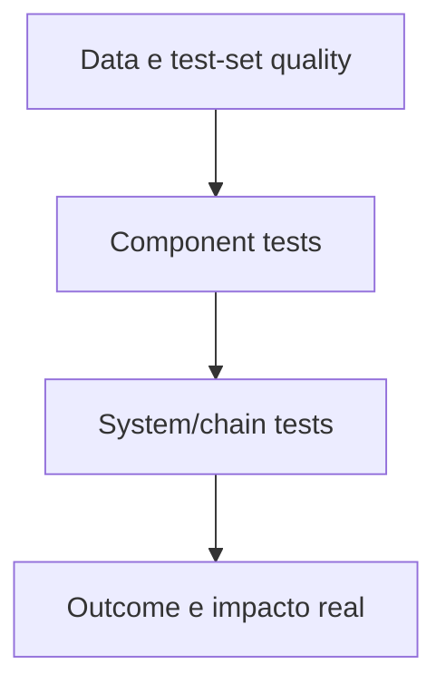
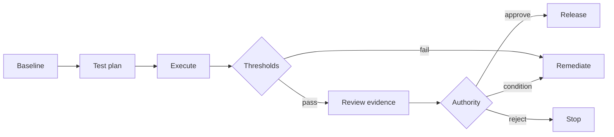

# 07 — Avaliação, evidência e assurance

Este capítulo integra a estrutura clean-room aprovada com o conteúdo substantivo do corpus autoritativo. Requisitos do framework são vendor-neutral; legislação externa, guidance, casos e histórico são identificados como tais. A implementação organizacional exige adoção formal pela authority competente e não decorre do versionamento deste repositório.

## Contrato operacional do capítulo

As subseções seguintes formam um contrato executável de completude. Cada uma especifica a decisão ou ação requerida, o record/evidence mínimo e uma condição observável de conclusão para levar a governança do zero ao business as usual.

### 07.1 Evaluation governance and independence

**Required decision/action.** For **evaluation governance and independence**, the organization must define and execute this evaluation or assurance activity against pre-approved criteria.

**Record and evidence.** The evaluation record must bind scope, version, dataset or sample, method, thresholds, results, limitations, reviewer and evidence lineage.

**Done when.** Results are reproducible, failed criteria block or condition release, and the conclusion does not exceed the tested scope or reviewer independence.

### 07.2 Evaluation strategy by risk and use case

**Required decision/action.** For **evaluation strategy by risk and use case**, the organization must approve test objectives, datasets, slices, abuse cases, thresholds and reviewer independence before seeing results.

**Record and evidence.** The plan must bind use case, tier, versions, environments, methods, acceptance criteria and evidence owner.

**Done when.** The plan covers material failure modes and cannot be relaxed after a failed result without a recorded change decision.

### 07.3 Functional and task-success testing

**Required decision/action.** For **functional and task-success testing**, the organization must test representative tasks, state transitions and failure handling against user and system requirements.

**Record and evidence.** Record scenario, precondition, expected outcome, actual outcome, version, environment, coverage and defect.

**Done when.** Critical tasks meet threshold and failed edge or exception paths cannot be hidden by aggregate success.

### 07.4 Quality and reliability testing

**Required decision/action.** For **quality and reliability testing**, the organization must measure repeatability, consistency and failure rate under representative load and input variation.

**Record and evidence.** Record sample, repetitions, variance, latency, failure modes, confidence interval or limitation and threshold.

**Done when.** Results meet pre-approved reliability targets across material slices and reruns remain within tolerance.

### 07.5 Accuracy, factuality and groundedness

**Required decision/action.** For **accuracy, factuality and groundedness**, the organization must define acceptable factuality, source quality and harmful-content limits for the use context.

**Record and evidence.** Record claim categories, authoritative sources, test set, citation checks, thresholds, failure examples and response.

**Done when.** Unsupported material claims are detected or disclosed and failure above threshold blocks or constrains the use.

### 07.6 Fairness and impact evaluation

**Required decision/action.** For **fairness and impact evaluation**, the organization must define context-specific fairness harms, relevant groups, slices and acceptable disparity before testing.

**Record and evidence.** Record group rationale, metrics, sample adequacy, thresholds, results, uncertainty, mitigations and residual impact.

**Done when.** Aggregate performance cannot hide a failed material slice and unresolved harm is escalated to the proper authority.

### 07.7 Privacy evaluation

**Required decision/action.** For **privacy evaluation**, the organization must establish purpose, lawful authority, minimization, rights handling, retention and transfer constraints for personal data.

**Record and evidence.** Retain data categories, subjects, source, processing purpose, access, flow, DPIA or equivalent, tests and deletion evidence.

**Done when.** Unauthorized data paths fail testing, subject rights are operable and material processing change reopens assessment.

### 07.8 Security and adversarial testing

**Required decision/action.** For **security and adversarial testing**, the organization must model threats across identity, prompt, data, tool, runtime and supply-chain boundaries and test material abuse paths.

**Record and evidence.** Retain threat model, scenarios, attack preconditions, test evidence, findings, mitigations, residual risk and retest result.

**Done when.** High-impact attack paths are prevented or contained and open blocking findings prevent release.

### 07.9 Prompt, context and tool abuse testing

**Required decision/action.** For **prompt, context and tool abuse testing**, the organization must identify plausible misuse, abuse, automation bias, scope expansion and emergent interaction before release.

**Record and evidence.** Record threat actor or user, scenario, precondition, impact, detection, preventive control, response and residual exposure.

**Done when.** Material scenarios are tested or explicitly restricted and observed misuse feeds controls and reevaluation.

### 07.10 Tool-call and action evaluation

**Required decision/action.** For **tool-call and action evaluation**, the organization must test tool selection, parameter construction, authorization, side effects, idempotency and refusal behavior.

**Record and evidence.** Record tool version, scenario, expected call, observed call, policy decision, side effect, rollback and evidence.

**Done when.** Unauthorized or malformed calls are blocked and retries cannot duplicate a consequential action.

### 07.11 Human-oversight evaluation

**Required decision/action.** For **human-oversight evaluation**, the organization must place a competent human at a decision point where intervention remains timely, informed and technically effective.

**Record and evidence.** Record trigger, information presented, authority, response time, override path, workload, training and exercised test.

**Done when.** The human can detect, stop, correct and escalate a representative failure rather than rubber-stamping an irreversible action.

### 07.12 Robustness and out-of-distribution behavior

**Required decision/action.** For **robustness and out-of-distribution behavior**, the organization must challenge the system with distribution shifts, ambiguity, missing context and dependency degradation.

**Record and evidence.** Record shift design, sample, expected safe behavior, observed behavior, uncertainty, threshold and mitigation.

**Done when.** The system degrades, abstains or escalates within the approved boundary instead of acting confidently outside evidence.

### 07.13 Failure, rollback and containment testing

**Required decision/action.** For **failure, rollback and containment testing**, the organization must exercise failures of models, tools, data, policy, identity and infrastructure together with containment and rollback.

**Record and evidence.** Retain fault injected, blast radius, detection time, containment time, recovery, evidence preservation and findings.

**Done when.** The tested failure remains within the approved blast radius and recovery meets its target.

### 07.14 Third-party evidence and supplier claims

**Required decision/action.** For **third-party evidence and supplier claims**, the organization must classify supplier evidence by source, scope, freshness and independence before relying on it.

**Record and evidence.** Record claim, artifact, supplier version, assessed scope, corroboration, gaps, contractual right and reviewer.

**Done when.** Marketing or self-attestation cannot satisfy a control that requires observed, independent or organization-specific evidence.

### 07.15 Thresholds and acceptance criteria

**Required decision/action.** For **thresholds and acceptance criteria**, the organization must approve quantitative and qualitative pass, condition and fail criteria before running the evaluation.

**Record and evidence.** Record metric, population, slice, threshold, rationale, uncertainty, blocker status and change history.

**Done when.** Failed blocking criteria cannot be averaged away or retrospectively relaxed without a new decision.

### 07.16 Test datasets and representativeness

**Required decision/action.** For **test datasets and representativeness**, the organization must construct and govern datasets that represent intended, affected, adverse and edge-case populations.

**Record and evidence.** Record provenance, rights, time period, sampling, slices, leakage, quality, version and known exclusions.

**Done when.** Coverage and limitations are explicit and test data cannot contaminate training or overstate real-world validity.

### 07.17 Reproducibility and version binding

**Required decision/action.** For **reproducibility and version binding**, the organization must bind every result to code, model, prompt, policy, data, tool, configuration and environment versions.

**Record and evidence.** Retain immutable identifiers or hashes, execution parameters, randomization controls, timestamp and rerun procedure.

**Done when.** An authorized reviewer can reproduce or explain variance in the material result from the retained package.

### 07.18 Evidence package and lineage

**Required decision/action.** For **evidence package and lineage**, the organization must collect decision-relevant evidence with stable identity, source, time, version, integrity and custody.

**Record and evidence.** The evidence manifest must list artifacts, hashes, producer, environment, method, result, limitation and linked decision.

**Done when.** A reviewer can retrieve and reproduce the material claim and missing evidence is represented as a gap, not success.

### 07.19 Go, conditional-go and no-go decision

**Required decision/action.** For **go, conditional-go and no-go decision**, the organization must decide release only from the bound risk, evaluation, control and operational evidence package.

**Record and evidence.** Record decision, authority, versions, passed and failed criteria, conditions, expiry, rollback target and unresolved findings.

**Done when.** Blocking controls cannot be waived by a conditional approval and expired conditions stop continued operation.

### 07.20 Continuous and runtime evaluation

**Required decision/action.** For **continuous and runtime evaluation**, the organization must monitor the production behavior and control outcomes that can invalidate approval.

**Record and evidence.** Retain signal definitions, baselines, slices, thresholds, owner, alert route, investigation and linked lifecycle action.

**Done when.** Material drift or threshold breach produces containment or reassessment rather than an informational alert with no owner.

### 07.21 Regression testing after change

**Required decision/action.** For **regression testing after change**, the organization must retest affected requirements after incident, fix, dependency change or model/configuration update.

**Record and evidence.** Bind prior and new versions, impacted scenarios, regression set, result, residual gaps and release disposition.

**Done when.** The change does not silently invalidate prior evidence and failed regression prevents reactivation or promotion.

### 07.22 Self-assessment

**Required decision/action.** For **self-assessment**, the organization must require owners to assess their implementation against defined criteria while declaring self-review limitations.

**Record and evidence.** Record assessor role, claims, evidence, gaps, confidence, conflicts, requested decision and reviewer challenge.

**Done when.** Self-assessment routes material gaps for review and is never presented as independent assurance.

### 07.23 Peer challenge

**Required decision/action.** For **peer challenge**, the organization must assign a qualified peer outside the immediate work product to challenge evidence, rationale and missing scenarios.

**Record and evidence.** Record reviewer, conflicts, questions, evidence examined, disagreements, disposition and actions.

**Done when.** Disputed claims remain visible and closure requires evidence rather than consensus or hierarchy.

### 07.24 Independent assurance and audit

**Required decision/action.** For **independent assurance and audit**, the organization must define challenge scope and independence criteria before the reviewer evaluates work.

**Record and evidence.** Record reporting line, conflicts, incompatible services, population, sample, criteria, limitations and form of conclusion.

**Done when.** The reviewer does not conclude on work they designed or operated, and claims do not exceed the approved scope and evidence.

### 07.25 Findings, corrective action and closure evidence

**Required decision/action.** For **findings, corrective action and closure evidence**, the organization must assign each finding a root cause, risk-based priority, corrective action and closure criterion.

**Record and evidence.** Record finding, evidence, owner, due date, interim control, root cause, remediation, retest and reviewer disposition.

**Done when.** Closure requires objective retest evidence; overdue material findings remain visible and affect approval.

### 07.26 Evidence retention and audit access

**Required decision/action.** For **evidence retention and audit access**, the organization must define who may read, change and retrieve the record, for how long and under which legal hold or deletion rule.

**Record and evidence.** Record classification, access groups, custodian, retention trigger, minimum period, disposition and audit retrieval path.

**Done when.** Authorized evidence is retrievable within the required time and expired data is disposed of without breaking required lineage.


## Conteúdo canônico incorporado

A seção preserva integralmente as unidades atribuídas pela matriz de cobertura. Os marcadores HTML são provenance machine-readable e não alteram o significado normativo.

### Fonte: `docs/auditability/README.md`

Commit de origem: `5545d9227624400ab8bb707b6032b2f61329a36e`.

<!-- source-unit {"classification": "metadata-title", "end_line": "2", "index": 1, "source_field": "title", "source_heading": "", "source_path": "docs/auditability/README.md", "start_line": "2", "transformation": "integrate-completely", "unit_type": "frontmatter-title"} -->
**Título controlado na origem:** Auditabilidade, evidence package e traceability

<!-- source-unit {"classification": "evidence-artifact", "end_line": "19", "index": 2, "source_field": "", "source_heading": "Auditabilidade, evidence package e traceability", "source_path": "docs/auditability/README.md", "start_line": "18", "transformation": "split-by-heading-with-cross-links", "unit_type": "markdown-atx-heading"} -->
### Auditabilidade, evidence package e traceability

<!-- source-unit {"classification": "objective", "end_line": "23", "index": 3, "source_field": "", "source_heading": "Objetivo", "source_path": "docs/auditability/README.md", "start_line": "20", "transformation": "split-by-heading-with-cross-links", "unit_type": "markdown-atx-heading"} -->
#### Objetivo

Permitir que uma pessoa autorizada reconstrua o que o sistema era, o que fez, com qual autoridade, quais dados e tools usou, quais controles se aplicaram e qual decisão resultou.

<!-- source-unit {"classification": "concept-or-structure", "end_line": "35", "index": 4, "source_field": "", "source_heading": "Auditabilidade não é “logar tudo”", "source_path": "docs/auditability/README.md", "start_line": "24", "transformation": "split-by-heading-with-cross-links", "unit_type": "markdown-atx-heading"} -->
#### Auditabilidade não é “logar tudo”

Logs indiscriminados podem aumentar risco de privacy, custo e exposição. O desenho precisa equilibrar:

- traceability;
- minimização;
- integridade;
- retenção;
- acesso;
- utilidade para investigação;
- separação entre telemetria e record oficial.

<!-- source-unit {"classification": "concept-or-structure", "end_line": "49", "index": 5, "source_field": "", "source_heading": "Eventos mínimos", "source_path": "docs/auditability/README.md", "start_line": "36", "transformation": "split-by-heading-with-cross-links", "unit_type": "markdown-atx-heading"} -->
#### Eventos mínimos

- criação e alteração de registry/blueprint;
- classificação e approvals;
- model, prompt, tool e policy version;
- authentication e authorization decision;
- user/agent/tool correlation;
- retrieval source IDs e data classification quando aplicável;
- state-changing action e result;
- human approval, edit, deny e override;
- policy denial e alert;
- incident, quarantine, rollback e reactivation;
- attestation, exception e sunset.

<!-- source-unit {"classification": "concept-or-structure", "end_line": "68", "index": 6, "source_field": "", "source_heading": "Event envelope", "source_path": "docs/auditability/README.md", "start_line": "50", "transformation": "split-by-heading-with-cross-links", "unit_type": "markdown-atx-heading"} -->
#### Event envelope

| Campo | Propósito |
|---|---|
| timestamp e timezone | ordenar e correlacionar |
| event ID / correlation ID | rastrear a chain |
| agent ID e version | identificar o sistema |
| user/delegated subject | atribuir contexto humano |
| tool/action | identificar capability |
| target/resource | localizar efeito |
| policy/control decision | explicar allow/deny |
| outcome/status | registrar resultado |
| evidence reference | apontar artefato protegido |
| sensitivity | aplicar acesso e retenção |

Sensitive payloads devem ser referenciados ou protegidos, não copiados sem necessidade.

O [AI Agent Audit Event schema](../../toolkit/schemas/audit-event.schema.json) oferece um envelope mínimo vendor-neutral. Ele não obriga ferramenta ou pipeline específico e deliberadamente evita payload completo.

<!-- source-unit {"classification": "evidence-artifact", "end_line": "86", "index": 7, "source_field": "", "source_heading": "Evidence package", "source_path": "docs/auditability/README.md", "start_line": "69", "transformation": "split-by-heading-with-cross-links", "unit_type": "markdown-atx-heading"} -->
#### Evidence package

Um package de release ou attestation deve ser:

- versionado;
- immutable ou tamper-evident;
- ligado a agent/version;
- completo segundo tier;
- acessível somente a roles autorizados;
- retido conforme policy;
- exportável para review;
- capaz de distinguir missing, not-applicable e passed.

“Sem evidência” não significa “controle passou”.

A composição mínima de cada package por nível de risco está em [evidence pack proporcional por tier](07-evaluation-evidence-and-assurance.md).
Use o [Release Evidence Manifest schema](../../toolkit/schemas/release-evidence-manifest.schema.json) para lineage machine-readable e o [template humano](../../toolkit/templates/release-evidence-manifest.md) para preparar a decisão.

<!-- source-unit {"classification": "concept-or-structure", "end_line": "97", "index": 8, "source_field": "", "source_heading": "Integridade e acesso", "source_path": "docs/auditability/README.md", "start_line": "87", "transformation": "split-by-heading-with-cross-links", "unit_type": "markdown-atx-heading"} -->
#### Integridade e acesso

- clock synchronization;
- append-only ou controles de integridade;
- segregação de administradores e auditores;
- access logging;
- redaction/tokenization;
- legal hold quando aplicável;
- test de restauração e export;
- retention/deletion verificáveis.

<!-- source-unit {"classification": "concept-or-structure", "end_line": "113", "index": 9, "source_field": "", "source_heading": "Traceability graph", "source_path": "docs/auditability/README.md", "start_line": "98", "transformation": "split-by-heading-with-cross-links", "unit_type": "markdown-atx-heading"} -->
#### Traceability graph

```text
Business outcome
  ↕
Agent ID/version
  ↕
Blueprint → model/prompt/data/tool versions
  ↕
Risk/control/evaluation decisions
  ↕
Runtime events/incidents
  ↕
Attestation/value/sunset decision
```

<!-- source-unit {"classification": "evidence-artifact", "end_line": "126", "index": 10, "source_field": "", "source_heading": "Evidências", "source_path": "docs/auditability/README.md", "start_line": "114", "transformation": "split-by-heading-with-cross-links", "unit_type": "markdown-atx-heading"} -->
#### Evidências

- logging specification;
- sample events e schema;
- [audit event estruturado](../../toolkit/schemas/audit-event.schema.json);
- access/retention configuration;
- integrity test;
- evidence package index;
- [release evidence manifest](../../toolkit/schemas/release-evidence-manifest.schema.json);
- audit export test;
- deletion e legal-hold records;
- findings e remediação.

<!-- source-unit {"classification": "metric", "end_line": "137", "index": 11, "source_field": "", "source_heading": "Métricas", "source_path": "docs/auditability/README.md", "start_line": "127", "transformation": "split-by-heading-with-cross-links", "unit_type": "markdown-atx-heading"} -->
#### Métricas

- actions sem correlation ID;
- events atrasados, incompletos ou duplicados;
- agents sem version identificável;
- evidence packages incompletos;
- unauthorized log access;
- retention/deletion failures;
- tempo para reconstruir um incident;
- controls com evidence link quebrado.

<!-- source-unit {"classification": "risk-failure-mode", "end_line": "147", "index": 12, "source_field": "", "source_heading": "Failure modes", "source_path": "docs/auditability/README.md", "start_line": "138", "transformation": "split-by-heading-with-cross-links", "unit_type": "markdown-atx-heading"} -->
#### Failure modes

- logar prompt completo por padrão;
- usar dashboard agregado como audit trail;
- não versionar prompt/model/tool;
- permitir que o mesmo admin altere ação e evidência;
- guardar logs sem capability de busca/export;
- apagar evidência no sunset antes de cumprir retenção;
- marcar missing como not-applicable.

<!-- source-unit {"classification": "requirement-control", "end_line": "152", "index": 13, "source_field": "", "source_heading": "Decision gate", "source_path": "docs/auditability/README.md", "start_line": "148", "transformation": "split-by-heading-with-cross-links", "unit_type": "markdown-atx-heading"} -->
#### Decision gate

A release authority exige event model, retention, access, correlation e evidence package compatíveis com o tier antes de produção.

A integração com o universo de auditoria que a organização já opera está em [integração com o audit universe existente](07-evaluation-evidence-and-assurance.md). Um framework que chega como universo paralelo é tolerado, não adotado.

### Fonte: `docs/auditability/audit-universe-crosswalk.md`

Commit de origem: `5545d9227624400ab8bb707b6032b2f61329a36e`.

<!-- source-unit {"classification": "metadata-title", "end_line": "2", "index": 14, "source_field": "title", "source_heading": "", "source_path": "docs/auditability/audit-universe-crosswalk.md", "start_line": "2", "transformation": "integrate-audit-universe-method-completely", "unit_type": "frontmatter-title"} -->
**Título controlado na origem:** Integração com o audit universe existente

<!-- source-unit {"classification": "concept-or-structure", "end_line": "16", "index": 15, "source_field": "", "source_heading": "Integração com o audit universe existente", "source_path": "docs/auditability/audit-universe-crosswalk.md", "start_line": "15", "transformation": "integrate-audit-universe-method-completely", "unit_type": "markdown-atx-heading"} -->
### Integração com o audit universe existente

<!-- source-unit {"classification": "objective", "end_line": "24", "index": 16, "source_field": "", "source_heading": "Objetivo", "source_path": "docs/auditability/audit-universe-crosswalk.md", "start_line": "17", "transformation": "integrate-audit-universe-method-completely", "unit_type": "markdown-atx-heading"} -->
#### Objetivo

Responder à pergunta que auditoria interna faz na primeira reunião: **"como estes controles se relacionam com o que eu já testo?"**

Uma organização madura já tem universo de auditoria, ciclo de teste, matriz de controles financeiros e certificações vigentes. Um framework que chega como universo paralelo não é adotado — é tolerado até a próxima reorganização.

Este documento não mapeia control a control contra normas específicas. Ele responde algo mais útil e mais honesto: **onde estes controles se encaixam no que já existe, e o que muda em relação a um controle de TI convencional.**

<!-- source-unit {"classification": "concept-or-structure", "end_line": "37", "index": 17, "source_field": "", "source_heading": "O que o catálogo oferece a auditoria", "source_path": "docs/auditability/audit-universe-crosswalk.md", "start_line": "25", "transformation": "integrate-audit-universe-method-completely", "unit_type": "markdown-atx-heading"} -->
#### O que o catálogo oferece a auditoria

O [control catalog](../../toolkit/controls/README.md) tem 44 controls, e três campos determinam como auditoria os trata:

| Campo | Valores | O que significa para o teste |
|---|---|---|
| `scope` | 40 `agent`, 4 `organization` | controle de escopo `agent` é testado por amostra de agentes; `organization` é testado uma vez para a entidade |
| `blocking` | 27 bloqueantes | bloqueante impede release quando reprovado — é candidato natural a control chave |
| `automation` | 9 `automated`, 24 `assisted`, 10 `manual`, 1 `mixed` | determina se o teste é de configuração, de amostra ou de processo |
| `verification` | declarado em todos | diz **como** a evidência é obtida, não só que ela existe |

Um control `organization`-scoped nunca é bloqueante por decisão de design ([ADR-0010](../architecture/decisions/0010-structured-governance-contracts-2.0.md)) — falha de governança corporativa não deve travar um release específico; ela dispara remediação no nível certo. Auditoria precisa saber disso antes de desenhar o teste.

<!-- source-unit {"classification": "concept-or-structure", "end_line": "56", "index": 18, "source_field": "", "source_heading": "Onde encaixar no universo existente", "source_path": "docs/auditability/audit-universe-crosswalk.md", "start_line": "38", "transformation": "integrate-audit-universe-method-completely", "unit_type": "markdown-atx-heading"} -->
#### Onde encaixar no universo existente

A recomendação é **não criar um universo novo**. Quase todo control deste framework é uma extensão de um domínio que auditoria já cobre:

| Domínio do framework | Universo em que normalmente encaixa | O que muda em relação ao teste convencional |
|---|---|---|
| registry e ownership | gestão de ativos e CMDB | o ativo tem comportamento próprio e muda sem deploy; inventário exige descoberta contínua, não recertificação anual |
| identidade | IAM e gestão de acessos | a identidade não é de pessoa nem de serviço estático; JML precisa cobrir reatribuição de owner de agente |
| dados | governança de dados e privacidade | a autorização acontece na recuperação, não só na concessão de acesso |
| tools e MCP | gestão de mudanças e integrações | a capacidade de ação pode crescer sem mudança de código, por descoberta de tool |
| modelos e provedores | gestão de fornecedores e terceiros | a versão do fornecedor muda sem aviso e invalida avaliação aceita |
| segurança | segurança da informação | a superfície inclui a instrução, não só a interface |
| evaluations e release | SDLC e gestão de mudanças | o critério de aceite é probabilístico, com threshold e slice, não binário |
| operações e runtime | continuidade e monitoramento | contenção precisa ser exercitada, não documentada |
| Responsible AI e human oversight | conformidade e conduta | frequentemente **não tem** universo prévio — é onde nasce controle novo |
| valor e portfólio | gestão de benefícios | outcome contra baseline, não uso |

Só a linha de Responsible AI costuma exigir universo novo. As demais são extensão de escopo de auditorias que já ocorrem — o que muda a conversa de "crie um programa de auditoria de IA" para "acrescente estas perguntas ao que você já faz".

<!-- source-unit {"classification": "concept-or-structure", "end_line": "66", "index": 19, "source_field": "", "source_heading": "Três diferenças que quebram o teste convencional", "source_path": "docs/auditability/audit-universe-crosswalk.md", "start_line": "57", "transformation": "integrate-audit-universe-method-completely", "unit_type": "markdown-atx-heading"} -->
#### Três diferenças que quebram o teste convencional

Vale antecipá-las, porque cada uma já invalidou papel de trabalho em alguma organização.

**1. Evidência tem data de validade curta.** Um control de TI testado em março costuma valer para o ano. Aqui, mudança de versão de modelo, de fonte de dados ou de tool invalida a evidência no dia em que acontece. O teste precisa amarrar a evidência à **versão** do agente, não ao período. O [evidence pack por tier](07-evaluation-evidence-and-assurance.md) e o release manifest existem para isso.

**2. Amostragem por população homogênea não funciona.** O estate é deliberadamente heterogêneo por tier. Amostrar 25 agentes ao acaso mede quase só T1, porque T1 é a maioria. A amostra precisa ser **estratificada por tier e por admissibilidade**, com cobertura integral dos T3 e T4.

**3. Aprovação não é evidência de controle.** Um release `conditional` aprovado não diz que as condições foram cumpridas — diz que foram impostas. O teste é sobre a **verificação declarada de cada condição**, e é por isso que o contrato de release exige que toda condição traga owner e método de verificação.

<!-- source-unit {"classification": "concept-or-structure", "end_line": "78", "index": 20, "source_field": "", "source_heading": "Onde começar um primeiro teste", "source_path": "docs/auditability/audit-universe-crosswalk.md", "start_line": "67", "transformation": "integrate-audit-universe-method-completely", "unit_type": "markdown-atx-heading"} -->
#### Onde começar um primeiro teste

Sugestão de escopo para o primeiro ciclo, em ordem de retorno:

1. **Completude e ownership do registry** — agente em produção sem business owner nomeado é o achado mais comum e o mais fácil de evidenciar.
2. **Os 27 controls bloqueantes**, verificando se realmente bloqueiam — control bloqueante que nunca reprovou nada merece investigação.
3. **Attestation vencida** em agentes ativos.
4. **Condições de release com prazo expirado** e agentes ainda operando.
5. **Bindings de catálogo** — modelo, fonte ou tool em uso sem entrada aprovada correspondente.

Os itens 4 e 5 são verificáveis por consulta aos records estruturados, sem depender de entrevista. Comece por onde a evidência já é máquina-legível.

<!-- source-unit {"classification": "concept-or-structure", "end_line": "83", "index": 21, "source_field": "", "source_heading": "Limites declarados", "source_path": "docs/auditability/audit-universe-crosswalk.md", "start_line": "79", "transformation": "integrate-audit-universe-method-completely", "unit_type": "markdown-atx-heading"} -->
#### Limites declarados

Este documento **não** é mapeamento control a control contra ISO/IEC 42001, 23894, 42005, SOX ou qualquer norma específica. Os `frameworkMappings` do catálogo declaram alinhamento direcional e dizem isso explicitamente: *"não constitui equivalência, conformidade nem atestação"*. O escopo de cada norma referenciada está em [`references/standards/`](../../research/sources/standards-scope-and-limitations.md), com o motivo de não haver mapeamento cláusula a cláusula.

Quem precisar de mapeamento formal precisa adquirir os textos normativos e produzi-lo internamente, com a authority competente. Alinhamento declarado por um framework de referência não substitui essa avaliação.

### Fonte: `docs/auditability/evidence-pack-by-tier.md`

Commit de origem: `5545d9227624400ab8bb707b6032b2f61329a36e`.

<!-- source-unit {"classification": "metadata-title", "end_line": "2", "index": 22, "source_field": "title", "source_heading": "", "source_path": "docs/auditability/evidence-pack-by-tier.md", "start_line": "2", "transformation": "synthesize-and-preserve", "unit_type": "frontmatter-title"} -->
**Título controlado na origem:** Evidence pack proporcional por tier

<!-- source-unit {"classification": "evidence-artifact", "end_line": "18", "index": 23, "source_field": "", "source_heading": "Evidence pack proporcional por tier", "source_path": "docs/auditability/evidence-pack-by-tier.md", "start_line": "17", "transformation": "synthesize-and-preserve", "unit_type": "markdown-atx-heading"} -->
### Evidence pack proporcional por tier

<!-- source-unit {"classification": "objective", "end_line": "26", "index": 24, "source_field": "", "source_heading": "Objetivo", "source_path": "docs/auditability/evidence-pack-by-tier.md", "start_line": "19", "transformation": "synthesize-and-preserve", "unit_type": "markdown-atx-heading"} -->
#### Objetivo

Definir qual evidência cada tier precisa produzir, em que formato e por quanto tempo — de modo que auditoria, investigação e reassessment sejam rápidos e que o custo da evidência seja proporcional ao risco.

**Todos os tiers produzem evidência.** Governança proporcional não significa ausência de registro; significa que evidência simples e gerada automaticamente é suficiente quando o risco é baixo. Sem isso, a organização perde rastreabilidade exatamente onde o volume é maior.

T4 também exige evidência reforçada por criticidade. Admissibilidade é separada: quando a decisão for `restricted` ou `prohibited`, a decisão e qualquer exceção precisam ser auditáveis em qualquer tier.

<!-- source-unit {"classification": "evidence-artifact", "end_line": "39", "index": 25, "source_field": "", "source_heading": "Evidence pack mínimo por tier", "source_path": "docs/auditability/evidence-pack-by-tier.md", "start_line": "27", "transformation": "synthesize-and-preserve", "unit_type": "markdown-atx-heading"} -->
#### Evidence pack mínimo por tier

| Tier | Pacote mínimo | Objetivo |
|---|---|---|
| **T1** | `agent_id` e registro de descoberta; resultado do pre-screen com tier e admissibilidade; business e technical owner e contexto de uso; resultado do policy gate; blueprint reduzido; referências das fontes de dados e das tools aprovadas; padrão de identidade aprovado; logging padrão com os campos mínimos chegando ao pipeline; resultado dos testes funcionais; impact assessment quando o trigger for acionado; rollback documentado; aprovação de owner ou do policy gate; data de attestation | demonstrar ownership, escopo conhecido e controles básicos sem criar review manual desnecessário |
| **T2** | tudo de T1 + blueprint versionado; risk record formal com escaladores; domain reviews acionadas; aprovações de dados e tools; identidade e permissões; resultados de evals e testes de segurança; rollback testado; telemetria; residual risk; aprovação de publicação | permitir assurance formal, investigação e reassessment de agente transacional |
| **T3** | tudo de T2 + threat model e abuse cases; impact assessment quando aplicável; testes adversariais e de resiliência; design de oversight humano e step-up; teste de kill switch e quarentena; baseline de comportamento; aceitação explícita de residual risk pela authority; attestation frequente | demonstrar que autonomia e impacto elevados receberam assurance reforçado e capacidade de contenção |
| **T4** | tudo de T3 + architecture/assurance challenge reforçado; cenários críticos; segregation e dual control quando aplicável; containment/fail-safe exercitados; executive risk decision; attestation orientada a evento | sustentar investigação e decisão para impactos críticos ou difíceis de reverter |

O [fast path de T1](04-risk-impact-and-compliance.md#fast-path-de-t1) não encurta a lista de T1: ele a **gera automaticamente**. A rota automatizada reduz trabalho humano, não a evidência exigida.

Cada linha desta tabela precisa cobrir tudo que o [Minimum Production Bar](../../toolkit/controls/minimum-production-bar.md) exige no mesmo tier. As duas tabelas descrevem o mesmo piso por ângulos diferentes — o MPB diz qual controle precisa existir, o evidence pack diz o que comprova que ele existe — e **não podem divergir**. Divergência entre as duas é defeito, não nuance: significa que o gate exige um controle cuja existência ninguém precisa demonstrar.

<!-- source-unit {"classification": "concept-or-structure", "end_line": "45", "index": 26, "source_field": "", "source_heading": "Overlay de admissibilidade", "source_path": "docs/auditability/evidence-pack-by-tier.md", "start_line": "40", "transformation": "synthesize-and-preserve", "unit_type": "markdown-atx-heading"} -->
##### Overlay de admissibilidade

- `conditional`: inclua condições, owner, testes, monitoring e expiry;
- `restricted`: inclua exception request, authority, compensating controls, escopo e expiry;
- `prohibited`: inclua rationale e decision record de rejeição; não gere manifesto de release aprovado.

<!-- source-unit {"classification": "evidence-artifact", "end_line": "57", "index": 27, "source_field": "", "source_heading": "Qualidade da evidência", "source_path": "docs/auditability/evidence-pack-by-tier.md", "start_line": "46", "transformation": "synthesize-and-preserve", "unit_type": "markdown-atx-heading"} -->
#### Qualidade da evidência

Um artefato só conta como evidência quando é:

- **recuperável** — existe endereço estável e alguém consegue abri-lo meses depois;
- **atribuída** — quem produziu, quando e com qual escopo;
- **versionada** — vinculada à versão do agente e do modelo de risco que a originou;
- **íntegra** — protegida contra alteração silenciosa; hash recomendado para snapshots;
- **interpretável** — um terceiro competente entende o que ela demonstra sem o autor presente.

Uma caixa marcada não é evidência. Um print sem contexto, data ou origem não é evidência.

<!-- source-unit {"classification": "procedure", "end_line": "63", "index": 28, "source_field": "", "source_heading": "Evidência é produto do processo", "source_path": "docs/auditability/evidence-pack-by-tier.md", "start_line": "58", "transformation": "synthesize-and-preserve", "unit_type": "markdown-atx-heading"} -->
#### Evidência é produto do processo

Evidence pack montado depois, para satisfazer uma auditoria, custa mais e vale menos. A evidência precisa ser subproduto natural de executar o processo: o eval gera o relatório, o gate gera o decision record, o deploy gera o baseline, o incidente gera a timeline.

Quando a evidência exige trabalho extra significativo, isso é sinal de que o processo não está instrumentado — não de que falta disciplina das equipes.

<!-- source-unit {"classification": "concept-or-structure", "end_line": "70", "index": 29, "source_field": "", "source_heading": "Retenção e acesso", "source_path": "docs/auditability/evidence-pack-by-tier.md", "start_line": "64", "transformation": "synthesize-and-preserve", "unit_type": "markdown-atx-heading"} -->
#### Retenção e acesso

- defina retenção por tier e por tipo de evidência, alinhada às obrigações aplicáveis;
- preserve a evidência de versões anteriores: uma nova release não sobrescreve o histórico da anterior;
- em quarentena e incidente, a preservação é deliberada e vem antes da remediação;
- em retirada, arquive conforme a retenção antes de revogar acessos.

<!-- source-unit {"classification": "evidence-artifact", "end_line": "77", "index": 30, "source_field": "", "source_heading": "Artefatos", "source_path": "docs/auditability/evidence-pack-by-tier.md", "start_line": "71", "transformation": "synthesize-and-preserve", "unit_type": "markdown-atx-heading"} -->
#### Artefatos

- Agent Evidence Pack Standard: lista por tier, formato, repositório, retenção, vínculo de versão e verificação de completude;
- índice de evidências por agente e release;
- [release evidence manifest](../../toolkit/schemas/release-evidence-manifest.schema.json) e [template humano](../../toolkit/templates/release-evidence-manifest.md);
- [evidence package as code](../../toolkit/patterns/evidence-package-as-code.md).

<!-- source-unit {"classification": "evidence-artifact", "end_line": "84", "index": 31, "source_field": "", "source_heading": "Evidências", "source_path": "docs/auditability/evidence-pack-by-tier.md", "start_line": "78", "transformation": "synthesize-and-preserve", "unit_type": "markdown-atx-heading"} -->
#### Evidências

- índice do pacote por release, com endereços recuperáveis;
- verificação de completude executada no gate;
- registro de retenção e de expurgo;
- histórico de acesso quando exigido pela obrigação aplicável.

<!-- source-unit {"classification": "metric", "end_line": "92", "index": 32, "source_field": "", "source_heading": "Métricas", "source_path": "docs/auditability/evidence-pack-by-tier.md", "start_line": "85", "transformation": "synthesize-and-preserve", "unit_type": "markdown-atx-heading"} -->
#### Métricas

- releases com evidence pack incompleto no momento do gate;
- evidências referenciadas que não abrem;
- tempo médio para reunir o pacote de um agente sob investigação;
- proporção de evidência gerada automaticamente versus montada manualmente;
- evidências fora da política de retenção.

<!-- source-unit {"classification": "risk-failure-mode", "end_line": "101", "index": 33, "source_field": "", "source_heading": "Failure modes", "source_path": "docs/auditability/evidence-pack-by-tier.md", "start_line": "93", "transformation": "synthesize-and-preserve", "unit_type": "markdown-atx-heading"} -->
#### Failure modes

- montar o pacote depois, para a auditoria;
- tratar caixa marcada como evidência;
- pacote pesado em T1 que ninguém consegue sustentar no volume real;
- pacote leve em T3 que não sustenta investigação;
- sobrescrever evidência ao publicar nova versão;
- evidência sem vínculo com a versão do modelo de risco que a produziu.

<!-- source-unit {"classification": "requirement-control", "end_line": "104", "index": 34, "source_field": "", "source_heading": "Decision gate", "source_path": "docs/auditability/evidence-pack-by-tier.md", "start_line": "102", "transformation": "synthesize-and-preserve", "unit_type": "markdown-atx-heading"} -->
#### Decision gate

Nenhum release é aprovado com item obrigatório do pacote do tier ausente. Ausência de evidência é registrada como `missing` e nunca convertida em `passed`.

### Fonte: `docs/evaluations/README.md`

Commit de origem: `5545d9227624400ab8bb707b6032b2f61329a36e`.

<!-- source-unit {"classification": "metadata-title", "end_line": "2", "index": 35, "source_field": "title", "source_heading": "", "source_path": "docs/evaluations/README.md", "start_line": "2", "transformation": "integrate-completely", "unit_type": "frontmatter-title"} -->
**Título controlado na origem:** Evaluations, quality gates e release evidence

<!-- source-unit {"classification": "requirement-control", "end_line": "16", "index": 36, "source_field": "", "source_heading": "Evaluations, quality gates e release evidence", "source_path": "docs/evaluations/README.md", "start_line": "15", "transformation": "integrate-completely", "unit_type": "markdown-atx-heading"} -->
### Evaluations, quality gates e release evidence

<!-- source-unit {"classification": "objective", "end_line": "22", "index": 37, "source_field": "", "source_heading": "Objetivo", "source_path": "docs/evaluations/README.md", "start_line": "17", "transformation": "integrate-completely", "unit_type": "markdown-atx-heading"} -->
#### Objetivo

Produzir evidência de que o sistema atende ao intended use, riscos e controles antes do release e continua adequado em operação.

O perfil de GenAI do NIST destaca pre-deployment testing e incident disclosure entre suas considerações primárias.[8] O framework amplia esse princípio para agentes, tools e efeitos operacionais.

<!-- source-unit {"classification": "concept-or-structure", "end_line": "37", "index": 38, "source_field": "", "source_heading": "Evaluation strategy", "source_path": "docs/evaluations/README.md", "start_line": "23", "transformation": "integrate-completely", "unit_type": "markdown-atx-heading"} -->
#### Evaluation strategy

Uma estratégia declara:

- intended e prohibited use;
- scenarios e personas;
- quality dimensions;
- risk-based thresholds;
- datasets e provenance;
- automated e human evaluation;
- negative, adversarial e edge cases;
- slices relevantes;
- runtime metrics;
- promotion, rollback e sunset criteria.

<!-- source-unit {"classification": "concept-or-structure", "end_line": "48", "index": 39, "source_field": "", "source_heading": "Pirâmide de avaliação", "source_path": "docs/evaluations/README.md", "start_line": "38", "transformation": "integrate-completely", "unit_type": "markdown-atx-heading"} -->
#### Pirâmide de avaliação



<!-- source-unit {"classification": "concept-or-structure", "end_line": "56", "index": 40, "source_field": "", "source_heading": "Data e test set", "source_path": "docs/evaluations/README.md", "start_line": "49", "transformation": "integrate-completely", "unit_type": "markdown-atx-heading"} -->
##### Data e test set

- representatividade contextual;
- provenance e licença;
- cobertura de red flags e edge cases;
- separação de train/tune/test quando aplicável;
- versioning e leakage control.

<!-- source-unit {"classification": "concept-or-structure", "end_line": "62", "index": 41, "source_field": "", "source_heading": "Component", "source_path": "docs/evaluations/README.md", "start_line": "57", "transformation": "integrate-completely", "unit_type": "markdown-atx-heading"} -->
##### Component

- prompt, model, retrieval, classifier e tool separadamente;
- schema, authz, safety e output validation;
- deterministic tests para código e policy.

<!-- source-unit {"classification": "concept-or-structure", "end_line": "71", "index": 42, "source_field": "", "source_heading": "System/chain", "source_path": "docs/evaluations/README.md", "start_line": "63", "transformation": "integrate-completely", "unit_type": "markdown-atx-heading"} -->
##### System/chain

- end-to-end scenarios;
- multi-step tool use;
- indirect prompt injection;
- rollback e idempotency;
- latency, cost e failure propagation;
- human approval e escalation.

<!-- source-unit {"classification": "concept-or-structure", "end_line": "79", "index": 43, "source_field": "", "source_heading": "Outcome", "source_path": "docs/evaluations/README.md", "start_line": "72", "transformation": "integrate-completely", "unit_type": "markdown-atx-heading"} -->
##### Outcome

- qualidade no processo real;
- impacto em pessoas e grupos;
- erro operacional;
- adoção e suporte;
- valor versus baseline.

<!-- source-unit {"classification": "concept-or-structure", "end_line": "92", "index": 44, "source_field": "", "source_heading": "Quality dimensions", "source_path": "docs/evaluations/README.md", "start_line": "80", "transformation": "integrate-completely", "unit_type": "markdown-atx-heading"} -->
#### Quality dimensions

- correctness e groundedness;
- relevance e completeness;
- safety e harmfulness;
- security e policy compliance;
- robustness e consistency;
- fairness por slices relevantes;
- transparency e citation quality;
- latency, availability e cost;
- task success e reversibility;
- human usability e override.

<!-- source-unit {"classification": "concept-or-structure", "end_line": "106", "index": 45, "source_field": "", "source_heading": "Thresholds", "source_path": "docs/evaluations/README.md", "start_line": "93", "transformation": "integrate-completely", "unit_type": "markdown-atx-heading"} -->
#### Thresholds

Threshold precisa de:

- métrica e unidade;
- dataset/scenario;
- rationale;
- owner;
- minimum e target;
- action quando falha;
- validade e review trigger.

Média agregada não pode compensar falha em red flag. Gates críticos são binários quando a tolerância é zero.

<!-- source-unit {"classification": "concept-or-structure", "end_line": "116", "index": 46, "source_field": "", "source_heading": "LLM-as-judge", "source_path": "docs/evaluations/README.md", "start_line": "107", "transformation": "integrate-completely", "unit_type": "markdown-atx-heading"} -->
#### LLM-as-judge

Pode apoiar escala, desde que:

- rubric e model/version sejam registrados;
- calibração humana seja amostrada;
- bias e instability sejam medidos;
- high-impact decisions não dependam de um único judge;
- outputs sejam tratados como evidência auxiliar.

<!-- source-unit {"classification": "evidence-artifact", "end_line": "129", "index": 47, "source_field": "", "source_heading": "Release evidence package", "source_path": "docs/evaluations/README.md", "start_line": "117", "transformation": "integrate-completely", "unit_type": "markdown-atx-heading"} -->
#### Release evidence package

- registry e blueprint aprovados;
- risk tier e assessments aplicáveis;
- model/data/tool versions;
- test plan e datasets;
- resultados, failures e limitações;
- security e Responsible AI evidence;
- human oversight e UX evidence;
- runtime thresholds e runbooks;
- rollback/quarantine drill;
- approvals, conditions e expiry.

<!-- source-unit {"classification": "requirement-control", "end_line": "144", "index": 48, "source_field": "", "source_heading": "Promotion gate", "source_path": "docs/evaluations/README.md", "start_line": "130", "transformation": "integrate-completely", "unit_type": "markdown-atx-heading"} -->
#### Promotion gate



<!-- source-unit {"classification": "architecture-runtime", "end_line": "155", "index": 49, "source_field": "", "source_heading": "Runtime evaluation", "source_path": "docs/evaluations/README.md", "start_line": "145", "transformation": "integrate-completely", "unit_type": "markdown-atx-heading"} -->
#### Runtime evaluation

- sample quality review;
- drift de input, output, source e user behavior;
- policy denials e safety signals;
- tool success e side effects;
- incidents, complaints e overrides;
- cost/latency regressions;
- canary e rollback criteria;
- periodic attestation.

<!-- source-unit {"classification": "evidence-artifact", "end_line": "166", "index": 50, "source_field": "", "source_heading": "Evidências", "source_path": "docs/evaluations/README.md", "start_line": "156", "transformation": "integrate-completely", "unit_type": "markdown-atx-heading"} -->
#### Evidências

- versioned evaluation plan;
- test sets e provenance;
- raw e summarized results;
- failure analysis;
- human review/calibration;
- gate decision;
- runtime trend e incident feedback;
- regression suite atualizada.

<!-- source-unit {"classification": "metric", "end_line": "177", "index": 51, "source_field": "", "source_heading": "Métricas", "source_path": "docs/evaluations/README.md", "start_line": "167", "transformation": "integrate-completely", "unit_type": "markdown-atx-heading"} -->
#### Métricas

- coverage de critical scenarios;
- pass/fail por dimension e slice;
- escaped defects/incidents;
- false positive/negative de safety controls;
- regression recurrence;
- judge-human agreement;
- time to evaluate after material change;
- agents operating with expired evidence.

<!-- source-unit {"classification": "risk-failure-mode", "end_line": "188", "index": 52, "source_field": "", "source_heading": "Failure modes", "source_path": "docs/evaluations/README.md", "start_line": "178", "transformation": "integrate-completely", "unit_type": "markdown-atx-heading"} -->
#### Failure modes

- demo usada como evaluation;
- test set escolhido depois de ver o resultado;
- threshold sem rationale;
- avaliar apenas output textual e ignorar tool effect;
- confiar em média agregada;
- LLM judge sem calibração;
- release approval sem raw evidence;
- não converter incidentes em regression tests.

<!-- source-unit {"classification": "reference", "end_line": "191", "index": 53, "source_field": "", "source_heading": "Sources", "source_path": "docs/evaluations/README.md", "start_line": "189", "transformation": "integrate-completely", "unit_type": "markdown-atx-heading"} -->
#### Sources

[8] <https://nvlpubs.nist.gov/nistpubs/ai/NIST.AI.600-1.pdf> — NIST AI 600-1 Generative AI Profile

## Acceptance criteria

- todas as decisões deste capítulo possuem authority, owner e evidência recuperável;
- requisitos aplicáveis estão ligados ao catálogo de controles e ao método de verificação;
- exceções têm escopo, justificativa, compensating controls, expiry e decisão residual;
- controles de build time e runtime são distinguidos e exercitados quando aplicáveis;
- mudanças materiais reabrem avaliação, aprovação e evidência;
- nenhuma alegação de conformidade, eficácia ou valor excede a evidência observada.
