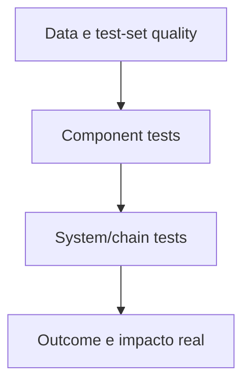
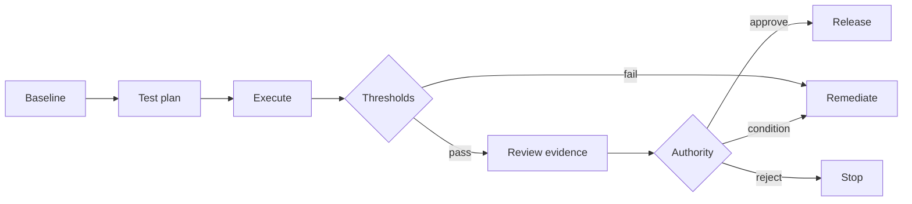

# 07 — Avaliação, evidência e assurance


## Visão geral

Antes de liberar um agente, a organização precisa responder com evidência: **como sabemos que este sistema faz o que promete, dentro do risco aceito?**

Este capítulo é a ponte entre "desenhamos os controles" (cap. 06) e "liberamos para produção" (cap. 08). Ele cobre três coisas que costumam ser confundidas:

1. **Avaliação (evaluation):** gerar evidência de que o sistema atende ao uso pretendido, aos riscos e aos controles — antes do release e continuamente em operação.
2. **Evidência (evidence):** empacotar resultados de forma recuperável, atribuída, versionada e íntegra — para que auditoria, investigação e reassessment sejam rápidos.
3. **Assurance (assurance):** desafiar a evidência com níveis crescentes de independência — self-check, peer challenge e independent assurance.

O princípio que amarra tudo: **a força da conclusão não pode exceder a força da evidência.** E o complemento que evita burocracia: **evidência é produto do processo** — o eval gera o relatório, o gate gera o decision record, o deploy gera o baseline. Evidence pack montado depois, para satisfazer auditoria, custa mais e vale menos.

> **Artefatos para produzir agora — avaliação e release evidence.** Defina a estratégia no [template de assessment](../../toolkit/templates/assessment-template.md), registre o pacote no [Release Evidence Manifest](../../toolkit/templates/release-evidence-manifest.md) e use o [release decision checklist](../../toolkit/templates/release-decision-checklist.md) para verificar se a authority pode aprovar, condicionar ou bloquear. O [schema do manifest](../../toolkit/schemas/release-evidence-manifest.schema.json) torna a lineage verificável; o template não substitui o teste nem a decisão.

Quando a decisão envolve um orchestrator ou control plane, claims de capability, modularity, neutrality, observability, enforcement, portability, resilience e exit devem ser tratados como alegações avaliáveis, não como cobertura presumida pela marca ou pelo fornecedor. Use o [Orchestrator Decision and Exit Record](../../toolkit/templates/orchestrator-decision-exit-record.md) para vincular cada claim a evidence, limitation, test ou status `missing`/`conditional`. A assurance deve desafiar a decisão de plataforma sem assumir a responsabilidade operacional do runtime.

## 1. Estratégia de avaliação

### 1.1 A estratégia declara antes de testar

Uma estratégia de avaliação é aprovada **antes de ver resultados**: intended e prohibited use; scenarios e personas; quality dimensions; risk-based thresholds; datasets e provenance; automated e human evaluation; negative, adversarial e edge cases; slices relevantes; runtime metrics; promotion, rollback e sunset criteria.

**O plano não pode ser afrouxado após um resultado reprovado sem decisão de mudança registrada.** Test set escolhido depois de ver o resultado é a forma mais comum de auto-engano em avaliação.

### 1.2 Governança da avaliação e independência

Toda avaliação roda contra critérios pré-aprovados: escopo, versão, dataset ou amostra, método, thresholds, resultados, limitações, revisor e linhagem de evidência. Resultados são reproduzíveis, critérios reprovados bloqueiam ou condicionam o release, e a conclusão **não excede o escopo testado nem a independência do revisor**.

### 1.3 A pirâmide de avaliação



| Camada | O que testa |
|---|---|
| **Data e test set** | representatividade contextual; provenance e licença; cobertura de red flags e edge cases; separação train/tune/test; versioning e leakage control |
| **Component** | prompt, model, retrieval, classifier e tool separadamente; schema, authz, safety e output validation; testes determinísticos para código e policy |
| **System/chain** | cenários end-to-end; multi-step tool use; indirect prompt injection; rollback e idempotency; latência, custo e propagação de falha; aprovação humana e escalonamento |
| **Outcome** | qualidade no processo real; impacto em pessoas e grupos; erro operacional; adoção e suporte; valor versus baseline |

### 1.4 Quality dimensions

Correctness e groundedness; relevance e completeness; safety e harmfulness; security e policy compliance; robustness e consistency; fairness por slices relevantes; transparency e citation quality; latency, availability e cost; task success e reversibility; human usability e override.

### 1.5 Thresholds: média agregada não pode compensar red flag

Todo threshold tem: métrica e unidade; dataset/scenario; rationale; owner; minimum e target; action quando falha; validade e review trigger. **Média agregada não pode compensar falha em red flag. Gates críticos são binários quando a tolerância é zero.**

### 1.6 LLM-as-judge: apoio de escala, não evidência única

Pode apoiar escala desde que: rubric e model/version registrados; calibração humana amostrada; bias e instability medidos; high-impact decisions não dependam de um único judge; outputs tratados como evidência auxiliar. **LLM-as-judge pode auxiliar triagem; não é evidência única para riscos críticos.**

## 2. Tipos de avaliação

### 2.1 Funcional e sucesso de tarefa

Testar tarefas representativas, transições de estado e tratamento de falhas contra requisitos de usuário e sistema: cenário, pré-condição, resultado esperado/real, versão, ambiente, cobertura e defeito. **Tarefas críticas atingem o threshold; caminhos de borda ou exceção reprovados não podem ser escondidos por sucesso agregado.**

### 2.2 Qualidade e confiabilidade

Medir repetibilidade, consistência e taxa de falha sob carga representativa e variação de entrada: amostra, repetições, variância, latência, modos de falha, intervalo de confiança e threshold. Resultados atingem alvos pré-aprovados nas fatias materiais e reexecuções permanecem dentro da tolerância.

### 2.3 Precisão, factualidade e ancoragem

Definir factualidade aceitável, qualidade de fonte e limites de conteúdo prejudicial para o contexto: categorias de afirmação, fontes autoritativas, conjunto de teste, verificações de citação, thresholds, exemplos de falha e resposta. **Alegações materiais sem suporte são detectadas ou divulgadas; falha acima do threshold bloqueia ou restringe o uso.**

### 2.4 Fairness e impacto

Definir danos de fairness específicos do contexto, grupos relevantes, fatias e disparidade aceitável **antes de testar**: rationale do grupo, métricas, adequação da amostra, thresholds, resultados, incerteza, mitigações e impacto residual. **Desempenho agregado não pode esconder uma fatia material reprovada.**

### 2.5 Privacidade

Estabelecer finalidade, base legal, minimização, tratamento de direitos, retenção e restrições de transferência: categorias de dados, titulares, origem, finalidade, acesso, fluxo, DPIA, testes e evidência de exclusão. **Caminhos não autorizados falham em teste; direitos operáveis; mudança material reabre avaliação.**

### 2.6 Segurança e adversarial

Modelar ameaças pelas fronteiras de identidade, prompt, dados, ferramenta, runtime e supply chain e testar caminhos materiais de abuso (ver [cap. 06, seção 7](06-architecture-and-technical-controls.md)): threat model, cenários, pré-condições, evidência de teste, descobertas, mitigações, residual e reteste. **Caminhos de alto impacto prevenidos ou contidos; descobertas bloqueantes abertas impedem o release.**

### 2.7 Abuso de prompt, contexto e ferramentas

Identificar uso indevido plausível, abuso, viés de automação, expansão de escopo e interação emergente antes do release: ator, cenário, pré-condição, impacto, detecção, controle preventivo, resposta e exposição residual. Cenários materiais testados ou explicitamente restritos; uso indevido observado alimenta controles.

### 2.8 Chamadas de ferramenta e ações

Testar seleção de ferramenta, construção de parâmetros, autorização, efeitos colaterais, idempotência e comportamento de recusa: versão da ferramenta, cenário, chamada esperada/observada, decisão de policy, efeito colateral, rollback e evidência. **Chamadas não autorizadas ou malformadas bloqueadas; retries não podem duplicar uma ação consequente.**

### 2.9 Supervisão humana

Testar que o humano consegue detectar, interromper, corrigir e escalonar uma falha representativa em vez de carimbar uma ação irreversível (ver [cap. 02, seção 4](02-governance-and-accountability.md)): gatilho, informações apresentadas, authority, tempo de resposta, override, carga, treinamento e teste exercitado.

### 2.10 Robustez e fora da distribuição

Desafiar o sistema com deslocamentos de distribuição, ambiguidade, contexto ausente e degradação de dependências: design do deslocamento, amostra, comportamento seguro esperado/observado, incerteza, threshold e mitigação. **O sistema degrada, abstém-se ou escalona dentro da fronteira aprovada em vez de agir com confiança fora da evidência.**

### 2.11 Falha, rollback e contenção

Exercitar falhas de modelos, ferramentas, dados, policy, identidade e infraestrutura juntamente com contenção e rollback: falha injetada, blast radius, tempo de detecção/contenção, recuperação, preservação de evidências e descobertas. **A falha permanece dentro do blast radius aprovado e a recuperação atinge seu alvo.**

### 2.12 Avaliação contínua e em runtime

Monitorar comportamento em produção e resultados de controle que podem invalidar a aprovação: definições de sinais, baselines, fatias, thresholds, owner, rota de alerta, investigação e ação de lifecycle vinculada. **Desvio material ou violação de threshold produz contenção ou reavaliação — não alerta informativo sem owner.** Componentes de runtime: sample quality review; drift de input/output/source/user behavior; policy denials e safety signals; tool success e side effects; incidents, complaints e overrides; cost/latency regressions; canary e rollback criteria; periodic attestation.

### 2.13 Regressão após mudança

Retestar requisitos afetados após incidente, correção, mudança de dependência ou atualização de modelo/configuração: versões anterior e nova, cenários impactados, conjunto de regressão, resultado, lacunas residuais e disposição. **A mudança não invalida silenciosamente evidências anteriores; regressão reprovada impede reativação ou promoção.**

## 3. Evidence pack proporcional por tier

### 3.1 Todos os tiers produzem evidência

Governança proporcional não significa ausência de registro — significa que evidência simples e gerada automaticamente é suficiente quando o risco é baixo. **Sem isso, a organização perde rastreabilidade exatamente onde o volume é maior.**

| Tier | Pacote mínimo | Objetivo |
|---|---|---|
| **T1** | `agent_id` e registro de descoberta; pre-screen com tier e admissibilidade; owners e contexto de uso; policy gate; blueprint reduzido; referências de fontes/tools aprovadas; padrão de identidade; logging padrão; testes funcionais; impact assessment quando trigger; rollback documentado; aprovação; data de attestation | ownership, escopo conhecido e controles básicos sem review manual desnecessário |
| **T2** | tudo de T1 + blueprint versionado; risk record formal com escaladores; domain reviews; aprovações de dados/tools; identidade e permissões; evals e testes de segurança; rollback testado; telemetria; residual risk; aprovação de publicação | assurance formal, investigação e reassessment de agente transacional |
| **T3** | tudo de T2 + threat model e abuse cases; impact assessment; testes adversariais e de resiliência; design de oversight humano e step-up; teste de kill switch e quarentena; baseline de comportamento; aceite de residual risk pela authority; attestation frequente | autonomia e impacto elevados com assurance reforçado e contenção |
| **T4** | tudo de T3 + architecture/assurance challenge reforçado; cenários críticos; segregation e dual control; containment/fail-safe exercitados; executive risk decision; attestation orientada a evento | investigação e decisão para impactos críticos ou difíceis de reverter |

> **O fast path de T1 não encurta a lista de T1: ele a gera automaticamente.** A rota automatizada reduz trabalho humano, não a evidência exigida. E cada linha desta tabela precisa cobrir tudo que o [Minimum Production Bar](../../toolkit/controls/minimum-production-bar.md) exige no mesmo tier — **as duas tabelas não podem divergir**: divergência é defeito, não nuance.

**Overlay de admissibilidade:** `conditional` inclui condições, owner, testes, monitoring e expiry; `restricted` inclui exception request, authority, compensating controls, escopo e expiry; `prohibited` inclui rationale e decision record de rejeição — **não gera manifesto de release aprovado.**

### 3.2 Qualidade da evidência

Um artefato só conta como evidência quando é:

- **recuperável** — endereço estável e alguém consegue abri-lo meses depois;
- **atribuída** — quem produziu, quando e com qual escopo;
- **versionada** — vinculada à versão do agente e do modelo de risco;
- **íntegra** — protegida contra alteração silenciosa (hash recomendado);
- **interpretável** — um terceiro competente entende o que ela demonstra sem o autor presente.

**Uma caixa marcada não é evidência. Um print sem contexto, data ou origem não é evidência.**

### 3.3 Retenção e acesso

Defina retenção por tier e por tipo de evidência, alinhada às obrigações; preserve evidência de versões anteriores (uma nova release não sobrescreve o histórico); em quarentena e incidente, a preservação é deliberada e vem antes da remediação; em retirada, arquive conforme a retenção antes de revogar acessos.

## 4. Auditabilidade: reconstruir o que aconteceu

### 4.1 Auditabilidade não é "logar tudo"

Logs indiscriminados aumentam risco de privacy, custo e exposição. O desenho equilibra: traceability; minimização; integridade; retenção; acesso; utilidade para investigação; separação entre telemetria e record oficial.

**Eventos mínimos:** criação/alteração de registry/blueprint; classificação e approvals; versões de model/prompt/tool/policy; decisões de authentication e authorization; correlação user/agent/tool; source IDs de retrieval; state-changing action e resultado; human approval, edit, deny e override; policy denial e alert; incident, quarantine, rollback e reactivation; attestation, exception e sunset.

**Event envelope (o que cada evento carrega):**

| Campo | Propósito |
|---|---|
| timestamp e timezone | ordenar e correlacionar |
| event ID / correlation ID | rastrear a chain |
| agent ID e version | identificar o sistema |
| user/delegated subject | atribuir contexto humano |
| tool/action | identificar capability |
| target/resource | localizar efeito |
| policy/control decision | explicar allow/deny |
| outcome/status | registrar resultado |
| evidence reference | apontar artefato protegido |
| sensitivity | aplicar acesso e retenção |

**Sensitive payloads devem ser referenciados ou protegidos, não copiados sem necessidade.** O [AI Agent Audit Event schema](../../toolkit/schemas/audit-event.schema.json) oferece um envelope mínimo vendor-neutral.

**Integridade e acesso:** clock synchronization; append-only ou controles de integridade; segregação de administradores e auditores; access logging; redaction/tokenization; legal hold; teste de restauração e export; retention/deletion verificáveis.

### 4.2 Traceability graph

```text
Business outcome
  ↕
Agent ID/version
  ↕
Blueprint → model/prompt/data/tool versions
  ↕
Risk/control/evaluation decisions
  ↕
Runtime events/incidents
  ↕
Attestation/value/sunset decision
```

Para sistemas AI-native, o [profile opcional de observabilidade](../../toolkit/patterns/ai-native-observability-profile.md) detalha a semântica de `agent.task`, `agent.delegation`, `model.call`, `retrieval`, `tool.request/result`, `policy.decision`, `human.intervention`, `agent.memory/state`, `containment` e `value.cost`. O profile complementa o envelope mínimo; não cria assurance por si só, não autoriza captura de payload sensível e não substitui a verificação de eficácia dos controls.

A cobertura deve ser demonstrada por um drill de reconstrução, não por quantidade de eventos. Registre o [template de profile](../../toolkit/templates/ai-native-observability-profile.md), as limitações de correlação, redaction, retention, access, export e cardinalidade e o [exemplo fictício](../../toolkit/examples/ai-native-observability.example.md) como referência de estrutura, nunca como evidência de produção.

### 4.3 Evidence package

Um package de release ou attestation deve ser: versionado; immutable ou tamper-evident; ligado a agent/version; completo segundo tier; acessível somente a roles autorizados; retido conforme policy; exportável para review; capaz de distinguir **missing, not-applicable e passed**. **"Sem evidência" não significa "controle passou".** Use o [Release Evidence Manifest schema](../../toolkit/schemas/release-evidence-manifest.schema.json) e o [template humano](../../toolkit/templates/release-evidence-manifest.md).

## 5. Integração com o audit universe existente

### 5.1 A pergunta da primeira reunião

Auditoria interna vai perguntar: **"como estes controles se relacionam com o que eu já testo?"** Uma organização madura já tem universo de auditoria, ciclo de teste, matriz de controles financeiros e certificações. Um framework que chega como universo paralelo não é adotado — é tolerado até a próxima reorganização.

O que o catálogo oferece a auditoria (44 controls): `scope` (40 agent, 4 organization — organization nunca é bloqueante por design, ADR-0010); `blocking` (27 bloqueantes — candidatos naturais a control chave); `automation` (9 automated, 24 assisted, 10 manual, 1 mixed); `verification` declarado em todos — diz **como** a evidência é obtida.

### 5.2 Onde encaixar (não criar universo novo)

| Domínio do framework | Universo existente | O que muda |
|---|---|---|
| registry e ownership | gestão de ativos e CMDB | o ativo tem comportamento próprio e muda sem deploy; descoberta contínua, não recertificação anual |
| identidade | IAM e gestão de acessos | identidade não é de pessoa nem de serviço estático; JML cobre reatribuição de owner |
| dados | governança de dados e privacidade | autorização acontece na recuperação, não só na concessão |
| tools e MCP | gestão de mudanças e integrações | capacidade de ação pode crescer sem mudança de código |
| modelos e provedores | gestão de fornecedores | versão do fornecedor muda sem aviso e invalida avaliação |
| segurança | segurança da informação | superfície inclui a instrução, não só a interface |
| evaluations e release | SDLC e gestão de mudanças | critério de aceite probabilístico com threshold e slice |
| operações e runtime | continuidade e monitoramento | contenção exercitada, não documentada |
| Responsible AI e oversight | conformidade e conduta | **frequentemente não tem universo prévio — nasce controle novo** |
| valor e portfólio | gestão de benefícios | outcome contra baseline, não uso |

**Só a linha de Responsible AI costuma exigir universo novo.** As demais são extensão de escopo: a conversa muda de "crie um programa de auditoria de IA" para "acrescente estas perguntas ao que você já faz".

### 5.3 Três diferenças que quebram o teste convencional

1. **Evidência tem data de validade curta.** Mudança de versão de modelo, fonte ou tool invalida a evidência no dia em que acontece. O teste amarra a evidência à **versão** do agente, não ao período.
2. **Amostragem por população homogênea não funciona.** O estate é heterogêneo por tier — amostrar 25 agentes ao acaso mede quase só T1. A amostra é **estratificada por tier e admissibilidade**, com cobertura integral dos T3 e T4.
3. **Aprovação não é evidência de controle.** Um release `conditional` aprovado não diz que as condições foram cumpridas — diz que foram impostas. O teste é sobre a **verificação declarada de cada condição**.

### 5.4 Onde começar um primeiro teste

1. **Completude e ownership do registry** — agente em produção sem business owner é o achado mais comum e o mais fácil de evidenciar.
2. **Os 27 controls bloqueantes** — verificando se realmente bloqueiam (control bloqueante que nunca reprovou merece investigação).
3. **Attestation vencida** em agentes ativos.
4. **Condições de release com prazo expirado** e agentes ainda operando.
5. **Bindings de catálogo** — modelo, fonte ou tool em uso sem entrada aprovada.

Os itens 4 e 5 são verificáveis por consulta a records estruturados, sem entrevista. **Comece por onde a evidência já é máquina-legível.**

**Limites declarados:** este framework não é mapeamento control a control contra ISO/IEC 42001, 23894, 42005, SOX ou qualquer norma específica. Os `frameworkMappings` declaram alinhamento direcional — "não constitui equivalência, conformidade nem atestação". Quem precisar de mapeamento formal adquire os textos normativos e o produz internamente com a authority competente.

## 6. Assurance: níveis de independência

### 6.1 Três níveis

| Nível | O que é | Limitação |
|---|---|---|
| **Self-check** | o control owner avalia a própria implementação | auto-revisão não é assurance independente |
| **Peer challenge** | par qualificado fora do produto de trabalho imediato desafia evidências, rationale e cenários ausentes | conflitos declarados; fechamento exige evidência, não consenso |
| **Independent assurance** | revisor sem responsabilidade por design/implementação/operação do objeto | requisitos formais de independência (ver [cap. 02, seção 3.5](02-governance-and-accountability.md)) |

**Autoavaliação:** owners avaliam contra critérios definidos enquanto declaram limitações da auto-revisão: papel do avaliador, alegações, evidências, lacunas, confiança, conflitos, decisão solicitada e challenge do revisor. **A autoavaliação encaminha lacunas materiais para revisão e nunca é apresentada como assurance independente.**

### 6.2 Descobertas, ação corretiva e fechamento

Toda descoberta tem causa raiz, prioridade baseada em risco, ação corretiva e critério de fechamento: descoberta, evidência, owner, vencimento, controle provisório, causa raiz, remediação, reteste e disposição do revisor. **O fechamento exige evidência objetiva de reteste; descobertas materiais vencidas permanecem visíveis e afetam a aprovação.**

## 7. Score de prontidão do dossiê

### 7.1 Por que pontuar o preenchimento

Chegou a hora da decisão go/no-go — e surge a pergunta prática: **como sabemos que o dossiê está completo o bastante para ser julgado?** Sem uma resposta objetiva, o gate vira negociação: "está quase tudo, aprova aí". O score de prontidão existe para transformar essa negociação em regra.

O score responde a uma pergunta e apenas uma: **o dossiê está completo e evidenciado no nível que o tier exige?** Ele não mede risco (isso é o tier do cap. 04), não mede qualidade do agente (isso é a avaliação das seções 1–2) e não mede maturidade organizacional (isso é o maturity model). É uma medida de **prontidão para decisão**.

### 7.2 Como funciona

Cada campo obrigatório da [autoavaliação](../../toolkit/templates/self-assessment-form.md) vira um item pontuável, agrupado em categorias com pesos: identificação vale menos que dados, dados valem menos que os itens críticos.

| Resposta ao item | Pontos |
|---|---|
| Preenchido **com evidência recuperável** | pontos cheios |
| Preenchido **sem evidência** | metade dos pontos |
| `missing` | zero |
| Item crítico `missing` | **bloqueador** — o score não importa |

**Itens críticos:** owners nomeados e vivos; classificação dos dados e destino de processamento; HITL definido quando há ação state-changing; kill switch com owner e método testado; testes mínimos (prompt injection, exfiltração, tool-use) com evidência. Um único item crítico ausente bloqueia o gate — por design, para impedir que um score alto compense uma lacuna grave.

**Threshold por tier:**

| Tier | Score mínimo | Bloqueadores |
|---|---|---|
| T1 | ≥ 70 | zero |
| T2 | ≥ 80 | zero |
| T3 | ≥ 90 | zero |
| T4 | 100 | zero |

### 7.3 Regras de leitura

- **Score abaixo do threshold = voltar ao trabalho**, não "aprovar com observações". O gate não é um espaço para negociar completeza.
- **Score alto com bloqueador ativo continua bloqueado.** O bloqueador é binário; o score é gradiente.
- **O score é um instantâneo datado**, não uma nota permanente: registre data, avaliador e versão do dossiê avaliado. Após correções, o score é recalculado — e o histórico mostra que ele subiu, quando e por quê.
- **Thresholds são calibrados pela organização** com os primeiros 20–30 casos reais, como qualquer parâmetro do framework. Os valores acima são ponto de partida, não SLA universal.

### 7.4 Armadilhas comuns

- **Confundir score de prontidão com score de risco.** Um dossiê 100% completo de um agente que executa pagamentos continua T3/T4. Um dossiê 40% completo de um assistente de leitura continua T1 — e ainda não pode seguir para o gate.
- **Premiar texto sem evidência.** "Logs: sim" sem configuração observável vale metade — e metade em todos os itens de peso 2 é o suficiente para falhar o threshold honestamente.
- **Usar o score como métrica de desempenho do time.** O score mede o dossiê, não a pessoa. Rastrear score médio por time vira incentivo para inflar formulários.
- **Recalcular sem registrar.** Um score novo sem data e avaliador é uma nota sem contexto; dois scores diferentes sem histórico viram disputa de "quem tem razão".

## 8. Decisão go, conditional-go e no-go

O release é decidido somente a partir do pacote vinculado de evidências de risco, avaliação, controle e operação: decisão, authority, versões, critérios aprovados e reprovados, condições, expiração, alvo de rollback e descobertas não resolvidas.



**Controles bloqueantes não podem ser dispensados por aprovação condicional; condições expiradas interrompem a operação continuada.** Um release `conditional` aprovado impõe condições — o teste é sobre a verificação declarada de cada condição.

## 9. Referência normativa

Condições mínimas que devem ser verdadeiras. Use como checklist; as seções 1–8 explicam o porquê.

| # | Obrigação | Evidência mínima | Concluído quando |
|---|---|---|---|
| R1 | Executar avaliação contra critérios pré-aprovados | escopo, versão, dataset/amostra, método, thresholds, resultados, limitações, revisor, linhagem | resultados reproduzíveis; reprovação bloqueia/condiciona; conclusão não excede escopo/independência |
| R2 | Aprovar estratégia de avaliação antes de ver resultados | plano com caso de uso, tier, versões, ambientes, métodos, critérios, owner | plano cobre modos de falha materiais; não afrouxado sem decisão registrada |
| R3 | Testar tarefas representativas, transições e falhas | cenário, pré-condição, esperado/real, versão, ambiente, cobertura, defeito | tarefas críticas no threshold; borda/exceção não escondida por sucesso agregado |
| R4 | Medir repetibilidade, consistência e taxa de falha | amostra, repetições, variância, latência, modos de falha, intervalo, threshold | alvos de confiabilidade nas fatias materiais; reexecuções na tolerância |
| R5 | Definir factualidade aceitável e limites de conteúdo | categorias, fontes, conjunto de teste, citações, thresholds, falhas, resposta | alegações materiais sem suporte detectadas/divulgadas; falha bloqueia uso |
| R6 | Definir danos de fairness, grupos, fatias e disparidade antes de testar | rationale do grupo, métricas, amostra, thresholds, resultados, incerteza, mitigações | agregado não esconde fatia reprovada; dano escalonado à authority |
| R7 | Estabelecer finalidade, base legal, minimização, direitos e retenção | categorias, titulares, origem, finalidade, acesso, fluxo, DPIA, testes, exclusão | caminhos não autorizados falham; direitos operáveis; mudança reabre avaliação |
| R8 | Testar caminhos materiais de abuso por fronteira | threat model, cenários, pré-condições, evidência, descobertas, mitigações, residual, reteste | alto impacto prevenido/contido; bloqueantes abertos impedem release |
| R9 | Identificar uso indevido previsível antes do release | ator, cenário, pré-condição, impacto, detecção, controle, resposta, residual | cenários materiais testados/restritos; observado alimenta controles |
| R10 | Testar seleção de ferramenta, parâmetros, autorização e efeitos | versão da tool, cenário, chamada esperada/observada, policy, efeito, rollback | não autorizadas/malformadas bloqueadas; retries não duplicam ação |
| R11 | Testar que o humano detecta, interrompe, corrige e escala | gatilho, informações, authority, tempo, override, carga, treinamento, teste | humano age antes de carimbar ação irreversível |
| R12 | Desafiar com deslocamentos, ambiguidade e degradação | design do deslocamento, amostra, esperado/observado, incerteza, threshold, mitigação | sistema degrada/abstém/escalona dentro da fronteira aprovada |
| R13 | Exercitar falhas de componentes e contenção/rollback | falha injetada, blast radius, tempos, recuperação, evidência, descobertas | falha dentro do blast radius aprovado; recuperação atinge alvo |
| R14 | Classificar evidências de fornecedor por fonte, escopo, atualidade e independência | alegação, artefato, versão, escopo, corroboração, lacunas, contrato, revisor | marketing/auto-attestation não satisfaz controle que exige evidência observada |
| R15 | Aprovar critérios quantitativos e qualitativos antes de executar | métrica, população, fatia, threshold, rationale, incerteza, status, histórico | bloqueantes não diluídos por média nem afrouxados retroativamente |
| R16 | Construir datasets representativos e governados | provenance, direitos, período, amostragem, fatias, leakage, qualidade, versão | cobertura/limitações explícitas; teste não contamina treinamento |
| R17 | Vincular todo resultado a versões de código, modelo, prompt, policy, dados e ambiente | hashes, parâmetros, randomização, timestamp, reexecução | revisor reproduz ou explica variância material |
| R18 | Coletar evidências com identidade, fonte, tempo, versão, integridade e custódia | manifesto com artefatos, hashes, produtor, ambiente, método, resultado, limitação | revisor recupera e reproduz alegação; ausência vira lacuna, não sucesso |
| R19 | Decidir release somente pelo pacote vinculado de evidências | decisão, authority, versões, critérios, condições, expiração, rollback, descobertas | bloqueantes não dispensados por aprovação condicional; condições expiradas interrompem |
| R20 | Monitorar comportamento em produção que invalida aprovação | sinais, baselines, fatias, thresholds, owner, alerta, investigação, ação | desvio material produz contenção/reavaliação, não alerta sem owner |
| R21 | Retestar requisitos afetados após mudança | versões, cenários impactados, regressão, resultado, lacunas, disposição | mudança não invalida evidência; regressão reprovada impede promoção |
| R22 | Exigir autoavaliação com limitações declaradas | papel, alegações, evidências, lacunas, confiança, conflitos, decisão, challenge | lacunas materiais encaminhadas; nunca apresentada como independente |
| R23 | Designar peer challenge fora do produto de trabalho | revisor, conflitos, perguntas, evidências, discordâncias, disposição, ações | alegações disputadas visíveis; fechamento por evidência |
| R24 | Atribuir causa raiz, prioridade e critério de fechamento a cada descoberta | descoberta, evidência, owner, vencimento, controle provisório, causa, remediação, reteste | fechamento exige reteste objetivo; vencidas afetam aprovação |
| R25 | Definir retenção, acesso e legal hold de evidências | classificação, grupos, custodiano, gatilho, período, disposição, recuperação | recuperáveis no prazo; expirados descartados sem romper linhagem |
| R26 | Calcular o score de prontidão do dossiê antes de julgar o gate | score datado com avaliador, pontos por categoria, itens críticos, threshold do tier | score no threshold sem bloqueadores; abaixo do threshold volta ao trabalho |

## 10. Evidências, métricas e failure modes

**Evidências:** logging specification; sample events e schema; [audit event estruturado](../../toolkit/schemas/audit-event.schema.json); access/retention configuration; integrity test; evidence package index; [release evidence manifest](../../toolkit/schemas/release-evidence-manifest.schema.json); audit export test; deletion e legal-hold records; versioned evaluation plan; test sets e provenance; raw e summarized results; failure analysis; human review/calibration; gate decision; runtime trend e incident feedback; regression suite; índice do pacote por release; verificação de completude no gate.

**Métricas:** actions sem correlation ID; events atrasados/incompletos/duplicados; agents sem version identificável; evidence packages incompletos; unauthorized log access; retention/deletion failures; tempo para reconstruir um incident; controls com evidence link quebrado; releases com pack incompleto no gate; evidências referenciadas que não abrem; tempo médio para reunir pacote sob investigação; proporção de evidência automática vs manual; evidências fora da retenção; coverage de critical scenarios; pass/fail por dimension e slice; escaped defects; judge-human agreement; tempo para avaliar após mudança; agentes operando com evidência expirada.

**Failure modes:** logar prompt completo por padrão; usar dashboard agregado como audit trail; não versionar prompt/model/tool; mesmo admin altera ação e evidência; logs sem busca/export; apagar evidência no sunset antes da retenção; marcar missing como not-applicable; montar pacote depois para a auditoria; tratar caixa marcada como evidência; pacote pesado em T1 insustentável; pacote leve em T3 que não sustenta investigação; sobrescrever evidência ao publicar; demo usada como evaluation; test set escolhido depois do resultado; threshold sem rationale; avaliar só output textual e ignorar tool effect; confiar em média agregada; LLM judge sem calibração; release approval sem raw evidence; não converter incidentes em regression tests.

## Decision gates

- **Auditabilidade:** a release authority exige event model, retention, access, correlation e evidence package compatíveis com o tier antes de produção.
- **Evidence pack:** nenhum release é aprovado com item obrigatório do pacote do tier ausente. **Ausência de evidência é registrada como `missing` e nunca convertida em `passed`.**
- **Promotion:** a decisão go/conditional/no-go sai somente do pacote vinculado, com thresholds aprovados e authority compatível.

## Acceptance criteria

- todas as decisões deste capítulo possuem authority, owner e evidência recuperável;
- requisitos aplicáveis estão ligados ao catálogo de controles e ao método de verificação;
- exceções têm escopo, justificativa, compensating controls, expiry e decisão residual;
- controles de build time e runtime são distinguidos e exercitados quando aplicáveis;
- mudanças materiais reabrem avaliação, aprovação e evidência;
- nenhuma alegação de conformidade, eficácia ou valor excede a evidência observada.
