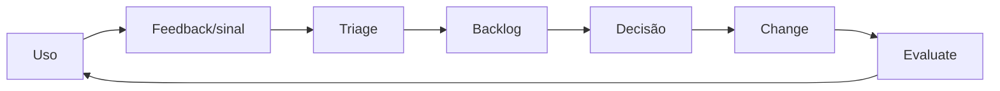

# 08 — Implementação e adoção

Este capítulo integra a estrutura clean-room aprovada com o conteúdo substantivo do corpus autoritativo. Requisitos do framework são vendor-neutral; legislação externa, guidance, casos e histórico são identificados como tais. A implementação organizacional exige adoção formal pela authority competente e não decorre do versionamento deste repositório.

## Contrato operacional do capítulo

As subseções seguintes formam um contrato executável de completude. Cada uma especifica a decisão ou ação requerida, o record/evidence mínimo e uma condição observável de conclusão para levar a governança do zero ao business as usual.

### 08.1 Implementation principles

**Required decision/action.** For **implementation principles**, the organization must deliver this implementation capability as an owned workstream with dependencies and exit criteria.

**Record and evidence.** The implementation plan must record baseline, target, owner, resources, sequence, acceptance evidence, risks, dependencies and handoff recipient.

**Done when.** The capability works on a representative path, users and operators can execute it, and permanent ownership accepts the runbook and backlog.

### 08.2 Current-state diagnostic

**Required decision/action.** For **current-state diagnostic**, the organization must establish a dated baseline of assets, capabilities, owners, controls, evidence and operating pain before designing target state.

**Record and evidence.** Record scope, method, population, sample, evidence, confidence, gaps, dependencies and stakeholder validation.

**Done when.** The baseline distinguishes absent, defined and operating capabilities and can be repeated with the same method.

### 08.3 Asset discovery and baseline

**Required decision/action.** For **asset discovery and baseline**, the organization must discover deployed, experimental, embedded and supplier-operated assets through multiple reconciled sources.

**Record and evidence.** Retain discovery source, last seen, confidence, owner match, unresolved identity and remediation status.

**Done when.** Unowned or shadow assets enter containment and ownership resolution instead of being silently accepted into inventory.

### 08.4 Capability and gap assessment

**Required decision/action.** For **capability and gap assessment**, the organization must establish a dated baseline of assets, capabilities, owners, controls, evidence and operating pain before designing target state.

**Record and evidence.** Record scope, method, population, sample, evidence, confidence, gaps, dependencies and stakeholder validation.

**Done when.** The baseline distinguishes absent, defined and operating capabilities and can be repeated with the same method.

### 08.5 Target governance system

**Required decision/action.** For **target governance system**, the organization must design the target decision, control, assurance, registry and operating capabilities from the baseline and risk context.

**Record and evidence.** Retain target capabilities, authority, interfaces, required artifacts, sequencing, acceptance and transition assumptions.

**Done when.** Every target capability closes a documented gap or obligation and has an owner and measurable exit criterion.

### 08.6 Target operating model

**Required decision/action.** For **target operating model**, the organization must select and document the centralized, federated or hybrid allocation of policy, platform, domain and assurance duties.

**Record and evidence.** Retain design principles, role map, service boundaries, decision rights, handoffs, service levels and exception route.

**Done when.** A representative case moves from intake to operation with no orphan decision or duplicated source of truth.

### 08.7 Prioritized workstreams and dependencies

**Required decision/action.** For **prioritized workstreams and dependencies**, the organization must sequence work by blocking dependency, risk reduction and usable capability rather than document category.

**Record and evidence.** Record workstream, owner, prerequisite, milestone, deliverable, acceptance, risk, capacity and critical path.

**Done when.** No wave promises a capability whose identity, data, authority, evidence or operating dependency is missing.

### 08.8 Funding, resources and skills

**Required decision/action.** For **funding, resources and skills**, the organization must secure an accountable sponsor, funded capacity and named roles for both implementation and business-as-usual operation.

**Record and evidence.** Record budget, capacity, competencies, decision authority, funding horizon, dependencies and unfunded risks.

**Done when.** Mandatory controls and operating duties have resources before the related cohort or capability is approved.

### 08.9 Technology selection and procurement

**Required decision/action.** For **technology selection and procurement**, the organization must define capability contracts and extension interfaces independently from a specific product.

**Record and evidence.** Record required behavior, interface, data and identity contract, portability test, supplier mapping and exit constraint.

**Done when.** A supplier can be replaced or isolated without redefining the policy, control IDs, schemas or decision gates.

### 08.10 Minimum viable governance for the first cohort

**Required decision/action.** For **minimum viable governance for the first cohort**, the organization must establish the named foundation before exposing the first representative cohort.

**Record and evidence.** Record minimum artifacts, owners, control states, blocked gaps, test evidence, exception authority and target hardening backlog.

**Done when.** The first cohort can complete G0–G7 with traceable decisions and no missing blocking foundation.

### 08.11 Policy, roles and decision foundations

**Required decision/action.** For **policy, roles and decision foundations**, the organization must establish the named foundation before exposing the first representative cohort.

**Record and evidence.** Record minimum artifacts, owners, control states, blocked gaps, test evidence, exception authority and target hardening backlog.

**Done when.** The first cohort can complete G0–G7 with traceable decisions and no missing blocking foundation.

### 08.12 Registry and intake foundations

**Required decision/action.** For **registry and intake foundations**, the organization must establish the named foundation before exposing the first representative cohort.

**Record and evidence.** Record minimum artifacts, owners, control states, blocked gaps, test evidence, exception authority and target hardening backlog.

**Done when.** The first cohort can complete G0–G7 with traceable decisions and no missing blocking foundation.

### 08.13 Risk and impact process foundations

**Required decision/action.** For **risk and impact process foundations**, the organization must establish the named foundation before exposing the first representative cohort.

**Record and evidence.** Record minimum artifacts, owners, control states, blocked gaps, test evidence, exception authority and target hardening backlog.

**Done when.** The first cohort can complete G0–G7 with traceable decisions and no missing blocking foundation.

### 08.14 Minimum control and evidence baseline

**Required decision/action.** For **minimum control and evidence baseline**, the organization must establish the named foundation before exposing the first representative cohort.

**Record and evidence.** Record minimum artifacts, owners, control states, blocked gaps, test evidence, exception authority and target hardening backlog.

**Done when.** The first cohort can complete G0–G7 with traceable decisions and no missing blocking foundation.

### 08.15 Platform and enforcement foundations

**Required decision/action.** For **platform and enforcement foundations**, the organization must establish the named foundation before exposing the first representative cohort.

**Record and evidence.** Record minimum artifacts, owners, control states, blocked gaps, test evidence, exception authority and target hardening backlog.

**Done when.** The first cohort can complete G0–G7 with traceable decisions and no missing blocking foundation.

### 08.16 Representative pilot or validation cohort

**Required decision/action.** For **representative pilot or validation cohort**, the organization must select a cohort that exercises material risk, data, identity, tool, lifecycle and operating paths without uncontrolled exposure.

**Record and evidence.** Record selection rationale, excluded risks, success criteria, safeguards, cohort size, rollback and learning questions.

**Done when.** The cohort validates the full governance path and does not substitute an easy demo for representative evidence.

### 08.17 End-to-end validation

**Required decision/action.** For **end-to-end validation**, the organization must exercise intake, risk, design, build, evaluation, release, operation, incident and retirement as one traceable flow.

**Record and evidence.** Retain timestamps, handoffs, decisions, artifacts, system evidence, exceptions, defects and remediation.

**Done when.** All gates and owners work on the same case and unresolved integration defects block broad rollout.

### 08.18 Controlled release and learning

**Required decision/action.** For **controlled release and learning**, the organization must release through bounded cohorts or stages with explicit promotion, pause and rollback criteria.

**Record and evidence.** Record cohort, exposure, telemetry, thresholds, approval, observed result, incidents and next-stage decision.

**Done when.** Expansion occurs only after the prior stage meets criteria and an adverse signal can halt or reverse rollout.

### 08.19 Treatment of existing and shadow agents

**Required decision/action.** For **treatment of existing and shadow agents**, the organization must triage existing assets into register, restrict, remediate, migrate, suspend or retire paths using a dated plan.

**Record and evidence.** Record discovery confidence, owner, current exposure, interim control, target state, deadline and authority.

**Done when.** Legacy status is not a permanent exemption and overdue high-risk assets are contained.

### 08.20 Rollout waves

**Required decision/action.** For **rollout waves**, the organization must release through bounded cohorts or stages with explicit promotion, pause and rollback criteria.

**Record and evidence.** Record cohort, exposure, telemetry, thresholds, approval, observed result, incidents and next-stage decision.

**Done when.** Expansion occurs only after the prior stage meets criteria and an adverse signal can halt or reverse rollout.

### 08.21 Paved road and self-service

**Required decision/action.** For **paved road and self-service**, the organization must provide reusable compliant defaults, automation and guidance for common patterns while preserving escalation for exceptions.

**Record and evidence.** Record supported patterns, built-in controls, user contract, version, telemetry, support model and escape conditions.

**Done when.** A team can complete the standard path with less manual effort and cannot use self-service to bypass blocking review.

### 08.22 Role-based training

**Required decision/action.** For **role-based training**, the organization must define role-specific competencies and training tied to decisions and tasks rather than generic awareness.

**Record and evidence.** Record role, learning objective, assessment method, completion, expiry, remediation and evidence owner.

**Done when.** Personnel demonstrate the required task or decision and lapsed competency is visible before access or authority is exercised.

### 08.23 Communication and change management

**Required decision/action.** For **communication and change management**, the organization must provide role-appropriate communication, support and feedback routes before and during rollout.

**Record and evidence.** Record audience, message, channel, timing, owner, comprehension signal, feedback and resulting action.

**Done when.** Affected users know the system boundary, reporting route and consequence of misuse, and feedback reaches an accountable owner.

### 08.24 Champions and feedback channels

**Required decision/action.** For **champions and feedback channels**, the organization must provide role-appropriate communication, support and feedback routes before and during rollout.

**Record and evidence.** Record audience, message, channel, timing, owner, comprehension signal, feedback and resulting action.

**Done when.** Affected users know the system boundary, reporting route and consequence of misuse, and feedback reaches an accountable owner.

### 08.25 Support and operating readiness

**Required decision/action.** For **support and operating readiness**, the organization must prove that permanent owners, support tiers, runbooks, access, monitoring, capacity and backlog are ready before handoff.

**Record and evidence.** Retain service acceptance, owner sign-off, support model, SLO, runbook test, known debt, training and escalation.

**Done when.** Business-as-usual teams resolve a representative issue and accept residual work without dependence on the implementation project.

### 08.26 Transfer to permanent ownership

**Required decision/action.** For **transfer to permanent ownership**, the organization must prove that permanent owners, support tiers, runbooks, access, monitoring, capacity and backlog are ready before handoff.

**Record and evidence.** Retain service acceptance, owner sign-off, support model, SLO, runbook test, known debt, training and escalation.

**Done when.** Business-as-usual teams resolve a representative issue and accept residual work without dependence on the implementation project.

### 08.27 Exit criteria for steady-state operation

**Required decision/action.** For **exit criteria for steady-state operation**, the organization must prove that permanent owners, support tiers, runbooks, access, monitoring, capacity and backlog are ready before handoff.

**Record and evidence.** Retain service acceptance, owner sign-off, support model, SLO, runbook test, known debt, training and escalation.

**Done when.** Business-as-usual teams resolve a representative issue and accept residual work without dependence on the implementation project.

## Conteúdo canônico incorporado

A seção preserva integralmente as unidades atribuídas pela matriz de cobertura. Os marcadores HTML são provenance machine-readable e não alteram o significado normativo.

### Fonte: `docs/adoption/README.md`

Commit de origem: `5545d9227624400ab8bb707b6032b2f61329a36e`.

<!-- source-unit {"classification": "metadata-title", "end_line": "2", "index": 1, "source_field": "title", "source_heading": "", "source_path": "docs/adoption/README.md", "start_line": "2", "transformation": "integrate-completely", "unit_type": "frontmatter-title"} -->
**Título controlado na origem:** Adoção, enablement e suporte

<!-- source-unit {"classification": "adoption-implementation", "end_line": "16", "index": 2, "source_field": "", "source_heading": "Adoção, enablement e suporte", "source_path": "docs/adoption/README.md", "start_line": "15", "transformation": "integrate-completely", "unit_type": "markdown-atx-heading"} -->
### Adoção, enablement e suporte

<!-- source-unit {"classification": "objective", "end_line": "22", "index": 3, "source_field": "", "source_heading": "Objetivo", "source_path": "docs/adoption/README.md", "start_line": "17", "transformation": "integrate-completely", "unit_type": "markdown-atx-heading"} -->
#### Objetivo

Preparar builders, usuários, líderes e suporte para criar, descobrir, usar e operar capacidades de IA com segurança e efetividade.

Adoção não é comunicação de lançamento. É a capacidade organizacional de usar o sistema de forma correta, obter suporte, reportar falhas e incorporar feedback ao governance lifecycle.

<!-- source-unit {"classification": "governance-role", "end_line": "35", "index": 4, "source_field": "", "source_heading": "Personas", "source_path": "docs/adoption/README.md", "start_line": "23", "transformation": "integrate-completely", "unit_type": "markdown-atx-heading"} -->
#### Personas

| Persona | Necessidade |
|---|---|
| sponsor | value, risco, decisões e accountability |
| business owner | outcome, usuários, limites e attestation |
| maker/engineer | paved road, controls, templates e feedback rápido |
| end user | intended use, limitações, suporte e contestação |
| administrator | policy, inventory, access e remediation |
| support | triage, known issues, escalation e communication |
| domain authority | evidências relevantes e decision rights |
| auditor | acesso independente a records e rationale |

<!-- source-unit {"classification": "concept-or-structure", "end_line": "49", "index": 5, "source_field": "", "source_heading": "Discovery e catalog", "source_path": "docs/adoption/README.md", "start_line": "36", "transformation": "integrate-completely", "unit_type": "markdown-atx-heading"} -->
#### Discovery e catalog

Um catálogo útil permite:

- encontrar capacidades aprovadas por tarefa e persona;
- distinguir status, owner, versão e tier;
- entender intended/prohibited use;
- acessar support e feedback;
- evitar duplicação;
- ocultar ou bloquear itens em quarantine/sunset;
- medir discovery separado de criação.

Publicar sem discovery gera agentes invisíveis; discovery sem lifecycle promove itens inadequados.

<!-- source-unit {"classification": "adoption-implementation", "end_line": "64", "index": 6, "source_field": "", "source_heading": "Paved road para builders", "source_path": "docs/adoption/README.md", "start_line": "50", "transformation": "integrate-completely", "unit_type": "markdown-atx-heading"} -->
#### Paved road para builders

- starter templates com identity, logging e policy hooks;
- schemas e self-assessment proporcionais;
- approved models, data connectors e tools;
- automated checks com feedback acionável;
- sandbox e test datasets;
- design clinic e office hours;
- exception process com owner e expiry;
- documentação de examples e failure modes.

O paved road deve ser mais simples que contornar a governança.

A sequência que o builder percorre nesse caminho — do registro do caso de uso à retirada — está em [developer experience e paved road](08-implementation-and-adoption.md), com os building blocks e as métricas de fricção correspondentes.

<!-- source-unit {"classification": "concept-or-structure", "end_line": "72", "index": 7, "source_field": "", "source_heading": "Suporte em camadas", "source_path": "docs/adoption/README.md", "start_line": "65", "transformation": "integrate-completely", "unit_type": "markdown-atx-heading"} -->
#### Suporte em camadas

1. **Self-service:** documentação, status, FAQ e runbooks.
2. **AI-assisted:** busca e triage com handoff rastreável.
3. **Platform/IT backstop:** incidentes, acesso e operação.
4. **Domain SME:** security, privacy, RAI, legal, data ou negócio.
5. **Authority escalation:** containment, risk acceptance e policy decision.

<!-- source-unit {"classification": "lifecycle-state", "end_line": "84", "index": 8, "source_field": "", "source_heading": "Change e comunicação", "source_path": "docs/adoption/README.md", "start_line": "73", "transformation": "integrate-completely", "unit_type": "markdown-atx-heading"} -->
#### Change e comunicação

Mudanças materiais comunicam:

- o que mudou e por quê;
- quem é afetado;
- novos limites ou ações;
- data de vigência;
- treinamento ou suporte necessário;
- rollback/contingency;
- canal de feedback e owner.

<!-- source-unit {"classification": "adoption-implementation", "end_line": "99", "index": 9, "source_field": "", "source_heading": "Feedback loop", "source_path": "docs/adoption/README.md", "start_line": "85", "transformation": "integrate-completely", "unit_type": "markdown-atx-heading"} -->
#### Feedback loop

Feedback é evidência contextual, não prova isolada de valor ou segurança.

<!-- source-unit {"classification": "procedure", "end_line": "112", "index": 10, "source_field": "", "source_heading": "Playbook de implantação", "source_path": "docs/adoption/README.md", "start_line": "100", "transformation": "integrate-completely", "unit_type": "markdown-atx-heading"} -->
#### Playbook de implantação

Governança só escala quando cada papel consegue executá-la sem depender do time central para cada decisão. Adoção transforma regra em competência prática, suporte e hábito.

1. **Segmentar personas.** Citizen builder, desenvolvedor profissional, business owner, technical owner, reviewer, administrador de plataforma, operação de segurança, data owner, sponsor e usuário final. Cada persona tem objetivo de aprendizagem distinto.
2. **Separar awareness de competência.** Awareness ensina a reconhecer a regra e pedir ajuda; competência exige executar a atividade e demonstrar resultado. **Não habilite um reviewer de impact assessment porque ele concluiu um treinamento introdutório.**
3. **Montar currículo por papel e risco.** Builders precisam de registry, risco, dados, ferramentas, identidade e telemetria; owners precisam de accountability, valor e attestation; reviewers precisam de critérios e evidência; segurança precisa de contenção e forensics. Com laboratórios e casos calibrados.
4. **Implantar rede de champions.** Escolher áreas por volume e risco, definir tempo alocado e **limite de autoridade**. O champion orienta a primeira linha e escala; não substitui as funções de controle nem aprova localmente o que exige authority.
5. **Tornar o caminho governado o mais fácil.** Builders aprovados, templates, catálogos de fontes e ferramentas, office hours, policy gates self-service e exemplos. **Fricção desnecessária é o principal produtor de shadow AI.**
6. **Calibrar reviewers com casos comuns.** Os mesmos 10 a 20 casos aplicados por reviewers diferentes. Divergência vira discussão de critério, não preferência individual. Versionar os exemplos quando o standard mudar.
7. **Criar suporte e comunidade de prática.** Office hours, FAQ, canais de escalation e encontros regulares reduzem retrabalho. Perguntas recorrentes viram melhoria de documentação e automação.
8. **Medir eficácia, não conclusão.** Taxa de conclusão de treinamento é métrica fraca isolada. Medir verificação de conhecimento, retrabalho de review, violações de policy, tickets de suporte, tempo até assessment, qualidade da evidência e padrões de shadow AI — e ajustar o currículo com esses sinais.

<!-- source-unit {"classification": "evidence-artifact", "end_line": "124", "index": 11, "source_field": "", "source_heading": "Evidências", "source_path": "docs/adoption/README.md", "start_line": "113", "transformation": "integrate-completely", "unit_type": "markdown-atx-heading"} -->
#### Evidências

- persona e stakeholder map;
- adoption/support plan;
- catalog entry e discovery analytics;
- learning assets;
- support model e escalation;
- training/competence records;
- feedback backlog e decisões;
- change communication;
- user research e accessibility findings.

<!-- source-unit {"classification": "metric", "end_line": "135", "index": 12, "source_field": "", "source_heading": "Métricas", "source_path": "docs/adoption/README.md", "start_line": "125", "transformation": "integrate-completely", "unit_type": "markdown-atx-heading"} -->
#### Métricas

- discovery-to-use conversion;
- active/recurring users por persona;
- duplicate creation;
- support demand e resolution time;
- training completion e task competence;
- misuse/incorrect-use reports;
- feedback-to-decision time;
- adoption com qualidade e outcome, não apenas login.

<!-- source-unit {"classification": "risk-failure-mode", "end_line": "146", "index": 13, "source_field": "", "source_heading": "Failure modes", "source_path": "docs/adoption/README.md", "start_line": "136", "transformation": "integrate-completely", "unit_type": "markdown-atx-heading"} -->
#### Failure modes

- medir sucesso por agentes criados;
- publicar sem owner ou suporte;
- treinamento único para todos;
- champion network sem authority ou tempo;
- usar feedback positivo como prova de ROI;
- esconder limitation para aumentar adoção;
- ignorar resistência como “falta de cultura”;
- manter itens em discovery durante quarantine.

<!-- source-unit {"classification": "requirement-control", "end_line": "149", "index": 14, "source_field": "", "source_heading": "Decision gate", "source_path": "docs/adoption/README.md", "start_line": "147", "transformation": "integrate-completely", "unit_type": "markdown-atx-heading"} -->
#### Decision gate

Release para audiência ampla exige catalog entry, intended use, limitations, support owner, escalation, communication e feedback channel.

### Fonte: `docs/devex/README.md`

Commit de origem: `5545d9227624400ab8bb707b6032b2f61329a36e`.

<!-- source-unit {"classification": "adoption-implementation", "end_line": "4", "index": 15, "source_field": "", "source_heading": "Developer experience e paved road", "source_path": "docs/devex/README.md", "start_line": "1", "transformation": "integrate-completely", "unit_type": "markdown-atx-heading"} -->
### Developer experience e paved road

Governança deve aparecer no fluxo de entrega, não apenas em documentos. O paved road reduz decisões repetitivas e preserva escalation para exceções.

<!-- source-unit {"classification": "concept-or-structure", "end_line": "16", "index": 16, "source_field": "", "source_heading": "Golden path", "source_path": "docs/devex/README.md", "start_line": "5", "transformation": "integrate-completely", "unit_type": "markdown-atx-heading"} -->
#### Golden path

1. registrar use case, owner e prohibited use;
2. criar registry record e blueprint;
3. classificar risk tier e red flags;
4. selecionar approved model, data e tool contracts;
5. aplicar controls e evaluation strategy;
6. produzir release evidence;
7. obter decisão no gate aplicável;
8. publicar com observability, containment e rollback;
9. operar, regress, attest e sunset.

<!-- source-unit {"classification": "concept-or-structure", "end_line": "26", "index": 17, "source_field": "", "source_heading": "Building blocks", "source_path": "docs/devex/README.md", "start_line": "17", "transformation": "integrate-completely", "unit_type": "markdown-atx-heading"} -->
#### Building blocks

- templates e examples versionados;
- CI para schemas, controls e links;
- identity e data patterns aprovados;
- tool/MCP gateway;
- evaluation harness e negative scenarios;
- runtime event e evidence standards;
- self-service com escalation claro.

<!-- source-unit {"classification": "metric", "end_line": "36", "index": 18, "source_field": "", "source_heading": "Métricas", "source_path": "docs/devex/README.md", "start_line": "27", "transformation": "integrate-completely", "unit_type": "markdown-atx-heading"} -->
#### Métricas

- lead time por gate e tier;
- rework causado por requirement tardio;
- coverage do paved road;
- exception rate e expiry;
- evidence freshness;
- containment/recovery readiness.

Automation não deve esconder decision rights ou transformar falha de validação em aprovação implícita.

### Fonte: `docs/governance/ai-agent-policy-and-governance-v1.md`

Commit de origem: `5545d9227624400ab8bb707b6032b2f61329a36e`.

<!-- source-unit {"classification": "procedure", "end_line": "284", "index": 19, "source_field": "", "source_heading": "17. Suggested Action Plan", "source_path": "docs/governance/ai-agent-policy-and-governance-v1.md", "start_line": "280", "transformation": "archive-verbatim-and-integrate-unique-content", "unit_type": "markdown-atx-heading"} -->
#### 17. Suggested Action Plan
0–30 days: Do’s & Don’ts + Self-Assessment + Approval Matrix + HITL Policy + Minimum Catalog; initial alignment with stakeholders.
30–60 days: Complete agent policy; audit and observability playbook; pilots in 1–2 segments; review by the Digital Council (1 week).
60–90 days: Corporate publication; training; progressive adoption (require Self-Assessment for new agents and migration of legacy ones to the catalog).

### Fonte: `docs/guides/capability-map.md`

Commit de origem: `5545d9227624400ab8bb707b6032b2f61329a36e`.

<!-- source-unit {"classification": "metadata-title", "end_line": "2", "index": 20, "source_field": "title", "source_heading": "", "source_path": "docs/guides/capability-map.md", "start_line": "2", "transformation": "integrate-completely", "unit_type": "frontmatter-title"} -->
**Título controlado na origem:** Capability map — atual versus alvo

<!-- source-unit {"classification": "definition", "end_line": "16", "index": 21, "source_field": "", "source_heading": "Capability map — atual versus alvo", "source_path": "docs/guides/capability-map.md", "start_line": "15", "transformation": "integrate-completely", "unit_type": "markdown-atx-heading"} -->
### Capability map — atual versus alvo

<!-- source-unit {"classification": "objective", "end_line": "20", "index": 22, "source_field": "", "source_heading": "Objetivo", "source_path": "docs/guides/capability-map.md", "start_line": "17", "transformation": "integrate-completely", "unit_type": "markdown-atx-heading"} -->
#### Objetivo

Separar **o que a organização precisa saber fazer** de **qual ferramenta vai implementar**. O capability map existe para evitar o erro mais caro de um programa de governança: comprar tecnologia para um problema que é, na verdade, ausência de processo, ownership, dados ou decision rights.

<!-- source-unit {"classification": "definition", "end_line": "28", "index": 23, "source_field": "", "source_heading": "O que é uma capability", "source_path": "docs/guides/capability-map.md", "start_line": "21", "transformation": "integrate-completely", "unit_type": "markdown-atx-heading"} -->
#### O que é uma capability

Uma capacidade organizacional de produzir um resultado **de forma repetível**. Não é uma ferramenta, um time nem um projeto.

"Agent registry" é uma capability quando a empresa consegue descobrir, registrar, manter e consultar agentes com qualidade conhecida. Uma plataforma pode implementar parte dela — não é ela.

O teste: se você trocar o produto e a capacidade desaparecer, você comprou uma ferramenta e chamou de capability.

<!-- source-unit {"classification": "concept-or-structure", "end_line": "50", "index": 24, "source_field": "", "source_heading": "As capacidades do framework", "source_path": "docs/guides/capability-map.md", "start_line": "29", "transformation": "integrate-completely", "unit_type": "markdown-atx-heading"} -->
#### As capacidades do framework

Ponto de partida: os [domínios canônicos](06-architecture-and-technical-controls.md#domínios-canônicos-por-plano). Quebre uma capability em duas apenas quando a filha tiver owner, processo **ou** evidência diferentes.

| Capacidade | Pergunta de diagnóstico | Sinal típico de estado inicial | Alvo comum |
| --- | --- | --- | --- |
| estratégia e governança | existe mandato, portfólio, funding e decisão clara? | política genérica de IA, sem charter ou priorização de agentes | charter aprovado, fóruns, decision rights, risk appetite e portfolio review |
| estate inventory e registry | sabemos quais agentes existem, onde operam e quem responde? | planilhas por plataforma e baixa cobertura de shadow agents | discovery contínuo + registry corporativo reconciliável |
| risco e Responsible AI | risco, admissibilidade e impacto roteiam controles? | mesma review para todos os casos | tiers, admissibilidade, escaladores e impact assessment por gatilho |
| lifecycle e Agent SDLC | versões, estados e mudanças estão governados? | publicação ad hoc e approvals permanentes | stage/state, gates, transition history, attestation e retirada |
| identidade e acesso | cada ação é atribuível e autorizada? | chaves e contas de serviço compartilhadas | identidade própria por agente, least privilege, JML e delegação quando aplicável |
| dados e conhecimento | as fontes são classificadas, permitidas e AI-ready? | recuperação sobre qualquer pasta autorizada | catálogo de fontes certificadas com lineage, restrictions e recertification |
| tools, APIs e MCP | as ações são catalogadas, limitadas e mediadas? | ferramentas embutidas por time | enterprise tool registry, gateway e autorização por ação/parâmetro |
| modelos e provedores | combinações e versões possuem critérios de admissão e saída? | escolha por preferência do time | catálogo provider/model/version, evaluation binding, fallback e exit strategy |
| runtime e plataforma | existem enforcement, isolamento, resiliência e rollback? | acesso direto a endpoints e configuração por agente | control plane, policy enforcement, budgets, containment e recovery patterns |
| segurança e AgentSecOps | ameaças agentic entram em prevention, detection e response? | SOC vê apenas logs tradicionais | threat model agentic, red teaming, supply-chain controls e incident integration |
| observabilidade e behavioral analytics | é possível reconstruir, detectar desvio e agir? | logs de aplicação sem correlation ou owner action | event envelope, traces, baselines, thresholds, runbooks e feedback loop |
| FinOps | custo é atribuível a agente, tarefa e outcome? | custo por chave ou centro de custo agregado | budgets, unit economics, anomaly response e arquitetura guiada por custo/qualidade |
| value realization | outcomes influenciam funding, expansão e sunset? | contagem de agentes e relatos de benefício | baseline, KPI, attribution caveats e portfolio decisions por evidência |
| assurance e auditabilidade | controls e decisões podem ser testados por challenge apropriado? | evidence preparada manualmente para auditoria | continuous evidence, segregation, sampling, findings e assurance proporcional |
| adoção, suporte e competências | cada papel consegue usar a rota governada corretamente? | treinamento pontual e suporte informal | currículo por papel, champions, support model e feedback incorporado aos standards |

<!-- source-unit {"classification": "procedure", "end_line": "84", "index": 25, "source_field": "", "source_heading": "Procedimento", "source_path": "docs/guides/capability-map.md", "start_line": "75", "transformation": "integrate-completely", "unit_type": "markdown-atx-heading"} -->
#### Procedimento

1. **Listar as capacidades** necessárias ao operating model.
2. **Escrever uma frase de outcome** para cada uma. Exemplo: *"toda ação material de agente é atribuível a uma identidade conhecida e autorizada"*.
3. **Definir evidências observáveis do estado atual.** Evite "o controle de acesso é forte". Prefira: *"74% dos T2/T3 usam identidade dedicada; 26% usam chave compartilhada"*.
4. **Atribuir maturidade com base em evidência** e registrar confidence. Evidência fraca produz nota provisória, não nota otimista.
5. **Definir o alvo por horizonte e necessidade de negócio.** Nem toda capacidade precisa do nível máximo; nível 3 costuma bastar no primeiro ano.
6. **Identificar dependências.** Behavioral analytics confiável depende de identidade própria e telemetria consistente — priorizá-la antes disso desperdiça o investimento.
7. **Converter gaps materiais em iniciativas** do roadmap de maturidade.

<!-- source-unit {"classification": "example", "end_line": "94", "index": 26, "source_field": "", "source_heading": "Exemplo", "source_path": "docs/guides/capability-map.md", "start_line": "85", "transformation": "integrate-completely", "unit_type": "markdown-atx-heading"} -->
#### Exemplo

| Capability | Estado atual observado | Alvo 12m | Gap concreto | Iniciativa |
|---|---|---|---|---|
| identidade | chaves compartilhadas; owner não rastreável em 30% dos agentes transacionais | 100% de T2/T3 com identidade própria, JML e rotação | atribuição, lifecycle e least privilege insuficientes | padrão de identidade + onboarding + automação de JML |
| tools e MCP | ferramentas embutidas por time, sem catálogo nem classificação de ação | ferramentas críticas registradas, classificadas e mediadas | sem visão da capacidade executável nem do risco por ação | tool registry + broker + autorização por parâmetro |
| observabilidade | logs de aplicação; custo por chave; sem correlação agente-tarefa-ferramenta | schema de telemetria e dashboards por decisão | impossível investigar um agente ou medir custo por resultado | schema + correlation IDs + pipeline |

Repare no primeiro: o gap **não é "comprar IAM"**. É identidade não humana por agente, least privilege, lifecycle de owner, gestão de secrets e auditabilidade. Nenhum produto entrega isso sozinho.

<!-- source-unit {"classification": "concept-or-structure", "end_line": "105", "index": 27, "source_field": "", "source_heading": "Perguntas de challenge", "source_path": "docs/guides/capability-map.md", "start_line": "95", "transformation": "integrate-completely", "unit_type": "markdown-atx-heading"} -->
#### Perguntas de challenge

Aplique antes de aprovar o alvo:

- o alvo é necessário para o risco e o volume previstos, ou está sendo escolhido por ambição tecnológica?
- existe dependência invisível em outra capacidade que pode bloquear a iniciativa?
- o alvo pode ser demonstrado por evidência objetiva?
- **existe owner capaz de sustentar a capacidade depois que o programa terminar?**

A última derruba mais iniciativas que as outras três somadas.

<!-- source-unit {"classification": "risk-failure-mode", "end_line": "119", "index": 28, "source_field": "", "source_heading": "Failure modes", "source_path": "docs/guides/capability-map.md", "start_line": "112", "transformation": "integrate-completely", "unit_type": "markdown-atx-heading"} -->
#### Failure modes

- mapear produtos e chamar de capacidades;
- quebrar capacidades até virarem tarefas, perdendo o nível de decisão;
- alvo máximo em tudo, ignorando dependência e capacidade operacional;
- estado atual descrito por adjetivo em vez de medida;
- ignorar que uma capacidade em nível baixo pode inutilizar outra em nível alto;
- aprovar alvo sem owner que o sustente depois do programa.

### Fonte: `docs/guides/framework-implementation-playbook.md`

Commit de origem: `5545d9227624400ab8bb707b6032b2f61329a36e`.

<!-- source-unit {"classification": "metadata-title", "end_line": "2", "index": 29, "source_field": "title", "source_heading": "", "source_path": "docs/guides/framework-implementation-playbook.md", "start_line": "2", "transformation": "integrate-journey-and-cross-reference-chapters + preserve-complete-operational-method", "unit_type": "frontmatter-title"} -->
**Título controlado na origem:** Implementation playbook do framework de governança

<!-- source-unit {"classification": "procedure", "end_line": "16", "index": 30, "source_field": "", "source_heading": "Implementation playbook do framework de governança", "source_path": "docs/guides/framework-implementation-playbook.md", "start_line": "15", "transformation": "integrate-journey-and-cross-reference-chapters", "unit_type": "markdown-atx-heading"} -->
### Implementation playbook do framework de governança

<!-- source-unit {"classification": "objective", "end_line": "20", "index": 31, "source_field": "", "source_heading": "Objetivo", "source_path": "docs/guides/framework-implementation-playbook.md", "start_line": "17", "transformation": "integrate-journey-and-cross-reference-chapters", "unit_type": "markdown-atx-heading"} -->
#### Objetivo

Implantar um sistema de governança proporcional, federado e verificável. O playbook organiza outcomes, atividades, artefatos e decision gates; não prescreve produto, organograma ou prazo universal.

<!-- source-unit {"classification": "concept-or-structure", "end_line": "30", "index": 32, "source_field": "", "source_heading": "Como usar", "source_path": "docs/guides/framework-implementation-playbook.md", "start_line": "21", "transformation": "integrate-journey-and-cross-reference-chapters", "unit_type": "markdown-atx-heading"} -->
#### Como usar

1. Defina o mandato e o escopo organizacional.
2. Faça baseline com evidência, sem preencher lacunas por suposição.
3. Selecione os controls mínimos por risco e capacidade.
4. Implemente governance como fluxo, não como documento isolado.
5. Teste handoffs, enforcement, contenção e evidência.
6. Meça operação e valor separadamente.
7. Revise decisões quando contexto, risco ou evidência mudarem.

<!-- source-unit {"classification": "concept-or-structure", "end_line": "42", "index": 33, "source_field": "", "source_heading": "Workstreams", "source_path": "docs/guides/framework-implementation-playbook.md", "start_line": "31", "transformation": "integrate-journey-and-cross-reference-chapters", "unit_type": "markdown-atx-heading"} -->
#### Workstreams

- estratégia, portfólio e valor;
- operating model e accountability;
- registry, blueprint e lifecycle;
- identidade e dados;
- tools, APIs e MCP;
- risco, Responsible AI e assurance;
- evaluations e release;
- adoção, suporte e change;
- runtime, auditabilidade e resposta.

<!-- source-unit {"classification": "requirement-control", "end_line": "46", "index": 34, "source_field": "", "source_heading": "Contrato comum dos decision gates", "source_path": "docs/guides/framework-implementation-playbook.md", "start_line": "43", "transformation": "integrate-journey-and-cross-reference-chapters", "unit_type": "markdown-atx-heading"} -->
#### Contrato comum dos decision gates

Os gates são decisões registradas, não nomes de fase. Workstreams podem avançar em paralelo, mas nenhum gate é concluído apenas porque o prazo terminou ou um documento foi produzido.

<!-- source-unit {"classification": "decision-authority", "end_line": "57", "index": 35, "source_field": "", "source_heading": "Estados de decisão", "source_path": "docs/guides/framework-implementation-playbook.md", "start_line": "47", "transformation": "integrate-journey-and-cross-reference-chapters", "unit_type": "markdown-atx-heading"} -->
##### Estados de decisão

| Estado | Significado | Requisito de registro |
|---|---|---|
| `approve` | critérios de saída atendidos para o escopo e versão avaliados | authority, data, versão e evidências aceitas |
| `condition` | avanço permitido com gap não crítico e compensação temporária | condição, owner, prazo, compensating control e expiry |
| `hold` | decisão suspensa por evidência insuficiente ou remediação necessária | finding, owner, ação, evidência esperada e nova data |
| `reject` | risco, desenho ou escopo não é aceitável no appetite vigente | rationale, authority, opções de redesign ou encerramento |

Todo decision record deve identificar `gate_id`, escopo, versão, tier, authority, participantes, evidence refs, estado, rationale, condições, expiry e próxima revisão. `Missing evidence` nunca equivale a aprovação. A mesma pessoa não pode construir, aprovar e desafiar o próprio artefato quando segregation of duties for exigida pelo tier ou por obrigação aplicável.

<!-- source-unit {"classification": "requirement-control", "end_line": "70", "index": 36, "source_field": "", "source_heading": "Contratos por gate", "source_path": "docs/guides/framework-implementation-playbook.md", "start_line": "58", "transformation": "integrate-journey-and-cross-reference-chapters", "unit_type": "markdown-atx-heading"} -->
##### Contratos por gate

| Gate | Critérios de entrada | Evidência mínima | Authority da decisão | Critérios de saída | Falha e remediação |
|---|---|---|---|---|---|
| G0 — Mandato | sponsor candidato, problema e boundary inicial | draft de charter, scope, authorities e obligations map | sponsor executivo, com governance owner | mandato, scope, appetite, containment authority e regra de exceção aprovados | `hold` para esclarecer escopo/authority; não automatizar approvals |
| G1 — Baseline | G0 aprovado e acesso às fontes e stakeholders | inventários com coverage, current-state map, gaps, limitações e confidence | governance owner, com domain owners; sponsor aceita limitações materiais | baseline separa observado de hipótese e todo gap crítico tem owner | `hold`; unknowns de alto impacto são restringidos ou isolados até avaliação |
| G2 — Fundações | G1 aceito e população in-scope identificada | registry, blueprints, ownership, identity/data/tool records e testes de revogação | Design Authority e authorities de identity, data e tools | records mínimos validam, owners aceitam responsabilidade e acessos são revogáveis | bloquear onboarding, restringir connector/tool ou retornar para correção |
| G3 — Operating model | G0 vigente, handoffs atuais conhecidos e G2 suficiente para atribuir responsabilidade | operating model, RACI, decision matrix, exception flow, SLAs e charters | sponsor/Governance Council, com aceite das domain authorities | cada decisão material possui accountable, receiver, prazo e escalation | `hold`; decisões não delegadas retornam à authority existente |
| G4 — Controls e assurance | tiering proposto, G2/G3 aceitos e obligations map disponível | risk rationale, baseline por tier, assessments, evaluation plan, evidence index e residual-risk record | Design Authority e domain authorities; residual risk pela authority designada | controles bloqueantes possuem design, owner, teste e evidence requirement | `hold` ou `reject`; remediar, reduzir capability/escopo ou elevar authority |
| G5 — Onboarding/release | G4 aprovado para o escopo e versão, suporte e operação preparados | blueprint versionado, checks, evidence package, conditions, run readiness e release record | release/Design Authority definida no operating model | release `approve`/`condition` registrado e catalog entry publicável | não liberar; corrigir, reclassificar, restringir ou rejeitar |
| G6 — Operação | G5 válido e sistema instrumentado antes de exposição material | telemetry map, thresholds, runbooks, on-call, drills, rollback/quarantine e incident evidence | Run Authority, com domain escalation | sinais possuem owner/action e containment, recovery e reactivation foram exercitados | conter, fazer rollback ou suspender; reativação exige cause e regression evidence |
| G7 — Valor e lifecycle | janela de operação definida, G6 aceito e baseline de outcome/custo disponível | owner attestation, use/quality/risk/value evidence, incidents, costs e sunset options | Business Owner; Governance Council para decisão de portfólio/material risk | decisão de manter, expandir, corrigir, restringir ou aposentar registrada | restringir/sunset ou abrir remediation; mudança normativa segue processo separado |

<!-- source-unit {"classification": "concept-or-structure", "end_line": "91", "index": 37, "source_field": "", "source_heading": "A numeração não é um cronograma", "source_path": "docs/guides/framework-implementation-playbook.md", "start_line": "71", "transformation": "integrate-journey-and-cross-reference-chapters", "unit_type": "markdown-atx-heading"} -->
##### A numeração não é um cronograma

**G0–G7 são pontos de decisão com dependência declarada, não etapas em ordem cronológica.** A numeração ajuda a referenciar; ela não diz em que semana cada gate acontece.

A dependência real está na coluna de critérios de entrada acima:

| Gate | Depende de |
|---|---|
| G0 | — |
| G1 | G0 |
| G2 | G1 |
| G3 | G0 vigente e **G2 suficiente para atribuir responsabilidade** — não G2 completo |
| G4 | G2 e G3 |
| G5 | G4, para aquele escopo e versão |
| G6 | G5 |
| G7 | G6 |

A consequência prática é que **G2 e G3 se sobrepõem**. Basta ter registry e ownership o bastante para saber a quem atribuir uma decisão; o resto das fundações continua sendo construído enquanto o operating model é aprovado. Por isso o [programa de 24 semanas](08-implementation-and-adoption.md) fecha G3 na fase F2 e completa G2 na F3 — não é inversão, é paralelismo legítimo.

Um cronograma montado assumindo que a ordem numérica é a ordem de execução vai travar em F2 esperando um G2 completo que o G3 não exige.

<!-- source-unit {"classification": "requirement-control", "end_line": "93", "index": 38, "source_field": "", "source_heading": "Gate 0 — Mandato, escopo e sponsorship", "source_path": "docs/guides/framework-implementation-playbook.md", "start_line": "92", "transformation": "integrate-journey-and-cross-reference-chapters", "unit_type": "markdown-atx-heading"} -->
#### Gate 0 — Mandato, escopo e sponsorship

<!-- source-unit {"classification": "concept-or-structure", "end_line": "97", "index": 39, "source_field": "", "source_heading": "Outcome", "source_path": "docs/guides/framework-implementation-playbook.md", "start_line": "94", "transformation": "integrate-journey-and-cross-reference-chapters", "unit_type": "markdown-atx-heading"} -->
##### Outcome

Existe autoridade para definir requisitos, exigir evidências e conter sistemas fora do envelope aprovado.

<!-- source-unit {"classification": "concept-or-structure", "end_line": "106", "index": 40, "source_field": "", "source_heading": "Atividades", "source_path": "docs/guides/framework-implementation-playbook.md", "start_line": "98", "transformation": "integrate-journey-and-cross-reference-chapters", "unit_type": "markdown-atx-heading"} -->
##### Atividades

- nomear sponsor e governance owner;
- definir sistemas, unidades, regiões e ambientes cobertos;
- declarar risk appetite e red flags;
- mapear obrigações e authorities existentes;
- definir o que permanece fora de escopo e por quanto tempo;
- estabelecer princípios e regra de versionamento.

<!-- source-unit {"classification": "concept-or-structure", "end_line": "115", "index": 41, "source_field": "", "source_heading": "Entregáveis", "source_path": "docs/guides/framework-implementation-playbook.md", "start_line": "107", "transformation": "integrate-journey-and-cross-reference-chapters", "unit_type": "markdown-atx-heading"} -->
##### Entregáveis

- governance charter;
- scope map;
- stakeholder/authority map;
- initial risk appetite;
- decision log;
- communication plan.

<!-- source-unit {"classification": "requirement-control", "end_line": "123", "index": 42, "source_field": "", "source_heading": "Gate questions", "source_path": "docs/guides/framework-implementation-playbook.md", "start_line": "116", "transformation": "integrate-journey-and-cross-reference-chapters", "unit_type": "markdown-atx-heading"} -->
##### Gate questions

- quem pode aprovar, condicionar, conter e aposentar?
- o escopo inclui SaaS, low-code, shadow AI e agentes adquiridos?
- exceções têm authority e expiry?

Sem mandato, não automatize approvals nem prometa cobertura.

<!-- source-unit {"classification": "requirement-control", "end_line": "125", "index": 43, "source_field": "", "source_heading": "Gate 1 — Diagnóstico e baseline", "source_path": "docs/guides/framework-implementation-playbook.md", "start_line": "124", "transformation": "integrate-journey-and-cross-reference-chapters", "unit_type": "markdown-atx-heading"} -->
#### Gate 1 — Diagnóstico e baseline

<!-- source-unit {"classification": "concept-or-structure", "end_line": "129", "index": 44, "source_field": "", "source_heading": "Outcome", "source_path": "docs/guides/framework-implementation-playbook.md", "start_line": "126", "transformation": "integrate-journey-and-cross-reference-chapters", "unit_type": "markdown-atx-heading"} -->
##### Outcome

A organização conhece sua situação atual, lacunas e limitações de evidência.

<!-- source-unit {"classification": "concept-or-structure", "end_line": "138", "index": 45, "source_field": "", "source_heading": "Atividades", "source_path": "docs/guides/framework-implementation-playbook.md", "start_line": "130", "transformation": "integrate-journey-and-cross-reference-chapters", "unit_type": "markdown-atx-heading"} -->
##### Atividades

- aplicar maturity assessment;
- reconciliar inventários e sources;
- entrevistar owners e domain authorities;
- mapear lifecycle real, approvals e handoffs;
- revisar incidentes, findings, exceções e métricas;
- identificar duplicidade, ownerless assets e high-risk unknowns.

<!-- source-unit {"classification": "concept-or-structure", "end_line": "147", "index": 46, "source_field": "", "source_heading": "Entregáveis", "source_path": "docs/guides/framework-implementation-playbook.md", "start_line": "139", "transformation": "integrate-journey-and-cross-reference-chapters", "unit_type": "markdown-atx-heading"} -->
##### Entregáveis

- maturity baseline;
- current-state map;
- preliminary inventory;
- gap/risk register;
- evidence quality statement;
- prioritized decisions.

<!-- source-unit {"classification": "requirement-control", "end_line": "153", "index": 47, "source_field": "", "source_heading": "Gate questions", "source_path": "docs/guides/framework-implementation-playbook.md", "start_line": "148", "transformation": "integrate-journey-and-cross-reference-chapters", "unit_type": "markdown-atx-heading"} -->
##### Gate questions

- quais conclusões são observadas e quais são hipóteses?
- quais lacunas críticas não possuem owner?
- onde a organização possui policy sem enforcement ou evidence?

<!-- source-unit {"classification": "requirement-control", "end_line": "155", "index": 48, "source_field": "", "source_heading": "Gate 2 — Fundações de dados, identidade e ownership", "source_path": "docs/guides/framework-implementation-playbook.md", "start_line": "154", "transformation": "integrate-journey-and-cross-reference-chapters", "unit_type": "markdown-atx-heading"} -->
#### Gate 2 — Fundações de dados, identidade e ownership

<!-- source-unit {"classification": "concept-or-structure", "end_line": "159", "index": 49, "source_field": "", "source_heading": "Outcome", "source_path": "docs/guides/framework-implementation-playbook.md", "start_line": "156", "transformation": "integrate-journey-and-cross-reference-chapters", "unit_type": "markdown-atx-heading"} -->
##### Outcome

Cada agente possui identidade, owner, finalidade, dados e capabilities rastreáveis.

<!-- source-unit {"classification": "concept-or-structure", "end_line": "169", "index": 50, "source_field": "", "source_heading": "Atividades", "source_path": "docs/guides/framework-implementation-playbook.md", "start_line": "160", "transformation": "integrate-journey-and-cross-reference-chapters", "unit_type": "markdown-atx-heading"} -->
##### Atividades

- aprovar schemas de registry e blueprint;
- escolher source of truth e reconciliation strategy;
- registrar business/technical owner;
- definir workload identity e permission mapping;
- criar data contracts e connector gates;
- inventariar tools, APIs e MCP servers;
- definir material changes e lifecycle states.

<!-- source-unit {"classification": "concept-or-structure", "end_line": "178", "index": 51, "source_field": "", "source_heading": "Entregáveis", "source_path": "docs/guides/framework-implementation-playbook.md", "start_line": "170", "transformation": "integrate-journey-and-cross-reference-chapters", "unit_type": "markdown-atx-heading"} -->
##### Entregáveis

- registry operacional;
- agent blueprints;
- identity records;
- data contracts;
- tool/MCP registry;
- ownership e attestation rules.

<!-- source-unit {"classification": "requirement-control", "end_line": "184", "index": 52, "source_field": "", "source_heading": "Gate questions", "source_path": "docs/guides/framework-implementation-playbook.md", "start_line": "179", "transformation": "integrate-journey-and-cross-reference-chapters", "unit_type": "markdown-atx-heading"} -->
##### Gate questions

- é possível responder o que existe e quem responde?
- blueprint explica arquitetura e blast radius?
- identidades, connectors e tools podem ser revogados?

<!-- source-unit {"classification": "requirement-control", "end_line": "186", "index": 53, "source_field": "", "source_heading": "Gate 3 — Operating model e decision rights", "source_path": "docs/guides/framework-implementation-playbook.md", "start_line": "185", "transformation": "integrate-journey-and-cross-reference-chapters", "unit_type": "markdown-atx-heading"} -->
#### Gate 3 — Operating model e decision rights

<!-- source-unit {"classification": "concept-or-structure", "end_line": "190", "index": 54, "source_field": "", "source_heading": "Outcome", "source_path": "docs/guides/framework-implementation-playbook.md", "start_line": "187", "transformation": "integrate-journey-and-cross-reference-chapters", "unit_type": "markdown-atx-heading"} -->
##### Outcome

Decisões têm authority, handoffs, SLA e evidência definidos.

<!-- source-unit {"classification": "concept-or-structure", "end_line": "199", "index": 55, "source_field": "", "source_heading": "Atividades", "source_path": "docs/guides/framework-implementation-playbook.md", "start_line": "191", "transformation": "integrate-journey-and-cross-reference-chapters", "unit_type": "markdown-atx-heading"} -->
##### Atividades

- instituir Governance Council, Design Authority e Run Authority adequados ao contexto;
- definir domain authorities;
- criar RACI e decision matrix;
- separar build, approval, run e challenge conforme tier; usar `independent assurance` somente quando segregation e conflict rules estiverem formalizadas;
- desenhar exception e waiver process;
- definir forums e cadences.

<!-- source-unit {"classification": "concept-or-structure", "end_line": "208", "index": 56, "source_field": "", "source_heading": "Entregáveis", "source_path": "docs/guides/framework-implementation-playbook.md", "start_line": "200", "transformation": "integrate-journey-and-cross-reference-chapters", "unit_type": "markdown-atx-heading"} -->
##### Entregáveis

- target operating model;
- RACI/decision rights;
- forum charter;
- handoff map;
- exception process;
- service levels.

<!-- source-unit {"classification": "requirement-control", "end_line": "214", "index": 57, "source_field": "", "source_heading": "Gate questions", "source_path": "docs/guides/framework-implementation-playbook.md", "start_line": "209", "transformation": "integrate-journey-and-cross-reference-chapters", "unit_type": "markdown-atx-heading"} -->
##### Gate questions

- accountability está atribuída a funções reais, não a “o time”?
- Run Authority pode conter sem depender de council?
- exceção sem expiry é bloqueada?

<!-- source-unit {"classification": "requirement-control", "end_line": "216", "index": 58, "source_field": "", "source_heading": "Gate 4 — Controls mínimos e assurance", "source_path": "docs/guides/framework-implementation-playbook.md", "start_line": "215", "transformation": "integrate-journey-and-cross-reference-chapters", "unit_type": "markdown-atx-heading"} -->
#### Gate 4 — Controls mínimos e assurance

<!-- source-unit {"classification": "concept-or-structure", "end_line": "220", "index": 59, "source_field": "", "source_heading": "Outcome", "source_path": "docs/guides/framework-implementation-playbook.md", "start_line": "217", "transformation": "integrate-journey-and-cross-reference-chapters", "unit_type": "markdown-atx-heading"} -->
##### Outcome

Risco é classificado e traduzido em controls, assessments, tests e residual-risk decisions.

<!-- source-unit {"classification": "concept-or-structure", "end_line": "230", "index": 60, "source_field": "", "source_heading": "Atividades", "source_path": "docs/guides/framework-implementation-playbook.md", "start_line": "221", "transformation": "integrate-journey-and-cross-reference-chapters", "unit_type": "markdown-atx-heading"} -->
##### Atividades

- aprovar tiers e red flags;
- mapear control catalog à policy e aos domínios;
- definir triggers de impact, privacy, security e release assessments;
- criar evaluation strategy e evidence package;
- definir human oversight e transparency;
- testar negative paths, rollback e kill switch;
- estabelecer risk acceptance authority.

<!-- source-unit {"classification": "concept-or-structure", "end_line": "239", "index": 61, "source_field": "", "source_heading": "Entregáveis", "source_path": "docs/guides/framework-implementation-playbook.md", "start_line": "231", "transformation": "integrate-journey-and-cross-reference-chapters", "unit_type": "markdown-atx-heading"} -->
##### Entregáveis

- risk matrix;
- control baseline por tier;
- assessment suite;
- evaluation/release criteria;
- human oversight design;
- evidence package index.

<!-- source-unit {"classification": "requirement-control", "end_line": "245", "index": 62, "source_field": "", "source_heading": "Gate questions", "source_path": "docs/guides/framework-implementation-playbook.md", "start_line": "240", "transformation": "integrate-journey-and-cross-reference-chapters", "unit_type": "markdown-atx-heading"} -->
##### Gate questions

- cada control tem owner e evidence?
- ausência de evidência aparece como missing, não como passed?
- approval é proporcional e possui caminho de remediation?

<!-- source-unit {"classification": "requirement-control", "end_line": "247", "index": 63, "source_field": "", "source_heading": "Gate 5 — Onboarding por tier de risco", "source_path": "docs/guides/framework-implementation-playbook.md", "start_line": "246", "transformation": "integrate-journey-and-cross-reference-chapters", "unit_type": "markdown-atx-heading"} -->
#### Gate 5 — Onboarding por tier de risco

<!-- source-unit {"classification": "concept-or-structure", "end_line": "251", "index": 64, "source_field": "", "source_heading": "Outcome", "source_path": "docs/guides/framework-implementation-playbook.md", "start_line": "248", "transformation": "integrate-journey-and-cross-reference-chapters", "unit_type": "markdown-atx-heading"} -->
##### Outcome

Existe um paved road para registrar, avaliar, liberar e suportar agentes em cada tier.

<!-- source-unit {"classification": "concept-or-structure", "end_line": "260", "index": 65, "source_field": "", "source_heading": "Atividades", "source_path": "docs/guides/framework-implementation-playbook.md", "start_line": "252", "transformation": "integrate-journey-and-cross-reference-chapters", "unit_type": "markdown-atx-heading"} -->
##### Atividades

- integrar registry, blueprint, controls e release flow;
- criar starter templates e approved components;
- configurar automated checks onde policy está estável;
- publicar guidance, examples e support channels;
- validar experience de maker, reviewer, owner e operator;
- impedir bypass de paths críticos.

<!-- source-unit {"classification": "concept-or-structure", "end_line": "269", "index": 66, "source_field": "", "source_heading": "Entregáveis", "source_path": "docs/guides/framework-implementation-playbook.md", "start_line": "261", "transformation": "integrate-journey-and-cross-reference-chapters", "unit_type": "markdown-atx-heading"} -->
##### Entregáveis

- onboarding workflow;
- release checklist;
- approved component catalog;
- builder guidance;
- support/escalation model;
- audit trail do gate.

<!-- source-unit {"classification": "requirement-control", "end_line": "275", "index": 67, "source_field": "", "source_heading": "Gate questions", "source_path": "docs/guides/framework-implementation-playbook.md", "start_line": "270", "transformation": "integrate-journey-and-cross-reference-chapters", "unit_type": "markdown-atx-heading"} -->
##### Gate questions

- o paved road é mais simples que contornar a governança?
- o workflow diferencia risco e capability?
- condições e findings chegam ao owner correto?

<!-- source-unit {"classification": "requirement-control", "end_line": "277", "index": 68, "source_field": "", "source_heading": "Gate 6 — Operação, observabilidade e resposta", "source_path": "docs/guides/framework-implementation-playbook.md", "start_line": "276", "transformation": "integrate-journey-and-cross-reference-chapters", "unit_type": "markdown-atx-heading"} -->
#### Gate 6 — Operação, observabilidade e resposta

<!-- source-unit {"classification": "concept-or-structure", "end_line": "281", "index": 69, "source_field": "", "source_heading": "Outcome", "source_path": "docs/guides/framework-implementation-playbook.md", "start_line": "278", "transformation": "integrate-journey-and-cross-reference-chapters", "unit_type": "markdown-atx-heading"} -->
##### Outcome

Sinais geram decisões e ações de contenção, remediação e recuperação.

<!-- source-unit {"classification": "concept-or-structure", "end_line": "290", "index": 70, "source_field": "", "source_heading": "Atividades", "source_path": "docs/guides/framework-implementation-playbook.md", "start_line": "282", "transformation": "integrate-journey-and-cross-reference-chapters", "unit_type": "markdown-atx-heading"} -->
##### Atividades

- instrumentar agent, identity, data e tool chain;
- definir SLOs, thresholds e alerts;
- implementar quarantine, rollback e reactivation;
- executar incident e containment drills;
- ligar support, SOC/SRE e domain escalation;
- preservar evidence e update regression suite.

<!-- source-unit {"classification": "concept-or-structure", "end_line": "299", "index": 71, "source_field": "", "source_heading": "Entregáveis", "source_path": "docs/guides/framework-implementation-playbook.md", "start_line": "291", "transformation": "integrate-journey-and-cross-reference-chapters", "unit_type": "markdown-atx-heading"} -->
##### Entregáveis

- observability model;
- dashboards com owner/threshold/action;
- incident severity e runbooks;
- quarantine/rollback evidence;
- runtime control mapping;
- post-incident loop.

<!-- source-unit {"classification": "requirement-control", "end_line": "305", "index": 72, "source_field": "", "source_heading": "Gate questions", "source_path": "docs/guides/framework-implementation-playbook.md", "start_line": "300", "transformation": "integrate-journey-and-cross-reference-chapters", "unit_type": "markdown-atx-heading"} -->
##### Gate questions

- o dashboard muda uma decisão?
- containment funciona sem cooperação do agente?
- reactivation exige cause e regression evidence?

<!-- source-unit {"classification": "requirement-control", "end_line": "307", "index": 73, "source_field": "", "source_heading": "Gate 7 — Valor, attestation e melhoria contínua", "source_path": "docs/guides/framework-implementation-playbook.md", "start_line": "306", "transformation": "integrate-journey-and-cross-reference-chapters", "unit_type": "markdown-atx-heading"} -->
#### Gate 7 — Valor, attestation e melhoria contínua

<!-- source-unit {"classification": "concept-or-structure", "end_line": "311", "index": 74, "source_field": "", "source_heading": "Outcome", "source_path": "docs/guides/framework-implementation-playbook.md", "start_line": "308", "transformation": "integrate-journey-and-cross-reference-chapters", "unit_type": "markdown-atx-heading"} -->
##### Outcome

O portfólio é revisado por ownership, risco, qualidade, uso, outcome e custo.

<!-- source-unit {"classification": "concept-or-structure", "end_line": "320", "index": 75, "source_field": "", "source_heading": "Atividades", "source_path": "docs/guides/framework-implementation-playbook.md", "start_line": "312", "transformation": "integrate-journey-and-cross-reference-chapters", "unit_type": "markdown-atx-heading"} -->
##### Atividades

- separar criação, discovery, adoção, uso, qualidade e valor;
- revisar business case e baseline;
- executar attestation conforme tier;
- analisar concentração, duplicidade e agents inativos;
- decidir manter, expandir, corrigir, restringir ou aposentar;
- atualizar policy, controls e patterns somente por processo versionado.

<!-- source-unit {"classification": "concept-or-structure", "end_line": "329", "index": 76, "source_field": "", "source_heading": "Entregáveis", "source_path": "docs/guides/framework-implementation-playbook.md", "start_line": "321", "transformation": "integrate-journey-and-cross-reference-chapters", "unit_type": "markdown-atx-heading"} -->
##### Entregáveis

- value review;
- attestation record;
- portfolio decisions;
- improvement backlog;
- sunset records;
- change proposal versionada.

<!-- source-unit {"classification": "requirement-control", "end_line": "335", "index": 77, "source_field": "", "source_heading": "Gate questions", "source_path": "docs/guides/framework-implementation-playbook.md", "start_line": "330", "transformation": "integrate-journey-and-cross-reference-chapters", "unit_type": "markdown-atx-heading"} -->
##### Gate questions

- há outcome observável ou apenas uso?
- custo inclui operação, suporte e assurance?
- policy changes estão separadas de guidance?

<!-- source-unit {"classification": "concept-or-structure", "end_line": "339", "index": 78, "source_field": "", "source_heading": "Sequenciamento", "source_path": "docs/guides/framework-implementation-playbook.md", "start_line": "336", "transformation": "integrate-journey-and-cross-reference-chapters", "unit_type": "markdown-atx-heading"} -->
#### Sequenciamento

Os gates possuem dependências lógicas, mas workstreams podem avançar em paralelo. Não espere perfeição para começar; também não use urgência para pular ownership, identidade, risco ou containment.

<!-- source-unit {"classification": "definition", "end_line": "353", "index": 79, "source_field": "", "source_heading": "Definition of done", "source_path": "docs/guides/framework-implementation-playbook.md", "start_line": "340", "transformation": "integrate-journey-and-cross-reference-chapters", "unit_type": "markdown-atx-heading"} -->
#### Definition of done

A implantação está operacional quando:

- o inventário é reconciliável e possui owners;
- tier determina controls e authority;
- release evidence é recuperável;
- identities, data e tools são revogáveis;
- runtime signals acionam runbooks;
- quarantine, rollback e sunset foram exercitados;
- attestation e value review mudam o portfólio;
- exceptions vencem;
- policy e guidance são versionados separadamente.

<!-- source-unit {"classification": "procedure", "end_line": "361", "index": 80, "source_field": "", "source_heading": "O que este playbook não faz", "source_path": "docs/guides/framework-implementation-playbook.md", "start_line": "354", "transformation": "integrate-journey-and-cross-reference-chapters", "unit_type": "markdown-atx-heading"} -->
#### O que este playbook não faz

- não substitui análise jurídica ou regulatória;
- não define threshold universal;
- não seleciona produto;
- não comprova maturidade por documentação;
- não certifica conformidade;
- não promete resultado financeiro.

### Fonte: `docs/guides/implementation-plan-90-days.md`

Commit de origem: `5545d9227624400ab8bb707b6032b2f61329a36e`.

<!-- source-unit {"classification": "metadata-title", "end_line": "2", "index": 81, "source_field": "title", "source_heading": "", "source_path": "docs/guides/implementation-plan-90-days.md", "start_line": "2", "transformation": "integrate-completely", "unit_type": "frontmatter-title"} -->
**Título controlado na origem:** Roadmap de implantação — 90 dias

<!-- source-unit {"classification": "concept-or-structure", "end_line": "18", "index": 82, "source_field": "", "source_heading": "Roadmap de implantação — 90 dias", "source_path": "docs/guides/implementation-plan-90-days.md", "start_line": "15", "transformation": "integrate-completely-and-link-tailoring-guide", "unit_type": "markdown-atx-heading"} -->
### Roadmap de implantação — 90 dias

> **Referência acelerada, não SLA.** Os 90 dias ajudam equipes que precisam de uma sequência inicial. Adapte duração e sobreposição às dependências, ao estate e à capacidade da organização. O calendário nunca substitui G0–G7 nem cria obrigação de piloto.

<!-- source-unit {"classification": "objective", "end_line": "24", "index": 83, "source_field": "", "source_heading": "Objetivo", "source_path": "docs/guides/implementation-plan-90-days.md", "start_line": "19", "transformation": "integrate-completely-and-link-tailoring-guide", "unit_type": "markdown-atx-heading"} -->
#### Objetivo

Estabelecer, em 90 dias, as fundações e os fluxos mínimos de um sistema de governança operável: mandato, baseline, registry, blueprint, tiers, decision rights, controls, release evidence, runtime response e roadmap priorizado.

O resultado não é “governança concluída”. É uma capacidade inicial verificável que pode ser ampliada sem perder accountability ou rastreabilidade.

<!-- source-unit {"classification": "concept-or-structure", "end_line": "34", "index": 84, "source_field": "", "source_heading": "Constraints", "source_path": "docs/guides/implementation-plan-90-days.md", "start_line": "25", "transformation": "integrate-completely-and-link-tailoring-guide", "unit_type": "markdown-atx-heading"} -->
#### Constraints

- A policy modular é a fonte canônica; adoção organizacional requer release e authority explícitas.
- Core e controls são multiplataforma.
- Thresholds são aprovados no contexto da organização.
- Dados, identidade, segurança, privacy, legal e RAI mantêm suas authorities.
- Automação é aplicada somente a regras estáveis e testadas.
- Lacuna de evidência permanece visível; não é preenchida por suposição.
- Este roadmap não exige piloto: uma coorte de onboarding ou rollout controlado delimita o primeiro escopo operacional e usa os mesmos gates, controls e critérios de produção.

<!-- source-unit {"classification": "requirement-control", "end_line": "50", "index": 85, "source_field": "", "source_heading": "Mapeamento entre calendário e gates", "source_path": "docs/guides/implementation-plan-90-days.md", "start_line": "35", "transformation": "integrate-completely-and-link-tailoring-guide", "unit_type": "markdown-atx-heading"} -->
#### Mapeamento entre calendário e gates

Os períodos abaixo organizam trabalho; os gates continuam sendo decisões independentes. Chegar ao último dia de uma fase não autoriza avanço automático.

| Período | Gates preparados ou decididos | Decisão esperada |
|---|---|---|
| dias 0–10 | G0 | aprovar, condicionar, suspender ou rejeitar mandato e scope |
| dias 11–25 | G1 | aceitar baseline e limitações ou exigir evidência/remediação |
| dias 26–40 | G2 | aceitar fundações mínimas ou bloquear onboarding |
| dias 41–55 | G3 e preparação de G4 | aprovar decision rights e autorizar desenho da baseline de controls |
| dias 56–70 | G4 e preparação de G5 | aceitar baseline/assurance e decidir readiness para release |
| dias 71–85 | G5 e G6 | decidir release condicionado ao tier e aceitar operação/containment |
| dias 86–90 | G7 | decidir continuidade, restrição, expansão, remediação ou sunset |

O [contrato comum dos gates](08-implementation-and-adoption.md#contrato-comum-dos-decision-gates) define evidence mínima, authority, estados e caminho de falha. Uma decisão `hold` ou `reject` altera o plano; o calendário deve ser replanejado, não usado para contornar o gate.

<!-- source-unit {"classification": "concept-or-structure", "end_line": "52", "index": 86, "source_field": "", "source_heading": "Dias 0–10 — Mandato e escopo", "source_path": "docs/guides/implementation-plan-90-days.md", "start_line": "51", "transformation": "integrate-completely-and-link-tailoring-guide", "unit_type": "markdown-atx-heading"} -->
#### Dias 0–10 — Mandato e escopo

<!-- source-unit {"classification": "concept-or-structure", "end_line": "61", "index": 87, "source_field": "", "source_heading": "Atividades", "source_path": "docs/guides/implementation-plan-90-days.md", "start_line": "53", "transformation": "integrate-completely-and-link-tailoring-guide", "unit_type": "markdown-atx-heading"} -->
##### Atividades

- nomear sponsor, governance owner e authorities iniciais;
- aprovar escopo organizacional e ambientes;
- definir risk appetite, red flags e autoridade de containment;
- mapear policies, processos, inventários e ferramentas existentes;
- selecionar um portfólio inicial representativo para onboarding controlado;
- registrar decisões e dependências.

<!-- source-unit {"classification": "concept-or-structure", "end_line": "69", "index": 88, "source_field": "", "source_heading": "Entregáveis", "source_path": "docs/guides/implementation-plan-90-days.md", "start_line": "62", "transformation": "integrate-completely-and-link-tailoring-guide", "unit_type": "markdown-atx-heading"} -->
##### Entregáveis

- governance charter;
- scope e stakeholder map;
- authority matrix inicial;
- risk appetite v0.1;
- decision/risk log.

<!-- source-unit {"classification": "concept-or-structure", "end_line": "76", "index": 89, "source_field": "", "source_heading": "Exit criteria", "source_path": "docs/guides/implementation-plan-90-days.md", "start_line": "70", "transformation": "integrate-completely-and-link-tailoring-guide", "unit_type": "markdown-atx-heading"} -->
##### Exit criteria

- sponsor e owners nominativos;
- scope explícito;
- containment authority definida;
- nenhuma lacuna crítica sem owner.

<!-- source-unit {"classification": "concept-or-structure", "end_line": "78", "index": 90, "source_field": "", "source_heading": "Dias 11–25 — Diagnóstico e baseline", "source_path": "docs/guides/implementation-plan-90-days.md", "start_line": "77", "transformation": "integrate-completely-and-link-tailoring-guide", "unit_type": "markdown-atx-heading"} -->
#### Dias 11–25 — Diagnóstico e baseline

<!-- source-unit {"classification": "concept-or-structure", "end_line": "87", "index": 91, "source_field": "", "source_heading": "Atividades", "source_path": "docs/guides/implementation-plan-90-days.md", "start_line": "79", "transformation": "integrate-completely-and-link-tailoring-guide", "unit_type": "markdown-atx-heading"} -->
##### Atividades

- aplicar maturity assessment;
- reconciliar inventários de plataformas;
- mapear lifecycle e handoffs reais;
- identificar ownerless, duplicados, inativos e high-risk unknowns;
- avaliar qualidade da evidência;
- priorizar gaps por impacto, dependência e reversibilidade.

<!-- source-unit {"classification": "concept-or-structure", "end_line": "95", "index": 92, "source_field": "", "source_heading": "Entregáveis", "source_path": "docs/guides/implementation-plan-90-days.md", "start_line": "88", "transformation": "integrate-completely-and-link-tailoring-guide", "unit_type": "markdown-atx-heading"} -->
##### Entregáveis

- maturity baseline;
- current-state map;
- preliminary registry;
- gap/risk register;
- prioritized backlog.

<!-- source-unit {"classification": "concept-or-structure", "end_line": "101", "index": 93, "source_field": "", "source_heading": "Exit criteria", "source_path": "docs/guides/implementation-plan-90-days.md", "start_line": "96", "transformation": "integrate-completely-and-link-tailoring-guide", "unit_type": "markdown-atx-heading"} -->
##### Exit criteria

- situação atual separa observado de hipótese;
- inventário possui coverage declarado;
- gaps críticos e altos têm owner e prazo;

<!-- source-unit {"classification": "architecture-runtime", "end_line": "103", "index": 94, "source_field": "", "source_heading": "Dias 26–40 — Registry, blueprint, dados e identidade", "source_path": "docs/guides/implementation-plan-90-days.md", "start_line": "102", "transformation": "integrate-completely-and-link-tailoring-guide", "unit_type": "markdown-atx-heading"} -->
#### Dias 26–40 — Registry, blueprint, dados e identidade

<!-- source-unit {"classification": "concept-or-structure", "end_line": "113", "index": 95, "source_field": "", "source_heading": "Atividades", "source_path": "docs/guides/implementation-plan-90-days.md", "start_line": "104", "transformation": "integrate-completely-and-link-tailoring-guide", "unit_type": "markdown-atx-heading"} -->
##### Atividades

- aprovar schemas mínimos;
- definir source of truth e reconciliation;
- registrar business/technical owners e lifecycle;
- preencher blueprints do portfólio inicial;
- mapear workload identities e permissions;
- criar data contracts e connector gates;
- inventariar tools, APIs e MCP servers.

<!-- source-unit {"classification": "concept-or-structure", "end_line": "121", "index": 96, "source_field": "", "source_heading": "Entregáveis", "source_path": "docs/guides/implementation-plan-90-days.md", "start_line": "114", "transformation": "integrate-completely-and-link-tailoring-guide", "unit_type": "markdown-atx-heading"} -->
##### Entregáveis

- registry e blueprints versionados;
- identity/permission matrix;
- data contracts;
- tool/MCP registry;
- material-change triggers.

<!-- source-unit {"classification": "concept-or-structure", "end_line": "127", "index": 97, "source_field": "", "source_heading": "Exit criteria", "source_path": "docs/guides/implementation-plan-90-days.md", "start_line": "122", "transformation": "integrate-completely-and-link-tailoring-guide", "unit_type": "markdown-atx-heading"} -->
##### Exit criteria

- todos os itens do escopo inicial têm owner e status;
- identities, data e tools são rastreáveis;
- gaps aparecem como missing evidence.

<!-- source-unit {"classification": "concept-or-structure", "end_line": "129", "index": 98, "source_field": "", "source_heading": "Dias 41–55 — Operating model e controls", "source_path": "docs/guides/implementation-plan-90-days.md", "start_line": "128", "transformation": "integrate-completely-and-link-tailoring-guide", "unit_type": "markdown-atx-heading"} -->
#### Dias 41–55 — Operating model e controls

<!-- source-unit {"classification": "concept-or-structure", "end_line": "138", "index": 99, "source_field": "", "source_heading": "Atividades", "source_path": "docs/guides/implementation-plan-90-days.md", "start_line": "130", "transformation": "integrate-completely-and-link-tailoring-guide", "unit_type": "markdown-atx-heading"} -->
##### Atividades

- formalizar Council, Design Authority e Run Authority;
- definir RACI e decision rights por tier;
- aprovar risk tiers e red flags;
- mapear control catalog e evidence;
- definir exception/waiver e expiry;
- estabelecer forums, handoffs e SLAs.

<!-- source-unit {"classification": "concept-or-structure", "end_line": "146", "index": 100, "source_field": "", "source_heading": "Entregáveis", "source_path": "docs/guides/implementation-plan-90-days.md", "start_line": "139", "transformation": "integrate-completely-and-link-tailoring-guide", "unit_type": "markdown-atx-heading"} -->
##### Entregáveis

- target operating model;
- RACI e decision matrix;
- risk/control baseline;
- exception process;
- forum charter.

<!-- source-unit {"classification": "concept-or-structure", "end_line": "152", "index": 101, "source_field": "", "source_heading": "Exit criteria", "source_path": "docs/guides/implementation-plan-90-days.md", "start_line": "147", "transformation": "integrate-completely-and-link-tailoring-guide", "unit_type": "markdown-atx-heading"} -->
##### Exit criteria

- cada decisão material possui accountable;
- segregation of duties é proporcional;
- exceções não podem ser permanentes por padrão.

<!-- source-unit {"classification": "concept-or-structure", "end_line": "154", "index": 102, "source_field": "", "source_heading": "Dias 56–70 — Assurance, evaluations e release", "source_path": "docs/guides/implementation-plan-90-days.md", "start_line": "153", "transformation": "integrate-completely-and-link-tailoring-guide", "unit_type": "markdown-atx-heading"} -->
#### Dias 56–70 — Assurance, evaluations e release

<!-- source-unit {"classification": "concept-or-structure", "end_line": "163", "index": 103, "source_field": "", "source_heading": "Atividades", "source_path": "docs/guides/implementation-plan-90-days.md", "start_line": "155", "transformation": "integrate-completely-and-link-tailoring-guide", "unit_type": "markdown-atx-heading"} -->
##### Atividades

- definir triggers de assessments;
- criar evaluation strategy e thresholds;
- documentar human oversight e transparency;
- montar release evidence package;
- testar negative paths, rollback, quarantine e kill switch;
- registrar residual risk e conditions.

<!-- source-unit {"classification": "concept-or-structure", "end_line": "171", "index": 104, "source_field": "", "source_heading": "Entregáveis", "source_path": "docs/guides/implementation-plan-90-days.md", "start_line": "164", "transformation": "integrate-completely-and-link-tailoring-guide", "unit_type": "markdown-atx-heading"} -->
##### Entregáveis

- assessment suite;
- evaluation/release criteria;
- evidence package;
- run readiness checklist;
- drill records.

<!-- source-unit {"classification": "concept-or-structure", "end_line": "177", "index": 105, "source_field": "", "source_heading": "Exit criteria", "source_path": "docs/guides/implementation-plan-90-days.md", "start_line": "172", "transformation": "integrate-completely-and-link-tailoring-guide", "unit_type": "markdown-atx-heading"} -->
##### Exit criteria

- controls aplicáveis possuem evidence;
- release authority consegue aprovar, condicionar ou negar;
- containment e rollback foram exercitados.

<!-- source-unit {"classification": "concept-or-structure", "end_line": "179", "index": 106, "source_field": "", "source_heading": "Dias 71–85 — Onboarding, operação e suporte", "source_path": "docs/guides/implementation-plan-90-days.md", "start_line": "178", "transformation": "integrate-completely-and-link-tailoring-guide", "unit_type": "markdown-atx-heading"} -->
#### Dias 71–85 — Onboarding, operação e suporte

<!-- source-unit {"classification": "concept-or-structure", "end_line": "188", "index": 107, "source_field": "", "source_heading": "Atividades", "source_path": "docs/guides/implementation-plan-90-days.md", "start_line": "180", "transformation": "integrate-completely-and-link-tailoring-guide", "unit_type": "markdown-atx-heading"} -->
##### Atividades

- colocar o workflow de onboarding em uso no escopo inicial;
- configurar telemetry, dashboards e alerts;
- publicar catalog entries, guidance e support paths;
- ligar incident, support e domain escalation;
- medir fricção, gaps e bypass attempts;
- corrigir controls e templates pelo processo versionado da policy modular.

<!-- source-unit {"classification": "concept-or-structure", "end_line": "196", "index": 108, "source_field": "", "source_heading": "Entregáveis", "source_path": "docs/guides/implementation-plan-90-days.md", "start_line": "189", "transformation": "integrate-completely-and-link-tailoring-guide", "unit_type": "markdown-atx-heading"} -->
##### Entregáveis

- onboarding workflow operacional;
- observability e runbooks;
- catalog/discovery;
- support model;
- remediation backlog.

<!-- source-unit {"classification": "concept-or-structure", "end_line": "202", "index": 109, "source_field": "", "source_heading": "Exit criteria", "source_path": "docs/guides/implementation-plan-90-days.md", "start_line": "197", "transformation": "integrate-completely-and-link-tailoring-guide", "unit_type": "markdown-atx-heading"} -->
##### Exit criteria

- cada signal possui owner e action;
- ações state-changing têm correlation;
- support e escalation funcionam ponta a ponta.

<!-- source-unit {"classification": "lifecycle-state", "end_line": "204", "index": 110, "source_field": "", "source_heading": "Dias 86–90 — Attestation e roadmap", "source_path": "docs/guides/implementation-plan-90-days.md", "start_line": "203", "transformation": "integrate-completely-and-link-tailoring-guide", "unit_type": "markdown-atx-heading"} -->
#### Dias 86–90 — Attestation e roadmap

<!-- source-unit {"classification": "concept-or-structure", "end_line": "212", "index": 111, "source_field": "", "source_heading": "Atividades", "source_path": "docs/guides/implementation-plan-90-days.md", "start_line": "205", "transformation": "integrate-completely-and-link-tailoring-guide", "unit_type": "markdown-atx-heading"} -->
##### Atividades

- executar primeira owner attestation do escopo;
- revisar criação, discovery, uso, qualidade e value hypothesis separadamente;
- registrar decisões de manter, corrigir, restringir ou aposentar;
- atualizar maturity baseline com evidência;
- aprovar roadmap de expansão e automation backlog.

<!-- source-unit {"classification": "concept-or-structure", "end_line": "220", "index": 112, "source_field": "", "source_heading": "Entregáveis", "source_path": "docs/guides/implementation-plan-90-days.md", "start_line": "213", "transformation": "integrate-completely-and-link-tailoring-guide", "unit_type": "markdown-atx-heading"} -->
##### Entregáveis

- attestation records;
- portfolio/value review;
- maturity delta com limitações;
- roadmap 6–12 meses;
- executive decision memo.

<!-- source-unit {"classification": "concept-or-structure", "end_line": "226", "index": 113, "source_field": "", "source_heading": "Exit criteria", "source_path": "docs/guides/implementation-plan-90-days.md", "start_line": "221", "transformation": "integrate-completely-and-link-tailoring-guide", "unit_type": "markdown-atx-heading"} -->
##### Exit criteria

- decisões ligadas a evidência;
- próximos increments possuem owner, dependency e acceptance criteria;
- nenhuma mudança normativa é autoaprovada.

<!-- source-unit {"classification": "metric", "end_line": "228", "index": 114, "source_field": "", "source_heading": "Métricas dos 90 dias", "source_path": "docs/guides/implementation-plan-90-days.md", "start_line": "227", "transformation": "integrate-completely-and-link-tailoring-guide", "unit_type": "markdown-atx-heading"} -->
#### Métricas dos 90 dias

<!-- source-unit {"classification": "requirement-control", "end_line": "237", "index": 115, "source_field": "", "source_heading": "Cobertura e controle", "source_path": "docs/guides/implementation-plan-90-days.md", "start_line": "229", "transformation": "integrate-completely-and-link-tailoring-guide", "unit_type": "markdown-atx-heading"} -->
##### Cobertura e controle

- coverage do registry;
- owners e attestations válidos;
- identities/connectors/tools classificados;
- evidence packages completos por tier;
- exceptions e findings vencidos;
- containment e rollback drill pass rate.

<!-- source-unit {"classification": "procedure", "end_line": "245", "index": 116, "source_field": "", "source_heading": "Fluxo", "source_path": "docs/guides/implementation-plan-90-days.md", "start_line": "238", "transformation": "integrate-completely-and-link-tailoring-guide", "unit_type": "markdown-atx-heading"} -->
##### Fluxo

- cycle time por gate e tier;
- devoluções por evidência incompleta;
- time to decide/contain/remediate;
- bypass attempts e causes;
- suporte e escalation resolution time.

<!-- source-unit {"classification": "concept-or-structure", "end_line": "254", "index": 117, "source_field": "", "source_heading": "Uso, qualidade e valor", "source_path": "docs/guides/implementation-plan-90-days.md", "start_line": "246", "transformation": "integrate-completely-and-link-tailoring-guide", "unit_type": "markdown-atx-heading"} -->
##### Uso, qualidade e valor

- discovery, adoption e use separados;
- task success e erro por scenario;
- safety/security signals;
- support burden;
- baseline e outcome evidence disponível;
- custo de operação e assurance.

<!-- source-unit {"classification": "risk-failure-mode", "end_line": "267", "index": 118, "source_field": "", "source_heading": "Riscos de execução", "source_path": "docs/guides/implementation-plan-90-days.md", "start_line": "255", "transformation": "integrate-completely-and-link-tailoring-guide", "unit_type": "markdown-atx-heading"} -->
#### Riscos de execução

| Risco | Mitigação |
|---|---|
| burocracia uniforme | tiering, paved road e forms proporcionais |
| catálogo decorativo | reconciliation, owners, lifecycle e actions |
| falso senso de coverage | declarar sources, missing evidence e confidence |
| centralização em silo | authorities distribuídas e handoffs |
| automação prematura | manual first para regras instáveis; automate after evidence |
| métricas de vaidade | separar criação, uso, qualidade e outcome |
| vendor lock-in | capabilities e schemas neutros; adapters separados |
| rollout sem containment | quarantine/rollback como exit criteria |

<!-- source-unit {"classification": "concept-or-structure", "end_line": "270", "index": 119, "source_field": "", "source_heading": "Próximo passo após 90 dias", "source_path": "docs/guides/implementation-plan-90-days.md", "start_line": "268", "transformation": "integrate-completely-and-link-tailoring-guide", "unit_type": "markdown-atx-heading"} -->
#### Próximo passo após 90 dias

Expandir coverage, automatizar controles estáveis, aprofundar domains com maior residual risk e revisar o roadmap. Uma futura Policy v2, se necessária, deve seguir processo formal de mudança e não é consequência automática deste roadmap.

### Fonte: `docs/guides/implementation-program-24-weeks.md`

Commit de origem: `5545d9227624400ab8bb707b6032b2f61329a36e`.

<!-- source-unit {"classification": "metadata-title", "end_line": "2", "index": 120, "source_field": "title", "source_heading": "", "source_path": "docs/guides/implementation-program-24-weeks.md", "start_line": "2", "transformation": "synthesize-and-preserve", "unit_type": "frontmatter-title"} -->
**Título controlado na origem:** Programa de implantação em 24 semanas

<!-- source-unit {"classification": "concept-or-structure", "end_line": "18", "index": 121, "source_field": "", "source_heading": "Programa de implantação em 24 semanas", "source_path": "docs/guides/implementation-program-24-weeks.md", "start_line": "15", "transformation": "synthesize-and-preserve", "unit_type": "markdown-atx-heading"} -->
### Programa de implantação em 24 semanas

> **Pattern de referência, não calendário normativo.** As 24 semanas oferecem um ponto de partida para equipes que ainda não sabem como organizar a implantação. Adapte duração, sobreposição, ordem e nomenclatura ao contexto. Os únicos decision gates canônicos são G0–G7; nem este programa nem um piloto são requisitos universais.

<!-- source-unit {"classification": "objective", "end_line": "24", "index": 122, "source_field": "", "source_heading": "Objetivo", "source_path": "docs/guides/implementation-program-24-weeks.md", "start_line": "19", "transformation": "synthesize-and-preserve", "unit_type": "markdown-atx-heading"} -->
#### Objetivo

Dar forma de **programa** ao que o [implementation playbook](08-implementation-and-adoption.md) define como **decisões**. As fases organizam tempo, equipe e entregáveis; os gates G0–G7 continuam sendo o que autoriza avançar.

Para uma organização que adote este pattern, uma fase pode terminar sem que o gate correspondente seja aprovado. Quando isso acontece, o escopo não avança: o gate manda, o calendário não.

<!-- source-unit {"classification": "requirement-control", "end_line": "42", "index": 123, "source_field": "", "source_heading": "Fases e gates", "source_path": "docs/guides/implementation-program-24-weeks.md", "start_line": "25", "transformation": "synthesize-and-preserve", "unit_type": "markdown-atx-heading"} -->
#### Fases e gates

| Fase | Semanas | Objetivo | Entregáveis | Gate correspondente |
|---|---|---|---|---|
| **F0 — Mobilizar** | 1–2 | mandato e escopo | charter, scope statement, decision principles, fóruns, time do programa | G0 |
| **F1 — Descobrir** | 3–5 | baseline real | discovery do estate, forecast, gargalos manuais, capability map, maturity baseline | G1 |
| **F2 — Desenhar** | 6–8 | target operating model | target de maturidade, tiers calibrados, triggers de RAI, operating model, patterns de referência | G3 e preparação de G4 |
| **F3 — Construir** | 9–12 | controles de fundação | registry, padrões de identidade, catálogos de dados e tools, schema de telemetria, MPB, runbooks iniciais | G2 e G4 |
| **F4 — Validar** | 13–16 | validar ponta a ponta | piloto opcional, cohort de onboarding ou estate existente; fluxo risco→RAI→publicação, observabilidade, tabletop e KPIs | G5 e G6 |
| **F5 — Escalar** | 17–20 | automação e cobertura | automação de discovery, policy-as-code, JML, attestation, baselines de comportamento, FinOps, dashboards | G6 |
| **F6 — Institucionalizar** | 21–24 | operação regular e assurance | evidência e assurance, enablement, handoff para BAU, cadência de governança, roadmap de 12 meses | G7 |

Repare que **F2 fecha G3 e F3 fecha G2** — a ordem numérica dos gates não é a ordem de execução. G3 exige apenas que G2 esteja *suficiente para atribuir responsabilidade*, não completo, então as duas frentes correm em paralelo. A [dependência real entre gates](08-implementation-and-adoption.md#a-numeração-não-é-um-cronograma) está declarada no playbook, e é ela que manda no cronograma.

A coluna "entregáveis" nomeia os artefatos por fase. O [catálogo de artefatos](../../toolkit/artifact-catalog.md) os detalha um a um, com propósito, owner típico e onde cada um está definido no corpus.

O [roadmap de 90 dias](../annexes/tailoring-guide.md) é uma referência acelerada — corresponde aproximadamente a F0–F3 comprimidas. Este programa é uma referência mais detalhada. Os dois são guias adaptáveis do mesmo conjunto de gates, não métodos concorrentes nem prazos de compliance.

<!-- source-unit {"classification": "concept-or-structure", "end_line": "52", "index": 124, "source_field": "", "source_heading": "F0 — Mobilizar (semanas 1–2)", "source_path": "docs/guides/implementation-program-24-weeks.md", "start_line": "43", "transformation": "synthesize-and-preserve", "unit_type": "markdown-atx-heading"} -->
#### F0 — Mobilizar (semanas 1–2)

1. Entrevistar sponsors e validar problema e mandato.
2. Produzir charter, scope statement e princípios de decisão.
3. Definir fóruns de governança, presidências, decision rights e cadência.
4. Nomear program manager e leads de domínio.
5. Montar o corpus de referência e a baseline de standards aplicáveis.

**Critério de saída:** existe autoridade para definir requisitos, exigir evidência e conter sistemas fora do envelope aprovado. Sem isso, não automatize aprovações nem prometa cobertura.

<!-- source-unit {"classification": "concept-or-structure", "end_line": "62", "index": 125, "source_field": "", "source_heading": "F1 — Descobrir (semanas 3–5)", "source_path": "docs/guides/implementation-program-24-weeks.md", "start_line": "53", "transformation": "synthesize-and-preserve", "unit_type": "markdown-atx-heading"} -->
#### F1 — Descobrir (semanas 3–5)

1. Executar [discovery do estate](03-inventory-portfolio-and-value.md) em fontes técnicas e por entrevistas.
2. Produzir forecast de 6, 12 e 24 meses com mix de risco.
3. Mapear gargalos manuais e padrões de shadow AI.
4. Executar capability map e [maturity assessment](../../toolkit/maturity/maturity-model.md) com evidência.
5. Publicar baseline, principais riscos e nível de confiança.

**Critério de saída:** o baseline separa o observado da hipótese, tem data de corte e todo gap crítico tem owner.

<!-- source-unit {"classification": "concept-or-structure", "end_line": "72", "index": 126, "source_field": "", "source_heading": "F2 — Desenhar (semanas 6–8)", "source_path": "docs/guides/implementation-program-24-weeks.md", "start_line": "63", "transformation": "synthesize-and-preserve", "unit_type": "markdown-atx-heading"} -->
#### F2 — Desenhar (semanas 6–8)

1. Definir target de maturidade por capability — não nível máximo em tudo.
2. Calibrar tiers, scoring e escaladores com casos reais.
3. Desenhar operating model, RACI e handoff matrix.
4. Definir a integração risco → impact trigger → RAI → domain reviews → gate de publicação.
5. Aprovar arquitetura de referência e patterns por tier.

**Critério de saída:** cada decisão material tem accountable, receptor, prazo e escalation.

<!-- source-unit {"classification": "concept-or-structure", "end_line": "82", "index": 127, "source_field": "", "source_heading": "F3 — Construir (semanas 9–12)", "source_path": "docs/guides/implementation-program-24-weeks.md", "start_line": "73", "transformation": "synthesize-and-preserve", "unit_type": "markdown-atx-heading"} -->
#### F3 — Construir (semanas 9–12)

1. Implementar o registry mínimo viável e os identificadores.
2. Implementar padrões de identidade e remediar credenciais compartilhadas na primeira cohort selecionada.
3. Criar o standard de dados AI-ready e o catálogo inicial de fontes certificadas.
4. Criar o registro de tools e a mediação para ações de alto impacto.
5. Implementar schema de telemetria, dashboards básicos, [MPB](../../toolkit/controls/minimum-production-bar.md) e repositório de evidência.

**Critério de saída:** controles centrais demonstráveis em ambiente controlado ou por evidência operacional equivalente — não apresentados apenas em slide.

<!-- source-unit {"classification": "concept-or-structure", "end_line": "94", "index": 128, "source_field": "", "source_heading": "F4 — Validar (semanas 13–16)", "source_path": "docs/guides/implementation-program-24-weeks.md", "start_line": "83", "transformation": "synthesize-and-preserve", "unit_type": "markdown-atx-heading"} -->
#### F4 — Validar (semanas 13–16)

Escolha uma rota de validação proporcional: piloto dedicado, cohort de onboarding, phased rollout ou avaliação retrospectiva de agentes já operacionais. O [plano de piloto](08-implementation-and-adoption.md) é um template útil quando a organização escolhe piloto; não é prerequisite deste programa.

1. Selecionar de 8 a 15 agentes cobrindo T1 a T3 e padrões arquiteturais distintos.
2. Executar o lifecycle completo de pelo menos um T2 e um T3.
3. Testar contenção de incidente e kill switch de verdade.
4. Rodar [behavioral analytics](09-operations-incidents-and-continuity.md) em monitor-only.
5. Medir lead time, falsos positivos, fricção percebida e KPI de negócio.

**Critério de saída:** evidence suficiente para os gates G5/G6, controls ajustados e nenhum bloqueador crítico aberto. Se a rota escolhida for piloto, aplique também os critérios do [plano de piloto](08-implementation-and-adoption.md).

<!-- source-unit {"classification": "concept-or-structure", "end_line": "104", "index": 129, "source_field": "", "source_heading": "F5 — Escalar (semanas 17–20)", "source_path": "docs/guides/implementation-program-24-weeks.md", "start_line": "95", "transformation": "synthesize-and-preserve", "unit_type": "markdown-atx-heading"} -->
#### F5 — Escalar (semanas 17–20)

1. Automatizar discovery, registro e policy gates simples.
2. Integrar JML, reatribuição de owner e workflow de dormancy.
3. Expandir fontes certificadas, tools e identidades próprias.
4. Calibrar detecções de comportamento e budgets de [FinOps](10-metrics-review-and-improvement.md).
5. Expandir enablement e a rede de champions.

**Critério de saída:** metas de cobertura atingidas e gargalos manuais mensuravelmente reduzidos.

<!-- source-unit {"classification": "concept-or-structure", "end_line": "114", "index": 130, "source_field": "", "source_heading": "F6 — Institucionalizar (semanas 21–24)", "source_path": "docs/guides/implementation-program-24-weeks.md", "start_line": "105", "transformation": "synthesize-and-preserve", "unit_type": "markdown-atx-heading"} -->
#### F6 — Institucionalizar (semanas 21–24)

1. Executar a revisão de evidência e assurance da primeira onda.
2. Transferir responsabilidades para a operação regular e documentar o modelo de suporte.
3. Publicar o [governance dashboard](10-metrics-review-and-improvement.md) e a cadência de fóruns.
4. Reavaliar maturidade e definir o target de 12 meses.
5. Planejar a automação restante com base nos dados da rota de validação escolhida.

**Critério de saída:** owners de BAU nomeados, cadência funcionando e próximos targets acordados.

<!-- source-unit {"classification": "concept-or-structure", "end_line": "127", "index": 131, "source_field": "", "source_heading": "Workstreams", "source_path": "docs/guides/implementation-program-24-weeks.md", "start_line": "115", "transformation": "synthesize-and-preserve", "unit_type": "markdown-atx-heading"} -->
#### Workstreams

Workstream é trilha de execução paralela dentro do **mesmo** roadmap — não um segundo cronograma.

| Workstream | Lead típico | F0–F2 | F3–F4 | F5–F6 |
|---|---|---|---|---|
| governança e risco | governança/risco | charter, tiers, triggers de RAI, operating model | workflow, evidência, reviews da primeira cohort | automação, assurance, exceções |
| arquitetura e plataforma | arquitetura/plataforma | patterns de referência | integração registry, runtime e policy | escala, resiliência, APIs |
| identidade e segurança | IAM/segurança | patterns e ameaças | identidade própria, controles, runbooks | JML, integração com SOC, tuning |
| dados e ferramentas | dados/API | desenho de standards e catálogos | fontes certificadas, tool registry | cobertura, remediação, recertificação |
| observabilidade e custo | SRE/FinOps | desenho da telemetria | dashboards, baseline, budget | automação de comportamento, unit economics |
| adoção e valor | negócio/change | portfólio, personas | enablement da primeira cohort, KPI | champions, operação regular, value review |

<!-- source-unit {"classification": "concept-or-structure", "end_line": "137", "index": 132, "source_field": "", "source_heading": "Prioridade do backlog", "source_path": "docs/guides/implementation-program-24-weeks.md", "start_line": "128", "transformation": "synthesize-and-preserve", "unit_type": "markdown-atx-heading"} -->
##### Prioridade do backlog

`P0` · `P1` · `P2` é prioridade de backlog, **não** severidade nem fase paralela. Cada item continua vinculado a uma fase, a um workstream, a dependências e a um critério de saída.

| Prioridade | Significado | Exemplos |
|---|---|---|
| **P0** | obrigatório para iniciar a primeira release/cohort com segurança e rastreabilidade — sem isso o programa não deve se declarar pronto | charter, registry mínimo, tiers, blueprint, MPB, identidade para T2/T3, catálogos de fontes e ferramentas, logging, gate de publicação, kill switch, repositório de evidência |
| **P1** | necessário para escalar sem criar gargalo manual ou perda de controle | discovery automatizado, JML, automação de attestation, integração com SOC, behavioral analytics, dashboard de custo, policy-as-code, rede de champions |
| **P2** | otimização e automação avançada; antecipável quando houver dependência ou risco específico | scoring assistido, routing de modelos, detecção de duplicidade, grafo entre agentes, atribuição avançada de valor, remediação automática |

<!-- source-unit {"classification": "concept-or-structure", "end_line": "148", "index": 133, "source_field": "", "source_heading": "Um item de backlog de qualidade", "source_path": "docs/guides/implementation-program-24-weeks.md", "start_line": "138", "transformation": "synthesize-and-preserve", "unit_type": "markdown-atx-heading"} -->
##### Um item de backlog de qualidade

| Campo | Exemplo |
|---|---|
| outcome | 100% dos T2/T3 com identidade própria correlacionada ao registry |
| por quê | eliminar credencial compartilhada e habilitar atribuição e baseline de comportamento |
| dependências | `agent_id` no registry, API de IAM, dados de owner, eventos de lifecycle |
| trabalho | standard, workflow de provisionamento, migração, JML, enriquecimento de telemetria |
| evidência | export de registry e IAM mostrando cobertura; teste de revogação |
| critério de saída | zero credencial compartilhada em T2/T3 sem exceção; 100% com owner válido |

<!-- source-unit {"classification": "concept-or-structure", "end_line": "156", "index": 134, "source_field": "", "source_heading": "Dependências entre workstreams", "source_path": "docs/guides/implementation-program-24-weeks.md", "start_line": "149", "transformation": "synthesize-and-preserve", "unit_type": "markdown-atx-heading"} -->
##### Dependências entre workstreams

Workstreams distribuem execução, mas **não podem otimizar localmente**. Identidade pode declarar "entregue" enquanto o registry ainda não associa identidade a `agent_id`: tecnicamente há entrega, operacionalmente a capacidade continua incompleta.

Behavioral analytics depende de registry (identificar o ativo), identidade (atribuir a ação), telemetria (coletar as features) e runtime (responder ao desvio). Faltando qualquer uma, o backlog prioriza fundação — e essa relação precisa aparecer no plano integrado, não em listas separadas de cada time.

**Milestones se definem por outcome cross-domain**, não por entrega de trilha.

<!-- source-unit {"classification": "concept-or-structure", "end_line": "165", "index": 135, "source_field": "", "source_heading": "Cadência", "source_path": "docs/guides/implementation-program-24-weeks.md", "start_line": "157", "transformation": "synthesize-and-preserve", "unit_type": "markdown-atx-heading"} -->
##### Cadência

| Frequência | Fórum | O que decide |
|---|---|---|
| semanal | workstream | entregas, dependências e bloqueios |
| quinzenal | revisão integrada de arquitetura e governança | outcomes cross-domain |
| mensal | sponsor e council | risco, prioridade, funding e exceções |
| trimestral | revisão de maturidade | alvo e ajuste do roadmap |

<!-- source-unit {"classification": "reference", "end_line": "181", "index": 136, "source_field": "", "source_heading": "Depois do horizonte de referência — ciclo de melhoria contínua", "source_path": "docs/guides/implementation-program-24-weeks.md", "start_line": "166", "transformation": "synthesize-and-preserve", "unit_type": "markdown-atx-heading"} -->
#### Depois do horizonte de referência — ciclo de melhoria contínua

O framework não pode ficar estático enquanto agentes, modelos e protocolos evoluem. Mudança de policy precisa ser **impulsionada por evidência**: incidentes, exceções, falsos positivos, novos padrões de ataque, anomalias de custo, lacunas de maturidade, feedback de builders e mudança regulatória.

Ciclo trimestral:

1. Revisar KPIs, KRIs e tendências do estate.
2. Analisar principais incidentes, quase-incidentes e eventos de quarentena.
3. Revisar exceções e verificar se viraram padrão legítimo ou dívida de governança.
4. Avaliar falsos positivos e negativos das regras de comportamento e dos policy gates.
5. Revisar gargalos manuais e oportunidades de automação.
6. Atualizar standards com changelog e data de vigência.
7. Priorizar as próximas capacidades no roadmap de maturidade.

O item 3 é o mais revelador: uma exceção que se repete não é exceção — é requisito que a policy ainda não reconheceu, ou controle que a operação não consegue cumprir. Os dois casos exigem mudança, não renovação.

<!-- source-unit {"classification": "concept-or-structure", "end_line": "190", "index": 137, "source_field": "", "source_heading": "Sinais de maturidade adaptativa", "source_path": "docs/guides/implementation-program-24-weeks.md", "start_line": "182", "transformation": "synthesize-and-preserve", "unit_type": "markdown-atx-heading"} -->
##### Sinais de maturidade adaptativa

- mudanças de policy são baseadas em dados de runtime e resultados de risco;
- novos agentes são descobertos e registrados automaticamente;
- mudança material dispara reavaliação proporcional;
- sinais de comportamento reduzem capacidade ou exigem step-up automaticamente, com override governado;
- custo e valor orientam retirada e arquitetura;
- **evidência é produzida continuamente, não preparada para a auditoria.**

<!-- source-unit {"classification": "concept-or-structure", "end_line": "198", "index": 138, "source_field": "", "source_heading": "Como usar sem virar teatro de programa", "source_path": "docs/guides/implementation-program-24-weeks.md", "start_line": "191", "transformation": "synthesize-and-preserve", "unit_type": "markdown-atx-heading"} -->
#### Como usar sem virar teatro de programa

- fases podem se sobrepor; gates não;
- prazo cumprido com evidência ausente é `hold`, não `approve`;
- escopo reduzido é decisão legítima e registrada, não fracasso silencioso;
- as 24 semanas dimensionam esforço, não prometem maturidade — maturidade se demonstra por evidência de operação, conforme o [maturity model](../../toolkit/maturity/maturity-model.md).
- encurtar, estender ou substituir fases é legítimo quando rationale, dependências e evidências permanecem explícitos.

<!-- source-unit {"classification": "concept-or-structure", "end_line": "207", "index": 139, "source_field": "", "source_heading": "O que este programa não faz", "source_path": "docs/guides/implementation-program-24-weeks.md", "start_line": "199", "transformation": "synthesize-and-preserve", "unit_type": "markdown-atx-heading"} -->
#### O que este programa não faz

- não substitui análise jurídica ou regulatória;
- não define threshold universal;
- não seleciona produto;
- não impõe calendário, piloto ou ordem universal;
- não comprova maturidade por documentação;
- não certifica conformidade;
- não promete resultado financeiro.

### Fonte: `docs/guides/pilot-plan.md`

Commit de origem: `5545d9227624400ab8bb707b6032b2f61329a36e`.

<!-- source-unit {"classification": "metadata-title", "end_line": "2", "index": 140, "source_field": "title", "source_heading": "", "source_path": "docs/guides/pilot-plan.md", "start_line": "2", "transformation": "integrate-completely", "unit_type": "frontmatter-title"} -->
**Título controlado na origem:** Plano opcional de piloto e critérios de expansão

<!-- source-unit {"classification": "concept-or-structure", "end_line": "18", "index": 141, "source_field": "", "source_heading": "Plano opcional de piloto e critérios de expansão", "source_path": "docs/guides/pilot-plan.md", "start_line": "15", "transformation": "integrate-completely-as-optional-route", "unit_type": "markdown-atx-heading"} -->
### Plano opcional de piloto e critérios de expansão

> **Uso opcional.** Este documento é um template para organizações que escolhem um piloto porque precisam aprender em ambiente delimitado. Cohort de onboarding, phased rollout ou evidência de agentes existentes podem cumprir o mesmo objetivo. G0–G7, MPB e evidence requirements continuam iguais em qualquer rota.

<!-- source-unit {"classification": "objective", "end_line": "24", "index": 142, "source_field": "", "source_heading": "Objetivo", "source_path": "docs/guides/pilot-plan.md", "start_line": "19", "transformation": "integrate-completely-as-optional-route", "unit_type": "markdown-atx-heading"} -->
#### Objetivo

Quando escolhido, o piloto existe para **testar a governança**, não para provar que um modelo de linguagem funciona.

Se todos os casos-piloto forem de leitura, a organização não valida identidade própria, mediação de ferramentas, oversight humano, rollback, quarentena, evidence pack ou resposta a incidente — e conclui, erradamente, que está pronta.

<!-- source-unit {"classification": "example", "end_line": "37", "index": 143, "source_field": "", "source_heading": "Coorte", "source_path": "docs/guides/pilot-plan.md", "start_line": "25", "transformation": "integrate-completely-as-optional-route", "unit_type": "markdown-atx-heading"} -->
#### Coorte

Selecione de três a quatro casos que **forcem rotas diferentes** do framework.

| Coorte | O que valida | Exemplo |
|---|---|---|
| T1 fast path | discovery, registro automático e rota self-service | assistente pessoal de conhecimento |
| T1 revisado | ownership de time e fonte de dados certificada | perguntas e respostas sobre procedimentos de uma área |
| T2 | transação e governança de ferramentas | agente que abre e atualiza chamados |
| T3 | assurance completo e aprovação humana | agente que propõe mudança material e executa após aprovação |

Como regra de aprendizagem, não comece por T4: primeiro demonstre fundações e containment em casos menos críticos. Exceções são legítimas quando o primeiro caso real já é T4 ou quando a criticidade exige validação imediata; nesse cenário, aplique authority e controls de T4 desde o início. T4 não é sinônimo de `restricted`.

<!-- source-unit {"classification": "procedure", "end_line": "48", "index": 144, "source_field": "", "source_heading": "Desenho", "source_path": "docs/guides/pilot-plan.md", "start_line": "38", "transformation": "integrate-completely-as-optional-route", "unit_type": "markdown-atx-heading"} -->
#### Desenho

1. Selecionar a coorte cobrindo leitura, transação e alto impacto.
2. **Congelar baseline** de processo, custo e qualidade antes do go-live — sem isso, não há como atribuir resultado depois.
3. Executar o fluxo completo: intake → risco → blueprint → build → reviews → MPB → publicação → observação → attestation ou mudança → simulação de suspensão e retirada.
4. Medir lead time e retrabalho **da governança**, além da performance do agente.
5. Executar ao menos um tabletop de incidente e um teste real de kill switch e quarentena.
6. Rodar behavioral analytics em monitor-only e FinOps por tarefa e resultado.
7. Coletar feedback separado de builder, reviewer, owner e operador — os quatro enxergam fricções diferentes.
8. Ajustar standards e thresholds **antes** de escalar, documentando o que mudou e por quê.

<!-- source-unit {"classification": "metric", "end_line": "60", "index": 145, "source_field": "", "source_heading": "O que medir", "source_path": "docs/guides/pilot-plan.md", "start_line": "49", "transformation": "integrate-completely-as-optional-route", "unit_type": "markdown-atx-heading"} -->
#### O que medir

| Dimensão | Indicador |
|---|---|
| fricção | lead time por etapa e por tier; retrabalho de review |
| cobertura | completude do registry e do evidence pack |
| contenção | tempo até quarentena; sucesso do rollback |
| detecção | falsos positivos das regras de comportamento |
| economia | custo por resultado bem-sucedido contra baseline |
| resultado | KPI de negócio do caso, contra baseline congelada |
| experiência | percepção de builder, reviewer, owner e operador |

<!-- source-unit {"classification": "concept-or-structure", "end_line": "74", "index": 146, "source_field": "", "source_heading": "Critérios de expansão quando a rota escolhida é piloto", "source_path": "docs/guides/pilot-plan.md", "start_line": "61", "transformation": "integrate-completely-as-optional-route", "unit_type": "markdown-atx-heading"} -->
#### Critérios de expansão quando a rota escolhida é piloto

Se a organização escolheu piloto, não escale a cohort antes de todos serem verdadeiros:

- nenhum finding crítico aberto; findings altos apenas com residual risk aceito pela authority correta;
- lead time de T1 baixo o suficiente para que **contornar a governança não compense**;
- T2 e T3 com identidade, evidência e telemetria completas;
- kill switch, quarentena e rollback funcionaram no teste — não em documentação;
- falsos positivos das regras de comportamento compreendidos e ajustados;
- custo e resultado efetivamente mensuráveis;
- owners de operação regular aceitaram a responsabilidade operacional, nominalmente.

O último item é o mais ignorado e o que mais derruba programas: sem owner de BAU aceito, o piloto vira uma ilha mantida pelo time do programa.

<!-- source-unit {"classification": "evidence-artifact", "end_line": "78", "index": 147, "source_field": "", "source_heading": "Relatório de piloto", "source_path": "docs/guides/pilot-plan.md", "start_line": "75", "transformation": "integrate-completely-as-optional-route", "unit_type": "markdown-atx-heading"} -->
#### Relatório de piloto

O relatório fecha o ciclo e alimenta a decisão de expansão. Deve conter: objetivos; coorte; baseline congelada; controles efetivamente exercitados; gaps encontrados; lead time por etapa; exceções abertas; resultado do tabletop e do teste de contenção; achados de telemetria e comportamento; custo e valor; mudanças recomendadas nos standards; e a decisão registrada de `approve`, `condition` ou `hold` para a próxima onda.

<!-- source-unit {"classification": "risk-failure-mode", "end_line": "88", "index": 148, "source_field": "", "source_heading": "Failure modes", "source_path": "docs/guides/pilot-plan.md", "start_line": "79", "transformation": "integrate-completely-as-optional-route", "unit_type": "markdown-atx-heading"} -->
#### Failure modes

- piloto só com casos de leitura, gerando falsa sensação de maturidade;
- medir apenas a performance do agente e nunca a fricção da governança;
- go-live sem baseline congelada — resultado sem atribuição possível;
- kill switch testado em documento;
- ajustar standards depois de escalar, quando o custo da mudança já multiplicou;
- piloto sem owner de operação regular designado;
- tratar ausência de incidente no piloto como prova de segurança.

<!-- source-unit {"classification": "requirement-control", "end_line": "91", "index": 149, "source_field": "", "source_heading": "Decision gate", "source_path": "docs/guides/pilot-plan.md", "start_line": "89", "transformation": "integrate-completely-as-optional-route", "unit_type": "markdown-atx-heading"} -->
#### Decision gate

Quando houver piloto, a expansão para a próxima onda exige relatório com decisão registrada, critérios atendidos e mudanças de standard incorporadas e versionadas. Sem piloto, a organização precisa apresentar evidência equivalente da primeira cohort, phased rollout ou operação existente; o gate avalia a qualidade da evidência, não o nome da rota.

## Acceptance criteria

- todas as decisões deste capítulo possuem authority, owner e evidência recuperável;
- requisitos aplicáveis estão ligados ao catálogo de controles e ao método de verificação;
- exceções têm escopo, justificativa, compensating controls, expiry e decisão residual;
- controles de build time e runtime são distinguidos e exercitados quando aplicáveis;
- mudanças materiais reabrem avaliação, aprovação e evidência;
- nenhuma alegação de conformidade, eficácia ou valor excede a evidência observada.
