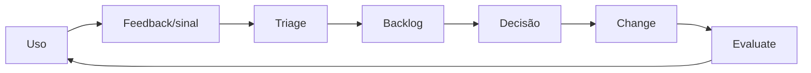

# 08 — Implementação e adoção

## Visão geral

Este capítulo responde a pergunta prática que todos os outros preparam: **como uma organização sai do zero e chega à governança operando no dia a dia?**

A resposta tem três camadas:

1. **A jornada em 8 gates (G0–G7):** pontos de decisão com critérios, evidência e authority — o esqueleto da implantação.
2. **Dois roadmaps de referência:** 90 dias (acelerado) e 24 semanas (programa completo) — formas de organizar o calendário sem virar SLA.
3. **Adoção e suporte:** como cada papel aprende, usa e retroalimenta o sistema — porque governança que ninguém consegue executar não existe.

O aviso que atravessa tudo: **gates são decisões registradas, não nomes de fase.** Nenhum gate é concluído porque o prazo terminou ou um documento foi produzido. E o risco mais caro de um programa: **comprar tecnologia para um problema que é, na verdade, ausência de processo, ownership, dados ou decision rights.**

## 1. A jornada em 8 gates

### 1.1 O contrato comum dos decision gates

Os gates são decisões registradas, não fases cronológicas. Workstreams podem avançar em paralelo, mas nenhum gate é concluído apenas porque o prazo terminou.

**Estados de decisão:**

| Estado | Significado | Requisito de registro |
|---|---|---|
| `approve` | critérios de saída atendidos para o escopo e versão avaliados | authority, data, versão e evidências aceitas |
| `condition` | avanço permitido com gap não crítico e compensação temporária | condição, owner, prazo, compensating control e expiry |
| `hold` | decisão suspensa por evidência insuficiente ou remediação necessária | finding, owner, ação, evidência esperada e nova data |
| `reject` | risco, desenho ou escopo não é aceitável no appetite vigente | rationale, authority, opções de redesign ou encerramento |

Todo decision record identifica: `gate_id`, escopo, versão, tier, authority, participantes, evidence refs, estado, rationale, condições, expiry e próxima revisão. **`Missing evidence` nunca equivale a aprovação.** A mesma pessoa não pode construir, aprovar e desafiar o próprio artefato quando segregação for exigida.

### 1.2 Os 8 gates em uma tabela

| Gate | Critérios de entrada | Evidência mínima | Authority da decisão | Critérios de saída | Falha e remediação |
|---|---|---|---|---|---|
| **G0 — Mandato** | sponsor candidato, problema e boundary inicial | draft de charter, scope, authorities e obligations map | sponsor executivo, com governance owner | mandato, scope, appetite, containment authority e regra de exceção aprovados | `hold` para esclarecer escopo/authority; não automatizar approvals |
| **G1 — Baseline** | G0 aprovado e acesso às fontes e stakeholders | inventários com coverage, current-state map, gaps, limitações e confidence | governance owner, com domain owners; sponsor aceita limitações materiais | baseline separa observado de hipótese e todo gap crítico tem owner | `hold`; unknowns de alto impacto restringidos ou isolados |
| **G2 — Fundações** | G1 aceito e população in-scope identificada | registry, blueprints, ownership, identity/data/tool records e testes de revogação | Design Authority e authorities de identity, data e tools | records mínimos validam, owners aceitam responsabilidade e acessos são revogáveis | bloquear onboarding, restringir connector/tool ou retornar |
| **G3 — Operating model** | G0 vigente, handoffs atuais conhecidos e G2 suficiente para atribuir responsabilidade | operating model, RACI, decision matrix, exception flow, SLAs e charters | sponsor/Governance Council, com aceite das domain authorities | cada decisão material possui accountable, receiver, prazo e escalation | `hold`; decisões não delegadas retornam à authority existente |
| **G4 — Controls e assurance** | tiering proposto, G2/G3 aceitos e obligations map disponível | risk rationale, baseline por tier, assessments, evaluation plan, evidence index e residual-risk record | Design Authority e domain authorities; residual risk pela authority designada | controles bloqueantes possuem design, owner, teste e evidence requirement | `hold` ou `reject`; remediar, reduzir capability/escopo ou elevar authority |
| **G5 — Onboarding/release** | G4 aprovado para o escopo e versão, suporte e operação preparados | blueprint versionado, checks, evidence package, conditions, run readiness e release record | release/Design Authority definida no operating model | release `approve`/`condition` registrado e catalog entry publicável | não liberar; corrigir, reclassificar, restringir ou rejeitar |
| **G6 — Operação** | G5 válido e sistema instrumentado antes de exposição material | telemetry map, thresholds, runbooks, on-call, drills, rollback/quarantine e incident evidence | Run Authority, com domain escalation | sinais possuem owner/action e containment, recovery e reactivation foram exercitados | conter, fazer rollback ou suspender; reativação exige cause e regression evidence |
| **G7 — Valor e lifecycle** | janela de operação definida, G6 aceito e baseline de outcome/custo disponível | owner attestation, use/quality/risk/value evidence, incidents, costs e sunset options | Business Owner; Governance Council para portfólio/material risk | decisão de manter, expandir, corrigir, restringir ou aposentar registrada | restringir/sunset ou abrir remediation; mudança normativa segue processo separado |

### 1.3 A numeração não é um cronograma

**G0–G7 são pontos de decisão com dependência declarada, não etapas em ordem cronológica.** A dependência real:

| Gate | Depende de |
|---|---|
| G0 | — |
| G1 | G0 |
| G2 | G1 |
| G3 | G0 vigente e **G2 suficiente para atribuir responsabilidade** — não G2 completo |
| G4 | G2 e G3 |
| G5 | G4, para aquele escopo e versão |
| G6 | G5 |
| G7 | G6 |

A consequência prática: **G2 e G3 se sobrepõem.** Basta ter registry e ownership o bastante para saber a quem atribuir uma decisão; o resto das fundações continua sendo construído enquanto o operating model é aprovado. Um cronograma que assume ordem numérica vai travar esperando um G2 completo que o G3 não exige.

### 1.4 O que cada gate exige (detalhe por gate)

**G0 — Mandato, escopo e sponsorship.** Outcome: existe autoridade para definir requisitos, exigir evidências e conter sistemas fora do envelope aprovado. Atividades: nomear sponsor e governance owner; definir sistemas, unidades, regiões e ambientes cobertos; declarar risk appetite e red flags; mapear obrigações e authorities; definir o que permanece fora de escopo e por quanto tempo; estabelecer princípios e regra de versionamento. Entregáveis: governance charter, scope map, stakeholder/authority map, initial risk appetite, decision log, communication plan. **Gate questions:** quem pode aprovar, condicionar, conter e aposentar? O escopo inclui SaaS, low-code, shadow AI e adquiridos? Exceções têm authority e expiry? **Sem mandato, não automatize approvals nem prometa cobertura.**

**G1 — Diagnóstico e baseline.** Outcome: a organização conhece sua situação atual, lacunas e limitações de evidência. Atividades: aplicar maturity assessment; reconciliar inventários e sources; entrevistar owners e domain authorities; mapear lifecycle real, approvals e handoffs; revisar incidentes, findings, exceções e métricas; identificar duplicidade, ownerless assets e high-risk unknowns. Entregáveis: maturity baseline, current-state map, preliminary inventory, gap/risk register, evidence quality statement, prioritized decisions. **Gate questions:** quais conclusões são observadas e quais são hipóteses? Quais lacunas críticas não possuem owner? Onde existe policy sem enforcement ou evidence?

**G2 — Fundações de dados, identidade e ownership.** Outcome: cada agente possui identidade, owner, finalidade, dados e capabilities rastreáveis. Atividades: aprovar schemas de registry e blueprint; escolher source of truth e reconciliation; registrar business/technical owner; definir workload identity e permission mapping; criar data contracts e connector gates; inventariar tools, APIs e MCP; definir material changes e lifecycle states. Entregáveis: registry operacional, agent blueprints, identity records, data contracts, tool/MCP registry, ownership e attestation rules. **Gate questions:** é possível responder o que existe e quem responde? Blueprint explica arquitetura e blast radius? Identidades, connectors e tools podem ser revogados?

**G3 — Operating model e decision rights.** Outcome: decisões têm authority, handoffs, SLA e evidência. Atividades: instituir Council, Design Authority e Run Authority; definir domain authorities; criar RACI e decision matrix; separar build, approval, run e challenge conforme tier; desenhar exception e waiver process; definir forums e cadences. Entregáveis: target operating model, RACI/decision rights, forum charter, handoff map, exception process, service levels. **Gate questions:** accountability está em funções reais, não em "o time"? Run Authority pode conter sem depender de council? Exceção sem expiry é bloqueada?

**G4 — Controls mínimos e assurance.** Outcome: risco é classificado e traduzido em controls, assessments, tests e residual-risk decisions. Atividades: aprovar tiers e red flags; mapear control catalog; definir triggers de assessments; criar evaluation strategy e evidence package; definir human oversight e transparency; testar negative paths, rollback e kill switch; estabelecer risk acceptance authority. Entregáveis: risk matrix, control baseline por tier, assessment suite, evaluation/release criteria, human oversight design, evidence package index. **Gate questions:** cada control tem owner e evidence? Ausência de evidência aparece como missing, não passed? Approval é proporcional com caminho de remediation?

**G5 — Onboarding por tier.** Outcome: existe um paved road para registrar, avaliar, liberar e suportar agentes em cada tier. Atividades: integrar registry, blueprint, controls e release flow; criar starter templates e approved components; configurar automated checks onde policy está estável; publicar guidance, examples e support; validar experiência de maker, reviewer, owner e operator; impedir bypass de paths críticos. Entregáveis: onboarding workflow, release checklist, approved component catalog, builder guidance, support/escalation model, audit trail do gate. **Gate questions:** o paved road é mais simples que contornar a governança? O workflow diferencia risco e capability? Condições e findings chegam ao owner correto?

**G6 — Operação, observabilidade e resposta.** Outcome: sinais geram decisões e ações de contenção, remediação e recuperação. Atividades: instrumentar agent, identity, data e tool chain; definir SLOs, thresholds e alerts; implementar quarantine, rollback e reactivation; executar drills; ligar support, SOC/SRE e domain escalation; preservar evidence e atualizar regression suite. Entregáveis: observability model, dashboards com owner/threshold/action, incident severity e runbooks, quarantine/rollback evidence, runtime control mapping, post-incident loop. **Gate questions:** o dashboard muda uma decisão? Containment funciona sem cooperação do agente? Reactivation exige cause e regression evidence?

**G7 — Valor, attestation e melhoria contínua.** Outcome: o portfólio é revisado por ownership, risco, qualidade, uso, outcome e custo. Atividades: separar criação, discovery, adoção, uso, qualidade e valor; revisar business case e baseline; executar attestation conforme tier; analisar concentração, duplicidade e inativos; decidir manter, expandir, corrigir, restringir ou aposentar; atualizar policy somente por processo versionado. Entregáveis: value review, attestation record, portfolio decisions, improvement backlog, sunset records, change proposal versionada. **Gate questions:** há outcome observável ou apenas uso? Custo inclui operação, suporte e assurance? Policy changes estão separadas de guidance?

### 1.5 Definition of done da implantação

A implantação está operacional quando: o inventário é reconciliável e possui owners; tier determina controls e authority; release evidence é recuperável; identities, data e tools são revogáveis; runtime signals acionam runbooks; quarantine, rollback e sunset foram exercitados; attestation e value review mudam o portfólio; exceptions vencem; policy e guidance são versionados separadamente.

### 1.6 O que o playbook não faz

Não substitui análise jurídica ou regulatória; não define threshold universal; não seleciona produto; não comprova maturidade por documentação; não certifica conformidade; não promete resultado financeiro.

## 2. Roadmap de 90 dias (referência acelerada)

> **Referência acelerada, não SLA.** Os 90 dias ajudam equipes que precisam de uma sequência inicial. Adapte duração e sobreposição às dependências, ao estate e à capacidade. O calendário nunca substitui G0–G7 nem cria obrigação de piloto.

Objetivo: estabelecer as fundações e fluxos mínimos de um sistema de governança operável. **O resultado não é "governança concluída" — é uma capacidade inicial verificável que pode ser ampliada sem perder accountability.**

| Período | Gates preparados ou decididos | Decisão esperada |
|---|---|---|
| dias 0–10 | G0 | aprovar, condicionar, suspender ou rejeitar mandato e scope |
| dias 11–25 | G1 | aceitar baseline e limitações ou exigir evidência/remediação |
| dias 26–40 | G2 | aceitar fundações mínimas ou bloquear onboarding |
| dias 41–55 | G3 e preparação de G4 | aprovar decision rights e autorizar desenho da baseline de controls |
| dias 56–70 | G4 e preparação de G5 | aceitar baseline/assurance e decidir readiness para release |
| dias 71–85 | G5 e G6 | decidir release condicionado ao tier e aceitar operação/containment |
| dias 86–90 | G7 | decidir continuidade, restrição, expansão, remediação ou sunset |

**Dias 0–10 (G0):** nomear sponsor, governance owner e authorities; aprovar escopo e ambientes; definir risk appetite, red flags e containment authority; mapear policies, processos e inventários; selecionar portfólio inicial. Entregáveis: charter, scope map, authority matrix, risk appetite v0.1, decision/risk log. **Exit:** sponsor e owners nominativos; escopo explícito; containment authority definida; nenhuma lacuna crítica sem owner.

**Dias 11–25 (G1):** aplicar maturity assessment; reconciliar inventários; mapear lifecycle e handoffs; identificar ownerless, duplicados, inativos e high-risk unknowns; avaliar qualidade da evidência; priorizar gaps. Entregáveis: maturity baseline, current-state map, preliminary registry, gap/risk register, prioritized backlog. **Exit:** situação atual separa observado de hipótese; inventário com coverage declarado; gaps críticos com owner e prazo.

**Dias 26–40 (G2):** aprovar schemas mínimos; definir source of truth e reconciliation; registrar owners e lifecycle; preencher blueprints do portfólio inicial; mapear workload identities e permissions; criar data contracts e connector gates; inventariar tools, APIs e MCP. Entregáveis: registry e blueprints versionados, identity/permission matrix, data contracts, tool/MCP registry, material-change triggers. **Exit:** todos os itens do escopo inicial têm owner e status; identities, data e tools rastreáveis; gaps aparecem como missing evidence.

**Dias 41–55 (G3/G4):** formalizar Council, Design e Run Authority; definir RACI e decision rights por tier; aprovar tiers e red flags; mapear control catalog e evidence; definir exception/waiver e expiry; estabelecer forums, handoffs e SLAs. Entregáveis: target operating model, RACI, risk/control baseline, exception process, forum charter. **Exit:** cada decisão material possui accountable; segregação proporcional; exceções não permanentes por padrão.

**Dias 56–70 (G4/G5):** definir triggers de assessments; criar evaluation strategy e thresholds; documentar oversight e transparency; montar release evidence package; testar negative paths, rollback, quarantine e kill switch; registrar residual risk e conditions. Entregáveis: assessment suite, evaluation/release criteria, evidence package, run readiness checklist, drill records. **Exit:** controls aplicáveis com evidence; release authority consegue aprovar, condicionar ou negar; containment e rollback exercitados.

**Dias 71–85 (G5/G6):** colocar onboarding em uso; configurar telemetry, dashboards e alerts; publicar catalog entries, guidance e support; ligar incident, support e domain escalation; medir fricção, gaps e bypass; corrigir controls pelo processo versionado. Entregáveis: onboarding operacional, observability e runbooks, catalog/discovery, support model, remediation backlog. **Exit:** cada signal com owner e action; state-changing actions com correlation; support e escalation ponta a ponta.

**Dias 86–90 (G7):** executar primeira owner attestation; revisar criação, discovery, uso, qualidade e value separadamente; registrar decisões; atualizar maturity baseline; aprovar roadmap de expansão. Entregáveis: attestation records, portfolio/value review, maturity delta, roadmap 6–12 meses, executive decision memo. **Exit:** decisões ligadas a evidência; próximos increments com owner e acceptance criteria; nenhuma mudança normativa autoaprovada.

**Riscos de execução:** burocracia uniforme → tiering e paved road; catálogo decorativo → reconciliation e actions; falso senso de coverage → declarar sources e confidence; centralização em silo → authorities distribuídas; automação prematura → manual first para regras instáveis; métricas de vaidade → separar criação, uso, qualidade e outcome; vendor lock-in → capabilities e schemas neutros; rollout sem containment → quarantine/rollback como exit criteria.

## 3. Programa de 24 semanas (pattern de referência)

> **Pattern de referência, não calendário normativo.** As 24 semanas oferecem um ponto de partida para equipes que ainda não sabem como organizar a implantação. Os únicos decision gates canônicos são G0–G7.

**Fases e gates:**

| Fase | Semanas | Objetivo | Entregáveis | Gate |
|---|---|---|---|---|
| **F0 — Mobilizar** | 1–2 | mandato e escopo | charter, scope, decision principles, fóruns, time | G0 |
| **F1 — Descobrir** | 3–5 | baseline real | discovery, forecast, gargalos, capability map, maturity | G1 |
| **F2 — Desenhar** | 6–8 | target operating model | target de maturidade, tiers, triggers, operating model | G3 e preparação de G4 |
| **F3 — Construir** | 9–12 | controles de fundação | registry, identidade, catálogos, telemetria, MPB | G2 e G4 |
| **F4 — Validar** | 13–16 | validar ponta a ponta | piloto opcional ou cohort; fluxo completo, tabletop, KPIs | G5 e G6 |
| **F5 — Escalar** | 17–20 | automação e cobertura | discovery automatizado, policy-as-code, JML, FinOps | G6 |
| **F6 — Institucionalizar** | 21–24 | operação regular e assurance | evidência, enablement, handoff BAU, roadmap 12m | G7 |

**Repare: F2 fecha G3 e F3 fecha G2** — a ordem numérica dos gates não é a ordem de execução. Os dois roadmaps (90 dias ≈ F0–F3 comprimidas; 24 semanas = versão detalhada) são guias adaptáveis do mesmo conjunto de gates, não métodos concorrentes nem prazos de compliance.

**Workstreams:** trilhas paralelas dentro do mesmo roadmap — governança e risco; arquitetura e plataforma; identidade e segurança; dados e ferramentas; observabilidade e custo; adoção e valor. **Workstreams não podem otimizar localmente:** identidade pode declarar "entregue" enquanto o registry ainda não associa identidade a `agent_id`. **Milestones se definem por outcome cross-domain, não por entrega de trilha.**

**Prioridade do backlog:** `P0` (obrigatório para a primeira release — charter, registry mínimo, tiers, blueprint, MPB, identidade T2/T3, catálogos, logging, gate, kill switch, evidência); `P1` (necessário para escalar — discovery automatizado, JML, attestation, SOC, behavioral analytics, FinOps, champions); `P2` (otimização avançada). **Um item de backlog de qualidade tem:** outcome, por quê, dependências, trabalho, evidência e critério de saída.

**Cadência:** semanal (workstream: entregas, dependências, bloqueios); quinzenal (revisão integrada de arquitetura e governança: outcomes cross-domain); mensal (sponsor e council: risco, prioridade, funding, exceções); trimestral (maturidade: alvo e roadmap).

**Ciclo de melhoria contínua (trimestral):** revisar KPIs/KRIs; analisar incidentes e quase-incidentes; revisar exceções — **uma exceção que se repete não é exceção: é requisito que a policy não reconheceu ou controle que a operação não cumpre**; avaliar falsos positivos/negativos; revisar gargalos; atualizar standards com changelog; priorizar roadmap.

**Como usar sem virar teatro de programa:** fases podem se sobrepor, gates não; prazo cumprido com evidência ausente é `hold`, não `approve`; escopo reduzido é decisão legítima registrada; as semanas dimensionam esforço, não prometem maturidade.

## 4. Capability map: atual versus alvo

### 4.1 O que é uma capability

Uma capacidade organizacional de produzir um resultado **de forma repetível**. Não é uma ferramenta, um time nem um projeto. **O teste: se você trocar o produto e a capacidade desaparecer, você comprou uma ferramenta e chamou de capability.**

### 4.2 As capacidades do framework

Ponto de partida: os domínios canônicos. Quebre uma capability em duas apenas quando a filha tiver owner, processo **ou** evidência diferentes.

| Capacidade | Pergunta de diagnóstico | Sinal típico de estado inicial | Alvo comum |
|---|---|---|---|
| estratégia e governança | existe mandato, portfólio, funding e decisão clara? | política genérica, sem charter | charter, fóruns, decision rights, risk appetite |
| estate inventory e registry | sabemos quais agentes existem, onde operam e quem responde? | planilhas por plataforma | discovery contínuo + registry reconciliável |
| risco e Responsible AI | risco, admissibilidade e impacto roteiam controles? | mesma review para todos | tiers, admissibilidade, escaladores, impact assessment |
| lifecycle e Agent SDLC | versões, estados e mudanças estão governados? | publicação ad hoc | stage/state, gates, attestation e retirada |
| identidade e acesso | cada ação é atribuível e autorizada? | chaves compartilhadas | identidade própria, least privilege, JML |
| dados e conhecimento | fontes são classificadas, permitidas e AI-ready? | recuperação sobre qualquer pasta | catálogo de fontes certificadas |
| tools, APIs e MCP | ações são catalogadas, limitadas e mediadas? | ferramentas embutidas por time | tool registry, gateway, autorização por ação |
| modelos e provedores | combinações e versões têm critérios de admissão? | escolha por preferência | catálogo, evaluation binding, fallback, exit |
| runtime e plataforma | existem enforcement, isolamento, resiliência e rollback? | acesso direto a endpoints | control plane, budgets, containment |
| segurança e AgentSecOps | ameaças agentic entram em prevention/detection/response? | SOC vê só logs tradicionais | threat model agentic, red teaming |
| observabilidade | é possível reconstruir, detectar desvio e agir? | logs sem correlation | event envelope, baselines, runbooks |
| FinOps | custo é atribuível a agente, tarefa e outcome? | custo por chave agregado | budgets, unit economics, anomaly response |
| value realization | outcomes influenciam funding e sunset? | contagem de agentes | baseline, KPI, portfolio decisions |
| assurance e auditabilidade | controls podem ser testados por challenge? | evidence manual para auditoria | continuous evidence, sampling, findings |
| adoção e competências | cada papel usa a rota governada corretamente? | treinamento pontual | currículo por papel, champions, support |

### 4.3 Procedimento

1. Listar as capacidades necessárias ao operating model.
2. Escrever uma frase de outcome para cada uma (ex.: *"toda ação material de agente é atribuível a uma identidade conhecida e autorizada"*).
3. Definir evidências observáveis do estado atual — prefira *"74% dos T2/T3 usam identidade dedicada"* a "o controle de acesso é forte".
4. Atribuir maturidade com base em evidência e registrar confidence. **Evidência fraca produz nota provisória, não nota otimista.**
5. Definir o alvo por horizonte e necessidade — nível 3 costuma bastar no primeiro ano.
6. Identificar dependências (behavioral analytics depende de registry + identidade + telemetria + runtime).
7. Converter gaps materiais em iniciativas.

**Perguntas de challenge antes de aprovar o alvo:** o alvo é necessário para o risco e o volume previstos, ou é ambição tecnológica? Existe dependência invisível? Pode ser demonstrado por evidência? **Existe owner capaz de sustentar a capacidade depois que o programa terminar?** — a última derruba mais iniciativas que as outras três somadas.

**Failure modes:** mapear produtos e chamar de capacidades; quebrar capacidades até virarem tarefas; alvo máximo em tudo; estado atual descrito por adjetivo; ignorar que capacidade em nível baixo inutiliza outra em nível alto; aprovar alvo sem owner pós-programa.

## 5. Adoção, enablement e suporte

### 5.1 Adoção não é comunicação de lançamento

É a capacidade organizacional de usar o sistema de forma correta, obter suporte, reportar falhas e incorporar feedback ao governance lifecycle.

**Personas:** sponsor (value, risco, decisões); business owner (outcome, usuários, limites, attestation); maker/engineer (paved road, controls, feedback rápido); end user (intended use, limitações, suporte, contestação); administrator (policy, inventory, acesso); support (triage, known issues, escalation); domain authority (evidências, decision rights); auditor (acesso independente a records).

### 5.2 Discovery e catalog

Um catálogo útil permite: encontrar capacidades por tarefa e persona; distinguir status, owner, versão e tier; entender intended/prohibited use; acessar support e feedback; evitar duplicação; ocultar itens em quarantine/sunset; medir discovery separado de criação. **Publicar sem discovery gera agentes invisíveis; discovery sem lifecycle promove itens inadequados.**

### 5.3 Paved road para builders

Starter templates com identity, logging e policy hooks; schemas e self-assessment proporcionais; approved models, data connectors e tools; automated checks com feedback acionável; sandbox e test datasets; design clinic e office hours; exception process com owner e expiry; documentação de examples e failure modes. **O paved road deve ser mais simples que contornar a governança — fricção desnecessária é o principal produtor de shadow AI.**

O golden path do builder: registrar use case, owner e prohibited use → criar registry record e blueprint → classificar risk tier e red flags → selecionar approved model/data/tool contracts → aplicar controls e evaluation strategy → produzir release evidence → obter decisão no gate → publicar com observability, containment e rollback → operar, regress, attest e sunset.

### 5.4 Suporte em camadas

1. **Self-service:** documentação, status, FAQ, runbooks.
2. **AI-assisted:** busca e triage com handoff rastreável.
3. **Platform/IT backstop:** incidentes, acesso e operação.
4. **Domain SME:** security, privacy, RAI, legal, data ou negócio.
5. **Authority escalation:** containment, risk acceptance e policy decision.

### 5.5 Change e comunicação

Mudanças materiais comunicam: o que mudou e por quê; quem é afetado; novos limites ou ações; data de vigência; treinamento ou suporte necessário; rollback/contingency; canal de feedback e owner.

### 5.6 Feedback loop

**Feedback é evidência contextual, não prova isolada de valor ou segurança.**

### 5.7 Playbook de implantação da adoção

1. **Segmentar personas** — cada uma com objetivo de aprendizagem distinto.
2. **Separar awareness de competência** — awareness ensina a reconhecer a regra; competência exige executar a atividade e demonstrar resultado. **Não habilite um reviewer de impact assessment porque ele concluiu um treinamento introdutório.**
3. **Montar currículo por papel e risco** — builders: registry, risco, dados, ferramentas, identidade, telemetria; owners: accountability, valor, attestation; reviewers: critérios e evidência; segurança: contenção e forensics.
4. **Implantar rede de champions** — áreas por volume e risco, tempo alocado e **limite de autoridade**: o champion orienta e escala; não substitui funções de controle.
5. **Tornar o caminho governado o mais fácil** — builders aprovados, templates, catálogos, office hours, policy gates self-service.
6. **Calibrar reviewers com casos comuns** — os mesmos 10–20 casos por reviewers diferentes; divergência vira discussão de critério.
7. **Criar suporte e comunidade de prática** — office hours, FAQ, canais de escalation; perguntas recorrentes viram melhoria de documentação.
8. **Medir eficácia, não conclusão** — taxa de conclusão de treinamento é métrica fraca isolada; medir verificação de conhecimento, retrabalho, violações, tickets, tempo até assessment, qualidade da evidência.

### 5.8 Prontidão de suporte e handoff

Antes do handoff: owners permanentes, níveis de suporte, runbooks, acesso, monitoramento, capacidade e backlog prontos. Reter: aceite de serviço, assinatura do owner, modelo de suporte, SLO, teste de runbook, dívida conhecida, treinamento e escalonamento. **Times do business as usual resolvem um problema representativo e aceitam o trabalho residual sem dependência do projeto de implementação.** O último item é o mais ignorado e o que mais derruba programas: sem owner de BAU aceito, o piloto vira ilha mantida pelo time do programa.

## 6. Tratamento de agentes existentes e shadow

Triar ativos existentes em caminhos de **registrar, restringir, remediar, migrar, suspender ou aposentar** usando um plano datado: confiança da descoberta, owner, exposição atual, controle provisório, estado-alvo, prazo e authority. **Status legado não é isenção permanente; ativos de alto risco vencidos são contidos.**

## 7. Plano opcional de piloto

> **Uso opcional.** Cohort de onboarding, phased rollout ou evidência de agentes existentes podem cumprir o mesmo objetivo. G0–G7, MPB e evidence requirements continuam iguais em qualquer rota.

Quando escolhido, o piloto existe para **testar a governança, não para provar que um modelo funciona**. Se todos os casos forem de leitura, a organização não valida identidade própria, mediação, oversight, rollback, quarentena, evidence pack ou resposta a incidente — e conclui, erradamente, que está pronta.

**Coorte:** selecione 3–4 casos que **forcem rotas diferentes**: T1 fast path (assistente pessoal), T1 revisado (Q&A de procedimentos), T2 (agente que abre chamados), T3 (agente que propõe mudança e executa após aprovação). **Não comece por T4** — primeiro demonstre fundações e containment; T4 não é sinônimo de `restricted`.

**Desenho:** selecionar coorte cobrindo leitura, transação e alto impacto; **congelar baseline** de processo, custo e qualidade antes do go-live; executar o fluxo completo; medir lead time e retrabalho **da governança**; executar um tabletop e um teste real de kill switch e quarentena; rodar behavioral analytics em monitor-only; coletar feedback separado de builder, reviewer, owner e operador; ajustar standards e thresholds **antes** de escalar.

**O que medir:** fricção (lead time por etapa e tier; retrabalho de review); cobertura (completude do registry e evidence pack); contenção (tempo até quarentena; sucesso do rollback); detecção (falsos positivos); economia (custo por resultado contra baseline); resultado (KPI contra baseline congelada); experiência (percepção dos quatro papéis).

**Critérios de expansão:** nenhum finding crítico aberto; lead time de T1 baixo o suficiente para que **contornar a governança não compense**; T2/T3 com identidade, evidência e telemetria completas; kill switch/quarentena/rollback funcionaram **no teste**; falsos positivos compreendidos; custo e resultado mensuráveis; **owners de operação regular aceitaram a responsabilidade, nominalmente.**

**Failure modes:** piloto só com leitura; medir apenas a performance do agente; go-live sem baseline congelada; kill switch testado em documento; ajustar standards depois de escalar; piloto sem owner de BAU; tratar ausência de incidente como prova de segurança.

## 8. Referência normativa

Condições mínimas que devem ser verdadeiras. Use como checklist; as seções 1–7 explicam o porquê.

| # | Obrigação | Evidência mínima | Concluído quando |
|---|---|---|---|
| R1 | Entregar a implementação como workstream com owner, dependências e critérios de saída | plano com baseline, alvo, owner, recursos, sequência, aceite, riscos, dependências, handoff | capacidade funciona em caminho representativo; ownership permanente aceita runbook e backlog |
| R2 | Estabelecer baseline datado antes de desenhar o estado-alvo | escopo, método, população, amostra, evidência, confiança, lacunas, dependências, validação | baseline distingue ausente/definida/operante e é repetível |
| R3 | Descobrir ativos por múltiplas fontes reconciliadas | fonte, última visualização, confiança, owner, identidade não resolvida, remediação | shadow/sem owner entram em contenção, não são aceitos silenciosamente |
| R4 | Desenhar capacidades-alvo a partir do baseline e contexto de risco | capacidades-alvo, authority, interfaces, artefatos, sequenciamento, aceite, premissas | toda capability fecha lacuna documentada com owner e critério mensurável |
| R5 | Selecionar e documentar modelo operacional centralizado/federado/híbrido | princípios, mapa de papéis, fronteiras, decision rights, handoffs, SLAs, exceção | caso representativo percorre do intake à operação sem decisão órfã |
| R6 | Sequenciar workstreams por dependência bloqueante e redução de risco | workstream, owner, pré-requisito, marco, entregável, aceite, risco, caminho crítico | nenhuma onda promete capacidade com fundação ausente |
| R7 | Assegurar sponsor accountable, capacidade financiada e papéis nomeados | orçamento, capacidade, competências, authority, horizonte, dependências, riscos | controles e deveres têm recursos antes da coorte ser aprovada |
| R8 | Estabelecer a fundação nomeada antes da primeira coorte | artefatos mínimos, owners, estados de controle, lacunas, teste, authority de exceção, backlog | primeira coorte completa G0–G7 com decisões rastreáveis |
| R9 | Selecionar coorte que exercite caminhos materiais sem exposição não controlada | rationale, riscos excluídos, critérios, salvaguardas, tamanho, rollback, perguntas | coorte valida o caminho completo; não substitui demo por evidência |
| R10 | Exercitar intake, risco, design, build, avaliação, release, operação e aposentadoria | timestamps, handoffs, decisões, artefatos, evidência, exceções, defeitos, remediação | todos os gates trabalham no mesmo caso; defeitos de integração bloqueiam rollout |
| R11 | Liberar por coortes com critérios de promoção, pausa e rollback | coorte, exposição, telemetria, thresholds, aprovação, resultado, incidentes, decisão | expansão só após critérios; sinal adverso interrompe ou reverte |
| R12 | Triar ativos existentes em registrar/restringir/remediar/migrar/suspender/aposentar | confiança, owner, exposição, controle provisório, estado-alvo, prazo, authority | legado não é isenção; alto risco vencido é contido |
| R13 | Fornecer defaults conformes reutilizáveis e automação preservando escalonamento | padrões, controles embutidos, contrato, versão, telemetria, suporte, escape | time completa caminho padrão com menos esforço; self-service não contorna revisão |
| R14 | Definir competências e treinamento por papel vinculado a decisões | papel, objetivo, avaliação, conclusão, expiração, remediação, owner | pessoal demonstra tarefa; competência vencida visível antes do exercício |
| R15 | Prover comunicação, suporte e feedback adequados ao papel | público, mensagem, canal, momento, owner, compreensão, feedback, ação | usuários conhecem fronteira, rota de reporte e consequência; feedback chega a owner |
| R16 | Comprovar prontidão de suporte e operação antes do handoff | aceite de serviço, assinatura, suporte, SLO, runbook testado, dívida, treinamento | BAU resolve problema representativo sem dependência do projeto |

## 9. Evidências, métricas e failure modes

**Evidências:** persona e stakeholder map; adoption/support plan; catalog entry e discovery analytics; learning assets; support model e escalation; training/competence records; feedback backlog e decisões; change communication; user research; decision records de cada gate (G0–G7); capability map com evidências observáveis; baseline com data de corte; relatório de piloto com decisão registrada.

**Métricas:** discovery-to-use conversion; active/recurring users por persona; duplicate creation; support demand e resolution time; training completion **e task competence**; misuse reports; feedback-to-decision time; lead time por gate e tier; rework por requirement tardio; coverage do paved road; exception rate e expiry; evidence freshness; containment/recovery readiness; cycle time por gate; devoluções por evidência incompleta; time to decide/contain/remediate; bypass attempts; coverage do registry; owners e attestations válidos; evidence packages completos por tier; exceptions e findings vencidos; drill pass rate.

**Failure modes:** medir sucesso por agentes criados; publicar sem owner ou suporte; treinamento único para todos; champion sem authority ou tempo; feedback positivo como prova de ROI; esconder limitation para aumentar adoção; ignorar resistência como "falta de cultura"; manter itens em discovery durante quarantine; comprar tecnologia para problema de processo; mapear produtos e chamar de capacidades; aprovar alvo sem owner pós-programa; piloto só com leitura; go-live sem baseline congelada; kill switch testado em documento; ajustar standards depois de escalar; tratar ausência de incidente como prova de segurança; prazo cumprido com evidência ausente tratado como approve.

## Decision gates

- **Capability map:** uma capability não é declarada implantada sem sistema atribuído, source of truth e evidência. Cobertura prometida por roadmap não é cobertura.
- **Piloto (quando houver):** a expansão exige relatório com decisão registrada e critérios atendidos. **Sem piloto, a organização apresenta evidência equivalente da primeira cohort — o gate avalia a qualidade da evidência, não o nome da rota.**
- **Release amplo:** exige catalog entry, intended use, limitations, support owner, escalation, communication e feedback channel.

## Acceptance criteria

- todas as decisões deste capítulo possuem authority, owner e evidência recuperável;
- requisitos aplicáveis estão ligados ao catálogo de controles e ao método de verificação;
- exceções têm escopo, justificativa, compensating controls, expiry e decisão residual;
- controles de build time e runtime são distinguidos e exercitados quando aplicáveis;
- mudanças materiais reabrem avaliação, aprovação e evidência;
- nenhuma alegação de conformidade, eficácia ou valor excede a evidência observada.
