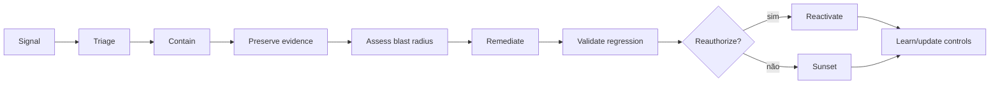

# 09 — Operações, incidentes e continuidade

Este capítulo integra a estrutura clean-room aprovada com o conteúdo substantivo do corpus autoritativo. Requisitos do framework são vendor-neutral; legislação externa, guidance, casos e histórico são identificados como tais. A implementação organizacional exige adoção formal pela authority competente e não decorre do versionamento deste repositório.

## Contrato operacional do capítulo

As subseções seguintes formam um contrato executável de completude. Cada uma especifica a decisão ou ação requerida, o record/evidence mínimo e uma condição observável de conclusão para levar a governança do zero ao business as usual.

### 09.1 Modelo operacional e ownership de serviço

**Decisão/ação obrigatória.** Para **modelo operacional e ownership de serviço**, a organização deve selecionar e documentar a alocação centralizada, federada ou híbrida das atribuições de policy, plataforma, domínio e assurance.

**Registro e evidência.** Reter princípios de design, mapa de papéis, fronteiras de serviço, decision rights, handoffs, níveis de serviço e rota de exceção.

**Concluído quando.** Um caso representativo percorre do intake à operação sem decisão órfã nem fonte de verdade duplicada.

### 09.2 Inventário de produção e visibilidade de configuração

**Decisão/ação obrigatória.** Para **inventário de produção e visibilidade de configuração**, a organização deve operar o registry como o índice autoritativo de identidade e lifecycle de todo agente em escopo.

**Registro e evidência.** Validar ID estável, owner, finalidade, tier, admissibilidade, versão, ambiente, estado, dependências e data do último attestation.

**Concluído quando.** Reconciliação automatizada e manual detecta registros ausentes, obsoletos, duplicados e inválidos e bloqueia transições exigidas.

### 09.3 Telemetria e correlação de ponta a ponta

**Decisão/ação obrigatória.** Para **telemetria e correlação de ponta a ponta**, a organização deve emitir eventos atribuíveis que correlacionem usuário, agente, versão, tarefa, modelo, ferramenta, decisão de policy e resultado.

**Registro e evidência.** Definir schema de evento, IDs, timestamps, controle de integridade, retenção, acesso, premissas de relógio e testes de cobertura.

**Concluído quando.** Uma cadeia de ações representativa pode ser reconstruída sem expor prompt, segredo ou dados pessoais proibidos.

### 09.4 Níveis de serviço e thresholds operacionais

**Decisão/ação obrigatória.** Para **níveis de serviço e thresholds operacionais**, a organização deve definir objetivos de serviço, qualidade, segurança e resposta com medição e ação em caso de violação.

**Registro e evidência.** Registrar indicador, objetivo, população, janela, exclusões, fonte, threshold de alerta, owner e error budget ou tolerância.

**Concluído quando.** Violações são detectáveis e levam a uma decisão operacional ou de portfólio registrada, em vez de reporte apenas em dashboard.

### 09.5 Monitoramento comportamental

**Decisão/ação obrigatória.** Para **monitoramento comportamental**, a organização deve estabelecer baselines e sinais para mudança de comportamento, qualidade, segurança, custo e dependências.

**Registro e evidência.** Registrar definição do sinal, população, janela de baseline, threshold, confiança, owner, escada de resposta e histórico de calibração.

**Concluído quando.** Alertas são calibrados contra comportamento real e levam a investigação, throttling, quarentena ou reavaliação.

### 09.6 Monitoramento de qualidade, segurança, fairness e proteção

**Decisão/ação obrigatória.** Para **monitoramento de qualidade, segurança, fairness e proteção**, a organização deve operar esta capacidade de produção com ownership de serviço e authority de resposta definidos.

**Registro e evidência.** O registro operacional deve identificar telemetria, thresholds, ownership de plantão (on-call), severidade, caminho de contenção, comunicações, retenção de evidências e critérios de recuperação.

**Concluído quando.** Sinais disparam a resposta acordada, contenção e recuperação são exercitadas, e incidentes alimentam ação corretiva e reavaliação.

### 09.7 Drift e comportamento emergente

**Decisão/ação obrigatória.** Para **drift e comportamento emergente**, a organização deve estabelecer baselines e sinais para mudança de comportamento, qualidade, segurança, custo e dependências.

**Registro e evidência.** Registrar definição do sinal, população, janela de baseline, threshold, confiança, owner, escada de resposta e histórico de calibração.

**Concluído quando.** Alertas são calibrados contra comportamento real e levam a investigação, throttling, quarentena ou reavaliação.

### 09.8 Monitoramento de custo e recursos

**Decisão/ação obrigatória.** Para **monitoramento de custo e recursos**, a organização deve atribuir consumo e custo operacional total a agente, owner, ambiente e resultado mensurável.

**Registro e evidência.** Registrar custo unitário, orçamento, quota, previsão, variância, alocação de custo compartilhado, anomalia e decisão de otimização.

**Concluído quando.** Violação de threshold dispara throttling ou revisão e alegações de custo permanecem separadas de alegações de realização de valor.

### 09.9 Reporte de problemas e incidentes

**Decisão/ação obrigatória.** Para **reporte de problemas e incidentes**, a organização deve fornecer a usuários autorizados, operadores e partes afetadas uma rota descobrível para reportar problemas e incidentes.

**Registro e evidência.** Registrar canal do reportador, recebimento, triagem, severidade, owner, ativo vinculado, evidência, comunicação e fechamento.

**Concluído quando.** Um reporte alcança triagem accountable dentro do alvo e retaliação, perda ou fechamento silencioso é prevenido.

### 09.10 Classificação de severidade

**Decisão/ação obrigatória.** Para **classificação de severidade**, a organização deve classificar o caso usando critérios aprovados, escaladores obrigatórios e o resultado aplicável mais severo.

**Registro e evidência.** Registrar resultados por critério, red flags, rationale, confiança, revisor e rota resultante ou alvo de resposta.

**Concluído quando.** A mesma evidência produz encaminhamento consistente e sub-classificação é detectada por revisão ou reconciliação.

### 09.11 Papéis, escalonamento e comunicações

**Decisão/ação obrigatória.** Para **papéis, escalonamento e comunicações**, a organização deve mapear cada evento material de lifecycle e severidade de incidente para uma decisão accountable e um caminho de escalonamento.

**Registro e evidência.** Registrar evento, threshold, autoridade primária e alternativa, consulta, tempo de resposta e fallback para decisão não resolvida.

**Concluído quando.** Um exercício (drill) alcança uma decisão autorizada dentro do alvo e autoridade ambígua falha para o estado mais seguro.

### 09.12 Integração com SOC, SRE, privacidade e continuidade de negócio

**Decisão/ação obrigatória.** Para **integração com SOC, SRE, privacidade e continuidade de negócio**, a organização deve integrar a resposta específica de agentes com processos estabelecidos de segurança, confiabilidade, privacidade, legal e continuidade.

**Registro e evidência.** Registrar mapeamento de gatilhos, identificadores compartilhados, handoff, authority, comunicação, custódia de evidência e regra de prioridade conflitante.

**Concluído quando.** Um exercício conjunto preserva uma única linha do tempo de incidente e cada função especialista executa sua authority sem handoff órfão.

### 09.13 Contenção, quarentena e kill switch

**Decisão/ação obrigatória.** Para **contenção, quarentena e kill switch**, a organização deve implementar caminhos de authority e técnicos para interromper ações, isolar dependências e preservar evidências.

**Registro e evidência.** Registrar gatilho, caminho de comando, escopo, estado esperado, operador, cadência de teste, resultado e pré-requisitos de recuperação.

**Concluído quando.** Um exercício (drill) contém uma falha representativa dentro do alvo sem depender do próprio agente com falha.

### 09.14 Rollback e recuperação

**Decisão/ação obrigatória.** Para **rollback e recuperação**, a organização deve definir o estado mais seguro, o alvo de rollback e a sequência de recuperação para falhas de controle, dependência e modelo.

**Registro e evidência.** Reter modos de falha, gatilho, artefato de rollback, reconciliação de dados, authority do operador, RTO/RPO e resultado do exercício.

**Concluído quando.** Uma falha representativa restaura um serviço delimitado em estado bom conhecido sem perder evidência exigida nem duplicar ações.

### 09.15 Investigação e preservação de evidências

**Decisão/ação obrigatória.** Para **investigação e preservação de evidências**, a organização deve preservar uma linha do tempo de incidente defensável e artefatos antes de a remediação destruir evidência material.

**Registro e evidência.** Registrar authority de coleta, fontes, hashes, timestamps, custódia, acesso, hipóteses, descobertas e limitações.

**Concluído quando.** Um revisor autorizado consegue reconstruir ações materiais e o tratamento de evidências atende restrições de retenção e privacidade.

### 09.16 Ação corretiva e preventiva

**Decisão/ação obrigatória.** Para **ação corretiva e preventiva**, a organização deve atribuir a cada descoberta uma causa raiz, prioridade baseada em risco, ação corretiva e critério de fechamento.

**Registro e evidência.** Registrar descoberta, evidência, owner, data de vencimento, controle provisório, causa raiz, remediação, reteste e disposição do revisor.

**Concluído quando.** O fechamento exige evidência objetiva de reteste; descobertas materiais vencidas permanecem visíveis e afetam a aprovação.

### 09.17 Decisão de reativação segura

**Decisão/ação obrigatória.** Para **decisão de reativação segura**, a organização deve permitir reativação somente após causa raiz, remediação, regressão, monitoramento e prontidão de rollback serem evidenciados.

**Registro e evidência.** Registrar vínculo do incidente, versão alterada, pacote de reteste, risco residual, authority aprovadora, condições e escopo do rollout.

**Concluído quando.** A falha anterior não é mais reproduzível nas condições testadas e sinais de alerta precoce estão ativos.

### 09.18 Comunicação com usuários, clientes, reguladores e terceiros

**Decisão/ação obrigatória.** Para **comunicação com usuários, clientes, reguladores e terceiros**, a organização deve determinar a comunicação interna e externa exigida a partir de impacto, contrato, lei e necessidade dos stakeholders.

**Registro e evidência.** Reter público, authority, fatos, incerteza, momento, canal, aprovações, correções e rationale da divulgação.

**Concluído quando.** Comunicações são oportunas, consistentes e baseadas em evidência e não ocultam impacto material nem exageram certeza.

### 09.19 Incidentes de fornecedores e dependências

**Decisão/ação obrigatória.** Para **incidentes de fornecedores e dependências**, a organização deve governar fornecedores e dependências a jusante por due diligence, contrato, monitoramento e planejamento de saída.

**Registro e evidência.** Registrar serviço, owner, criticidade, evidência, obrigações, concentração, incidentes, subprocessadores, fallback e teste de saída.

**Concluído quando.** Falha do fornecedor dispara a contenção ou fallback acordado e a accountability permanece com a organização.

### 09.20 Continuidade operacional e modos degradados

**Decisão/ação obrigatória.** Para **continuidade operacional e modos degradados**, a organização deve definir modos degradados aprovados, fallbacks de dependência, prioridades de continuidade e saída de fornecedores críticos.

**Registro e evidência.** Registrar caminhos críticos, tolerâncias, RTO/RPO, capacidade de fallback, procedimento manual, reconciliação de dados e exercício.

**Concluído quando.** O serviço atinge o alvo de recuperação aprovado sem contornar silenciosamente controles de risco, dados ou autorização.

### 09.21 Recuperação de desastres

**Decisão/ação obrigatória.** Para **recuperação de desastres**, a organização deve definir modos degradados aprovados, fallbacks de dependência, prioridades de continuidade e saída de fornecedores críticos.

**Registro e evidência.** Registrar caminhos críticos, tolerâncias, RTO/RPO, capacidade de fallback, procedimento manual, reconciliação de dados e exercício.

**Concluído quando.** O serviço atinge o alvo de recuperação aprovado sem contornar silenciosamente controles de risco, dados ou autorização.

### 09.22 Revisão pós-incidente e divulgação

**Decisão/ação obrigatória.** Para **revisão pós-incidente e divulgação**, a organização deve determinar a comunicação interna e externa exigida a partir de impacto, contrato, lei e necessidade dos stakeholders.

**Registro e evidência.** Reter público, authority, fatos, incerteza, momento, canal, aprovações, correções e rationale da divulgação.

**Concluído quando.** Comunicações são oportunas, consistentes e baseadas em evidência e não ocultam impacto material nem exageram certeza.

### 09.23 Revisão operacional periódica

**Decisão/ação obrigatória.** Para **revisão operacional periódica**, a organização deve operar esta capacidade de produção com ownership de serviço e authority de resposta definidos.

**Registro e evidência.** O registro operacional deve identificar telemetria, thresholds, ownership de plantão (on-call), severidade, caminho de contenção, comunicações, retenção de evidências e critérios de recuperação.

**Concluído quando.** Sinais disparam a resposta acordada, contenção e recuperação são exercitadas, e incidentes alimentam ação corretiva e reavaliação.

## Conteúdo canônico incorporado

A seção preserva integralmente as unidades atribuídas pela matriz de cobertura. Os marcadores HTML são provenance machine-readable e não alteram o significado normativo.

### Fonte: `docs/governance/ai-agent-policy-and-governance-v1.md`

Commit de origem: `5545d9227624400ab8bb707b6032b2f61329a36e`.

<!-- source-unit {"classification": "concept-or-structure", "end_line": "164", "index": 1, "source_field": "", "source_heading": "11.3 Agent Performance Metrics", "source_path": "docs/governance/ai-agent-policy-and-governance-v1.md", "start_line": "162", "transformation": "archive-verbatim-and-integrate-unique-content", "unit_type": "markdown-atx-heading"} -->
##### 11.3 Agent Performance Metrics
Each agent in production must have minimum technical metrics defined by the Technical Owner (e.g., accuracy rate, response time, error rate, or user satisfaction), monitored continuously.

<!-- source-unit {"classification": "concept-or-structure", "end_line": "231", "index": 2, "source_field": "", "source_heading": "16. Processes and Flows (High Level)", "source_path": "docs/governance/ai-agent-policy-and-governance-v1.md", "start_line": "229", "transformation": "archive-verbatim-and-integrate-unique-content", "unit_type": "markdown-atx-heading"} -->
#### 16. Processes and Flows (High Level)
For governance to be adoptable at scale (Group/Segments/Locations), processes must be simple, repeatable, and auditable. This section presents the high-level flows that connect the annexes and artifacts (Self-Assessment, Publication Checklist, Catalog, and Approval Matrix), defining inputs, responsible parties, and decision points. The goal is to standardize “how” agents are created, assessed, approved, published, monitored, and closed, ensuring clarity of roles and consistency across platforms and regions.

<!-- source-unit {"classification": "concept-or-structure", "end_line": "242", "index": 3, "source_field": "", "source_heading": "16.2 AI Incidents", "source_path": "docs/governance/ai-agent-policy-and-governance-v1.md", "start_line": "236", "transformation": "archive-verbatim-and-integrate-unique-content", "unit_type": "markdown-atx-heading"} -->
##### 16.2 AI Incidents
Isolate or disable the agent (kill switch or quarantine)
Notify Business Owner, Technical Owner, and Run Authority
Register incident and evidence in the catalog
Perform root cause analysis and correction plan
Revalidate controls before reactivating

<!-- source-unit {"classification": "concept-or-structure", "end_line": "245", "index": 4, "source_field": "", "source_heading": "17. Monitoring and Observability", "source_path": "docs/governance/ai-agent-policy-and-governance-v1.md", "start_line": "243", "transformation": "archive-verbatim-and-integrate-unique-content", "unit_type": "markdown-atx-heading"} -->
#### 17. Monitoring and Observability
Observability is a mandatory corporate requirement for all AI agents in Production and is directly linked to the principles of transparency, human accountability, and risk management established in this policy. Its purpose is to ensure safe, auditable operation aligned with Responsible AI practices and the controls defined in the Self-Assessment, Publication Checklist, Catalog, and the periodic review process.

### Fonte: `docs/operations/README.md`

Commit de origem: `5545d9227624400ab8bb707b6032b2f61329a36e`.

<!-- source-unit {"classification": "metadata-title", "end_line": "2", "index": 5, "source_field": "title", "source_heading": "", "source_path": "docs/operations/README.md", "start_line": "2", "transformation": "integrate-completely", "unit_type": "frontmatter-title"} -->
**Título controlado na origem:** Operações, observabilidade, resposta e lifecycle

<!-- source-unit {"classification": "lifecycle-state", "end_line": "16", "index": 6, "source_field": "", "source_heading": "Operações, observabilidade, resposta e lifecycle", "source_path": "docs/operations/README.md", "start_line": "15", "transformation": "integrate-completely", "unit_type": "markdown-atx-heading"} -->
### Operações, observabilidade, resposta e lifecycle

<!-- source-unit {"classification": "objective", "end_line": "20", "index": 7, "source_field": "", "source_heading": "Objetivo", "source_path": "docs/operations/README.md", "start_line": "17", "transformation": "integrate-completely", "unit_type": "markdown-atx-heading"} -->
#### Objetivo

Operar agentes como sistemas dinâmicos: observar comportamento e efeitos, decidir, conter, remediar, revalidar e aposentar com responsabilidade definida.

<!-- source-unit {"classification": "concept-or-structure", "end_line": "34", "index": 8, "source_field": "", "source_heading": "Run readiness", "source_path": "docs/operations/README.md", "start_line": "21", "transformation": "integrate-completely", "unit_type": "markdown-atx-heading"} -->
#### Run readiness

Antes do release, deve existir:

- Run Authority e technical owner;
- SLOs e error budgets adequados;
- telemetry e dashboards orientados a decisão;
- policy thresholds e alerts;
- incident severity matrix;
- runbooks de containment, rollback e reactivation;
- support model e escalation;
- change e attestation cadence;
- sunset e retention plan.

<!-- source-unit {"classification": "architecture-runtime", "end_line": "55", "index": 9, "source_field": "", "source_heading": "Observability model", "source_path": "docs/operations/README.md", "start_line": "35", "transformation": "integrate-completely", "unit_type": "markdown-atx-heading"} -->
#### Observability model

| Camada | Sinais |
|---|---|
| experiência | task success, user feedback, correction e abandonment |
| modelo | quality, safety, drift, refusal e uncertainty |
| retrieval/data | source, freshness, authorization e leakage |
| agent | plan depth, retries, loops e delegation |
| tool | allow/deny, latency, side effect, failure e cost |
| identity | authn/authz, scope e anomalies |
| business | outcome, error, control impact e value |
| governance | exception, finding, attestation, lifecycle stage e operational state |

Dashboards precisam de owner, threshold e action; caso contrário são visualização, não governança.

Três leituras derivam deste modelo e têm documento próprio:

- [behavioral analytics](../../toolkit/templates/behavioral-analytics-use-case.md) — quando o comportamento muda em relação ao normal do agente;
- [FinOps e unit economics](10-metrics-review-and-improvement.md) — quanto custa por resultado e onde está o desperdício;
- [KPIs, KRIs e governance dashboard](10-metrics-review-and-improvement.md) — o que vai a um fórum e com qual ação associada.

<!-- source-unit {"classification": "lifecycle-state", "end_line": "72", "index": 10, "source_field": "", "source_heading": "Incident lifecycle", "source_path": "docs/operations/README.md", "start_line": "56", "transformation": "integrate-completely", "unit_type": "markdown-atx-heading"} -->
#### Incident lifecycle

<!-- source-unit {"classification": "concept-or-structure", "end_line": "85", "index": 11, "source_field": "", "source_heading": "Containment ladder", "source_path": "docs/operations/README.md", "start_line": "73", "transformation": "integrate-completely", "unit_type": "markdown-atx-heading"} -->
#### Containment ladder

1. negar operação específica;
2. reduzir scope ou rate;
3. bloquear tool/connector;
4. revogar identidade/token;
5. quarentenar agent/version;
6. rollback para versão conhecida;
7. desativar serviço ou integração;
8. executar sunset.

Escolha o menor blast radius que controla o risco; escale quando incerteza ou impacto exigirem.

<!-- source-unit {"classification": "architecture-runtime", "end_line": "97", "index": 12, "source_field": "", "source_heading": "Quarantine", "source_path": "docs/operations/README.md", "start_line": "86", "transformation": "integrate-completely", "unit_type": "markdown-atx-heading"} -->
#### Quarantine

Quarantine deve:

- impedir novas ações relevantes;
- preservar logs e evidence;
- indicar status no registry;
- comunicar owners e suporte;
- evitar reativação automática;
- exigir cause, remediation e regression evidence;
- registrar authority e timestamps.

<!-- source-unit {"classification": "lifecycle-state", "end_line": "112", "index": 13, "source_field": "", "source_heading": "Change management", "source_path": "docs/operations/README.md", "start_line": "98", "transformation": "integrate-completely", "unit_type": "markdown-atx-heading"} -->
#### Change management

Material changes reabrem gates proporcionais:

- model/provider;
- prompt/policy relevante;
- tool, MCP server ou permission;
- connector, dataset ou region;
- autonomy/capability;
- target population ou exposure;
- support/oversight mode;
- dependency com efeito de security ou reliability.

Mudanças emergenciais seguem break-glass e revisão posterior.

<!-- source-unit {"classification": "lifecycle-state", "end_line": "127", "index": 14, "source_field": "", "source_heading": "Attestation", "source_path": "docs/operations/README.md", "start_line": "113", "transformation": "integrate-completely", "unit_type": "markdown-atx-heading"} -->
#### Attestation

Periodic attestation confirma:

- owners válidos;
- finalidade e usuários atuais;
- risk tier e controls;
- identidade, dados e tools;
- evidence e exceptions;
- qualidade e incidents;
- uso e value evidence;
- necessidade de manter, corrigir, restringir ou aposentar.

Frequência aumenta com risco; evento material pode antecipar.

<!-- source-unit {"classification": "lifecycle-state", "end_line": "140", "index": 15, "source_field": "", "source_heading": "Sunset", "source_path": "docs/operations/README.md", "start_line": "128", "transformation": "integrate-completely", "unit_type": "markdown-atx-heading"} -->
#### Sunset

Sunset inclui:

- stop de novas utilizações;
- comunicação e alternativa;
- revogação de identidade, tokens, tools e connectors;
- tratamento de memória, indexes e records;
- retenção de evidência;
- remoção de discovery/catalog ativo;
- encerramento de contratos/custos quando aplicável;
- verificação de órfãos e dependências downstream.

<!-- source-unit {"classification": "procedure", "end_line": "154", "index": 16, "source_field": "", "source_heading": "Playbook de implantação", "source_path": "docs/operations/README.md", "start_line": "141", "transformation": "integrate-completely", "unit_type": "markdown-atx-heading"} -->
#### Playbook de implantação

Observabilidade completa não é um dashboard único. É um **modelo de correlação** que permite responder perguntas de estate, runtime, segurança, comportamento, custo e valor sem reconstruir manualmente a história de cada agente.

1. **Definir o schema canônico de telemetria.** `agent_id`, versão, tarefa e sessão, usuário ou gatilho, modelo e provedor, ferramenta, ação, alvo, resultado da policy, tokens e custo, latência, erro e outcome. Os campos podem vir de produtos diferentes; **precisam ser correlacionáveis**.
2. **Medir estate e lifecycle.** Total conhecido versus estimado, novos agentes, mix de tiers, sem owner, dormentes, attestation vencida e candidatos a retirada. Responde "o que existe e está higienizado?".
3. **Definir SLI e SLO de runtime por classe.** Taxa de sucesso, latência, retries, falhas de ferramenta, profundidade de loop e timeout são interpretados conforme o caso — um agente em lote aceita latência que um assistente interativo não aceita.
4. **Integrar telemetria de segurança.** Anomalias de autenticação e permissão, perda de dados, ataques via prompt ou ferramenta, destinos inesperados, ações de alto impacto e negações de policy. **Segurança não pode trabalhar com uma cópia desconectada do `agent_id`.**
5. **Implantar [behavioral analytics](../../toolkit/templates/behavioral-analytics-use-case.md) em monitor-only.** Dois ou três casos com baseline claro, comparando cada agente com o próprio histórico e com o peer group, combinando regra determinística e desvio, medindo falso positivo antes de automatizar resposta.
6. **Fazer [FinOps](10-metrics-review-and-improvement.md) por tarefa e por resultado.** Distribuir custo de modelo, ferramenta, armazenamento e egress por agente e tarefa. Comparar custo por caso bem-sucedido, não gasto de tokens. Budget e threshold de anomalia por perfil de uso.
7. **Conectar uso a valor de negócio.** Usuários ativos mostram frequência; valor exige outcome — cycle time, qualidade, esforço evitado, receita, custo ou redução de incidente. **Um agente popular pode não gerar valor.**
8. **Construir dashboards por decisão.** Executivo precisa de estate, risco e valor; segurança precisa de comportamento e incidentes; plataforma precisa de runtime e custo; owner precisa de adoção, outcome e attestation. Um painel único serve a ninguém.
9. **Definir alert-to-action e tuning.** Toda regra crítica tem owner, severidade, threshold contextualizado e ação: observar, abrir ticket, throttle, exigir step-up ou colocar em quarentena. Revisar baselines após mudança material e drift.

<!-- source-unit {"classification": "evidence-artifact", "end_line": "166", "index": 17, "source_field": "", "source_heading": "Evidências", "source_path": "docs/operations/README.md", "start_line": "155", "transformation": "integrate-completely", "unit_type": "markdown-atx-heading"} -->
#### Evidências

- run readiness checklist;
- dashboards com owner/threshold/action;
- alerts e incident records;
- containment/rollback drills;
- change approvals;
- attestation;
- support tickets e user feedback;
- value review;
- sunset completion.

<!-- source-unit {"classification": "metric", "end_line": "178", "index": 18, "source_field": "", "source_heading": "Métricas", "source_path": "docs/operations/README.md", "start_line": "167", "transformation": "integrate-completely", "unit_type": "markdown-atx-heading"} -->
#### Métricas

- mean time to detect, decide, contain e recover;
- incidents por severity e recurrence;
- failed actions, loops e retries;
- policy denials e anomalous tool chains;
- agents com expired attestation;
- orphaned identity/tool/data access;
- change sem reauthorization;
- quarantine/reactivation outcomes;
- inactive agents ainda gerando custo.

<!-- source-unit {"classification": "risk-failure-mode", "end_line": "189", "index": 19, "source_field": "", "source_heading": "Failure modes", "source_path": "docs/operations/README.md", "start_line": "179", "transformation": "integrate-completely", "unit_type": "markdown-atx-heading"} -->
#### Failure modes

- monitorar somente uptime;
- alert sem owner ou runbook;
- quarantine que não revoga tool access;
- reativar antes de regression test;
- alterar prompt em produção sem version;
- attestation como assinatura sem evidência;
- manter agent sem uso por medo de sunset;
- encerrar UI e deixar integrações ativas.

<!-- source-unit {"classification": "requirement-control", "end_line": "192", "index": 20, "source_field": "", "source_heading": "Decision gate", "source_path": "docs/operations/README.md", "start_line": "190", "transformation": "integrate-completely", "unit_type": "markdown-atx-heading"} -->
#### Decision gate

Produção exige Run Authority, observability, containment, rollback, incident process, support e sunset verificáveis.

### Fonte: `docs/operations/behavioral-analytics.md`

Commit de origem: `5545d9227624400ab8bb707b6032b2f61329a36e`.

<!-- source-unit {"classification": "metadata-title", "end_line": "2", "index": 21, "source_field": "title", "source_heading": "", "source_path": "docs/operations/behavioral-analytics.md", "start_line": "2", "transformation": "merge-into-operations-chapter-preserve-baseline-calibration-response-ladder-and-enforcement-gate", "unit_type": "frontmatter-title"} -->
**Título controlado na origem:** Behavioral analytics de agentes

<!-- source-unit {"classification": "concept-or-structure", "end_line": "18", "index": 22, "source_field": "", "source_heading": "Behavioral analytics de agentes", "source_path": "docs/operations/behavioral-analytics.md", "start_line": "17", "transformation": "preserve-exact-heading-subtree-and-map-operationally-with-related-template-link", "unit_type": "markdown-atx-heading"} -->
### Behavioral analytics de agentes

<!-- source-unit {"classification": "objective", "end_line": "24", "index": 23, "source_field": "", "source_heading": "Objetivo", "source_path": "docs/operations/behavioral-analytics.md", "start_line": "19", "transformation": "preserve-exact-heading-subtree-and-map-operationally-with-related-template-link", "unit_type": "markdown-atx-heading"} -->
#### Objetivo

Detectar quando o comportamento de um agente muda em relação ao que era normal para ele — e converter esse sinal em ação proporcional.

Regra determinística responde "isto é proibido". Behavioral analytics responde "isto é diferente". As duas são necessárias e não se substituem: ação administrativa sem aprovação é **regra**; custo oito vezes acima do p95 histórico é **anomalia**.

<!-- source-unit {"classification": "concept-or-structure", "end_line": "28", "index": 24, "source_field": "", "source_heading": "Unidade de comportamento", "source_path": "docs/operations/behavioral-analytics.md", "start_line": "25", "transformation": "preserve-exact-heading-subtree-and-map-operationally-with-related-template-link", "unit_type": "markdown-atx-heading"} -->
#### Unidade de comportamento

Escolha explicitamente o que está sendo perfilado: `agent_id`, agente + usuário, sessão, time ou peer group. Para agentes autônomos, `agent_id` é obrigatório — sem isso não há atribuição.

<!-- source-unit {"classification": "concept-or-structure", "end_line": "34", "index": 25, "source_field": "", "source_heading": "Features observáveis", "source_path": "docs/operations/behavioral-analytics.md", "start_line": "29", "transformation": "preserve-exact-heading-subtree-and-map-operationally-with-related-template-link", "unit_type": "markdown-atx-heading"} -->
#### Features observáveis

Chamadas de ferramenta por minuto · ferramentas únicas · proporção de escrita · ações falhas · profundidade de retry · profundidade de cadeia · tokens por sessão · custo por sessão · amplitude de fontes acessadas · uso de privilégio · egress externo · latência · tentativas de contornar aprovação.

Escolha poucas features com significado operacional. Uma feature que ninguém sabe interpretar produz alerta que ninguém trata.

<!-- source-unit {"classification": "concept-or-structure", "end_line": "42", "index": 26, "source_field": "", "source_heading": "Baseline", "source_path": "docs/operations/behavioral-analytics.md", "start_line": "35", "transformation": "preserve-exact-heading-subtree-and-map-operationally-with-related-template-link", "unit_type": "markdown-atx-heading"} -->
#### Baseline

- **baseline individual** (o agente contra o próprio histórico) evita comparar um agente de alto volume com outro de baixo volume;
- **peer-group baseline** ajuda quando há população suficiente de agentes com função semelhante;
- período inicial em **monitor-only** de no mínimo 30 dias, ou um ciclo operacional que capture sazonalidade;
- combine **desvio relativo com piso absoluto**: "5x o p95" sozinho dispara em um aumento de 1 para 5 chamadas, sem relevância;
- baselines são **versionados por release** do agente. Mudança material pode exigir novo período de aprendizagem.

<!-- source-unit {"classification": "concept-or-structure", "end_line": "48", "index": 27, "source_field": "", "source_heading": "Contexto antes de conclusão", "source_path": "docs/operations/behavioral-analytics.md", "start_line": "43", "transformation": "preserve-exact-heading-subtree-and-map-operationally-with-related-template-link", "unit_type": "markdown-atx-heading"} -->
#### Contexto antes de conclusão

Um desvio isolado pode ser perfeitamente legítimo. Enriqueça o sinal com: tier, janela de mudança ou manutenção, owner, versão do deployment, evento de negócio, risco da ferramenta e classe da fonte de dados.

Anomalia de custo isolada costuma ser aumento legítimo de uso. Anomalia de custo **combinada** com mudança de comportamento de ferramenta e ausência de change record é candidata a incidente.

<!-- source-unit {"classification": "example", "end_line": "59", "index": 28, "source_field": "", "source_heading": "Catálogo inicial de casos", "source_path": "docs/operations/behavioral-analytics.md", "start_line": "49", "transformation": "preserve-exact-heading-subtree-and-map-operationally-with-related-template-link", "unit_type": "markdown-atx-heading"} -->
#### Catálogo inicial de casos

| Caso | Sinal | Contexto a correlacionar | Resposta inicial |
|---|---|---|---|
| runaway loop | chamadas/min e profundidade de retry muito acima do baseline | janela de mudança | throttle + alerta; quarentena em T3 se crítico |
| deriva de privilégio | uso de ferramenta privilegiada nunca vista no histórico | tier e risco da ferramenta | exigir aprovação + investigar |
| anomalia de custo | custo/sessão acima do baseline e do piso absoluto | volume de negócio, versão do modelo | alerta; throttle em T2/T3 |
| expansão de acesso a dados | nova fonte ou aumento de amplitude | autorização vigente e change record | validar autorização + revisar mudança |
| mudança após release | alteração abrupta depois de update de modelo, prompt ou ferramenta | diff de versão | comparar versões; candidato a rollback |
| manipulação de aprovação | eventos repetidos de falha ou bypass de aprovação | histórico do ator | bloquear ação + incidente de segurança |

<!-- source-unit {"classification": "concept-or-structure", "end_line": "65", "index": 29, "source_field": "", "source_heading": "Escala de resposta", "source_path": "docs/operations/behavioral-analytics.md", "start_line": "60", "transformation": "preserve-exact-heading-subtree-and-map-operationally-with-related-template-link", "unit_type": "markdown-atx-heading"} -->
#### Escala de resposta

`observe` → `alert` → `throttle` → `exigir step-up` → `desabilitar ferramenta` → `quarentena`

Comece com resposta humana para casos novos. Só automatize contenção depois de medir precisão e falsos positivos em casos de alta confiança.

<!-- source-unit {"classification": "procedure", "end_line": "79", "index": 30, "source_field": "", "source_heading": "Procedimento", "source_path": "docs/operations/behavioral-analytics.md", "start_line": "66", "transformation": "preserve-exact-heading-subtree-and-map-operationally-with-related-template-link", "unit_type": "markdown-atx-heading"} -->
#### Procedimento

1. Escolher um caso observável e útil — runaway loop, pico de custo, primeira ferramenta privilegiada ou acesso a alvo incomum.
2. Definir as features e a unidade de comportamento.
3. Construir baseline individual e, quando útil, de peer group.
4. Rodar monitor-only por período suficiente para capturar sazonalidade.
5. Combinar desvio relativo com piso absoluto.
6. Enriquecer com contexto operacional.
7. Definir resposta por severidade.
8. Medir taxa de falso positivo e incidentes não detectados; ajustar.
9. Versionar regra e baseline — o incidente precisa indicar qual lógica gerou a decisão.

Use o [Behavioral Analytics Use Case](../../toolkit/templates/behavioral-analytics-use-case.md) para registrar hipótese, features, privacy boundaries, thresholds, response contract, calibração e sunset. Os sinais podem usar o [audit event envelope](../../toolkit/schemas/audit-event.schema.json) como contrato mínimo.

<!-- source-unit {"classification": "evidence-artifact", "end_line": "87", "index": 31, "source_field": "", "source_heading": "Evidências", "source_path": "docs/operations/behavioral-analytics.md", "start_line": "80", "transformation": "preserve-exact-heading-subtree-and-map-operationally-with-related-template-link", "unit_type": "markdown-atx-heading"} -->
#### Evidências

- catálogo de casos com features, thresholds e rationale;
- baselines versionados por release;
- período de monitor-only e evidência de calibração;
- decisões automatizadas com a versão da regra que as produziu;
- histórico de tuning com falsos positivos e incidentes correlacionados.

<!-- source-unit {"classification": "metric", "end_line": "96", "index": 32, "source_field": "", "source_heading": "Métricas", "source_path": "docs/operations/behavioral-analytics.md", "start_line": "88", "transformation": "preserve-exact-heading-subtree-and-map-operationally-with-related-template-link", "unit_type": "markdown-atx-heading"} -->
#### Métricas

- casos em monitor-only versus em enforcement;
- taxa de falso positivo por regra;
- incidentes detectados por behavioral analytics versus por outra via;
- tempo entre sinal e ação;
- regras sem revisão dentro do ciclo definido;
- agentes sem baseline válido após mudança material.

<!-- source-unit {"classification": "risk-failure-mode", "end_line": "105", "index": 33, "source_field": "", "source_heading": "Failure modes", "source_path": "docs/operations/behavioral-analytics.md", "start_line": "97", "transformation": "preserve-exact-heading-subtree-and-map-operationally-with-related-template-link", "unit_type": "markdown-atx-heading"} -->
#### Failure modes

- automatizar bloqueio com baseline imaturo;
- desvio relativo sem piso absoluto;
- alertar sem contexto e treinar a operação a ignorar;
- baseline global aplicado a agentes de perfis incompatíveis;
- regra não versionada — impossível explicar por que a ação ocorreu;
- tratar analytics como substituto de regra determinística para o que já é proibido.

<!-- source-unit {"classification": "requirement-control", "end_line": "108", "index": 34, "source_field": "", "source_heading": "Decision gate", "source_path": "docs/operations/behavioral-analytics.md", "start_line": "106", "transformation": "preserve-exact-heading-subtree-and-map-operationally-with-related-template-link", "unit_type": "markdown-atx-heading"} -->
#### Decision gate

Nenhuma regra de comportamento entra em enforcement automático sem período de monitor-only, medição de falso positivo, piso absoluto declarado e versionamento da regra e do baseline.

## Acceptance criteria

- todas as decisões deste capítulo possuem authority, owner e evidência recuperável;
- requisitos aplicáveis estão ligados ao catálogo de controles e ao método de verificação;
- exceções têm escopo, justificativa, compensating controls, expiry e decisão residual;
- controles de build time e runtime são distinguidos e exercitados quando aplicáveis;
- mudanças materiais reabrem avaliação, aprovação e evidência;
- nenhuma alegação de conformidade, eficácia ou valor excede a evidência observada.
