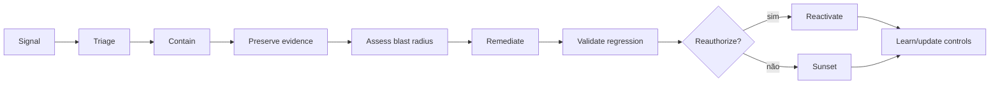

# 09 — Operações, incidentes e continuidade

## Visão geral

A aprovação de um agente é o começo da vida dele, não o fim da governança. **Depois do release, o agente é um sistema dinâmico**: o comportamento muda, as ferramentas mudam, os dados mudam, os custos mudam — e a organização precisa observar, decidir, conter, remediar, revalidar e aposentar com responsabilidade definida.

Este capítulo cobre a operação no dia a dia em quatro blocos:

1. **Operar:** run readiness, observabilidade, níveis de serviço, monitoramento comportamental e de custo.
2. **Responder:** reporte, severidade, escalonamento, contenção, quarentena, kill switch, rollback e reativação.
3. **Aprender:** investigação, preservação de evidências, ação corretiva, revisão pós-incidente.
4. **Continuar:** comunicação, fornecedores, continuidade, modos degradados e recuperação.

O princípio que atravessa tudo: **sinais geram decisões e ações — não dashboards decorativos.** Um alerta sem owner, sem runbook e sem ação não é governança, é ruído. E o complemento: **a contenção não pode depender do próprio agente com falha.**

## 1. Operar

### 1.1 Run readiness: o que precisa existir antes do release

Antes do release, deve existir: Run Authority e technical owner; SLOs e error budgets adequados; telemetria e dashboards orientados a decisão; policy thresholds e alerts; incident severity matrix; runbooks de containment, rollback e reactivation; support model e escalation; change e attestation cadence; sunset e retention plan.

### 1.2 O modelo de observabilidade em 8 camadas

| Camada | Sinais |
|---|---|
| experiência | task success, user feedback, correction e abandonment |
| modelo | quality, safety, drift, refusal e uncertainty |
| retrieval/data | source, freshness, authorization e leakage |
| agent | plan depth, retries, loops e delegation |
| tool | allow/deny, latency, side effect, failure e cost |
| identity | authn/authz, scope e anomalies |
| business | outcome, error, control impact e value |
| governance | exception, finding, attestation, lifecycle stage e operational state |

**Dashboards precisam de owner, threshold e action; caso contrário são visualização, não governança.**

### 1.3 Telemetria e correlação de ponta a ponta

Eventos atribuíveis correlacionam usuário, agente, versão, tarefa, modelo, ferramenta, decisão de policy e resultado: schema de evento, IDs, timestamps, integridade, retenção, acesso, premissas de relógio e testes de cobertura. **Uma cadeia de ações representativa pode ser reconstruída sem expor prompt, segredo ou dados pessoais proibidos.**

Observabilidade completa não é um dashboard único. É um **modelo de correlação** que permite responder perguntas de estate, runtime, segurança, comportamento, custo e valor sem reconstruir manualmente a história de cada agente.

### 1.4 Níveis de serviço e thresholds operacionais

Objetivos de serviço, qualidade, segurança e resposta com medição e ação em caso de violação: indicador, objetivo, população, janela, exclusões, fonte, threshold de alerta, owner e error budget. **Violações são detectáveis e levam a uma decisão operacional ou de portfólio registrada, em vez de reporte apenas em dashboard.**

**Métricas de runtime:** todo agente em produção tem métricas técnicas mínimas definidas pelo Technical Owner (ex.: taxa de acurácia, tempo de resposta, taxa de erro ou satisfação do usuário), monitoradas continuamente.

### 1.5 Monitoramento comportamental e drift

Baselines e sinais para mudança de comportamento, qualidade, segurança, custo e dependências: definição do sinal, população, janela de baseline, threshold, confiança, owner, escada de resposta e histórico de calibração. **Alertas são calibrados contra comportamento real e levam a investigação, throttling, quarentena ou reavaliação.**

### 1.6 Monitoramento de custo e recursos

Atribuir consumo e custo operacional total a agente, owner, ambiente e resultado mensurável: custo unitário, orçamento, quota, previsão, variância, alocação compartilhada, anomalia e decisão de otimização. **Violação de threshold dispara throttling ou revisão; alegações de custo permanecem separadas de alegações de realização de valor.**

### 1.7 Como implantar observabilidade orientada à decisão

**Entrada:** registry e blueprint do agente, risk tier/admissibilidade, dependências, SLOs de serviço e owners ativos. **Authority típica:** Run Authority, com Technical Owner e domain authorities aplicáveis. **Saída:** contrato de telemetria, baseline, dashboards por decisão, alert-to-action e evidence de run readiness. **Critério de conclusão:** cada sinal crítico possui source, threshold, owner, severidade, ação e caminho de contenção recuperável.

> **Artefatos para produzir agora — observabilidade.** Use o [AI Agent Audit Event schema](../../toolkit/schemas/audit-event.schema.json) para o envelope mínimo de correlação, o [SLO example](../../toolkit/examples/slo.example.md) como referência de objetivo e o [Support Runbook](../../toolkit/examples/support-runbook.example.md) para transformar alerta em ação. O dashboard é uma visualização; o contrato, o runbook e o decision record são os artefatos governados.

1. **Definir o schema canônico de telemetria.** `agent_id`, versão, tarefa e sessão, usuário ou gatilho, modelo e provedor, ferramenta, ação, alvo, resultado da policy, tokens e custo, latência, erro e outcome. Os campos podem vir de produtos diferentes; **precisam ser correlacionáveis**.
2. **Medir estate e lifecycle.** Total conhecido versus estimado, novos agentes, mix de tiers, sem owner, dormentes, attestation vencida e candidatos a retirada.
3. **Definir SLI e SLO de runtime por classe.** Taxa de sucesso, latência, retries, falhas de ferramenta, profundidade de loop e timeout são interpretados conforme o caso — um agente em lote aceita latência que um assistente interativo não aceita.
4. **Integrar telemetria de segurança.** Anomalias de autenticação e permissão, perda de dados, ataques via prompt ou ferramenta, destinos inesperados, ações de alto impacto e negações de policy. **Segurança não pode trabalhar com uma cópia desconectada do `agent_id`.**
5. **Implantar behavioral analytics em monitor-only.** Dois ou três casos com baseline claro, comparando cada agente com o próprio histórico e com o peer group, medindo falso positivo antes de automatizar resposta.
6. **Fazer FinOps por tarefa e por resultado.** Distribuir custo de modelo, ferramenta, armazenamento e egress por agente e tarefa. Comparar custo por caso bem-sucedido, não gasto de tokens.
7. **Conectar uso a valor de negócio.** Usuários ativos mostram frequência; valor exige outcome. **Um agente popular pode não gerar valor.**
8. **Construir dashboards por decisão.** Executivo: estate, risco e valor; segurança: comportamento e incidentes; plataforma: runtime e custo; owner: adoção, outcome e attestation. **Um painel único serve a ninguém.**
9. **Definir alert-to-action e tuning.** Toda regra crítica tem owner, severidade, threshold contextualizado e ação: observar, abrir ticket, throttle, exigir step-up ou quarentena. Revisar baselines após mudança material.

**Concluído quando:** um drill reconstrói uma cadeia representativa de eventos, alcança a Run Authority dentro do alvo e executa a ação prevista sem depender de pesquisa manual em dashboards desconectados.

## 2. Responder

### 2.1 Reporte de problemas e incidentes

Rota descobrível para usuários autorizados, operadores e partes afetadas reportarem problemas: canal do reportador, recebimento, triagem, severidade, owner, ativo vinculado, evidência, comunicação e fechamento. **Um reporte alcança triagem accountable dentro do alvo; retaliação, perda ou fechamento silencioso é prevenido.**

### 2.2 Classificação de severidade

Critérios aprovados, escaladores obrigatórios e o resultado aplicável mais severo: resultados por critério, red flags, rationale, confiança, revisor e rota resultante. **A mesma evidência produz encaminhamento consistente; sub-classificação é detectada por revisão.**

### 2.3 O ciclo de vida do incidente

**Fluxo de incidentes (política v1):** isolar ou desabilitar o agente (kill switch ou quarentena) → notificar Business Owner, Technical Owner e Run Authority → registrar incidente e evidência no catálogo → executar análise de causa raiz e plano de correção → **revalidar controles antes de reativar.**

### 2.4 A escada de contenção

Escolha o menor blast radius que controla o risco; escale quando incerteza ou impacto exigirem:

1. negar operação específica;
2. reduzir scope ou rate;
3. bloquear tool/connector;
4. revogar identidade/token;
5. quarentenar agent/version;
6. rollback para versão conhecida;
7. desativar serviço ou integração;
8. executar sunset.

### 2.5 Quarentena, kill switch e rollback

**Quarentena** deve: impedir novas ações relevantes; preservar logs e evidence; indicar status no registry; comunicar owners e suporte; evitar reativação automática; exigir cause, remediation e regression evidence; registrar authority e timestamps.

**Kill switch e circuit breaker:** caminhos de authority e técnicos para interromper ações, isolar dependências e preservar evidências: gatilho, caminho de comando, escopo, estado esperado, operador, cadência de teste, resultado e pré-requisitos de recuperação. **Um drill contém uma falha representativa dentro do alvo sem depender do próprio agente com falha.**

**Rollback e recuperação:** o estado mais seguro, o alvo de rollback e a sequência de recuperação para falhas de controle, dependência e modelo: modos de falha, gatilho, artefato de rollback, reconciliação de dados, authority do operador, RTO/RPO e resultado do exercício. **Uma falha representativa restaura um serviço delimitado em estado bom conhecido sem perder evidência exigida nem duplicar ações.**

### 2.6 Papéis, escalonamento e comunicações

Cada evento material e severidade mapeia para uma decisão accountable e um caminho de escalonamento: evento, threshold, autoridade primária e alternativa, consulta, tempo de resposta e fallback. **Um drill alcança uma decisão autorizada dentro do alvo; autoridade ambígua falha para o estado mais seguro.**

**Integração com SOC, SRE, privacidade e continuidade:** mapeamento de gatilhos, identificadores compartilhados, handoff, authority, comunicação, custódia de evidência e regra de prioridade conflitante. **Um exercício conjunto preserva uma única linha do tempo de incidente; cada função especialista executa sua authority sem handoff órfão.**

### 2.7 Decisão de reativação segura

Reativação somente após causa raiz, remediação, regressão, monitoramento e prontidão de rollback evidenciados: vínculo do incidente, versão alterada, pacote de reteste, risco residual, authority aprovadora, condições e escopo do rollout. **A falha anterior não é mais reproduzível nas condições testadas e sinais de alerta precoce estão ativos.**

## 3. Aprender

### 3.1 Investigação e preservação de evidências

Preservar uma linha do tempo de incidente defensável e artefatos **antes de a remediação destruir evidência material**: authority de coleta, fontes, hashes, timestamps, custódia, acesso, hipóteses, descobertas e limitações. **Um revisor autorizado consegue reconstruir ações materiais e o tratamento de evidências atende restrições de retenção e privacidade.**

### 3.2 Ação corretiva e preventiva

Toda descoberta tem causa raiz, prioridade baseada em risco, ação corretiva e critério de fechamento: descoberta, evidência, owner, vencimento, controle provisório, causa raiz, remediação, reteste e disposição do revisor. **O fechamento exige evidência objetiva de reteste; descobertas materiais vencidas permanecem visíveis e afetam a aprovação.**

### 3.3 Revisão pós-incidente e comunicação

Comunicação interna e externa exigida a partir de impacto, contrato, lei e necessidade dos stakeholders: público, authority, fatos, incerteza, momento, canal, aprovações, correções e rationale da divulgação. **Comunicações são oportunas, consistentes e baseadas em evidência; não ocultam impacto material nem exageram certeza.**

## 4. Continuar

### 4.1 Incidentes de fornecedores e dependências

Fornecedores e dependências a jusante governados por due diligence, contrato, monitoramento e planejamento de saída: serviço, owner, criticidade, evidência, obrigações, concentração, incidentes, subprocessadores, fallback e teste de saída. **Falha do fornecedor dispara a contenção ou fallback acordado; a accountability permanece com a organização.**

### 4.2 Continuidade operacional, modos degradados e recuperação de desastres

Modos degradados aprovados, fallbacks de dependência, prioridades de continuidade e saída de fornecedores críticos: caminhos críticos, tolerâncias, RTO/RPO, capacidade de fallback, procedimento manual, reconciliação de dados e exercício. **O serviço atinge o alvo de recuperação aprovado sem contornar silenciosamente controles de risco, dados ou autorização.**

### 4.3 Gestão de mudanças

Material changes reabrem gates proporcionais: model/provider; prompt/policy relevante; tool, MCP server ou permission; connector, dataset ou region; autonomy/capability; target population ou exposure; support/oversight mode; dependency com efeito de security ou reliability. **Mudanças emergenciais seguem break-glass e revisão posterior.**

### 4.4 Attestation periódica

Confirma: owners válidos; finalidade e usuários atuais; risk tier e controls; identidade, dados e tools; evidence e exceptions; qualidade e incidents; uso e value evidence; necessidade de manter, corrigir, restringir ou aposentar. **Frequência aumenta com risco; evento material pode antecipar.**

### 4.5 Sunset

Inclui: stop de novas utilizações; comunicação e alternativa; revogação de identidade, tokens, tools e connectors; tratamento de memória, indexes e records; retenção de evidência; remoção de discovery/catalog ativo; encerramento de contratos/custos quando aplicável; verificação de órfãos e dependências downstream.

## 5. Behavioral analytics de agentes

### 5.1 Regra vs anomalia

Regra determinística responde **"isto é proibido"**. Behavioral analytics responde **"isto é diferente"**. As duas são necessárias e não se substituem: ação administrativa sem aprovação é regra; custo oito vezes acima do p95 histórico é anomalia.

**Objetivo:** detectar quando o comportamento de um agente muda em relação ao que era normal para ele — e converter esse sinal em ação proporcional.

### 5.2 Unidade de comportamento e features

Escolha explicitamente o que está sendo perfilado: `agent_id`, agente + usuário, sessão, time ou peer group. Para agentes autônomos, `agent_id` é obrigatório — sem isso não há atribuição.

**Features observáveis:** chamadas de ferramenta por minuto · ferramentas únicas · proporção de escrita · ações falhas · profundidade de retry · profundidade de cadeia · tokens por sessão · custo por sessão · amplitude de fontes acessadas · uso de privilégio · egress externo · latência · tentativas de contornar aprovação.

> **Escolha poucas features com significado operacional. Uma feature que ninguém sabe interpretar produz alerta que ninguém trata.**

### 5.3 Baseline

- **baseline individual** (o agente contra o próprio histórico) evita comparar agente de alto volume com outro de baixo volume;
- **peer-group baseline** ajuda quando há população suficiente com função semelhante;
- período inicial em **monitor-only** de no mínimo 30 dias, ou um ciclo operacional que capture sazonalidade;
- combine **desvio relativo com piso absoluto**: "5x o p95" sozinho dispara em um aumento de 1 para 5 chamadas, sem relevância;
- baselines são **versionados por release** do agente. Mudança material pode exigir novo período de aprendizagem.

### 5.4 Contexto antes de conclusão

Um desvio isolado pode ser perfeitamente legítimo. Enriqueça o sinal com: tier, janela de mudança ou manutenção, owner, versão do deployment, evento de negócio, risco da ferramenta e classe da fonte de dados. **Anomalia de custo isolada costuma ser aumento legítimo de uso; anomalia de custo combinada com mudança de comportamento de ferramenta e ausência de change record é candidata a incidente.**

### 5.5 Catálogo inicial de casos

| Caso | Sinal | Contexto a correlacionar | Resposta inicial |
|---|---|---|---|
| runaway loop | chamadas/min e retry muito acima do baseline | janela de mudança | throttle + alerta; quarentena em T3 se crítico |
| deriva de privilégio | ferramenta privilegiada nunca vista no histórico | tier e risco da ferramenta | exigir aprovação + investigar |
| anomalia de custo | custo/sessão acima do baseline e do piso absoluto | volume de negócio, versão do modelo | alerta; throttle em T2/T3 |
| expansão de acesso a dados | nova fonte ou aumento de amplitude | autorização vigente e change record | validar autorização + revisar mudança |
| mudança após release | alteração abrupta após update de modelo/prompt/tool | diff de versão | comparar versões; candidato a rollback |
| manipulação de aprovação | eventos repetidos de falha ou bypass | histórico do ator | bloquear ação + incidente de segurança |

### 5.6 Escala de resposta

`observe` → `alert` → `throttle` → `exigir step-up` → `desabilitar ferramenta` → `quarentena`

**Comece com resposta humana para casos novos. Só automatize contenção depois de medir precisão e falsos positivos em casos de alta confiança.**

### 5.7 Como introduzir behavioral analytics com segurança

**Entrada:** um caso de uso observável, telemetria correlacionável, tier, owner, privacy boundary e resposta possível. **Authority típica:** Run Authority define a operação; Security, Data ou Privacy participam quando o sinal tocar seus domínios. **Saída:** hipótese versionada, baseline, regra, response contract e decisão de monitor-only ou enforcement. **Critério de conclusão:** a regra demonstra utilidade, falso positivo mensurado e resposta proporcional antes de qualquer contenção automática.

1. Escolher um caso observável e útil — runaway loop, pico de custo, primeira ferramenta privilegiada ou acesso a alvo incomum.
2. Definir as features e a unidade de comportamento.
3. Construir baseline individual e, quando útil, de peer group.
4. Rodar monitor-only por período suficiente para capturar sazonalidade.
5. Combinar desvio relativo com piso absoluto.
6. Enriquecer com contexto operacional.
7. Definir resposta por severidade.
8. Medir taxa de falso positivo e incidentes não detectados; ajustar.
9. **Versionar regra e baseline — o incidente precisa indicar qual lógica gerou a decisão.**

> **Artefato para produzir agora — Behavioral Analytics Use Case.** Use o [Behavioral Analytics Use Case](../../toolkit/templates/behavioral-analytics-use-case.md) para registrar hipótese, features, privacy boundaries, thresholds, response contract, calibração e sunset. Anexe a baseline e a versão da regra ao evidence package; uma anomalia não deve virar finding ou contenção sem esse contexto.

## 6. Referência normativa

Condições mínimas que devem ser verdadeiras. Use como checklist; as seções 1–5 explicam o porquê.

| # | Obrigação | Evidência mínima | Concluído quando |
|---|---|---|---|
| R1 | Operar produção com ownership de serviço e authority de resposta definidos | telemetria, thresholds, on-call, severidade, contenção, comunicações, retenção, recuperação | sinais disparam resposta acordada; contenção/recuperação exercitadas; incidentes alimentam correção |
| R2 | Emitir eventos atribuíveis correlacionando usuário, agente, versão, tarefa, modelo, ferramenta, policy e resultado | schema, IDs, timestamps, integridade, retenção, acesso, relógio, testes | cadeia de ações reconstruída sem expor prompt/segredo/dados proibidos |
| R3 | Definir objetivos de serviço, qualidade, segurança e resposta com ação em violação | indicador, objetivo, população, janela, exclusões, fonte, threshold, owner, error budget | violações detectáveis levam a decisão registrada, não só dashboard |
| R4 | Estabelecer baselines e sinais para mudança de comportamento, qualidade, segurança, custo e dependências | sinal, população, janela, threshold, confiança, owner, escada de resposta, calibração | alertas calibrados contra comportamento real levam a investigação/throttling/quarentena |
| R5 | Atribuir consumo e custo total a agente, owner, ambiente e resultado | custo unitário, orçamento, quota, previsão, variância, alocação, anomalia, otimização | threshold violado dispara throttling/revisão; custo separado de valor |
| R6 | Fornecer rota descobrível para reportar problemas e incidentes | canal, recebimento, triagem, severidade, owner, ativo, evidência, comunicação, fechamento | reporte alcança triagem accountable no alvo; retaliação/perda prevenida |
| R7 | Classificar severidade com critérios aprovados e escaladores obrigatórios | resultados por critério, red flags, rationale, confiança, revisor, rota | mesma evidência produz encaminhamento consistente; sub-classificação detectada |
| R8 | Mapear eventos e severidades para decisão accountable e escalonamento | evento, threshold, autoridade primária/alternativa, consulta, tempo, fallback | drill alcança decisão autorizada; ambiguidade falha para o estado mais seguro |
| R9 | Integrar resposta de agentes com SOC, SRE, privacidade, legal e continuidade | gatilhos, identificadores, handoff, authority, comunicação, custódia, prioridade | exercício conjunto preserva linha do tempo única; sem handoff órfão |
| R10 | Implementar caminhos de authority e técnicos para interromper, isolar e preservar | gatilho, comando, escopo, estado esperado, operador, cadência de teste, resultado | drill contém falha representativa sem depender do agente com falha |
| R11 | Definir estado mais seguro, alvo de rollback e sequência de recuperação | modos de falha, gatilho, artefato, reconciliação, authority, RTO/RPO, exercício | falha restaura serviço em estado bom sem perder evidência nem duplicar |
| R12 | Preservar linha do tempo defensável e artefatos antes da remediação | authority de coleta, fontes, hashes, timestamps, custódia, acesso, hipóteses, descobertas | revisor reconstrói ações materiais; evidência atende retenção e privacidade |
| R13 | Atribuir causa raiz, prioridade e critério de fechamento a cada descoberta | descoberta, evidência, owner, vencimento, controle provisório, causa, remediação, reteste | fechamento exige reteste objetivo; vencidas afetam aprovação |
| R14 | Permitir reativação somente com causa, remediação, regressão, monitoramento e rollback | vínculo do incidente, versão, reteste, residual, authority, condições, rollout | falha não reproduzível; sinais precoces ativos |
| R15 | Determinar comunicação exigida a partir de impacto, contrato e lei | público, authority, fatos, incerteza, momento, canal, aprovações, correções | comunicações oportunas, consistentes, sem ocultar ou exagerar |
| R16 | Governar fornecedores por due diligence, contrato, monitoramento e saída | serviço, owner, criticidade, evidência, obrigações, concentração, incidentes, fallback, saída | falha do fornecedor dispara contenção/fallback; accountability permanece |
| R17 | Definir modos degradados, fallbacks, prioridades e saída de fornecedores críticos | caminhos críticos, tolerâncias, RTO/RPO, fallback, manual, reconciliação, exercício | recuperação atinge alvo sem contornar controles |
| R18 | Operar revisão operacional periódica com ownership e authority | registro operacional completo (telemetria, thresholds, on-call, severidade, contenção, comunicações, retenção, recuperação) | sinais disparam resposta; incidentes alimentam correção e reavaliação |

## 7. Evidências, métricas e failure modes

**Evidências:** run readiness checklist; dashboards com owner/threshold/action; alerts e incident records; containment/rollback drills; change approvals; attestation; support tickets e user feedback; value review; sunset completion; catálogo de casos de behavioral analytics; baselines versionados; período de monitor-only; decisões automatizadas com versão da regra.

**Métricas:** mean time to detect, decide, contain e recover; incidents por severity e recurrence; failed actions, loops e retries; policy denials e anomalous tool chains; agents com expired attestation; orphaned identity/tool/data access; change sem reauthorization; quarantine/reactivation outcomes; inactive agents ainda gerando custo; casos em monitor-only vs enforcement; taxa de falso positivo por regra; incidentes detectados por behavioral analytics vs outra via; tempo entre sinal e ação; agentes sem baseline válido após mudança.

**Failure modes:** monitorar somente uptime; alert sem owner ou runbook; quarantine que não revoga tool access; reativar antes de regression test; alterar prompt em produção sem version; attestation como assinatura sem evidência; manter agent sem uso por medo de sunset; encerrar UI e deixar integrações ativas; automatizar bloqueio com baseline imaturo; desvio relativo sem piso absoluto; alertar sem contexto e treinar a operação a ignorar; baseline global para perfis incompatíveis; regra não versionada; tratar analytics como substituto de regra para o que já é proibido.

## Decision gates

- **Produção:** exige Run Authority, observability, containment, rollback, incident process, support e sunset verificáveis.
- **Behavioral analytics:** nenhuma regra de comportamento entra em enforcement automático sem período de monitor-only, medição de falso positivo, piso absoluto declarado e versionamento da regra e do baseline.
- **Reativação:** exige causa, remediação, regression evidence e sinais precoces ativos.

## Acceptance criteria

- todas as decisões deste capítulo possuem authority, owner e evidência recuperável;
- requisitos aplicáveis estão ligados ao catálogo de controles e ao método de verificação;
- exceções têm escopo, justificativa, compensating controls, expiry e decisão residual;
- controles de build time e runtime são distinguidos e exercitados quando aplicáveis;
- mudanças materiais reabrem avaliação, aprovação e evidência;
- nenhuma alegação de conformidade, eficácia ou valor excede a evidência observada.
