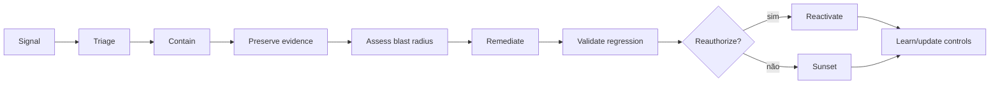

# 09 — Operações, incidentes e continuidade

Este capítulo integra a estrutura clean-room aprovada com o conteúdo substantivo do corpus autoritativo. Requisitos do framework são vendor-neutral; legislação externa, guidance, casos e histórico são identificados como tais. A implementação organizacional exige adoção formal pela authority competente e não decorre do versionamento deste repositório.

## Contrato operacional do capítulo

As subseções seguintes formam um contrato executável de completude. Cada uma especifica a decisão ou ação requerida, o record/evidence mínimo e uma condição observável de conclusão para levar a governança do zero ao business as usual.

### 09.1 Operating model and service ownership

**Required decision/action.** For **operating model and service ownership**, the organization must select and document the centralized, federated or hybrid allocation of policy, platform, domain and assurance duties.

**Record and evidence.** Retain design principles, role map, service boundaries, decision rights, handoffs, service levels and exception route.

**Done when.** A representative case moves from intake to operation with no orphan decision or duplicated source of truth.

### 09.2 Production inventory and configuration visibility

**Required decision/action.** For **production inventory and configuration visibility**, the organization must operate the registry as the authoritative identity and lifecycle index for every in-scope agent.

**Record and evidence.** Validate stable ID, owner, purpose, tier, admissibility, version, environment, state, dependencies and last-attested date.

**Done when.** Automated and manual reconciliation detects missing, stale, duplicate and invalid records and blocks required transitions.

### 09.3 Telemetry and end-to-end correlation

**Required decision/action.** For **telemetry and end-to-end correlation**, the organization must emit attributable events that correlate user, agent, version, task, model, tool, policy decision and outcome.

**Record and evidence.** Define event schema, IDs, timestamps, integrity control, retention, access, clock assumptions and coverage tests.

**Done when.** A representative action chain can be reconstructed without exposing prohibited prompt, secret or personal data.

### 09.4 Service levels and operational thresholds

**Required decision/action.** For **service levels and operational thresholds**, the organization must define service, quality, safety and response objectives with measurement and breach action.

**Record and evidence.** Record indicator, objective, population, window, exclusions, source, alert threshold, owner and error budget or tolerance.

**Done when.** Breaches are detectable and lead to a recorded operational or portfolio decision rather than dashboard-only reporting.

### 09.5 Behavioral monitoring

**Required decision/action.** For **behavioral monitoring**, the organization must establish baselines and signals for behavior, quality, safety, security, cost and dependency change.

**Record and evidence.** Record signal definition, population, baseline window, threshold, confidence, owner, response ladder and calibration history.

**Done when.** Alerts are calibrated against real behavior and lead to investigation, throttling, quarantine or reassessment.

### 09.6 Quality, safety, fairness and security monitoring

**Required decision/action.** For **quality, safety, fairness and security monitoring**, the organization must operate this production capability with defined service ownership and response authority.

**Record and evidence.** The operational record must identify telemetry, thresholds, on-call ownership, severity, containment path, communications, evidence retention and recovery criteria.

**Done when.** Signals trigger the agreed response, containment and recovery are exercised, and incidents feed corrective action and reassessment.

### 09.7 Drift and emerging behavior

**Required decision/action.** For **drift and emerging behavior**, the organization must establish baselines and signals for behavior, quality, safety, security, cost and dependency change.

**Record and evidence.** Record signal definition, population, baseline window, threshold, confidence, owner, response ladder and calibration history.

**Done when.** Alerts are calibrated against real behavior and lead to investigation, throttling, quarantine or reassessment.

### 09.8 Cost and resource monitoring

**Required decision/action.** For **cost and resource monitoring**, the organization must attribute consumption and total operating cost to agent, owner, environment and measurable outcome.

**Record and evidence.** Record unit cost, budget, quota, forecast, variance, shared-cost allocation, anomaly and optimization decision.

**Done when.** Threshold breach triggers throttling or review and cost claims remain separate from value realization claims.

### 09.9 Issue and incident reporting

**Required decision/action.** For **issue and incident reporting**, the organization must provide authorized users, operators and affected parties a discoverable route to report issues and incidents.

**Record and evidence.** Record reporter channel, receipt, triage, severity, owner, linked asset, evidence, communication and closure.

**Done when.** A report reaches accountable triage within target and retaliation, loss or silent closure is prevented.

### 09.10 Severity classification

**Required decision/action.** For **severity classification**, the organization must classify the case using approved criteria, mandatory escalators and the most severe applicable outcome.

**Record and evidence.** Record criterion results, red flags, rationale, confidence, reviewer and resulting route or response target.

**Done when.** The same evidence yields consistent routing and under-classification is detected by review or reconciliation.

### 09.11 Roles, escalation and communications

**Required decision/action.** For **roles, escalation and communications**, the organization must map each material lifecycle event and incident severity to one accountable decision and escalation path.

**Record and evidence.** Record event, threshold, primary and alternate authority, consultation, response time and unresolved-decision fallback.

**Done when.** A drill reaches an authorized decision within the target and ambiguous authority fails to the safer state.

### 09.12 Integration with SOC, SRE, privacy and business continuity

**Required decision/action.** For **integration with soc, sre, privacy and business continuity**, the organization must integrate agent-specific response with established security, reliability, privacy, legal and continuity processes.

**Record and evidence.** Record trigger mapping, shared identifiers, handoff, authority, communication, evidence custody and conflicting-priority rule.

**Done when.** A joint exercise preserves one incident timeline and each specialist function can execute its authority without an orphan handoff.

### 09.13 Containment, quarantine and kill switch

**Required decision/action.** For **containment, quarantine and kill switch**, the organization must implement authority and technical paths to stop actions, isolate dependencies and preserve evidence.

**Record and evidence.** Record trigger, command path, scope, expected state, operator, test cadence, result and recovery prerequisites.

**Done when.** A drill contains a representative failure within the target without relying on the failing agent itself.

### 09.14 Rollback and recovery

**Required decision/action.** For **rollback and recovery**, the organization must define the safer state, rollback target and recovery sequence for control, dependency and model failures.

**Record and evidence.** Retain failure modes, trigger, rollback artifact, data reconciliation, operator authority, RTO/RPO and exercise result.

**Done when.** A representative failure restores a known-good bounded service without losing required evidence or duplicating actions.

### 09.15 Investigation and evidence preservation

**Required decision/action.** For **investigation and evidence preservation**, the organization must preserve a defensible incident timeline and artifacts before remediation destroys material evidence.

**Record and evidence.** Record collection authority, sources, hashes, timestamps, custody, access, hypotheses, findings and limitations.

**Done when.** An authorized reviewer can reconstruct material actions and evidence handling meets retention and privacy constraints.

### 09.16 Corrective and preventive action

**Required decision/action.** For **corrective and preventive action**, the organization must assign each finding a root cause, risk-based priority, corrective action and closure criterion.

**Record and evidence.** Record finding, evidence, owner, due date, interim control, root cause, remediation, retest and reviewer disposition.

**Done when.** Closure requires objective retest evidence; overdue material findings remain visible and affect approval.

### 09.17 Safe reactivation decision

**Required decision/action.** For **safe reactivation decision**, the organization must permit reactivation only after root cause, remediation, regression, monitoring and rollback readiness are evidenced.

**Record and evidence.** Record incident link, changed version, retest package, residual risk, approving authority, conditions and rollout scope.

**Done when.** The former failure is no longer reproducible under the tested conditions and early-warning signals are active.

### 09.18 User, customer, regulator and third-party communication

**Required decision/action.** For **user, customer, regulator and third-party communication**, the organization must determine required internal and external communication from impact, contract, law and stakeholder need.

**Record and evidence.** Retain audience, authority, facts, uncertainty, timing, channel, approvals, corrections and disclosure rationale.

**Done when.** Communications are timely, consistent and evidence-based and do not conceal material impact or overstate certainty.

### 09.19 Supplier incidents and dependencies

**Required decision/action.** For **supplier incidents and dependencies**, the organization must govern supplier and downstream dependencies through due diligence, contract, monitoring and exit planning.

**Record and evidence.** Record service, owner, criticality, evidence, obligations, concentration, incidents, sub-processors, fallback and exit test.

**Done when.** Supplier failure triggers the agreed containment or fallback and accountability remains with the organization.

### 09.20 Operational continuity and degraded modes

**Required decision/action.** For **operational continuity and degraded modes**, the organization must define approved degraded modes, dependency fallbacks, continuity priorities and exit from critical suppliers.

**Record and evidence.** Record critical paths, tolerances, RTO/RPO, fallback capability, manual procedure, data reconciliation and exercise.

**Done when.** The service meets the approved recovery target without silently bypassing risk, data or authorization controls.

### 09.21 Disaster recovery

**Required decision/action.** For **disaster recovery**, the organization must define approved degraded modes, dependency fallbacks, continuity priorities and exit from critical suppliers.

**Record and evidence.** Record critical paths, tolerances, RTO/RPO, fallback capability, manual procedure, data reconciliation and exercise.

**Done when.** The service meets the approved recovery target without silently bypassing risk, data or authorization controls.

### 09.22 Post-incident review and disclosure

**Required decision/action.** For **post-incident review and disclosure**, the organization must determine required internal and external communication from impact, contract, law and stakeholder need.

**Record and evidence.** Retain audience, authority, facts, uncertainty, timing, channel, approvals, corrections and disclosure rationale.

**Done when.** Communications are timely, consistent and evidence-based and do not conceal material impact or overstate certainty.

### 09.23 Periodic operational review

**Required decision/action.** For **periodic operational review**, the organization must operate this production capability with defined service ownership and response authority.

**Record and evidence.** The operational record must identify telemetry, thresholds, on-call ownership, severity, containment path, communications, evidence retention and recovery criteria.

**Done when.** Signals trigger the agreed response, containment and recovery are exercised, and incidents feed corrective action and reassessment.

## Conteúdo canônico incorporado

A seção preserva integralmente as unidades atribuídas pela matriz de cobertura. Os marcadores HTML são provenance machine-readable e não alteram o significado normativo.

### Fonte: `docs/governance/ai-agent-policy-and-governance-v1.md`

Commit de origem: `5545d9227624400ab8bb707b6032b2f61329a36e`.

<!-- source-unit {"classification": "concept-or-structure", "end_line": "164", "index": 1, "source_field": "", "source_heading": "11.3 Agent Performance Metrics", "source_path": "docs/governance/ai-agent-policy-and-governance-v1.md", "start_line": "162", "transformation": "archive-verbatim-and-integrate-unique-content", "unit_type": "markdown-atx-heading"} -->
##### 11.3 Agent Performance Metrics
Each agent in production must have minimum technical metrics defined by the Technical Owner (e.g., accuracy rate, response time, error rate, or user satisfaction), monitored continuously.

<!-- source-unit {"classification": "concept-or-structure", "end_line": "231", "index": 2, "source_field": "", "source_heading": "16. Processes and Flows (High Level)", "source_path": "docs/governance/ai-agent-policy-and-governance-v1.md", "start_line": "229", "transformation": "archive-verbatim-and-integrate-unique-content", "unit_type": "markdown-atx-heading"} -->
#### 16. Processes and Flows (High Level)
For governance to be adoptable at scale (Group/Segments/Locations), processes must be simple, repeatable, and auditable. This section presents the high-level flows that connect the annexes and artifacts (Self-Assessment, Publication Checklist, Catalog, and Approval Matrix), defining inputs, responsible parties, and decision points. The goal is to standardize “how” agents are created, assessed, approved, published, monitored, and closed, ensuring clarity of roles and consistency across platforms and regions.

<!-- source-unit {"classification": "concept-or-structure", "end_line": "242", "index": 3, "source_field": "", "source_heading": "16.2 AI Incidents", "source_path": "docs/governance/ai-agent-policy-and-governance-v1.md", "start_line": "236", "transformation": "archive-verbatim-and-integrate-unique-content", "unit_type": "markdown-atx-heading"} -->
##### 16.2 AI Incidents
Isolate or disable the agent (kill switch or quarantine)
Notify Business Owner, Technical Owner, and Run Authority
Register incident and evidence in the catalog
Perform root cause analysis and correction plan
Revalidate controls before reactivating

<!-- source-unit {"classification": "concept-or-structure", "end_line": "245", "index": 4, "source_field": "", "source_heading": "17. Monitoring and Observability", "source_path": "docs/governance/ai-agent-policy-and-governance-v1.md", "start_line": "243", "transformation": "archive-verbatim-and-integrate-unique-content", "unit_type": "markdown-atx-heading"} -->
#### 17. Monitoring and Observability
Observability is a mandatory corporate requirement for all AI agents in Production and is directly linked to the principles of transparency, human accountability, and risk management established in this policy. Its purpose is to ensure safe, auditable operation aligned with Responsible AI practices and the controls defined in the Self-Assessment, Publication Checklist, Catalog, and the periodic review process.

### Fonte: `docs/operations/README.md`

Commit de origem: `5545d9227624400ab8bb707b6032b2f61329a36e`.

<!-- source-unit {"classification": "metadata-title", "end_line": "2", "index": 5, "source_field": "title", "source_heading": "", "source_path": "docs/operations/README.md", "start_line": "2", "transformation": "integrate-completely", "unit_type": "frontmatter-title"} -->
**Título controlado na origem:** Operações, observabilidade, resposta e lifecycle

<!-- source-unit {"classification": "lifecycle-state", "end_line": "16", "index": 6, "source_field": "", "source_heading": "Operações, observabilidade, resposta e lifecycle", "source_path": "docs/operations/README.md", "start_line": "15", "transformation": "integrate-completely", "unit_type": "markdown-atx-heading"} -->
### Operações, observabilidade, resposta e lifecycle

<!-- source-unit {"classification": "objective", "end_line": "20", "index": 7, "source_field": "", "source_heading": "Objetivo", "source_path": "docs/operations/README.md", "start_line": "17", "transformation": "integrate-completely", "unit_type": "markdown-atx-heading"} -->
#### Objetivo

Operar agentes como sistemas dinâmicos: observar comportamento e efeitos, decidir, conter, remediar, revalidar e aposentar com responsabilidade definida.

<!-- source-unit {"classification": "concept-or-structure", "end_line": "34", "index": 8, "source_field": "", "source_heading": "Run readiness", "source_path": "docs/operations/README.md", "start_line": "21", "transformation": "integrate-completely", "unit_type": "markdown-atx-heading"} -->
#### Run readiness

Antes do release, deve existir:

- Run Authority e technical owner;
- SLOs e error budgets adequados;
- telemetry e dashboards orientados a decisão;
- policy thresholds e alerts;
- incident severity matrix;
- runbooks de containment, rollback e reactivation;
- support model e escalation;
- change e attestation cadence;
- sunset e retention plan.

<!-- source-unit {"classification": "architecture-runtime", "end_line": "55", "index": 9, "source_field": "", "source_heading": "Observability model", "source_path": "docs/operations/README.md", "start_line": "35", "transformation": "integrate-completely", "unit_type": "markdown-atx-heading"} -->
#### Observability model

| Camada | Sinais |
|---|---|
| experiência | task success, user feedback, correction e abandonment |
| modelo | quality, safety, drift, refusal e uncertainty |
| retrieval/data | source, freshness, authorization e leakage |
| agent | plan depth, retries, loops e delegation |
| tool | allow/deny, latency, side effect, failure e cost |
| identity | authn/authz, scope e anomalies |
| business | outcome, error, control impact e value |
| governance | exception, finding, attestation, lifecycle stage e operational state |

Dashboards precisam de owner, threshold e action; caso contrário são visualização, não governança.

Três leituras derivam deste modelo e têm documento próprio:

- [behavioral analytics](../../toolkit/templates/behavioral-analytics-use-case.md) — quando o comportamento muda em relação ao normal do agente;
- [FinOps e unit economics](10-metrics-review-and-improvement.md) — quanto custa por resultado e onde está o desperdício;
- [KPIs, KRIs e governance dashboard](10-metrics-review-and-improvement.md) — o que vai a um fórum e com qual ação associada.

<!-- source-unit {"classification": "lifecycle-state", "end_line": "72", "index": 10, "source_field": "", "source_heading": "Incident lifecycle", "source_path": "docs/operations/README.md", "start_line": "56", "transformation": "integrate-completely", "unit_type": "markdown-atx-heading"} -->
#### Incident lifecycle

<!-- source-unit {"classification": "concept-or-structure", "end_line": "85", "index": 11, "source_field": "", "source_heading": "Containment ladder", "source_path": "docs/operations/README.md", "start_line": "73", "transformation": "integrate-completely", "unit_type": "markdown-atx-heading"} -->
#### Containment ladder

1. negar operação específica;
2. reduzir scope ou rate;
3. bloquear tool/connector;
4. revogar identidade/token;
5. quarentenar agent/version;
6. rollback para versão conhecida;
7. desativar serviço ou integração;
8. executar sunset.

Escolha o menor blast radius que controla o risco; escale quando incerteza ou impacto exigirem.

<!-- source-unit {"classification": "architecture-runtime", "end_line": "97", "index": 12, "source_field": "", "source_heading": "Quarantine", "source_path": "docs/operations/README.md", "start_line": "86", "transformation": "integrate-completely", "unit_type": "markdown-atx-heading"} -->
#### Quarantine

Quarantine deve:

- impedir novas ações relevantes;
- preservar logs e evidence;
- indicar status no registry;
- comunicar owners e suporte;
- evitar reativação automática;
- exigir cause, remediation e regression evidence;
- registrar authority e timestamps.

<!-- source-unit {"classification": "lifecycle-state", "end_line": "112", "index": 13, "source_field": "", "source_heading": "Change management", "source_path": "docs/operations/README.md", "start_line": "98", "transformation": "integrate-completely", "unit_type": "markdown-atx-heading"} -->
#### Change management

Material changes reabrem gates proporcionais:

- model/provider;
- prompt/policy relevante;
- tool, MCP server ou permission;
- connector, dataset ou region;
- autonomy/capability;
- target population ou exposure;
- support/oversight mode;
- dependency com efeito de security ou reliability.

Mudanças emergenciais seguem break-glass e revisão posterior.

<!-- source-unit {"classification": "lifecycle-state", "end_line": "127", "index": 14, "source_field": "", "source_heading": "Attestation", "source_path": "docs/operations/README.md", "start_line": "113", "transformation": "integrate-completely", "unit_type": "markdown-atx-heading"} -->
#### Attestation

Periodic attestation confirma:

- owners válidos;
- finalidade e usuários atuais;
- risk tier e controls;
- identidade, dados e tools;
- evidence e exceptions;
- qualidade e incidents;
- uso e value evidence;
- necessidade de manter, corrigir, restringir ou aposentar.

Frequência aumenta com risco; evento material pode antecipar.

<!-- source-unit {"classification": "lifecycle-state", "end_line": "140", "index": 15, "source_field": "", "source_heading": "Sunset", "source_path": "docs/operations/README.md", "start_line": "128", "transformation": "integrate-completely", "unit_type": "markdown-atx-heading"} -->
#### Sunset

Sunset inclui:

- stop de novas utilizações;
- comunicação e alternativa;
- revogação de identidade, tokens, tools e connectors;
- tratamento de memória, indexes e records;
- retenção de evidência;
- remoção de discovery/catalog ativo;
- encerramento de contratos/custos quando aplicável;
- verificação de órfãos e dependências downstream.

<!-- source-unit {"classification": "procedure", "end_line": "154", "index": 16, "source_field": "", "source_heading": "Playbook de implantação", "source_path": "docs/operations/README.md", "start_line": "141", "transformation": "integrate-completely", "unit_type": "markdown-atx-heading"} -->
#### Playbook de implantação

Observabilidade completa não é um dashboard único. É um **modelo de correlação** que permite responder perguntas de estate, runtime, segurança, comportamento, custo e valor sem reconstruir manualmente a história de cada agente.

1. **Definir o schema canônico de telemetria.** `agent_id`, versão, tarefa e sessão, usuário ou gatilho, modelo e provedor, ferramenta, ação, alvo, resultado da policy, tokens e custo, latência, erro e outcome. Os campos podem vir de produtos diferentes; **precisam ser correlacionáveis**.
2. **Medir estate e lifecycle.** Total conhecido versus estimado, novos agentes, mix de tiers, sem owner, dormentes, attestation vencida e candidatos a retirada. Responde "o que existe e está higienizado?".
3. **Definir SLI e SLO de runtime por classe.** Taxa de sucesso, latência, retries, falhas de ferramenta, profundidade de loop e timeout são interpretados conforme o caso — um agente em lote aceita latência que um assistente interativo não aceita.
4. **Integrar telemetria de segurança.** Anomalias de autenticação e permissão, perda de dados, ataques via prompt ou ferramenta, destinos inesperados, ações de alto impacto e negações de policy. **Segurança não pode trabalhar com uma cópia desconectada do `agent_id`.**
5. **Implantar [behavioral analytics](../../toolkit/templates/behavioral-analytics-use-case.md) em monitor-only.** Dois ou três casos com baseline claro, comparando cada agente com o próprio histórico e com o peer group, combinando regra determinística e desvio, medindo falso positivo antes de automatizar resposta.
6. **Fazer [FinOps](10-metrics-review-and-improvement.md) por tarefa e por resultado.** Distribuir custo de modelo, ferramenta, armazenamento e egress por agente e tarefa. Comparar custo por caso bem-sucedido, não gasto de tokens. Budget e threshold de anomalia por perfil de uso.
7. **Conectar uso a valor de negócio.** Usuários ativos mostram frequência; valor exige outcome — cycle time, qualidade, esforço evitado, receita, custo ou redução de incidente. **Um agente popular pode não gerar valor.**
8. **Construir dashboards por decisão.** Executivo precisa de estate, risco e valor; segurança precisa de comportamento e incidentes; plataforma precisa de runtime e custo; owner precisa de adoção, outcome e attestation. Um painel único serve a ninguém.
9. **Definir alert-to-action e tuning.** Toda regra crítica tem owner, severidade, threshold contextualizado e ação: observar, abrir ticket, throttle, exigir step-up ou colocar em quarentena. Revisar baselines após mudança material e drift.

<!-- source-unit {"classification": "evidence-artifact", "end_line": "166", "index": 17, "source_field": "", "source_heading": "Evidências", "source_path": "docs/operations/README.md", "start_line": "155", "transformation": "integrate-completely", "unit_type": "markdown-atx-heading"} -->
#### Evidências

- run readiness checklist;
- dashboards com owner/threshold/action;
- alerts e incident records;
- containment/rollback drills;
- change approvals;
- attestation;
- support tickets e user feedback;
- value review;
- sunset completion.

<!-- source-unit {"classification": "metric", "end_line": "178", "index": 18, "source_field": "", "source_heading": "Métricas", "source_path": "docs/operations/README.md", "start_line": "167", "transformation": "integrate-completely", "unit_type": "markdown-atx-heading"} -->
#### Métricas

- mean time to detect, decide, contain e recover;
- incidents por severity e recurrence;
- failed actions, loops e retries;
- policy denials e anomalous tool chains;
- agents com expired attestation;
- orphaned identity/tool/data access;
- change sem reauthorization;
- quarantine/reactivation outcomes;
- inactive agents ainda gerando custo.

<!-- source-unit {"classification": "risk-failure-mode", "end_line": "189", "index": 19, "source_field": "", "source_heading": "Failure modes", "source_path": "docs/operations/README.md", "start_line": "179", "transformation": "integrate-completely", "unit_type": "markdown-atx-heading"} -->
#### Failure modes

- monitorar somente uptime;
- alert sem owner ou runbook;
- quarantine que não revoga tool access;
- reativar antes de regression test;
- alterar prompt em produção sem version;
- attestation como assinatura sem evidência;
- manter agent sem uso por medo de sunset;
- encerrar UI e deixar integrações ativas.

<!-- source-unit {"classification": "requirement-control", "end_line": "192", "index": 20, "source_field": "", "source_heading": "Decision gate", "source_path": "docs/operations/README.md", "start_line": "190", "transformation": "integrate-completely", "unit_type": "markdown-atx-heading"} -->
#### Decision gate

Produção exige Run Authority, observability, containment, rollback, incident process, support e sunset verificáveis.

### Fonte: `docs/operations/behavioral-analytics.md`

Commit de origem: `5545d9227624400ab8bb707b6032b2f61329a36e`.

<!-- source-unit {"classification": "metadata-title", "end_line": "2", "index": 21, "source_field": "title", "source_heading": "", "source_path": "docs/operations/behavioral-analytics.md", "start_line": "2", "transformation": "merge-into-operations-chapter-preserve-baseline-calibration-response-ladder-and-enforcement-gate", "unit_type": "frontmatter-title"} -->
**Título controlado na origem:** Behavioral analytics de agentes

<!-- source-unit {"classification": "concept-or-structure", "end_line": "18", "index": 22, "source_field": "", "source_heading": "Behavioral analytics de agentes", "source_path": "docs/operations/behavioral-analytics.md", "start_line": "17", "transformation": "preserve-exact-heading-subtree-and-map-operationally-with-related-template-link", "unit_type": "markdown-atx-heading"} -->
### Behavioral analytics de agentes

<!-- source-unit {"classification": "objective", "end_line": "24", "index": 23, "source_field": "", "source_heading": "Objetivo", "source_path": "docs/operations/behavioral-analytics.md", "start_line": "19", "transformation": "preserve-exact-heading-subtree-and-map-operationally-with-related-template-link", "unit_type": "markdown-atx-heading"} -->
#### Objetivo

Detectar quando o comportamento de um agente muda em relação ao que era normal para ele — e converter esse sinal em ação proporcional.

Regra determinística responde "isto é proibido". Behavioral analytics responde "isto é diferente". As duas são necessárias e não se substituem: ação administrativa sem aprovação é **regra**; custo oito vezes acima do p95 histórico é **anomalia**.

<!-- source-unit {"classification": "concept-or-structure", "end_line": "28", "index": 24, "source_field": "", "source_heading": "Unidade de comportamento", "source_path": "docs/operations/behavioral-analytics.md", "start_line": "25", "transformation": "preserve-exact-heading-subtree-and-map-operationally-with-related-template-link", "unit_type": "markdown-atx-heading"} -->
#### Unidade de comportamento

Escolha explicitamente o que está sendo perfilado: `agent_id`, agente + usuário, sessão, time ou peer group. Para agentes autônomos, `agent_id` é obrigatório — sem isso não há atribuição.

<!-- source-unit {"classification": "concept-or-structure", "end_line": "34", "index": 25, "source_field": "", "source_heading": "Features observáveis", "source_path": "docs/operations/behavioral-analytics.md", "start_line": "29", "transformation": "preserve-exact-heading-subtree-and-map-operationally-with-related-template-link", "unit_type": "markdown-atx-heading"} -->
#### Features observáveis

Chamadas de ferramenta por minuto · ferramentas únicas · proporção de escrita · ações falhas · profundidade de retry · profundidade de cadeia · tokens por sessão · custo por sessão · amplitude de fontes acessadas · uso de privilégio · egress externo · latência · tentativas de contornar aprovação.

Escolha poucas features com significado operacional. Uma feature que ninguém sabe interpretar produz alerta que ninguém trata.

<!-- source-unit {"classification": "concept-or-structure", "end_line": "42", "index": 26, "source_field": "", "source_heading": "Baseline", "source_path": "docs/operations/behavioral-analytics.md", "start_line": "35", "transformation": "preserve-exact-heading-subtree-and-map-operationally-with-related-template-link", "unit_type": "markdown-atx-heading"} -->
#### Baseline

- **baseline individual** (o agente contra o próprio histórico) evita comparar um agente de alto volume com outro de baixo volume;
- **peer-group baseline** ajuda quando há população suficiente de agentes com função semelhante;
- período inicial em **monitor-only** de no mínimo 30 dias, ou um ciclo operacional que capture sazonalidade;
- combine **desvio relativo com piso absoluto**: "5x o p95" sozinho dispara em um aumento de 1 para 5 chamadas, sem relevância;
- baselines são **versionados por release** do agente. Mudança material pode exigir novo período de aprendizagem.

<!-- source-unit {"classification": "concept-or-structure", "end_line": "48", "index": 27, "source_field": "", "source_heading": "Contexto antes de conclusão", "source_path": "docs/operations/behavioral-analytics.md", "start_line": "43", "transformation": "preserve-exact-heading-subtree-and-map-operationally-with-related-template-link", "unit_type": "markdown-atx-heading"} -->
#### Contexto antes de conclusão

Um desvio isolado pode ser perfeitamente legítimo. Enriqueça o sinal com: tier, janela de mudança ou manutenção, owner, versão do deployment, evento de negócio, risco da ferramenta e classe da fonte de dados.

Anomalia de custo isolada costuma ser aumento legítimo de uso. Anomalia de custo **combinada** com mudança de comportamento de ferramenta e ausência de change record é candidata a incidente.

<!-- source-unit {"classification": "example", "end_line": "59", "index": 28, "source_field": "", "source_heading": "Catálogo inicial de casos", "source_path": "docs/operations/behavioral-analytics.md", "start_line": "49", "transformation": "preserve-exact-heading-subtree-and-map-operationally-with-related-template-link", "unit_type": "markdown-atx-heading"} -->
#### Catálogo inicial de casos

| Caso | Sinal | Contexto a correlacionar | Resposta inicial |
|---|---|---|---|
| runaway loop | chamadas/min e profundidade de retry muito acima do baseline | janela de mudança | throttle + alerta; quarentena em T3 se crítico |
| deriva de privilégio | uso de ferramenta privilegiada nunca vista no histórico | tier e risco da ferramenta | exigir aprovação + investigar |
| anomalia de custo | custo/sessão acima do baseline e do piso absoluto | volume de negócio, versão do modelo | alerta; throttle em T2/T3 |
| expansão de acesso a dados | nova fonte ou aumento de amplitude | autorização vigente e change record | validar autorização + revisar mudança |
| mudança após release | alteração abrupta depois de update de modelo, prompt ou ferramenta | diff de versão | comparar versões; candidato a rollback |
| manipulação de aprovação | eventos repetidos de falha ou bypass de aprovação | histórico do ator | bloquear ação + incidente de segurança |

<!-- source-unit {"classification": "concept-or-structure", "end_line": "65", "index": 29, "source_field": "", "source_heading": "Escala de resposta", "source_path": "docs/operations/behavioral-analytics.md", "start_line": "60", "transformation": "preserve-exact-heading-subtree-and-map-operationally-with-related-template-link", "unit_type": "markdown-atx-heading"} -->
#### Escala de resposta

`observe` → `alert` → `throttle` → `exigir step-up` → `desabilitar ferramenta` → `quarentena`

Comece com resposta humana para casos novos. Só automatize contenção depois de medir precisão e falsos positivos em casos de alta confiança.

<!-- source-unit {"classification": "procedure", "end_line": "79", "index": 30, "source_field": "", "source_heading": "Procedimento", "source_path": "docs/operations/behavioral-analytics.md", "start_line": "66", "transformation": "preserve-exact-heading-subtree-and-map-operationally-with-related-template-link", "unit_type": "markdown-atx-heading"} -->
#### Procedimento

1. Escolher um caso observável e útil — runaway loop, pico de custo, primeira ferramenta privilegiada ou acesso a alvo incomum.
2. Definir as features e a unidade de comportamento.
3. Construir baseline individual e, quando útil, de peer group.
4. Rodar monitor-only por período suficiente para capturar sazonalidade.
5. Combinar desvio relativo com piso absoluto.
6. Enriquecer com contexto operacional.
7. Definir resposta por severidade.
8. Medir taxa de falso positivo e incidentes não detectados; ajustar.
9. Versionar regra e baseline — o incidente precisa indicar qual lógica gerou a decisão.

Use o [Behavioral Analytics Use Case](../../toolkit/templates/behavioral-analytics-use-case.md) para registrar hipótese, features, privacy boundaries, thresholds, response contract, calibração e sunset. Os sinais podem usar o [audit event envelope](../../toolkit/schemas/audit-event.schema.json) como contrato mínimo.

<!-- source-unit {"classification": "evidence-artifact", "end_line": "87", "index": 31, "source_field": "", "source_heading": "Evidências", "source_path": "docs/operations/behavioral-analytics.md", "start_line": "80", "transformation": "preserve-exact-heading-subtree-and-map-operationally-with-related-template-link", "unit_type": "markdown-atx-heading"} -->
#### Evidências

- catálogo de casos com features, thresholds e rationale;
- baselines versionados por release;
- período de monitor-only e evidência de calibração;
- decisões automatizadas com a versão da regra que as produziu;
- histórico de tuning com falsos positivos e incidentes correlacionados.

<!-- source-unit {"classification": "metric", "end_line": "96", "index": 32, "source_field": "", "source_heading": "Métricas", "source_path": "docs/operations/behavioral-analytics.md", "start_line": "88", "transformation": "preserve-exact-heading-subtree-and-map-operationally-with-related-template-link", "unit_type": "markdown-atx-heading"} -->
#### Métricas

- casos em monitor-only versus em enforcement;
- taxa de falso positivo por regra;
- incidentes detectados por behavioral analytics versus por outra via;
- tempo entre sinal e ação;
- regras sem revisão dentro do ciclo definido;
- agentes sem baseline válido após mudança material.

<!-- source-unit {"classification": "risk-failure-mode", "end_line": "105", "index": 33, "source_field": "", "source_heading": "Failure modes", "source_path": "docs/operations/behavioral-analytics.md", "start_line": "97", "transformation": "preserve-exact-heading-subtree-and-map-operationally-with-related-template-link", "unit_type": "markdown-atx-heading"} -->
#### Failure modes

- automatizar bloqueio com baseline imaturo;
- desvio relativo sem piso absoluto;
- alertar sem contexto e treinar a operação a ignorar;
- baseline global aplicado a agentes de perfis incompatíveis;
- regra não versionada — impossível explicar por que a ação ocorreu;
- tratar analytics como substituto de regra determinística para o que já é proibido.

<!-- source-unit {"classification": "requirement-control", "end_line": "108", "index": 34, "source_field": "", "source_heading": "Decision gate", "source_path": "docs/operations/behavioral-analytics.md", "start_line": "106", "transformation": "preserve-exact-heading-subtree-and-map-operationally-with-related-template-link", "unit_type": "markdown-atx-heading"} -->
#### Decision gate

Nenhuma regra de comportamento entra em enforcement automático sem período de monitor-only, medição de falso positivo, piso absoluto declarado e versionamento da regra e do baseline.

## Acceptance criteria

- todas as decisões deste capítulo possuem authority, owner e evidência recuperável;
- requisitos aplicáveis estão ligados ao catálogo de controles e ao método de verificação;
- exceções têm escopo, justificativa, compensating controls, expiry e decisão residual;
- controles de build time e runtime são distinguidos e exercitados quando aplicáveis;
- mudanças materiais reabrem avaliação, aprovação e evidência;
- nenhuma alegação de conformidade, eficácia ou valor excede a evidência observada.
