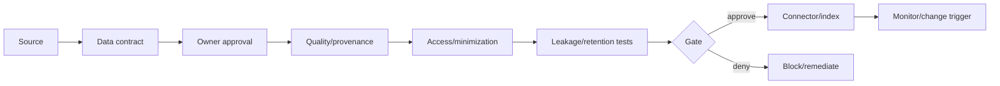

# Pattern — AI-Ready Data Gate

## Intenção

Permitir connector, retrieval, memory ou training somente quando a fonte é adequada à finalidade e possui owner, provenance, acesso e lifecycle.

## Problema

“Já está disponível” ou “o usuário tem acesso” é tratado como autorização suficiente. Fontes são indexadas sem quality, purpose, retention ou leakage analysis.

## Contexto

RAG, enterprise search, fine-tuning, memories, vector stores, connectors e tools que transportam dados.

## Forças e trade-offs

- data access versus minimization;
- freshness versus stable evaluation;
- personalization versus privacy;
- broad retrieval versus authorization;
- provenance versus performance;
- reuse versus purpose limitation.

## Solução

Introduza um gate baseado em data contract antes de conectar e quando houver mudança material.

## Estrutura e participantes

Participantes: data owner/steward, privacy, security, business/technical owner, platform e Design Authority.

## Fluxo operacional

1. declarar finalidade e affected data;
2. confirmar owner/classification;
3. avaliar provenance, quality e suitability;
4. mapear identities e authorization;
5. definir retention/deletion;
6. testar segregation/leakage;
7. aprovar com conditions/expiry;
8. monitorar source e context changes.

## Controles obrigatórios

- data contract;
- owner approval;
- purpose e classification;
- pre-retrieval authorization;
- lineage/provenance;
- retention/deletion;
- leakage e negative tests;
- external-source licensing/terms;
- change trigger.

## Evidências esperadas

- contract e approval;
- source/lineage records;
- access policy;
- quality report;
- leakage tests;
- retention/deletion proof;
- incidents e reapproval.

## Métricas

- connectors sem contract/owner;
- stale sources/indexes;
- authorization leakage;
- unsupported answers;
- deletion propagation failures;
- source changes sem review.

## Consequências

**Positivas:** reduz leakage, misuse e falsa confiança em dados.

**Custos:** stewardship, test data e integração com data governance.

## Limitações

Data-ready não garante agent/system quality. Ainda são necessários evals, risk e runtime controls.

## Antipatterns relacionados

- “internal means trusted”;
- authorization após retrieval;
- memory sem expiry;
- vector store órfão;
- output gerado virando record sem validação.

## Exemplo vendor-neutral

Antes de indexar documentos restritos, o gate confirma owner, purpose, group-based authorization, deletion propagation e leakage tests. A index version fica vinculada ao blueprint e expira quando o contract vence.

## Mappings de implementação

- data catalog + approval workflow;
- policy engine no connector;
- vector database filters;
- DLP e lineage platforms;
- Git-based contract + CI.

## Patterns relacionados

- [Registry and Blueprint](../../toolkit/patterns/registry-and-blueprint.md)
- [Evidence Package as Code](../../toolkit/patterns/evidence-package-as-code.md)
- [Risk-Tiered Governance](../../toolkit/patterns/risk-tiered-governance.md)
