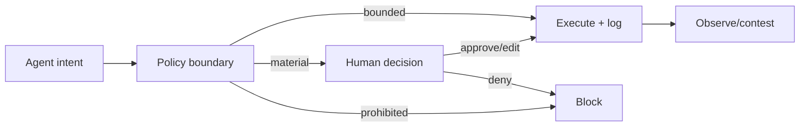

# Pattern — Human Accountability Boundary

## Intent

Delimitar o que o agente pode recomendar, preparar, executar ou jamais fazer e atribuir cada decisão material a uma autoridade humana.

## Problema

“HITL” é frequentemente implementado como botão genérico, reviewer sem contexto ou approval depois da ação. O humano existe no diagrama, mas não possui authority, tempo ou informação.

## Contexto

Agentes que influenciam pessoas, comunicam externamente, alteram records, usam privilégio ou executam ações com impacto material.

## Forças e trade-offs

- velocidade versus informed approval;
- volume versus fadiga;
- autonomia versus accountability;
- UX simples versus contexto suficiente;
- prevenção versus contestability;
- autoridade individual versus dual control.

## Solução

Crie uma accountability boundary por capability:

| Classe | Papel do agente | Papel humano |
|---|---|---|
| recommend | sugere e apresenta evidence | decide e executa |
| prepare | monta draft/transaction | revisa, edita e confirma |
| execute-bounded | executa dentro de envelope | monitora e pode conter |
| execute-material | prepara e pausa | authority aprova antes do commit |
| prohibited | bloqueado por policy | somente exception formal, se permitida |

## Estrutura e participantes

Participantes: business owner, end user/reviewer, Design Authority, Run Authority e affected-party support.

## Fluxo operacional

1. classificar capability e consequence;
2. mapear authority;
3. definir context exibido;
4. aplicar pause/approval fora do modelo;
5. registrar approve/edit/deny;
6. executar com correlation;
7. permitir contest/reversal;
8. revisar rubber-stamp signals.

## Controles obrigatórios

- boundary matrix;
- identity forte do approver;
- approval antes do efeito;
- ação/alvo/consequência visíveis;
- deny/edit claros;
- rollback e escalation;
- break-glass com expiry;
- automation-bias monitoring.

## Evidências esperadas

- UX specs;
- policy/enforcement configuration;
- approval logs;
- competence/training;
- override e contest records;
- rollback drills;
- boundary review.

## Métricas

- approvals, edits e denials;
- decision latency;
- rubber-stamp rate;
- actions sem authority;
- contests e corrections;
- break-glass use;
- rollback success.

## Consequências

**Positivas:** accountability real, contestability e menor excessive agency.

**Custos:** fricção e necessidade de design/treinamento.

## Limitações

Approval humano não corrige informação enganosa, overload ou incentives ruins. Precisa de quality, transparency e authority.

## Antipatterns relacionados

- rubber-stamp HITL;
- approval após execução;
- humano sem authority;
- consentimento genérico;
- break-glass permanente.

## Exemplo vendor-neutral

O agente prepara uma alteração em produção e mostra diff, sistemas afetados e rollback. Um approver com role específica pode editar ou negar. O commit usa token de transação e correlation ID; o agente não reutiliza a aprovação.

## Mappings de implementação

- transaction approval service;
- workflow engine;
- privileged-access management;
- chat/card approval com backend enforcement;
- two-person rule.

## Patterns relacionados

- [Risk-Tiered Governance](../../toolkit/patterns/risk-tiered-governance.md)
- [Tool and MCP Gateway](tool-and-mcp-gateway.md)
- [Runtime Observability and Quarantine](../../toolkit/patterns/runtime-observability-and-quarantine.md)
