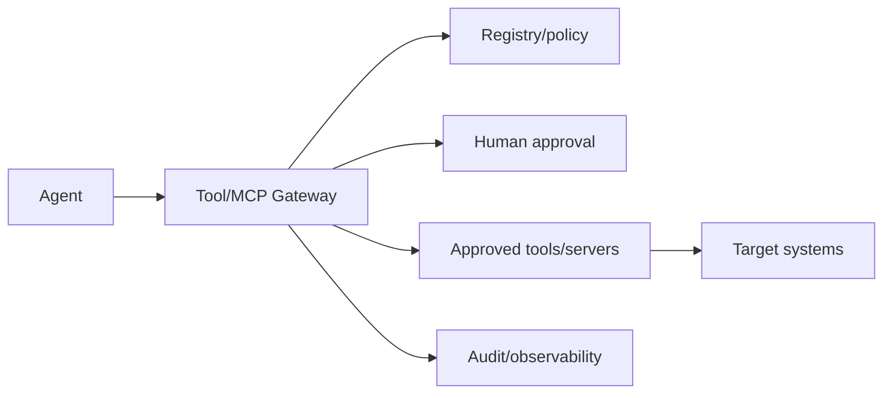

# Pattern — Tool and MCP Gateway

## Intenção

Interpor um enforcement point entre agentes e capabilities para validar identidade, policy, argumentos, destino e efeito.

## Problema

Agents chamam APIs, code tools ou MCP servers diretamente. Prompt e tool description tornam-se controles de autorização; revogação exige alterar cada agente.

## Contexto

Ecossistemas com múltiplos agents/tools, integração MCP, actions state-changing ou necessidade de common controls.

## Forças e trade-offs

- integração direta versus control consistency;
- latency versus inspection;
- dynamic discovery versus provenance;
- developer experience versus allowlist;
- central gateway versus availability/blast radius;
- payload inspection versus privacy.

## Solução

Use gateway ou enforcement layer para:

- autenticar agent/user;
- resolver approved tool/version;
- aplicar scope, context e tier;
- validar schema/arguments;
- limitar egress, rate, budget e chain depth;
- exigir human approval quando necessário;
- registrar correlation e outcome;
- bloquear/revogar independentemente do agente.

## Estrutura e participantes

Participantes: tool authority, platform, security, identity, data, technical owner e Run Authority.

## Fluxo operacional

1. agent solicita capability;
2. gateway identifica caller/context;
3. resolve registry/version;
4. avalia policy e arguments;
5. bloqueia, condiciona ou solicita approval;
6. executa com bounded credential;
7. valida outcome e registra;
8. circuit breaker/quarantine quando necessário.

## Controles obrigatórios

- registry/allowlist;
- provenance/version;
- workload identity;
- schema validation;
- least privilege e bounded token;
- state-change classification;
- approval/deny path;
- rate/budget/egress limits;
- kill switch/circuit breaker;
- tamper-evident logs.

## Evidências esperadas

- gateway policy;
- registry record;
- threat model;
- allow/deny tests;
- approval logs;
- egress/rate test;
- kill-switch drill;
- version-change history.

## Métricas

- direct/bypass calls;
- denied calls por reason;
- state-changing calls;
- unregistered tools;
- latency e availability;
- scope/egress violations;
- time to revoke.

## Consequências

**Positivas:** common enforcement, revogação rápida e visibility de chains.

**Custos:** platform criticality, latency e engineering.

## Limitações

Gateway não elimina vulnerabilidade da tool ou target. Deve evitar virar single point of compromise/failure.

## Antipatterns relacionados

- MCP irrestrito;
- prompt como authorization;
- gateway que apenas loga;
- shared credential no gateway;
- auto-discovery sem provenance.

## Exemplo vendor-neutral

Um agent solicita `finance.create-payment`. O gateway valida tier, vendor/version, amount limit e approver. Emite token de uma transação, executa e registra side effect. Um kill switch remove a capability de todos os agents.

## Mappings de implementação

- API gateway + policy engine;
- MCP gateway/proxy;
- service mesh;
- serverless broker;
- privileged action service.

## Patterns relacionados

- [Human Accountability Boundary](human-accountability-boundary.md)
- [Runtime Observability and Quarantine](../../toolkit/patterns/runtime-observability-and-quarantine.md)
- [Registry and Blueprint](../../toolkit/patterns/registry-and-blueprint.md)
