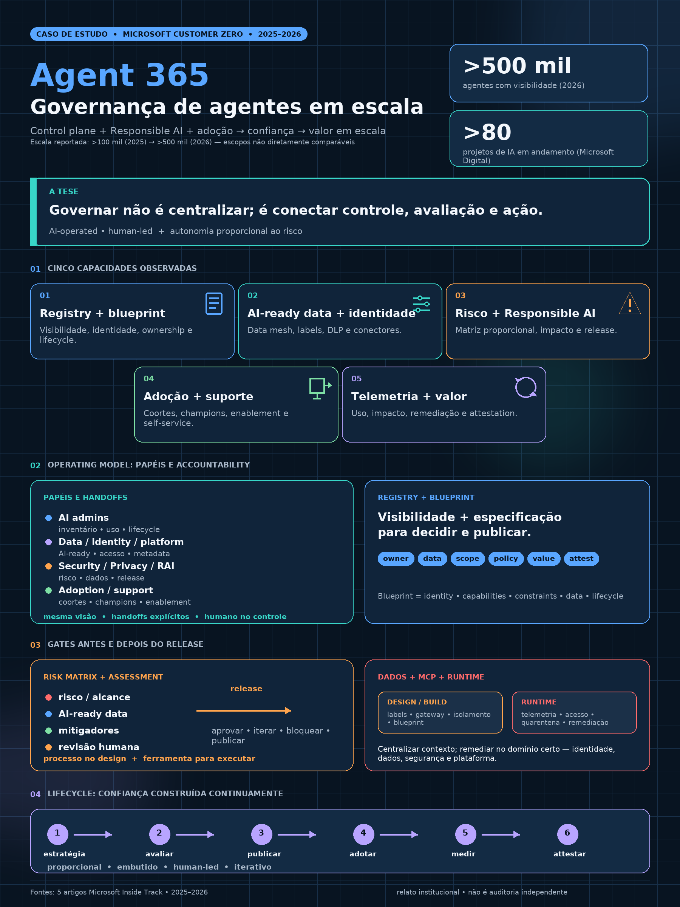

# Microsoft Customer Zero: governança e operação de agentes em escala

## Propósito

Este estudo consolida cinco artigos do Microsoft Inside Track sobre a jornada interna da Microsoft para governar, implantar, adotar, suportar e medir agentes de IA. O objetivo não é recomendar a adoção automática do Microsoft Agent 365, mas extrair capacidades organizacionais e técnicas aplicáveis a um framework corporativo e multiplataforma.

Os textos são relatos oficiais da própria Microsoft, incluindo sua experiência como *Customer Zero*. Eles são fontes primárias sobre a abordagem declarada pela empresa, mas não constituem auditoria independente, prova causal de redução de risco ou demonstração de retorno sobre investimento.

## Fontes analisadas

| Fonte | Data | Contribuição principal |
| --- | ---: | --- |
| Implementing Agent 365[1] | 2026-08-06 | Operating model, registry, papéis, observabilidade e coordenação |
| Deploying Microsoft Agent 365[2] | 2025-11-21 | Control plane, infraestrutura, blueprints, políticas e lifecycle |
| Responsible AI at Microsoft[3] | 2026-03-26 | Princípios, impact assessment, release assessment e accountability |
| Becoming a Frontier Firm[4] | 2026-04-16 | Maturidade, adoção, suporte, change management e medição de valor |
| Governing AI agents at scale[5] | 2026-05-21 | Dados AI-ready, matriz de risco, MCP, lifecycle e métricas |

## Visual do caso de estudo

O visual sintetiza relatos institucionais da Microsoft. Ele não representa arquitetura universal nem auditoria independente.

## Síntese executiva

Os cinco artigos descrevem um sistema operacional de governança, não apenas um produto ou um checklist:

> **estratégia e valor → dados confiáveis → registro, identidade e blueprint → governança proporcional ao risco → impact/release assessment → adoção e suporte → publicação controlada → observabilidade e métricas → remediação, attestation e aprendizado contínuo.**

A principal conclusão é que a organização não deve escolher entre liberdade e controle. Ela deve construir caminhos diferentes para agentes diferentes, escalando autonomia, revisão e suporte conforme risco, alcance, capacidade de ação e valor esperado.

## 1. Cinco planos complementares

### 1.1 Estratégia e valor

Todo agente deve começar ligado a um problema, uma persona, um resultado e um owner. Os artigos distinguem explicitamente volume de criação, uso e valor: muitos agentes criados e pouco utilizados não demonstram transformação.[4]

O plano de valor deve registrar:

- objetivo e processo afetado;
- baseline e resultado esperado;
- business owner e usuários-alvo;
- métricas de adoção, qualidade, produtividade, risco e custo;
- critérios para promover, corrigir ou aposentar.

### 1.2 Control plane

Agent 365 é apresentado como uma camada compartilhada para inventariar agentes, correlacionar ownership, identidade, lifecycle, uso, postura e sinais operacionais.[1][2]

O ponto transferível para um framework multiplataforma é a necessidade de um plano de controle capaz de responder:

- quais agentes existem;
- quem é responsável por cada um;
- onde foram criados e publicados;
- que dados, conectores e ferramentas utilizam;
- que identidade e permissões possuem;
- como estão sendo usados;
- que ação administrativa pode ser executada.

O control plane não substitui Entra, Purview, Defender, plataformas ou sistemas de registro. Ele coordena contexto e ação entre domínios especializados.[1][2]

### 1.3 Assurance plane

O artigo de Responsible AI descreve uma rede composta por Office of Responsible AI, conselho executivo, champions e especialistas distribuídos. O fluxo incorpora avaliação de impacto no design e avaliação de release antes do go-live.[3]

O assurance plane deve transformar princípios em decisões verificáveis:

- potenciais danos e grupos afetados;
- qualidade, representatividade e uso dos dados;
- segurança, privacidade, inclusão e transparência;
- mitigadores e testes;
- responsabilidade humana;
- condições de publicação, exceção e retirada.

Responsible AI funciona melhor quando integrado ao software development lifecycle, e não quando aparece como aprovação manual no final.[3]

### 1.4 Adoption and support plane

Adoção de agentes é tratada como uma jornada diferente da adoção de assistentes. Ela exige adoption lead, coortes, personas, champions, comunicação, treinamento, biblioteca de assets e patrocínio executivo.[4]

O suporte combina três mecanismos:

1. governança e guidance embutidos nas ferramentas;
2. oversight de TI baseado em risco;
3. educação do usuário para lacunas que políticas não antecipam.[4]

Agentes também podem apoiar compliance, avaliação de risco, segurança, privacidade e Responsible AI. O objetivo é reservar especialistas humanos para exceções e novos tipos de decisão, não removê-los do circuito.[4]

### 1.5 Runtime and value plane

Telemetria precisa conduzir a decisão. Os artigos conectam registry, dashboards, alertas, quarentena, remediação, ownership e retirement.[1][5]

A operação deve observar pelo menos:

- comportamento e ações executadas;
- dados e sistemas acessados;
- performance, erros e qualidade;
- violações de policy e tempo de remediação;
- adoção e recorrência de uso;
- impacto sobre resultados definidos;
- agentes sem owner, sem uso, duplicados ou expirados.

## 2. Frontier Firm como modelo de maturidade

Os artigos descrevem três padrões de evolução:

1. **Humano com assistente:** a pessoa executa, apoiada por IA.
2. **Equipe humano-agente:** agentes realizam tarefas específicas sob direção humana.
3. **Human-led, agent-operated:** pessoas definem direção e limites; agentes executam workflows com autonomia relativa e pontos de controle.[4][5]

A maturidade é simultaneamente tecnológica, organizacional e cultural. Não basta disponibilizar ferramentas: é necessário desenvolver governança, dados, skills, suporte, observabilidade e capacidade de decisão.

## 3. Governança proporcional e matricial

O guia de governança rejeita uma abordagem única para todos os agentes. O nível de controle varia conforme:[5]

- alcance: pessoal, equipe, unidade ou enterprise;
- método de construção: no-code, low-code ou pro-code;
- fontes de conhecimento e classificação dos dados;
- capacidade: leitura, escrita, ação ou automação de workflow;
- conectores, APIs, destinos e modelos;
- regionalidade e grupos afetados;
- criticidade e reversibilidade do processo.

Uma classificação prática é:

| Perfil | Tratamento predominante |
| --- | --- |
| Pessoal e somente leitura | Defaults de plataforma, identidade do criador, labels e logging básico |
| Equipe e leitura ampliada | Catálogo de conectores, owner de equipe, attestation e observabilidade |
| Low-code com ação limitada | Blueprint, testes, alcance controlado e rota de retirada |
| Pro-code com escrita ou workflow | SDLC, threat model, revisões especializadas e rollback |
| Enterprise ou alto impacto | Owners nominativos, assessments formais, validação regional, SLO e runtime controls |
| MCP e fronteira de sistemas | Gateway, inventário, vetting, identidade, isolamento e context trimming |

A Microsoft resume uma boa governança como proporcional, embutida, human-led e iterativa.[5]

## 4. Dados AI-ready e data mesh

O quinto artigo apresenta uma abordagem federada de data mesh: domínios mantêm ownership sobre produtos de dados, enquanto plataformas compartilhadas aplicam segurança, metadata, interoperabilidade, lineage, qualidade e compliance.[5]

A fundação mínima inclui:

- data owners responsáveis por qualidade;
- fontes certificadas como AI-ready;
- labels de sensibilidade intuitivas;
- proteção padrão em containers e arquivos;
- conectores compatíveis com a classificação;
- DLP, lineage e logging;
- alertas e remediação para violações.

Um catálogo de agentes pode estar correto e ainda assim produzir decisões ruins se fontes, permissões e labels não forem confiáveis.

## 5. Registry, blueprint e lifecycle

Registry e blueprint são artefatos diferentes:

- **Registry:** inventário operacional do que existe, ownership, estado, dados, uso, risco e próxima ação.[1][2]
- **Blueprint:** especificação de identidade, capacidades, constraints, acesso a dados, policy templates e lifecycle.[2]

O lifecycle também varia por ownership:

- agente pessoal acompanha o vínculo e a identidade do usuário;
- agente de equipe segue lifecycle do tenant, attestation e accountability periódica;
- agente crítico exige business owner, technical owner, telemetria, continuidade e critérios explícitos de sunset.[2][5]

## 6. Integrações de fronteira e MCP

MCP acelera a conexão entre agentes, ferramentas e dados, mas amplia o blast radius. O guia descreve controles em quatro camadas — aplicações/agentes, plataforma de IA, dados e infraestrutura — e recomenda remote MCP servers atrás de gateway, com vetting, identity management, isolamento, context trimming e automação capaz de desacelerar o agente em momentos críticos.[5]

Para este framework, MCP deve ser tratado como uma categoria específica de tool governance e não apenas como mais um conector.

## 7. Medição: controle, adoção e valor

Métricas de controle e métricas de valor não devem ser misturadas.

### Controle

- cobertura do catálogo;
- owners e attestations válidos;
- dados, labels, conectores e destinos classificados;
- assessments aplicáveis concluídos;
- conformidade e violações por severidade;
- tempo de detecção, decisão e remediação;
- agentes ownerless, unused, duplicados e expirados.

### Adoção e valor

- criação versus descoberta de agentes existentes;
- uso por persona e processo;
- cobertura de cenários;
- produtividade sem perda de qualidade;
- experiência dos usuários;
- redução ou melhor gestão de risco;
- resultado de negócio e custo operacional.[4][5]

Os artigos reconhecem que a metodologia de impacto ainda estava em evolução. Portanto, essas dimensões orientam o desenho de medição, mas não provam ROI já realizado.[4][5]

## 8. Implicações para o framework vendor-neutral

Este caso é uma referência institucional entre várias possíveis. Ele não integra a solução necessária, não cria dependência de Agent 365 e não substitui standards, evidência independente ou decisão de arquitetura.

As capacidades transferíveis observadas nos artigos ajudam a testar se o framework consegue:

- manter explícita a arquitetura em cinco planos;
- diferenciar registry e blueprint;
- formalizar impact assessment e release assessment;
- ampliar catálogo com attestation, adoção e valor;
- adicionar AI-ready data e connector gates;
- criar matriz no-code/low-code/pro-code por capacidade;
- formalizar adoption lead, champions e suporte por camadas;
- introduzir controles específicos para MCP;
- distinguir lifecycle individual e de equipe.

A comparação originalmente feita com a Policy v1 foi preservada apenas como [crosswalk histórico](../../project/history/assessments/microsoft-case-study-framework-crosswalk.md). A policy corrente evolui no corpus modular e não depende desse caso.

## 9. Conclusão

Os cinco artigos sustentam uma mensagem única:

> **Prepare a organização para governar e operar agentes antes que a escala transforme exceções em arquitetura.**

O resultado desejável não é um comitê que aprove tudo nem um catálogo que apenas conte agentes. É um sistema operacional em que dados e identidade limitam o que o agente pode conhecer e fazer, a revisão cresce com o risco, usuários recebem suporte, a operação é observável e agentes sem owner, sem uso ou sem valor saem do sistema.

## Limitações e horizonte de validade

- As fontes são relatos institucionais da Microsoft e também cumprem função de divulgação de produtos.
- Os números de mais de 100 mil agentes em 2025 e mais de 500 mil em 2026 não devem ser tratados como série comparável sem validar escopo e definição.[1][2]
- Capacidades do Agent 365 e práticas internas podem mudar depois da data de revisão.
- Thresholds, labels, papéis e workflows precisam ser adaptados a regulação, arquitetura, cultura e tolerância de risco locais.

## Sources

1. [Implementing Agent 365: How we’re governing and managing AI agents at Microsoft][1]
2. [Deploying Microsoft Agent 365: How we’re extending our infrastructure to manage agents at Microsoft][2]
3. [Responsible AI: Why it matters and how we’re infusing it into our internal AI projects at Microsoft][3]
4. [Becoming a Frontier Firm: A guide for deploying AI agents based on our experience at Microsoft][4]
5. [Governing AI agents at scale: Lessons from our journey at Microsoft][5]

[1]: https://www.microsoft.com/insidetrack/blog/implementing-agent-365-how-were-governing-and-managing-ai-agents-at-microsoft/
[2]: https://www.microsoft.com/insidetrack/blog/deploying-microsoft-agent-365-how-were-extending-our-infrastructure-to-manage-agents-at-microsoft/
[3]: https://www.microsoft.com/insidetrack/blog/responsible-ai-why-it-matters-and-how-were-infusing-it-into-our-internal-ai-projects-at-microsoft/
[4]: https://www.microsoft.com/insidetrack/blog/becoming-a-frontier-firm-a-guide-for-deploying-ai-agents-based-on-our-experience-at-microsoft/
[5]: https://www.microsoft.com/insidetrack/blog/governing-ai-agents-at-scale-lessons-from-our-journey-at-microsoft/
