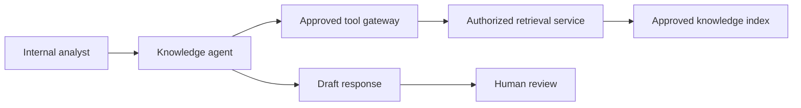

# Example architecture — Service Desk Knowledge Agent

> Fictitious and sanitized. No production system or real organization is represented.

## Trust boundaries

1. authenticated internal channel to agent runtime;
2. runtime to gateway with workload identity;
3. gateway to retrieval service with pre-retrieval authorization;
4. human review before any external response.

## Failure boundaries

- The gateway can revoke both tools without the agent's cooperation.
- Quarantine blocks new sessions.
- Rollback restores the last approved blueprint and prompt version.
