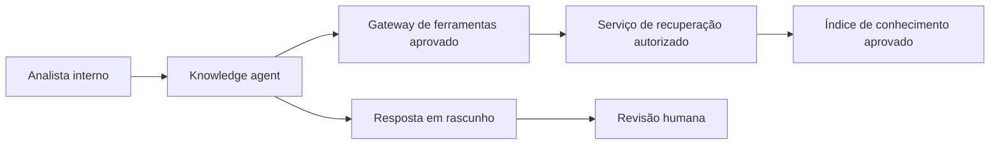

# Exemplo de arquitetura — Service Desk Knowledge Agent

> Fictício e sanitizado. Nenhum sistema de produção ou organização real é representado.

## Fronteiras de confiança

1. canal interno autenticado até o runtime do agente;
2. runtime até o gateway com identidade de workload;
3. gateway até o serviço de recuperação com autorização pré-recuperação;
4. revisão humana antes de qualquer resposta externa.

## Fronteiras de falha

- O gateway pode revogar ambas as ferramentas sem cooperação do agente.
- A quarentena bloqueia novas sessões.
- O rollback restaura o último blueprint e versão de prompt aprovados.
