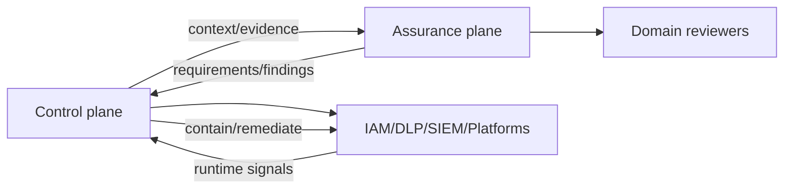

# Pattern — Control and Assurance Planes

## Intent

Separar coordenação operacional e enforcement da avaliação de suficiência, impacto e residual risk.

## Problema

Organizações confundem inventory, postura, policies e dashboards com prova de segurança ou Responsible AI. A mesma plataforma que aplica controles passa a “certificar” sua própria eficácia.

## Contexto

Ecossistemas com control planes de fornecedor, GRC, SIEM, IAM, data governance e workflows de assessment.

## Forças e trade-offs

- integração versus independence;
- automation versus judgment;
- single pane of glass versus sistemas especializados;
- posture signal versus evidence de eficácia;
- ownership operacional versus assurance objetiva.

## Solução

Use dois planos conectados:

- **Control plane:** registry, blueprint, identity, policy distribution, posture, lifecycle e actions.
- **Assurance plane:** impact, risk, privacy, security, RAI, evaluations, independent review e residual-risk decisions.

O control plane fornece contexto e executa ações; o assurance plane define/testa critérios e registra conclusão limitada.

## Estrutura e participantes

## Fluxo operacional

1. control plane reconcilia agent context;
2. assurance seleciona assessments por tier;
3. domain systems fornecem evidence;
4. assurance registra gaps/residual risk;
5. authority aprova/condiciona/nega;
6. control plane aplica status e actions;
7. runtime signals reabrem assurance quando necessário.

## Controles obrigatórios

- source/evidence provenance;
- separation of duties por tier;
- status e finding model comum;
- missing evidence explícito;
- authority independente do vendor score;
- remediation workflow;
- feedback runtime;
- periodic review.

## Evidências esperadas

- control posture com source/timestamp;
- assessment results;
- finding/remediation records;
- residual-risk decision;
- enforcement outcome;
- runtime trigger e re-review.

## Métricas

- findings sem remediation;
- posture stale/incomplete;
- controls “green” sem evidence;
- time from signal to re-review;
- assurance independence exceptions;
- repeated failures.

## Consequências

**Positivas:** reduz falsa confiança e preserva expertise.

**Custos:** integração de data models e mais handoffs explícitos.

## Limitações

Separar planos não garante independence real. Small organizations podem combinar funções, mas precisam registrar conflito e compensating review.

## Antipatterns relacionados

- single-dashboard governance;
- vendor score como risk acceptance;
- self-certification;
- finding sem owner/SLA;
- assurance como etapa final.

## Exemplo vendor-neutral

Um control plane mostra owner, identity, DLP e telemetry. O assurance workflow usa esses sinais, mas exige impact assessment, evals e human oversight antes de concluir release readiness.

## Mappings de implementação

Implementações podem integrar IAM, DLP, SIEM, CMDB, GRC, evidence stores, case management ou workflows Git-based. Esses componentes são adapters substituíveis: o pattern não exige uma plataforma, suíte ou control plane comercial específico.

Mappings nomeados pertencem a estudos de caso ou assessments opcionais e podem ser removidos sem alterar participantes, fluxo, controls ou evidências deste pattern.

## Patterns relacionados

- [Federated Governance](federated-governance-operating-model.md)
- [Runtime Observability and Quarantine](runtime-observability-and-quarantine.md)
- [Evidence Package as Code](evidence-package-as-code.md)
