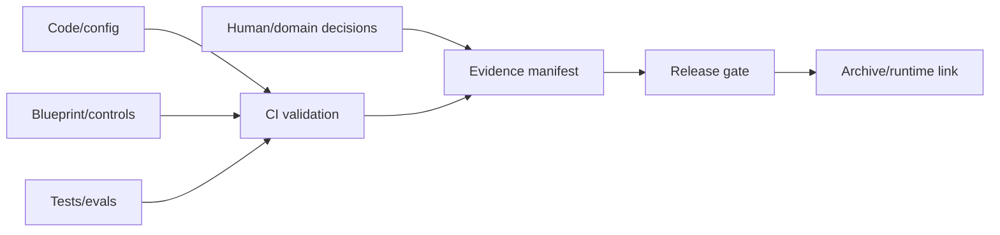

# Pattern — Evidence Package as Code

## Intenção

Versionar e validar a evidência de governança junto com o agent version, sem depender de e-mails ou decks dispersos.

## Problema

Approvals, assessments, configs e tests ficam em ferramentas diferentes, sem índice comum. Não é possível reconstruir o release ou distinguir missing de passed.

## Contexto

Engineering com Git/CI/CD ou qualquer ambiente capaz de armazenar artefatos versionados e produzir links imutáveis.

## Forças e trade-offs

- automation versus evidence quality;
- openness versus sensitive information;
- source proximity versus segregation of duties;
- immutable record versus correction;
- common schema versus domain richness;
- generated evidence versus human decision.

## Solução

Crie um manifest de evidence por agent/version com:

- registry e blueprint references;
- risk tier e assessments;
- control IDs e status;
- test/evaluation artifacts;
- approvals/conditions/expiry;
- runtime readiness;
- immutable hashes/links;
- missing/not-applicable rationale.

Valide structure em CI e preserve decision authority fora de self-approval.

## Estrutura e participantes

Participantes: technical owner, control owners, reviewers, release authority, records/audit.

## Fluxo operacional

1. create manifest from schema;
2. link sources e immutable outputs;
3. run automated checks;
4. domain reviewers add decisions;
5. release authority evaluates completeness/conditions;
6. sign/hash/archive package;
7. link runtime incidents e attestation;
8. supersede, nunca overwrite history.

## Controles obrigatórios

- schema/version;
- immutable agent/version key;
- role-based access;
- secrets redaction;
- source/hash/timestamp;
- missing/not-applicable distinction;
- reviewer identity;
- expiry e conditions;
- archive/retention;
- segregation from code author for higher tiers.

## Evidências esperadas

O próprio manifest, schema-validation result, hashes, approvals, CI run, release decision e archive reference.

## Métricas

- packages completos por tier;
- broken evidence links;
- missing/expired artifacts;
- manual evidence sem source;
- time-to-review;
- post-release changes sem novo package.

## Consequências

**Positivas:** traceability, repeatability e faster review.

**Custos:** schema maintenance, access design e adapter work.

## Limitações

CI verde não comprova eficácia nem substitui human/domain judgment. Sensitive evidence pode exigir secure references em vez de repository content.

## Antipatterns relacionados

- approval por e-mail;
- PDF final sem raw evidence;
- self-certification;
- passed usado para missing;
- artefato mutável após approval.

## Exemplo vendor-neutral

A versão `3.2` inclui manifest com blueprint hash, controls, eval outputs e approvals. CI verifica structure e links; a release authority assina a decisão. Um novo MCP server cria `3.3` e novo package.

## Mappings de implementação

- Git + CI;
- artifact repository;
- GRC evidence APIs;
- signed object storage;
- software supply-chain attestation frameworks.

## Patterns relacionados

- [Registry and Blueprint](registry-and-blueprint.md)
- [Control and Assurance Planes](control-and-assurance-planes.md)
- [Lifecycle Attestation and Sunset](../../docs/patterns/lifecycle-attestation-and-sunset.md)
