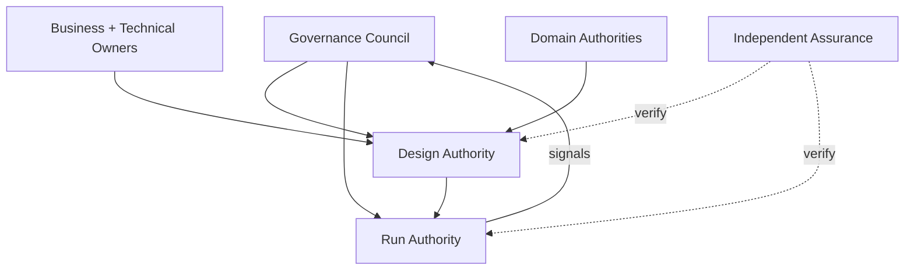

# Pattern — Federated Governance Operating Model

## Intent

Coordenar decisão enterprise sem retirar accountability e expertise dos domínios.

## Problema

Centralização total cria fila e decisões sem contexto. Descentralização sem padrões cria inconsistência, gaps e arbitragem tardia.

## Contexto

Organizações com authorities existentes em negócio, dados, identidade, security, privacy, legal, RAI, plataforma e operações.

## Forças e trade-offs

- autonomia local versus baseline comum;
- velocidade versus consistency;
- expertise versus end-to-end ownership;
- council estratégico versus trabalho operacional;
- delegation versus escalation;
- independence de assurance versus colaboração.

## Solução

Estabeleça:

- Governance Council para policy, risk appetite e conflitos;
- Design Authority para arquitetura/release;
- Run Authority para runtime/containment;
- domain authorities para decisões especializadas;
- business e technical owners por agente;
- assurance/challenge proporcional ao tier; usar o rótulo `independent assurance` somente quando independência, conflitos, segregation, amostragem, reporting line e forma da conclusão estiverem formalizados;
- common registry, controls, evidence e handoffs.

## Estrutura e participantes

## Fluxo operacional

1. council define baseline e delegation;
2. owner apresenta context/evidence;
3. domain authorities decidem dentro do mandato;
4. Design Authority integra e libera/condiciona;
5. Run Authority opera e contém;
6. assurance verifica;
7. sinais sistêmicos voltam ao council.

## Controles obrigatórios

- charter e scope por authority;
- decision/RACI matrix;
- delegation limits;
- SLAs e escalation;
- segregation of duties;
- exception e conflict process;
- common evidence package;
- forum cadence e decision records.

## Evidências esperadas

- charters;
- decision log;
- RACI;
- release/containment records;
- escalation e exception history;
- SLA e backlog metrics;
- assurance findings.

## Métricas

- cycle time por decision type;
- escalations e conflicts;
- devoluções por handoff incompleto;
- decisions sem authority;
- exception recurrence;
- backlog por domain;
- containment delays.

## Consequências

**Positivas:** contexto local, common baseline e accountability clara.

**Custos:** desenho de interfaces, disciplina de decisão e coordenação.

## Limitações

Não resolve falta de capacidade ou sponsor. Federação sem common controls vira fragmentação.

## Antipatterns relacionados

- governance silo;
- council como approval queue;
- “o time” accountable;
- domain veto sem SLA;
- assurance assumindo ownership.

## Exemplo vendor-neutral

Dados aprovam finalidade e connector; identidade aprova workload/scopes; security aprova threat treatment; negócio aceita outcome risk; Design Authority integra a decisão; Run Authority mantém poder de quarantine.

## Mappings de implementação

- existing architecture boards;
- three-lines model adaptado;
- product/platform operating model;
- delegated GRC workflows;
- councils regionais com baseline enterprise.

## Patterns relacionados

- [Control and Assurance Planes](control-and-assurance-planes.md)
- [Risk-Tiered Governance](risk-tiered-governance.md)
- [Evidence Package as Code](evidence-package-as-code.md)
