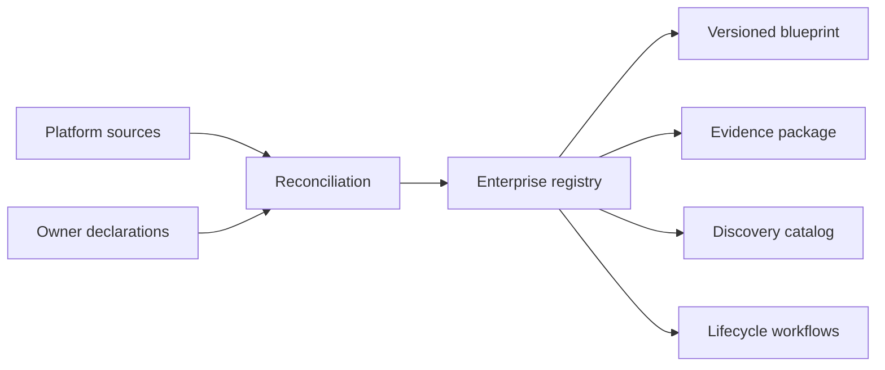

# Pattern — Registry and Blueprint

## Intent

Separar inventário e accountability da descrição técnica necessária para compreender arquitetura, acesso e blast radius.

## Problema

Catálogos costumam registrar nome, owner e status, mas não explicam dados, identidade, tools, dependências e failure modes. Diagramas técnicos, por outro lado, ficam isolados e não suportam lifecycle, attestation ou discovery.

## Contexto

Organizações com múltiplas plataformas, SaaS, low/no-code e pro-code, onde agentes podem ser criados fora de um pipeline único.

## Forças e trade-offs

- schema mínimo versus informação suficiente;
- source of truth versus fontes distribuídas;
- atualização automática versus declaração humana;
- discovery versus exposição indevida;
- cobertura versus confidence;
- versionamento técnico versus identidade estável do agente.

## Solução

Use dois objetos relacionados:

- **Registry record:** identidade estável, finalidade, owners, status, tier, alcance, lifecycle e evidence links.
- **Agent blueprint:** versão técnica com modelos, prompts, dados, identidade, memory, tools, permissions, trust boundaries, runtime e failure modes.

O registry aponta para a versão ativa do blueprint e preserva histórico de decisões.

## Estrutura e participantes

Participantes: registry owner, platform owners, business/technical owners, domain authorities, Run Authority e audit.

## Fluxo operacional

1. detectar ou declarar o agente;
2. criar ID estável e status `discovered`;
3. confirmar owners e finalidade;
4. vincular blueprint/version;
5. classificar tier e missing evidence;
6. aprovar, condicionar, bloquear ou sunset;
7. reconciliar mudanças;
8. executar attestation.

## Controles obrigatórios

- IDs estáveis e versões separadas;
- business e technical owner;
- source e last-seen;
- lifecycle state machine;
- risk tier e red flags;
- links para blueprint, controls e evidence;
- reconciliation e conflict policy;
- orphan/expiry detection;
- acesso por role e data classification.

## Evidências esperadas

- records que validam contra schema;
- history de owner/status/version;
- reconciliation report;
- blueprint atual e diff material;
- attestation;
- sunset/revocation record.

## Métricas

- coverage por source;
- ownerless e stale records;
- time-to-register;
- conflicts não resolvidos;
- agents ativos sem blueprint/evidence;
- duplicates e sunset backlog.

## Consequências

**Positivas:** visibilidade acionável, traceability e integração de lifecycle.

**Custos:** reconciliation, stewardship e governança de schema.

## Limitações

Não substitui policy, enforcement, assurance ou runtime monitoring. Um registro correto pode apontar para um sistema inseguro.

## Antipatterns relacionados

- registry decorativo;
- spreadsheet como source único sem reconciliation;
- blueprint monolítico nunca atualizado;
- discovery catalog usado como approval.

## Exemplo vendor-neutral

Um agente recebe `agent-042` no registry. A versão `3.2` do blueprint registra um novo MCP server e scope de escrita. O change trigger reabre threat model e release gate; o registry mantém o mesmo ID e aponta para a versão aprovada.

## Mappings de implementação

- CMDB/service catalog + schema extension;
- data catalog + registry específico;
- graph database;
- control-plane de fornecedor;
- Git + JSON/YAML para menor escala.

A escolha não altera os campos e evidence outcomes do pattern.

## Patterns relacionados

- [Risk-Tiered Governance](risk-tiered-governance.md)
- [Lifecycle Attestation and Sunset](../../docs/patterns/lifecycle-attestation-and-sunset.md)
- [Evidence Package as Code](evidence-package-as-code.md)
