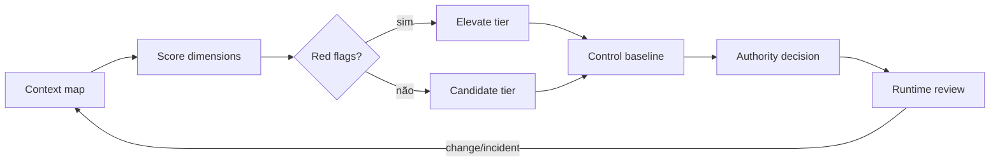

# Pattern — Risk-Tiered Governance

## Intent

Ajustar controls, evidence e decision authority ao risco e à capacidade real do agente.

## Problema

Processo uniforme cria burocracia para baixo risco e controles insuficientes para alto impacto. Scores simples ignoram autonomia, interconectividade, reversibilidade e pessoas afetadas.

## Contexto

Portfólio heterogêneo com agents read-only, copilots, automações state-changing e sistemas críticos.

## Forças e trade-offs

- consistência versus contexto;
- velocidade versus assurance;
- score reproduzível versus falsa precisão;
- automation versus judgment;
- risco inicial versus mudança runtime;
- autoridade local versus impacto enterprise.

## Solução

Classifique em tiers usando dimensões comuns e red flags. Cada tier mapeia:

- controls mínimos;
- assessments;
- segregation of duties;
- release authority;
- runtime monitoring;
- attestation cadence;
- exception authority.

Red flags elevam o tier independentemente da média.

## Estrutura e participantes

Participantes: business owner, Design Authority, Risk/RAI/Security/Data, Run Authority e approver definido pelo tier.

## Fluxo operacional

1. mapear finalidade, pessoas, dados e capabilities;
2. pontuar dimensões e incerteza;
3. aplicar red flags;
4. selecionar tier e baseline;
5. avaliar controls e residual risk;
6. obter decisão da authority;
7. monitorar change triggers;
8. reclassificar.

## Controles obrigatórios

- dimensions e definitions versionadas;
- rationale e evidence;
- red flags explícitas;
- baseline por tier;
- override apenas com authority e expiry;
- change triggers;
- periodic calibration;
- missing evidence não reduz tier.

## Evidências esperadas

- context/risk assessment;
- score, confidence e rationale;
- control mapping;
- residual-risk decision;
- exceptions;
- reclassification history;
- incidents e outcomes.

## Métricas

- distribuição por tier;
- overrides e expirations;
- incidents por tier;
- reclassificações após incident;
- cycle time por tier;
- controls ausentes;
- score-authority disagreements.

## Consequências

**Positivas:** proporcionalidade, priorização e clareza de authority.

**Custos:** calibração, training e manutenção dos thresholds.

## Limitações

Tier não prevê todo comportamento e não substitui threat/impact assessment. Um item baixo pode subir por novo contexto ou chain.

## Antipatterns relacionados

- one-size-fits-all approval;
- score único;
- “PoC é baixo risco”;
- threshold copiado de fornecedor;
- classificação congelada após release.

## Exemplo vendor-neutral

Um assistente interno read-only começa em T1. Ao receber tool de escrita em ERP e alcance regional, red flags elevam para T3; o release passa a exigir workload identity, dual review, rollback, monitoring e Run Authority.

## Mappings de implementação

- workflow engine;
- policy-as-code;
- GRC platform;
- control-plane de fornecedor;
- review manual versionado.

## Patterns relacionados

- [Registry and Blueprint](registry-and-blueprint.md)
- [Human Accountability Boundary](../../docs/patterns/human-accountability-boundary.md)
- [Runtime Observability and Quarantine](runtime-observability-and-quarantine.md)
