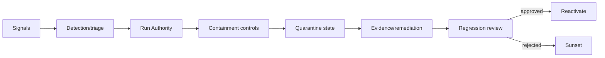

# Pattern — Runtime Observability and Quarantine

## Intent

Conectar signals a decisões e a containment verificável no menor blast radius possível.

## Problema

Dashboards mostram uso, qualidade ou alerts, mas não existe owner, threshold, runbook ou mecanismo para interromper o agente. Detecção não reduz impacto.

## Contexto

Agents em produção, especialmente com tools, dados sensíveis, external exposure ou autonomia elevada.

## Forças e trade-offs

- telemetry coverage versus data minimization;
- sensitivity versus alert fatigue;
- automated containment versus false positives;
- local containment versus systemic risk;
- availability versus safety;
- evidence preservation versus rapid cleanup.

## Solução

Defina uma chain explícita:

```text
signal → severity → decision authority → containment action
       → evidence preservation → remediation → regression → reactivation
```

Quarantine é estado de lifecycle, não apenas botão de UI.

## Estrutura e participantes



Participantes: Run Authority, SOC/SRE, business/technical owners, domain responders e Design Authority.

## Fluxo operacional

1. correlate user, agent, version, tool e target;
2. classifique severity e uncertainty;
3. execute menor containment eficaz;
4. atualize registry/status e communication;
5. preserve evidence;
6. avalie blast radius e downstream effects;
7. remedie causa;
8. execute regression e reauthorization.

## Controles obrigatórios

- telemetry model;
- owner/threshold/action por signal;
- containment ladder;
- identity/tool/connector kill switches;
- quarantine state;
- evidence preservation;
- reactivation authority;
- drills e after-action review.

## Evidências esperadas

- signal catalog;
- alert/runbook mapping;
- incident timeline;
- containment outcome;
- preserved evidence;
- cause/remediation;
- regression e reactivation decision;
- control updates.

## Métricas

- MTTD, MTTDecide, MTTC e MTTR;
- alerts sem action;
- failed/partial containment;
- recurrence;
- quarantines e reactivations;
- false containment impact;
- missing correlation.

## Consequências

**Positivas:** reduz tempo e blast radius, fecha learning loop.

**Custos:** instrumentation, on-call e risk de false positives.

## Limitações

Sem arquitetura revogável e owners, quarantine pode ser incompleta. Não substitui prevention.

## Antipatterns relacionados

- dashboard sem remediação;
- kill switch dentro do agente;
- containment que não revoga identity/tool;
- reactivation automática;
- incident sem regression test.

## Exemplo vendor-neutral

Um signal detecta sequência anômala de tool calls. A Run Authority bloqueia apenas a capability, revoga token e marca agent/version como quarantined. Após cause e regression, Design + Run Authority reativam.

## Mappings de implementação

- SIEM/SOAR + control plane;
- feature flags;
- IAM token revocation;
- API/MCP gateway circuit breaker;
- deployment rollback e service mesh.

## Patterns relacionados

- [Tool and MCP Gateway](../../docs/patterns/tool-and-mcp-gateway.md)
- [Lifecycle Attestation and Sunset](../../docs/patterns/lifecycle-attestation-and-sunset.md)
- [Evidence Package as Code](evidence-package-as-code.md)
